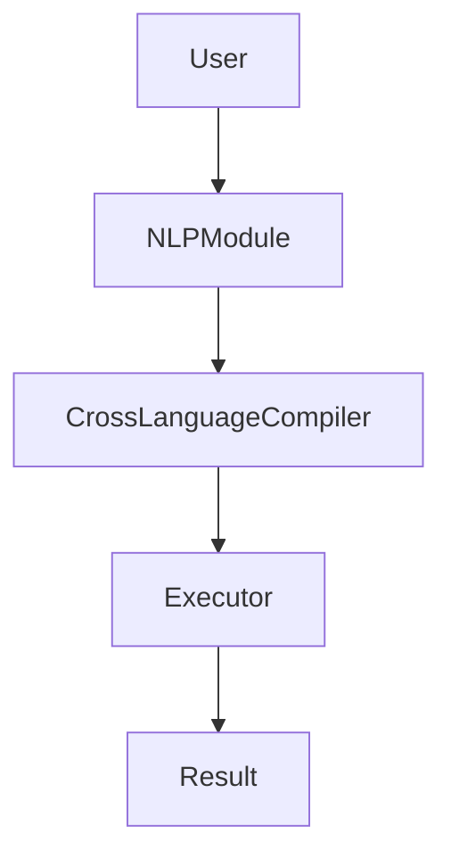

                 


# 跨语言AI Agent开发：挑战与解决方案

> 关键词：跨语言AI Agent，多语言处理，自然语言处理，编译原理，系统架构，项目实战

> 摘要：  
跨语言AI Agent的开发面临着语言多样性、语义理解、性能优化等多重挑战。本文从跨语言AI Agent的基本概念出发，深入分析其核心技术与实现原理，结合实际项目案例，探讨跨语言AI Agent的系统架构设计、实现方法及优化策略。最后，本文总结了跨语言AI Agent开发的挑战与解决方案，并展望了其未来发展方向。

---

## 第一部分: 背景与基础

### 第1章: 跨语言AI Agent的基本概念

#### 1.1 跨语言AI Agent的定义与目标

跨语言AI Agent（Cross-Language AI Agent）是一种能够理解、生成并执行多种编程语言代码的智能体。它结合了自然语言处理（NLP）和编译原理，能够跨越语言 barrier，为用户提供多语言环境下的智能服务。

**目标：**  
- 提供统一的接口，支持多种编程语言的交互。  
- 实现跨语言代码的理解与执行，提升开发效率。  
- 支持多语言环境下的任务分解与协作。

**应用场景：**  
- 跨语言开发工具：支持用户使用多种语言编写代码，并自动转换为目标语言。  
- 智能调试助手：帮助开发者快速定位跨语言代码中的问题。  
- 自动化测试：支持多种语言的测试用例生成与执行。

#### 1.2 跨语言AI Agent的技术特点

- **语言多样性：** 支持多种编程语言，如Python、Java、JavaScript等。  
- **自然语言理解：** 能够理解用户的自然语言指令，并生成对应的代码。  
- **跨语言执行：** 能够在不同语言之间切换，执行代码并返回结果。  

#### 1.3 跨语言AI Agent的挑战

- **语言多样性带来的复杂性：** 不同语言的语法、语义差异大，增加了代码解析的难度。  
- **语义理解的困难：** 用户的自然语言指令可能模糊，难以准确生成代码。  
- **性能优化：** 跨语言执行可能带来性能损失，需要优化编译与执行效率。  

---

### 第2章: 跨语言编译原理与实现

#### 2.1 跨语言编译的基本原理

跨语言编译的核心是将一种语言的代码转换为目标语言的代码。这一过程需要理解源代码的语法和语义，并生成目标语言的等价代码。

**步骤：**  
1. **语法分析：** 解析源代码的语法结构，生成抽象语法树（AST）。  
2. **中间表示：** 将AST转换为中间表示（IR），如LLVM IR。  
3. **目标语言生成：** 根据IR生成目标语言的代码。  

#### 2.2 跨语言编译器的设计与实现

**模块划分：**  
- 语法分析模块：负责解析输入代码的语法结构。  
- 中间表示生成模块：将AST转换为中间表示。  
- 目标语言生成模块：根据中间表示生成目标语言代码。  

**实现步骤：**  
1. 选择源语言和目标语言。  
2. 实现语法分析器，生成AST。  
3. 转换为中间表示。  
4. 生成目标语言代码。  

**性能优化：**  
- 使用缓存技术，减少重复计算。  
- 优化中间表示，提升生成代码的性能。  

#### 2.3 跨语言编译器的实际应用

**应用场景：**  
- 支持多语言开发环境，方便开发者跨语言协作。  
- 实现代码复用，减少重复开发。  

**优缺点分析：**  
- **优点：** 提升开发效率，降低学习成本。  
- **缺点：** 性能损失，代码生成的复杂性。  

---

### 第3章: AI Agent的核心技术

#### 3.1 自然语言处理技术

**核心概念：**  
自然语言处理（NLP）是AI Agent理解用户指令的关键技术。  
- **分词：** 将用户输入的自然语言分割成词语或短语。  
- **句法分析：** 分析句子的语法结构。  
- **语义理解：** 理解用户的意图，并生成对应的代码。  

**实现步骤：**  
1. 用户输入自然语言指令。  
2. NLP模块解析指令，生成代码。  
3. 执行代码并返回结果。  

#### 3.2 知识表示与推理

**知识表示：**  
- 使用知识图谱表示代码中的概念与关系。  
- 知识图谱构建：通过爬取公开数据构建代码知识库。  

**推理机制：**  
- 基于规则的推理：根据知识图谱中的规则生成代码。  
- 基于机器学习的推理：利用深度学习模型进行推理。  

---

## 第二部分: 系统架构与实现

### 第4章: 跨语言AI Agent的系统架构

#### 4.1 系统模块划分

**模块：**  
- 用户接口模块：接收用户指令并返回结果。  
- 自然语言处理模块：解析用户指令。  
- 跨语言编译模块：生成目标语言代码。  
- 执行模块：执行代码并返回结果。  

**模块关系：**  
用户输入指令 → 自然语言处理模块 → 跨语言编译模块 → 执行模块 → 返回结果。  

#### 4.2 系统架构设计

**架构选择：**  
- 分层架构：将系统划分为表示层、业务逻辑层和数据访问层。  
- 微服务架构：将功能模块化，便于扩展与维护。  

**实体关系图：**  


---

### 第5章: 项目实战

#### 5.1 项目介绍

**项目名称：** 跨语言AI Agent开发框架  
**目标：** 实现一个支持多种编程语言的AI Agent。  

#### 5.2 核心代码实现

**环境安装：**  
- 安装Python 3.9及以上版本。  
- 安装NLP库：如spaCy、NLTK。  
- 安装编译工具：如LLVM、Clang。  

**核心代码：**  
```python
class CrossLanguageCompiler:
    def __init__(self, source_language, target_language):
        self.source_language = source_language
        self.target_language = target_language

    def compile(self, code):
        # 语法分析
        ast = self.parse_code(code)
        # 中间表示
        ir = self.generate_ir(ast)
        # 生成目标语言代码
        target_code = self.generate_target_code(ir)
        return target_code

    def parse_code(self, code):
        # 具体实现：根据source_language选择解析器
        pass

    def generate_ir(self, ast):
        # 具体实现：生成LLVM IR
        pass

    def generate_target_code(self, ir):
        # 具体实现：生成目标语言代码
        pass
```

**代码解读：**  
- `CrossLanguageCompiler` 类负责跨语言编译。  
- `parse_code` 方法实现语法分析。  
- `generate_ir` 方法生成中间表示。  
- `generate_target_code` 方法生成目标语言代码。  

#### 5.3 实际案例分析

**案例：** 将Python代码转换为Java代码。  
```python
def add(a, b):
    return a + b
```

**转换结果：**  
```java
public class Add {
    public static int add(int a, int b) {
        return a + b;
    }
}
```

---

## 第三部分: 挑战与解决方案

### 第6章: 跨语言AI Agent的挑战

#### 6.1 语言多样性带来的复杂性

**问题：**  
- 不同语言的语法差异大，增加了语法分析的难度。  

**解决方案：**  
- 使用多语言支持的编译器框架，如LLVM。  
- 开发通用的语法分析模块，支持多种语言。  

#### 6.2 语义理解的困难

**问题：**  
- 用户的自然语言指令可能模糊，难以准确生成代码。  

**解决方案：**  
- 增强NLP模型的语义理解能力，使用预训练语言模型（如GPT）。  
- 提供上下文信息，帮助模型更好地理解用户意图。  

#### 6.3 性能优化的挑战

**问题：**  
- 跨语言执行可能带来性能损失。  

**解决方案：**  
- 优化中间表示，减少性能损失。  
- 使用 JIT（即时编译）技术，提升执行速度。  

---

## 第四部分: 未来展望

### 第7章: 跨语言AI Agent的未来发展方向

#### 7.1 技术趋势

- **多模态AI：** 结合视觉、听觉等多种模态，提升AI Agent的交互能力。  
- **自适应优化：** 实现动态优化，提升跨语言执行的性能。  

#### 7.2 应用场景扩展

- **智能代码生成：** 支持多种语言的智能代码生成。  
- **自动化测试：** 实现跨语言测试用例的自动生成与执行。  

#### 7.3 研究热点

- **编译优化：** 研究如何进一步优化跨语言编译的性能。  
- **NLP与代码生成的结合：** 探讨更高效的代码生成方法。  

---

## 总结

跨语言AI Agent的开发面临着语言多样性、语义理解、性能优化等多重挑战。通过深入分析其核心技术与实现原理，结合实际项目案例，本文为跨语言AI Agent的开发提供了系统的解决方案。未来，随着技术的不断进步，跨语言AI Agent将在更多领域发挥重要作用，为开发者提供更高效、更智能的开发体验。

--- 

**Tips：**  
- 在实际开发中，建议使用成熟的编译器框架（如LLVM）来降低跨语言编译的复杂性。  
- NLP模型的选择对代码生成的准确性有重要影响，建议使用预训练语言模型（如GPT）来提升语义理解能力。  
- 性能优化是跨语言AI Agent开发中的重要环节，可以通过优化中间表示和使用JIT技术来提升执行效率。

