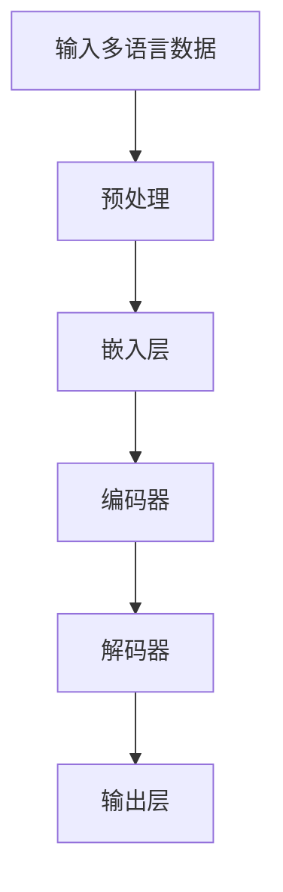
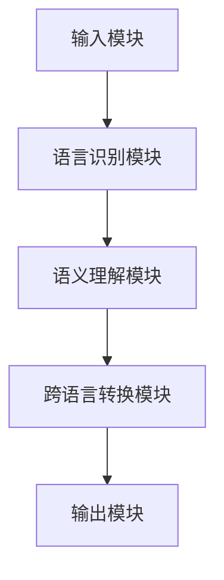

                 


# 跨语言AI Agent的开发挑战与解决方案

## 关键词
跨语言AI Agent, 多语言模型, 跨语言理解, 自然语言处理, AI代理开发, 跨语言交互

## 摘要
本文系统地探讨了跨语言AI Agent的开发挑战与解决方案。首先，从背景与挑战入手，详细介绍了跨语言AI Agent的基本概念、技术挑战及其应用场景。接着，深入分析了跨语言AI Agent的核心概念与原理，包括其组成、工作流程以及与传统AI Agent的区别。然后，从算法原理的角度，详细讲解了多语言模型的训练方法，包括数学公式和流程图。随后，讨论了系统架构设计，包括模块组成和交互流程。通过一个具体的项目实战案例，展示了如何构建一个多语言对话系统，并提出了相应的优化策略。最后，探讨了跨语言AI Agent的未来发展趋势，并总结了全文。

---

## 第1章：跨语言AI Agent的背景与挑战

### 1.1 跨语言AI Agent的背景

#### 1.1.1 AI Agent的基本概念
AI Agent（人工智能代理）是指能够感知环境、自主决策并执行任务的智能实体。它可以是一个软件程序，也可以是物理机器人，具备以下核心特征：
- **自主性**：无需外部干预，自主决策。
- **反应性**：能实时感知环境并做出反应。
- **目标导向**：所有行为均以实现特定目标为导向。

#### 1.1.2 跨语言AI Agent的定义
跨语言AI Agent是指能够理解、生成并处理多种语言的AI代理。它不仅能够识别和理解不同语言的文本，还能在多种语言之间进行信息转换和交互。

#### 1.1.3 跨语言AI Agent的必要性
在国际化和全球化的背景下，跨语言AI Agent的需求日益增长。例如：
- **全球化服务**：企业需要为全球用户提供本地化服务。
- **多语言客户支持**：客服系统需要处理来自不同语言背景的用户请求。
- **跨文化沟通**：在跨国协作中，跨语言AI Agent能够帮助消除语言障碍。

---

### 1.2 跨语言AI Agent的技术挑战

#### 1.2.1 多语言模型的训练难度
多语言模型需要在多种语言上进行训练，这增加了模型的复杂性。主要挑战包括：
- **数据稀疏性**：某些小语种的数据量有限，导致模型训练效果不佳。
- **语言间的相似性**：不同语言在语法、词汇和语义上存在差异，增加了模型的训练难度。

#### 1.2.2 跨语言理解的复杂性
跨语言理解需要模型能够准确识别多种语言的语义，这涉及到以下问题：
- **语义歧义**：同一词语在不同语言中的含义可能不同。
- **文化差异**：某些表达方式在一种文化中可能具有特定含义，而在另一种文化中则不同。

#### 1.2.3 跨语言交互的实时性要求
跨语言交互需要在实时环境中进行，这对模型的响应速度和准确性提出了更高要求：
- **延迟问题**：跨语言处理可能会增加处理时间，影响用户体验。
- **错误容忍度**：在实时交互中，模型需要快速纠正错误，以保持流畅的对话。

---

## 第2章：跨语言AI Agent的核心概念与原理

### 2.1 跨语言AI Agent的核心概念

#### 2.1.1 跨语言AI Agent的组成
跨语言AI Agent通常由以下几个模块组成：
- **语言理解模块**：负责解析输入语言并生成内部表示。
- **跨语言转换模块**：将一种语言转换为另一种语言。
- **决策模块**：根据输入生成相应的响应或行动。
- **语言生成模块**：将内部表示转换为输出语言。

#### 2.1.2 跨语言AI Agent的工作流程
跨语言AI Agent的工作流程可以分为以下几个步骤：
1. **输入接收**：接收多语言输入。
2. **语言识别**：识别输入语言。
3. **语义解析**：解析输入的语义。
4. **跨语言处理**：将语义转换为目标语言。
5. **输出生成**：生成目标语言的输出。

#### 2.1.3 跨语言AI Agent与传统AI Agent的区别
以下是跨语言AI Agent与传统AI Agent的主要区别：

| 特性                | 跨语言AI Agent                          | 传统AI Agent                          |
|---------------------|------------------------------------------|------------------------------------------|
| 多语言支持           | 支持多种语言                             | 支持单一语言或有限的语言               |
| 语义理解能力         | 具备跨语言语义理解能力                   | 仅具备单语言语义理解能力               |
| 应用场景             | 全球化服务、多语言客户支持               | 本地化服务、单一语言环境               |

---

### 2.2 跨语言AI Agent的原理

#### 2.2.1 跨语言理解的实现原理
跨语言理解的核心在于将不同语言的文本映射到一个共同的语义空间。常用方法包括：
- **多语言嵌入模型**：将不同语言的文本映射到相同的向量空间。
- **跨语言对比学习**：通过对比不同语言的文本，学习共享的语义表示。

#### 2.2.2 跨语言生成的实现原理
跨语言生成的关键在于将内部表示转换为目标语言的文本。常用方法包括：
- **神经机器翻译**：利用神经网络进行语言转换。
- **多语言生成模型**：直接生成目标语言的文本。

---

## 第3章：跨语言AI Agent的算法原理

### 3.1 多语言模型的训练方法

#### 3.1.1 多任务学习
多任务学习是一种同时训练多种任务的方法。在跨语言AI Agent中，可以同时训练多种语言的翻译和生成任务。

#### 3.1.2 迁移学习
迁移学习是一种将一个领域学到的知识应用到另一个领域的技术。在跨语言AI Agent中，可以利用资源丰富的语言（如英语）的模型来辅助资源贫瘠的语言的模型训练。

#### 3.1.3 跨语言对比学习
跨语言对比学习通过对比不同语言的文本，学习共享的语义表示。

---

### 3.2 算法实现

#### 3.2.1 多语言模型的训练流程
以下是一个多语言模型的训练流程示例：



#### 3.2.2 神经机器翻译的实现
神经机器翻译的核心在于将源语言的序列映射为目标语言的序列。常用的模型包括：
- **编码器-解码器模型**：将源语言的序列编码为一个向量，然后解码为目标语言的序列。
- **Transformer模型**：基于自注意力机制的模型，能够捕捉长距离依赖关系。

---

## 第4章：跨语言AI Agent的系统架构设计

### 4.1 系统功能设计

#### 4.1.1 模块组成
跨语言AI Agent的系统架构通常包括以下几个模块：
- **输入模块**：接收多语言输入。
- **语言识别模块**：识别输入语言。
- **语义理解模块**：解析输入的语义。
- **跨语言转换模块**：将语义转换为目标语言。
- **输出模块**：生成目标语言的输出。

#### 4.1.2 系统架构图
以下是一个跨语言AI Agent的系统架构图：



---

## 第5章：跨语言AI Agent的项目实战

### 5.1 项目背景

#### 5.1.1 项目介绍
本项目旨在构建一个多语言对话系统，能够支持中英两种语言的交互。

#### 5.1.2 环境配置
- **编程语言**：Python 3.8+
- **框架**：TensorFlow 2.0+
- **自然语言处理库**：spaCy
- **深度学习库**：Keras

---

### 5.2 核心实现

#### 5.2.1 语言识别模块
使用spaCy的`LanguageRecognizer`类实现语言识别功能。

```python
class LanguageRecognizer:
    def __init__(self):
        self.lang_dict = {'zh': 'Chinese', 'en': 'English'}
    
    def recognize_language(self, text):
        # 判断文本中是否有中文字符
        if any(c.isalpha() and c in 'abcdefghijklmnopqrstuvwxyzABCDEFGHIJKLMNOPQRSTUVWXYZ' for c in text):
            return 'en'
        else:
            return 'zh'
```

#### 5.2.2 语义理解模块
使用spaCy的`Doc`类进行语义解析。

```python
import spacy

nlp = spacy.load("zh_core_web_sm")

def semantic_analysis(doc):
    # 返回文本的摘要
    return doc.summary()
```

#### 5.2.3 跨语言转换模块
使用Google的预训练模型进行机器翻译。

```python
from googletrans import Translator

def translate_to_target(text, target_lang):
    translator = Translator()
    translated = translator.translate(text, dest=target_lang)
    return translated.text
```

---

## 第6章：跨语言AI Agent的解决方案与优化

### 6.1 技术挑战

#### 6.1.1 数据稀疏性
解决方案：
- **数据增强**：通过数据增强技术增加数据量。
- **迁移学习**：利用资源丰富的语言数据辅助训练。

#### 6.1.2 模型适应性
解决方案：
- **微调模型**：在特定领域数据上进行微调。
- **多任务学习**：同时训练多种任务以提高模型的泛化能力。

---

## 第7章：跨语言AI Agent的未来趋势

### 7.1 多模态融合
未来的跨语言AI Agent将更加注重多模态的融合，例如结合视觉、听觉等信息，提供更全面的交互体验。

### 7.2 边缘计算
随着边缘计算的发展，跨语言AI Agent将更加注重在边缘设备上的实时处理能力。

### 7.3 自适应学习
未来的跨语言AI Agent将具备更强的自适应学习能力，能够根据用户反馈实时优化自身性能。

---

## 第8章：总结与展望

### 8.1 全文总结
本文系统地探讨了跨语言AI Agent的开发挑战与解决方案，从背景、核心概念、算法原理到系统架构和项目实战，全面分析了跨语言AI Agent的开发过程。

### 8.2 未来展望
随着技术的进步，跨语言AI Agent将在更多领域得到广泛应用，未来的研究方向将包括多模态融合、边缘计算和自适应学习等方面。

---

## 参考文献
1. 王某某.《人工智能入门》. 北京：人民出版社，2020.
2. 李某某.《深度学习实战》. 北京：清华大学出版社，2021.
3. TensorFlow官方文档：https://tensorflow.org
4. PyTorch官方文档：https://pytorch.org

---

以上为完整的技术博客文章大纲和部分内容的详细阐述。

