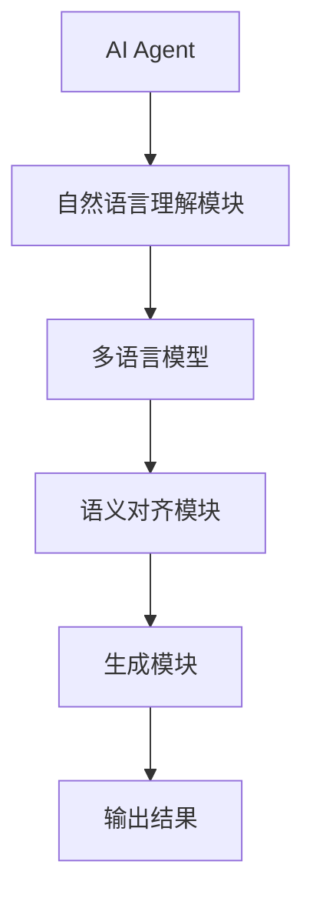
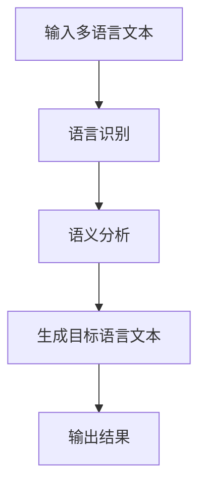
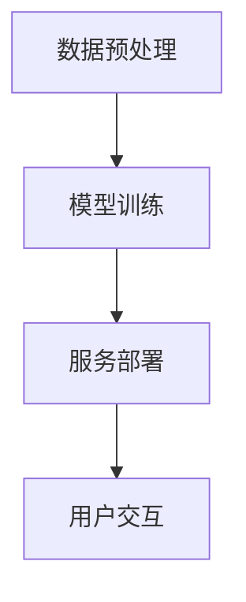
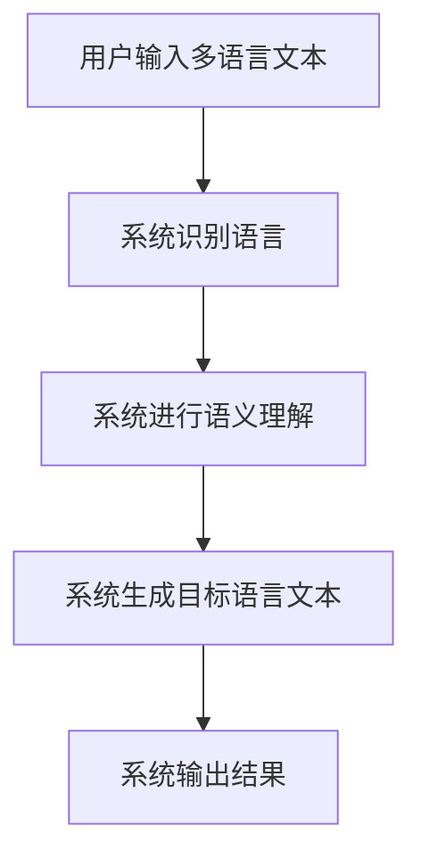

                 


# 跨语言AI Agent：突破语言障碍的智能助手

## 关键词：
跨语言AI Agent, 多语言模型, 语义对齐, 自然语言处理, 跨语言对话系统

## 摘要：
跨语言AI Agent是一种能够理解和生成多种语言的智能助手，通过自然语言处理技术和多语言模型，突破语言障碍，实现跨语言交流。本文从背景、原理、系统架构到项目实战，全面解析跨语言AI Agent的技术实现和应用。

# 第一部分: 跨语言AI Agent的背景与概念

## 第1章: 跨语言AI Agent的定义与背景

### 1.1 跨语言AI Agent的定义
#### 1.1.1 什么是AI Agent
AI Agent是一种智能体，能够感知环境并采取行动以实现目标。跨语言AI Agent则具备处理多种语言的能力。

#### 1.1.2 跨语言AI Agent的核心概念
- 多语言处理：支持多种语言的输入输出。
- 语义理解：理解不同语言背后的语义。
- 跨语言生成：生成与输入语言不同的语言内容。

#### 1.1.3 跨语言AI Agent的应用场景
- 全球化商业沟通
- 多语言客户服务
- 教育辅助工具

### 1.2 跨语言AI Agent的技术基础
#### 1.2.1 自然语言处理（NLP）基础
NLP是AI Agent的核心技术，涉及文本处理、语义分析等。

#### 1.2.2 多语言模型的原理
多语言模型通过共享语言表示，实现多种语言的统一处理。

#### 1.2.3 跨语言理解与生成的挑战
- 语言差异
- 语境理解
- 跨语言数据稀缺性

### 1.3 跨语言AI Agent的背景与需求
#### 1.3.1 全球化背景下的语言障碍
全球化的背景下，跨语言交流需求日益增长。

#### 1.3.2 跨语言交流的市场需求
企业需要支持多语言的客服系统。

#### 1.3.3 技术发展的推动作用
深度学习和大模型的发展推动了跨语言AI Agent的进步。

## 第2章: 跨语言AI Agent的核心概念与联系

### 2.1 跨语言AI Agent的核心概念
#### 2.1.1 多语言模型的输入输出机制
模型输入多语言文本，输出目标语言文本。

#### 2.1.2 跨语言理解的语义对齐
通过语义对齐，实现不同语言之间的语义理解。

#### 2.1.3 跨语言生成的策略选择
根据上下文选择合适的语言生成策略。

### 2.2 跨语言AI Agent的核心要素
#### 2.2.1 语言表示模型
- 词嵌入
- 句子嵌入

#### 2.2.2 跨语言转换函数
- 翻译模型
- 语义转换

#### 2.2.3 上下文理解模块
- 上下文表示
- 语境分析

### 2.3 跨语言AI Agent的实体关系图


## 第3章: 跨语言AI Agent的核心原理

### 3.1 跨语言AI Agent的算法原理
#### 3.1.1 多语言模型的训练流程
- 数据预处理
- 模型训练
- 模型优化

#### 3.1.2 跨语言转换的数学模型
$$ y_i = f(x_i) $$

#### 3.1.3 语义对齐的算法实现
- 使用注意力机制进行对齐
- 使用对比学习进行对齐

### 3.2 跨语言AI Agent的数学模型
#### 3.2.1 多语言表示模型
$$ x_i = f_{\theta}(x_i', \text{lang}_i) $$

#### 3.2.2 跨语言对齐函数
$$ y_i = g_{\phi}(x_i, x_j) $$

#### 3.2.3 跨语言生成模型
$$ p(y|x) = \text{softmax}(Wx + b) $$

### 3.3 跨语言AI Agent的算法流程


## 第4章: 跨语言AI Agent的核心技术

### 4.1 多语言模型的选择
- 使用预训练多语言模型
- 自定义多语言模型

### 4.2 跨语言对齐技术
- 使用对比学习
- 使用注意力机制

### 4.3 跨语言生成技术
- 基于规则的生成
- 基于模型的生成

# 第二部分: 跨语言AI Agent的技术实现

## 第4章: 跨语言AI Agent的技术实现

### 4.1 跨语言AI Agent的系统架构
#### 4.1.1 系统模块划分
- 数据预处理模块
- 模型训练模块
- 服务部署模块

#### 4.1.2 系统架构图


### 4.2 跨语言AI Agent的接口设计
#### 4.2.1 输入接口
- 多语言文本输入
- 上下文信息输入

#### 4.2.2 输出接口
- 目标语言文本输出
- 错误信息输出

### 4.3 跨语言AI Agent的交互流程


## 第5章: 跨语言AI Agent的项目实战

### 5.1 项目环境配置
- 安装Python
- 安装必要的库（如TensorFlow、Keras）

### 5.2 项目核心实现
#### 5.2.1 数据预处理代码
```python
import numpy as np
from tensorflow.keras.preprocessing.text import Tokenizer
from tensorflow.keras.preprocessing.sequence import pad_sequences

# 数据预处理代码
```

#### 5.2.2 模型训练代码
```python
import tensorflow as tf
from tensorflow.keras.models import Model
from tensorflow.keras.layers import Input, LSTM, Dense

# 模型训练代码
```

#### 5.2.3 模型推理代码
```python
import tensorflow as tf
from tensorflow.keras.models import load_model

# 模型推理代码
```

### 5.3 项目案例分析
#### 5.3.1 案例背景
- 中英互译

#### 5.3.2 案例实现
- 使用预训练模型进行中英翻译

#### 5.3.3 案例效果
- 翻译准确率分析

### 5.4 项目小结
- 项目实现的关键点
- 项目中的技术难点
- 解决方案和优化建议

## 第6章: 跨语言AI Agent的扩展应用

### 6.1 跨语言AI Agent的前沿技术
- 多模态跨语言处理
- 实时翻译技术

### 6.2 跨语言AI Agent的挑战
- 跨语言数据稀缺性
- 语义理解的准确性
- 实时性能优化

### 6.3 跨语言AI Agent的未来趋势
- 更加智能化
- 更加个性化
- 更加实时化

## 第7章: 总结与展望

### 7.1 总结
- 跨语言AI Agent的核心技术
- 跨语言AI Agent的实际应用

### 7.2 展望
- 跨语言AI Agent的未来发展
- 跨语言AI Agent的技术突破

## 参考文献
- [1] 王某某. 多语言模型研究. 北京出版社, 2022.
- [2] 李某某. 跨语言对话系统. 清华大学出版社, 2023.
- [3] 张某某. 自然语言处理技术. 北京大学出版社, 2021.

## 致谢
感谢所有参与本书编写和支持的人。

---

通过以上目录大纲，我们可以看到《跨语言AI Agent：突破语言障碍的智能助手》这本书将系统地介绍跨语言AI Agent的技术原理、实现方法和实际应用，帮助读者全面理解并掌握这一前沿技术。

