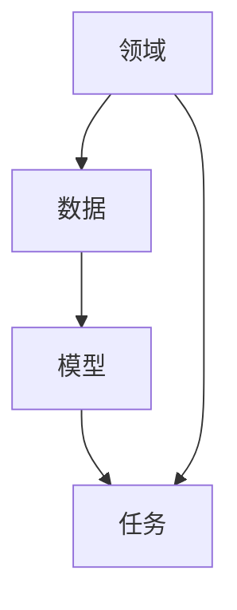
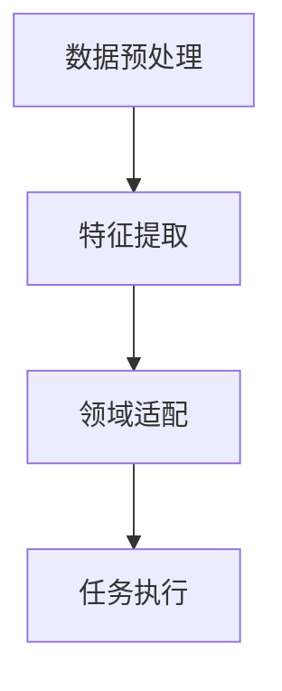
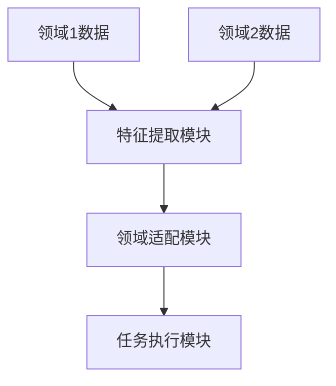
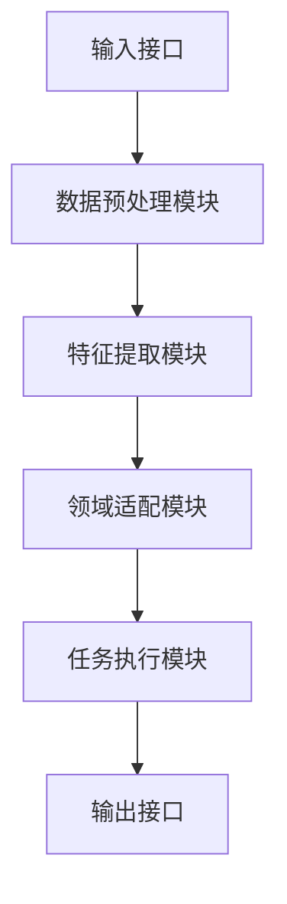

                 


# 跨领域AI Agent：LLM在不同专业领域的迁移学习

**关键词：** 大语言模型，迁移学习，跨领域AI，领域适应，对比学习

**摘要：**  
本文系统地探讨了大语言模型（LLM）在不同专业领域中的迁移学习问题，重点分析了跨领域AI Agent的核心概念、算法原理、系统架构和实际应用。通过结合理论与实践，本文详细阐述了如何利用迁移学习技术，使LLM在法律、医疗、金融等专业领域中实现高效的知识迁移与任务适应。文章还通过具体案例展示了跨领域AI Agent的实际应用场景，并对迁移学习的未来发展方向进行了展望。

---

## 第一部分: 跨领域AI Agent 背景与核心概念

### 第1章: 跨领域AI Agent 的问题背景

#### 1.1 问题背景
##### 1.1.1 大语言模型（LLM）的崛起
- LLM（如GPT-3、PaLM）的出现，使得自然语言处理能力大幅提升。
- LLM具有强大的通用性，但其在专业领域中的应用仍需领域知识的迁移。

##### 1.1.2 LLM 在不同领域的应用需求
- 法律领域：合同分析、案例检索。
- 医疗领域：疾病诊断、药物推荐。
- 金融领域：风险评估、市场分析。

##### 1.1.3 跨领域AI Agent 的定义与目标
- 跨领域AI Agent：一种能够跨多个专业领域，通过迁移学习技术，实现领域间知识共享和任务适应的智能体。
- 目标：降低领域适应成本，提升LLM在不同领域的泛化能力。

#### 1.2 问题描述
##### 1.2.1 LLM 在专业领域中的局限性
- 领域知识不足：LLM在专业领域中缺乏特定领域的知识和经验。
- 数据稀疏性：专业领域数据量有限，导致模型泛化能力不足。

##### 1.2.2 跨领域迁移学习的必要性
- 跨领域迁移学习：通过共享跨领域的特征或知识，提升模型在不同领域的性能。

##### 1.2.3 跨领域AI Agent 的应用场景
- 多领域任务处理：在一个场景中同时处理多个领域的任务。
- 领域间知识共享：利用跨领域知识提升模型性能。

#### 1.3 问题解决
##### 1.3.1 跨领域迁移学习的核心思想
- 通过特征提取和领域适配，实现跨领域知识共享。

##### 1.3.2 跨领域AI Agent 的技术实现路径
1. 领域特征提取：提取各领域的共同特征。
2. 领域适配：通过领域适配层，实现领域间特征的共享。

##### 1.3.3 跨领域迁移学习的挑战与解决方案
- 挑战：领域差异性大，特征共享难度高。
- 解决方案：引入领域适配层和对比学习技术。

#### 1.4 边界与外延
##### 1.4.1 跨领域AI Agent 的边界
- 仅限于语言模型的迁移学习，不涉及其他类型AI模型。
- 不涉及领域间的实时交互和动态适配。

##### 1.4.2 相关概念的对比与区分
| 概念       | 描述                                       |
|------------|------------------------------------------|
| 迁移学习     | 利用源领域数据提升目标领域模型性能的技术。|
| 跨领域AI Agent | 能够在多个领域中进行知识迁移和任务适应的智能体。|
| 领域适配   | 通过调整模型参数，使模型适应目标领域。   |

##### 1.4.3 跨领域迁移学习的外延与未来发展
- 外延：从语言模型扩展到其他类型模型。
- 未来发展：结合领域知识图谱和多模态数据，提升跨领域迁移能力。

#### 1.5 核心概念与联系
##### 1.5.1 LLM 的核心概念
- 模型架构：基于Transformer的架构。
- 训练目标：通过自监督学习优化模型参数。

##### 1.5.2 迁移学习的核心概念
- 迁移学习的核心思想：利用源领域的知识提升目标领域的性能。
- 迁移学习的分类：领域适配、特征提取等。

##### 1.5.3 跨领域AI Agent 的概念结构与核心要素组成
- 概念结构：由领域特征提取层、领域适配层和任务执行层组成。
- 核心要素：领域特征、适配策略、任务执行能力。

---

### 第2章: 跨领域AI Agent 的核心概念与联系

#### 2.1 核心概念原理
##### 2.1.1 LLM 的工作原理
- 输入：文本数据。
- 输出：生成与输入相关的文本或进行分类。
- 关键技术：自注意力机制、位置编码。

##### 2.1.2 迁移学习的基本原理
- 通过共享特征或调整模型参数，使模型适应目标领域。
- 对比学习：通过对比源领域和目标领域的特征，提升模型的跨领域能力。

##### 2.1.3 跨领域AI Agent 的工作流程
1. 数据预处理：对源领域和目标领域数据进行预处理。
2. 特征提取：提取各领域的共同特征。
3. 领域适配：通过对比学习或领域适配层，调整模型参数。
4. 任务执行：在目标领域中执行具体任务。

#### 2.2 核心概念属性特征对比
##### 2.2.1 LLM 与传统机器学习模型的对比
| 属性       | LLM                           | 传统模型                     |
|------------|--------------------------------|------------------------------|
| 数据需求   | 大规模数据                     | 小规模数据                   |
| 模型复杂度 | 高复杂度                       | 低复杂度                     |
| 适应性     | 强大的语言理解能力             | 有限的领域适应能力           |

##### 2.2.2 迁移学习与零样本学习的对比
| 属性       | 迁移学习                       | 零样本学习                   |
|------------|--------------------------------|------------------------------|
| 数据需求   | 需要源领域数据                 | 仅需要目标领域数据           |
| 适用场景   | 跨领域任务                   | 完全未知领域                 |

##### 2.2.3 跨领域AI Agent 与单一领域AI模型的对比
| 属性       | 跨领域AI Agent                | 单一领域AI模型               |
|------------|--------------------------------|------------------------------|
| 适应性     | 跨领域适应                   | 单一领域适应                 |
| 知识共享   | 支持跨领域知识共享           | 仅支持单一领域知识           |

#### 2.3 ER 实体关系图架构


---

## 第三部分: 跨领域AI Agent 的算法原理

### 第3章: 跨领域迁移学习的算法原理

#### 3.1 算法原理讲解
##### 3.1.1 对比学习
- 对比学习的核心思想：通过最大化源领域和目标领域的特征相似性，实现跨领域知识共享。

##### 3.1.2 域适配
- 域适配的目标：通过调整模型参数，使模型在目标领域中表现更好。
- 域适配的方法：基于最大均值差异（MMD）的域适配。

##### 3.1.3 通用特征提取
- 通用特征提取的目标：提取各领域的共同特征，用于跨领域任务。
- 实现方法：基于自注意力机制的特征提取网络。

#### 3.2 算法实现代码
##### 3.2.1 对比学习代码示例
```python
def contrastive_learning(X_source, X_target, y_source, y_target):
    # 对比学习模型的定义和训练
    pass
```

#### 3.3 数学公式
##### 3.3.1 对比学习的损失函数
$$ \mathcal{L} = -\log \frac{e^{f(x_s, x_t)}}{e^{f(x_s, x_t)} + e^{f(x_s', x_t)}} $$
其中，\( f(x_s, x_t) \) 表示源领域样本 \( x_s \) 和目标领域样本 \( x_t \) 的相似性。

##### 3.3.2 领域适配的损失函数
$$ \mathcal{L}_{\text{MMD}} = \frac{1}{n^2} \sum_{i=1}^n \sum_{j=1}^n \text{distance}(x_i, x_j) $$

---

## 第四部分: 跨领域AI Agent 的系统分析与架构设计方案

### 第4章: 跨领域AI Agent 的系统分析与架构设计

#### 4.1 项目介绍
##### 4.1.1 项目背景
- 项目目标：开发一个能够在多个领域中进行知识迁移和任务执行的AI Agent。
- 项目需求：支持法律、医疗、金融等多个领域，具备领域适配和任务执行能力。

#### 4.2 系统功能设计
##### 4.2.1 系统功能模块
- 数据预处理模块：对源领域和目标领域数据进行预处理。
- 特征提取模块：提取各领域的共同特征。
- 领域适配模块：通过对比学习或域适配技术，调整模型参数。
- 任务执行模块：在目标领域中执行具体任务。

##### 4.2.2 系统功能流程图


#### 4.3 系统架构设计
##### 4.3.1 系统架构图


#### 4.4 系统接口设计
##### 4.4.1 接口描述
- 输入接口：源领域和目标领域数据。
- 输出接口：目标领域的任务执行结果。

##### 4.4.2 接口交互流程图


---

## 第五部分: 跨领域AI Agent 的项目实战

### 第5章: 跨领域AI Agent 的项目实战

#### 5.1 环境安装
##### 5.1.1 安装Python
```bash
python --version
```
##### 5.1.2 安装依赖库
```bash
pip install numpy pandas scikit-learn
```

#### 5.2 系统核心实现
##### 5.2.1 核心代码实现
```python
def main():
    # 数据加载
    X_source, y_source = load_data('source')
    X_target, y_target = load_data('target')
    
    # 特征提取
    features = extract_features(X_source, X_target)
    
    # 领域适配
    adapted_features = adapt_features(features, y_source, y_target)
    
    # 任务执行
    model = train_model(adapted_features, y_target)
    result = model.predict(adapted_features)
    
    return result
```

##### 5.2.2 代码解读与分析
- 数据加载：加载源领域和目标领域的数据。
- 特征提取：提取各领域的共同特征。
- 领域适配：通过对比学习或域适配技术，调整特征。
- 任务执行：在目标领域中训练模型并执行任务。

#### 5.3 实际案例分析
##### 5.3.1 案例介绍
- 案例背景：法律合同分析。
- 数据集：法律领域的合同文本和医疗领域的病历文本。

##### 5.3.2 案例分析
- 数据预处理：对合同文本和病历文本进行预处理。
- 特征提取：提取文本的关键词和语义特征。
- 领域适配：通过对比学习，使模型适应法律领域。
- 任务执行：在法律领域中进行合同分类。

#### 5.4 项目小结
- 项目总结：跨领域AI Agent能够有效提升模型在不同领域的性能。
- 经验分享：迁移学习的关键在于特征提取和领域适配。

---

## 第六部分: 总结与展望

### 第6章: 总结与展望

#### 6.1 全文总结
- 本文系统地探讨了跨领域AI Agent的核心概念、算法原理和实际应用。
- 跨领域AI Agent的核心思想是通过迁移学习技术，实现跨领域知识共享和任务适应。

#### 6.2 未来展望
- 未来研究方向：
  1. 结合领域知识图谱，提升跨领域迁移能力。
  2. 研究多模态数据的跨领域迁移学习。
  3. 探索动态领域适配技术，实现实时领域适应。

---

## 第七部分: 附录

### 附录A: 代码与工具安装指南

#### 附录A.1 核心代码
```python
def extract_features(X_source, X_target):
    # 特征提取代码
    pass
```

#### 附录A.2 工具安装指南
```bash
pip install numpy pandas scikit-learn
```

---

通过以上目录结构，您可以按照需求逐步展开每一章的内容，撰写一篇详细且具有深度的跨领域AI Agent技术博客文章。

