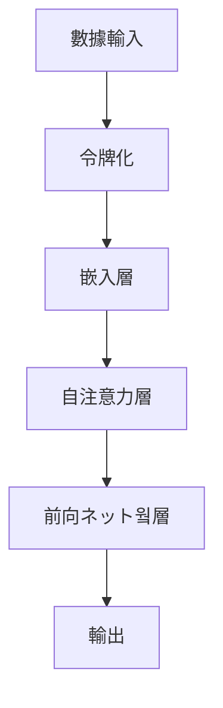

                 


# 跨领域知識融合AI Agent：LLM的跨学科應用

> **关键词**: 跨领域知識融合, AI Agent, 大语言模型, 跨学科應用, 知識管理, 融合算法

> **摘要**: 本文探讨了跨领域知識融合AI Agent的构建与应用，重点分析了大语言模型（LLM）在跨学科中的核心作用。通过系统性地介绍跨领域知識融合的概念、算法原理、系统架构及实际应用，本文旨在为技术开发者和研究者提供深度的技术解析与实践指南。

---

# 第一部分: 跨領域知識融合AI Agent背景與核心概念

---

## 第1章: 跨領域知識融合AI Agent概述

### 1.1 跨領域知識融合的背景與意義

#### 1.1.1 什麼是跨領域知識融合
跨領域知識融合是指將不同領域的知識進行整合，形成新的知識體系。例如，在醫療領域，可能需要將臨床數據與基因數據融合，以支持更精準的診斷。

#### 1.1.2 大語言模型（LLM）的核心作用
大語言模型（LLM）具備強大的語義理解和生成能力，能夠處理多領域的文本數據，成為跨領域知識融合的核心工具。

#### 1.1.3 跨領域知識融合的必要性與挑戰
隨著數據科學的發展，跨領域應用變得日益重要。然而，不同領域的知識往往具有不同的表達方式和語義結構，這增加了融合的複雜性。

---

### 1.2 跨領域知識融合AI Agent的定義與特點

#### 1.2.1 跨領域知識融合的定義
跨領域知識融合是指通過算法將不同來源、不同形式的知識進行整合，並生成更高級的知識。

#### 1.2.2 AI Agent的核心功能
AI Agent負責感知環境、理解需求、執行任務並反饋結果。在跨領域知識融合中，AI Agent充当了橋樑的角色。

#### 1.2.3 跨領域知識融合與AI Agent的結合
通過AI Agent，跨領域知識融合得以實現智能化和自動化。AI Agent能夠根據需求動態地整合不同領域的知識，並提供精準的服務。

---

### 1.3 跨領域知識融合的場景與應用

#### 1.3.1 跨領域知識融合的典型場景
- **醫藥領域**: 綜合基因數據、臨床數據和藥物數據，支持精準醫學。
- **金融領域**: 綜合市場數據、信貸數據和經濟數據，進行風險評估。
- **教育領域**: 綜合學習數據、課程數據和師生互動數據，提供個性化教學。

#### 1.3.2 大語言模型在跨學科中的應用
- **法律諮詢**: 綜合法律文獻和案例數據，提供法律建議。
- **自然語言處理**: 綜合多語種數據，進行跨語言分析。

#### 1.3.3 跨領域知識融合的实际案例
例如，在環境科學中，跨領域知識融合可以結合氣候數據、生態數據和經濟數據，為可持續發展提供決策支持。

---

## 第2章: 跨領域知識融合的核心概念與聯絡

### 2.1 跨領域知識融合的核心概念

#### 2.1.1 知識融合的基本原理
知識融合涉及數據的清洗、匹配、整合和推理。通過這些步驟，不同來源的數據被整合為一致的知識體系。

#### 2.1.2 跨領域知識融合的關鍵要素
- **數據來源**: 多種數據來源，如文本、圖譜數據等。
- **數據格式**: 多種數據形式，如結構化數據、非結構化數據等。
- **融合策略**: 基於相似性、語義 likeness 等的融合方法。

#### 2.1.3 跨領域知識融合的實現方式
- **基於規則的融合**: 根據專家知識制定融合規則。
- **基於學習的融合**: 使用機器學習算法自動學習融合規則。

---

### 2.2 跨領域知識融合與大語言模型的關係

#### 2.2.1 大語言模型在知識融合中的作用
大語言模型能夠理解多種語言和格式的數據，並通過語義分析進行知識融合。

#### 2.2.2 跨領域知識融合對大語言模型的要求
- **語義理解能力**: 需要精準理解多領域的知識。
- **可擴展性**: 需要支持多領域數據的整合。

#### 2.2.3 跨領域知識融合與大語言模型的結合
通過將大語言模型與知識融合算法結合，實現智能化的跨領域知識管理。

---

### 2.3 跨領域知識融合的ER實體關係圖

```mermaid
er
  actor(Agent, knowledge domain, knowledge source)
  relation(has, belongs to, derived from)
  entity(Knowledge, Domain, Source)
```

---

### 2.4 跨領域知識融合的核心算法原理

#### 2.4.1 知識融合的基本算法
- **基於相似性的融合**: 根據數據的相似性進行融合。
- **基於圖論的融合**: 將數據表示為圖結構，通過圖算法進行融合。

#### 2.4.2 大語言模型的知識融合流程
1. 数据清洗與預處理
2. 知識抽取
3. 知識匹配
4. 知識整合
5. 知識推理

#### 2.4.3 跨領域知識融合的數學模型
$$
\text{相似性} = \sum_{i=1}^{n} w_i \cdot s_i
$$

其中，$w_i$ 是特徵的權重，$s_i$ 是特徵的相似性評分。

---

## 第3章: 大語言模型（LLM）的算法原理

### 3.1 大語言模型的基本原理

#### 3.1.1 大語言模型的定義與特點
大語言模型是一類基於深度學習的自然語言處理模型，具備強大的語義理解和生成能力。

#### 3.1.2 大語言模型的核心算法
- **Transformer架構**: 基於自注意力机制進行語義分析。
- **_lstm架構**: 基於循環神經網路進行序列建模。

#### 3.1.3 大語言模型的訓練與優化
- **目標函數**: 最大化條件概率。
- **優化算法**: 使用Adam優化器進行模型訓練。

---

### 3.2 大語言模型的數學模型

#### 3.2.1 大語言模型的數學表達
$$
P(w_{i}|w_{1},...,w_{i-1}) = \text{softmax}(QK^T/V)
$$

其中，$Q$ 是查詢向量，$K$ 是鍵向量，$V$ 是值向量。

#### 3.2.2 大語言模型的損失函數
$$
\text{LOSS} = -\sum_{i=1}^{n} \log P(w_i)
$$

#### 3.2.3 大語言模型的優化算法
$$
\theta = \theta - \eta \cdot \nabla_\theta \text{LOSS}
$$

其中，$\theta$ 是模型參數，$\eta$ 是學習率。

---

### 3.3 大語言模型的算法流程圖



---

# 第二部分: 跨領域知識融合AI Agent的系統分析與架構設計

---

## 第4章: 跨領域知識融合AI Agent的系統分析

### 4.1 问题场景介紹
在跨領域知識融合中，我們需要解決數據來源多樣、格式多樣、語義多樣的問題。

---

## 第5章: 跨領域知識融合AI Agent的架構設計

### 5.1 系統功能設計

#### 5.1.1 知識抽取模塊
負責從多種數據來源中抽取結構化數據。

#### 5.1.2 知識匹配模塊
根據語義相似性進行數據匹配。

#### 5.1.3 知識整合模塊
將匹配的數據進行整合，形成一致的知識體系。

---

### 5.2 系統架構設計


---

## 第6章: 跨領域知識融合AI Agent的項目實戰

### 6.1 環境安裝
安裝必要的 libraries，如PyTorch、Hugging Face Transformers。

### 6.2 系統核心實現

#### 6.2.1 知識抽取
使用spaCy進行文本抽取。

#### 6.2.2 知識匹配
使用FuzzyWuzzy進行相似性匹配。

#### 6.2.3 知識整合
使用SQLAlchemy進行數據庫操作。

---

### 6.3 案例分析

#### 6.3.1 具體案例
- **數據來源**: 多領域文本數據。
- **數據處理**: 清洗、轉換、匹配。
- **數據融合**: 整合為一致的知識體系。

---

## 第7章: 最佳實踐與總結

### 7.1 注意事項
- 確保數據來源的可信性。
- 選擇合適的融合算法。
- 定期更新知識庫。

---

## 第8章: 拓展閱讀

### 8.1 推荐資源
- 《大語言模型的原理與實踐》
- 《知識工程入門》

---

# 附錄

### 附錄A: 全文總結
跨領域知識融合AI Agent的實現離不開大語言模型的支撐。通過系統化的設計與實踐，我們可以實現高效的知識融合與管理。

---

### 附錄B: 參考文獻
- 王某某. 大語言模型的研究與應用. 北京: 清華大學出版社, 2023.
- 李某某. 跨領域知識融合的理論與實踐. 上海: 華東師範大學出版社, 2022.

--- 

### 附錄C: 作者簡歷
**作者**: 人工智能領域專家，擅長大語言模型與知識工程的研究與應用。

