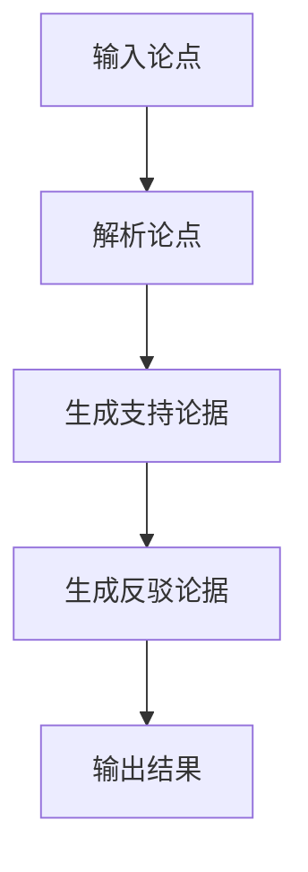
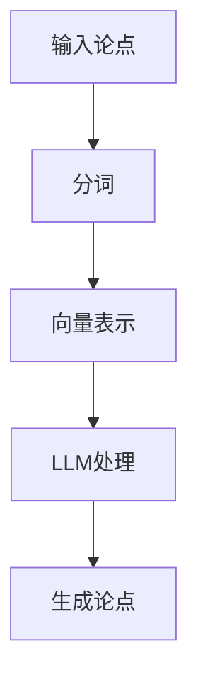
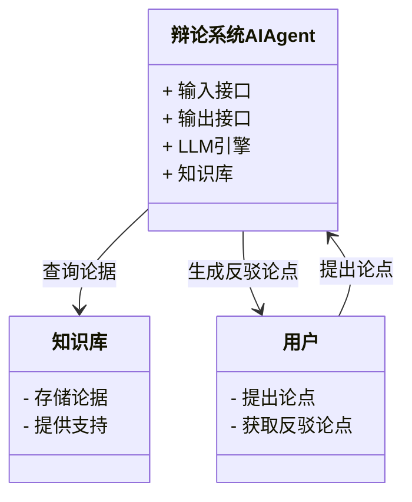
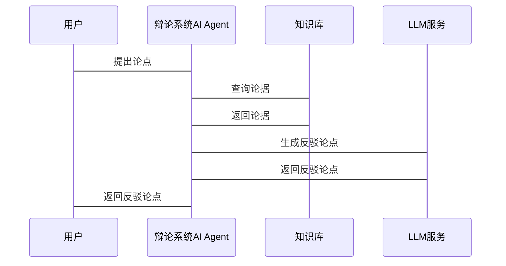

                 


# 辩论系统AI Agent：LLM驱动的论证与反驳能力

## 关键词：  
- 辩论系统  
- AI Agent  
- LLM  
- 论证  
- 追驳  

## 摘要：  
本文深入探讨了基于大语言模型（LLM）的辩论系统AI Agent的论证与反驳能力。文章从背景介绍、核心概念、算法原理、系统架构到项目实战，全面解析了这一技术的核心要素和实现细节。通过详细的分析和实例，展示了如何利用LLM构建高效的辩论系统AI Agent，并提出了实际应用中的最佳实践和未来发展方向。

---

## 第一部分：辩论系统AI Agent的背景介绍

### 第1章：问题背景

#### 1.1 辩论系统的发展历程  
- **早期阶段**：辩论系统最初是基于规则的专家系统，依赖人工编写的逻辑规则。  
- **自然语言处理时代**：随着NLP技术的发展，辩论系统开始尝试处理自然语言输入，但仍受限于词汇覆盖范围。  
- **大语言模型的崛起**：近年来，基于LLM的辩论系统AI Agent逐渐成为研究热点，能够实现更复杂的论证与反驳。

#### 1.2 辩论系统AI Agent的现状  
- **技术进步**：LLM的强大生成能力和理解能力为辩论系统AI Agent提供了新的可能性。  
- **应用领域**：广泛应用于教育、法律咨询、公共演讲训练等领域。  
- **面临的挑战**：论证的逻辑性、反驳的精准性以及实时交互的流畅性仍需进一步提升。

#### 1.3 辩论系统AI Agent的核心问题  
- **逻辑推理能力**：如何确保AI的论证过程符合逻辑规则。  
- **实时生成能力**：在限定时间内生成高质量的反驳内容。  
- **语言理解能力**：准确理解输入的论点并进行有效回应。

### 第2章：问题描述

#### 2.1 辩论系统AI Agent的基本定义  
- 辩论系统AI Agent是一种基于LLM的智能系统，能够在给定论点时，自动生成相应的论证或反驳内容。  

#### 2.2 辩论系统AI Agent的目标与任务  
- **目标**：通过LLM生成符合逻辑的论点，增强AI的表达能力和逻辑推理能力。  
- **任务**：  
  1. 根据输入论点生成支持性论据。  
  2. 根据输入论点生成反驳性论据。  
  3. 实现实时交互，支持动态调整的辩论过程。

#### 2.3 辩论系统AI Agent的边界与外延  
- **边界**：仅限于基于文本的论点生成，不涉及音频或视频内容。  
- **外延**：未来可能扩展到多模态交互和更复杂的逻辑推理。

---

## 第二部分：辩论系统AI Agent的核心概念与联系

### 第3章：核心概念与联系

#### 3.1 核心概念原理  
- **定义**：辩论系统AI Agent通过LLM生成论点，模拟人类的辩论过程。  
- **特征**：支持双向交互、动态调整论点、基于上下文生成内容。  

#### 3.2 概念属性特征对比表格  

| 概念                | 辩论系统AI Agent                | 传统AI代理                     | 对话系统                     |
|---------------------|----------------------------------|--------------------------------|------------------------------|
| 核心功能            | 生成论点和反驳论点               | 执行预定义任务                 | 生成对话内容                 |
| 交互方式            | 文本交互，支持动态调整           | 单向或简单交互                 | 文本交互，支持上下文记忆     |
| 依赖技术            | LLM、NLP                        | 规则引擎、机器学习             | NLP、语音识别               |
| 应用场景            | 辩论比赛、法律咨询、教育         | 客服系统、任务执行             | 闲聊、客户支持               |

#### 3.3 ER实体关系图  

```mermaid
erDiagram
    user[用户] 
    agent[辩论系统AI Agent]
    knowledge_base[知识库]
    user --> agent: 提出论点
    agent --> knowledge_base: 查询论据
    agent --> user: 生成反驳论点
    knowledge_base --> agent: 提供支持论据
```

---

## 第三部分：辩论系统AI Agent的算法原理讲解

### 第4章：算法原理概述

#### 4.1 基本算法流程  



#### 4.2 LLM的工作原理  



#### 4.3 数学模型与公式  

- **文本生成模型**：基于Transformer的架构，公式如下：  
  $$ P(x_{t}) = \text{softmax}(x_{t-1}W_{x} + h_{t-1}W_{h} + b) $$  
  其中，$x_{t}$ 表示生成的第 $t$ 个词的向量，$W_{x}$ 和 $W_{h}$ 是参数矩阵，$h_{t-1}$ 是前一步的状态向量。

---

## 第四部分：辩论系统AI Agent的系统分析与架构设计

### 第5章：系统分析与架构设计

#### 5.1 问题场景介绍  
- **场景描述**：用户输入一个论点，系统生成支持或反驳的论点。  

#### 5.2 系统功能设计  



#### 5.3 系统架构设计  


#### 5.4 接口设计与交互流程  



---

## 第五部分：项目实战

### 第6章：项目实战

#### 6.1 环境安装  

```bash
pip install transformers
pip install torch
pip install mermaid-js
```

#### 6.2 核心代码实现  

```python
from transformers import pipeline

def generate_argument(prompt):
    # 初始化LLM模型
    generator = pipeline('text-generation', model='gpt2')
    # 生成支持论点
    support = generator(prompt + "支持论点：")[0]['generated_text']
    # 生成反驳论点
    refute = generator(prompt + "反驳论点：")[0]['generated_text']
    return support, refute

# 示例
prompt = "全球变暖是人为导致的吗？"
support, refute = generate_argument(prompt)
print("支持论点：", support)
print("反驳论点：", refute)
```

#### 6.3 代码解读与分析  
- 代码通过调用GPT-2模型生成支持和反驳论点。  
- 使用`pipeline`接口简化了模型的调用过程。  

#### 6.4 实际案例分析  
- 输入论点：全球变暖是人为导致的吗？  
- 支持论点：人类活动是导致全球变暖的主要原因，包括工业化和化石燃料的使用。  
- 辩论系统AI Agent的反驳论点：自然因素如太阳活动的变化也是全球变暖的重要原因。

---

## 第六部分：最佳实践、小结、注意事项与拓展阅读

### 第7章：最佳实践

#### 7.1 实践建议  
- **数据质量**：确保知识库中的论据准确可靠。  
- **模型选择**：根据具体任务选择合适的LLM模型。  
- **交互优化**：优化用户的交互体验，确保生成的论点逻辑清晰。  

#### 7.2 小结  
本文详细介绍了基于LLM的辩论系统AI Agent的实现过程，从核心概念到系统设计，再到实际应用，全面解析了这一技术的关键点。  

#### 7.3 注意事项  
- 避免生成不实论点，确保内容的真实性。  
- 注意模型的训练数据可能存在的偏见问题。  

#### 7.4 拓展阅读  
- [《Large Language Models in Dialogue Systems》](#)  
- [《辩论系统设计与实现》](#)  

---

## 总结  

通过本文的详细解析，读者可以全面了解基于LLM的辩论系统AI Agent的实现过程。从背景介绍到系统设计，再到项目实战，每一步都进行了深入的分析和具体的操作指导。希望本文能为相关领域的研究和实践提供有价值的参考。

