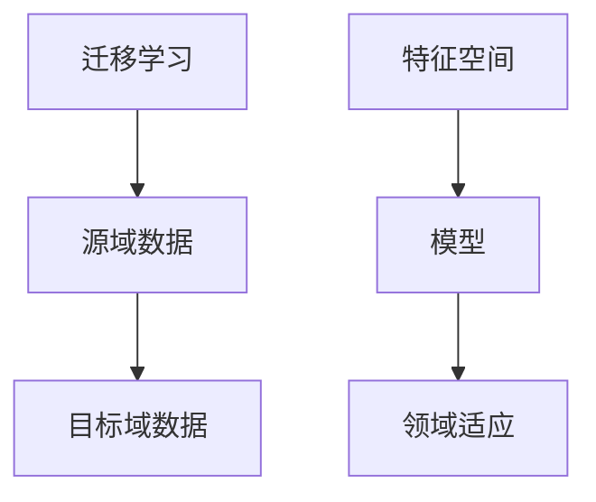
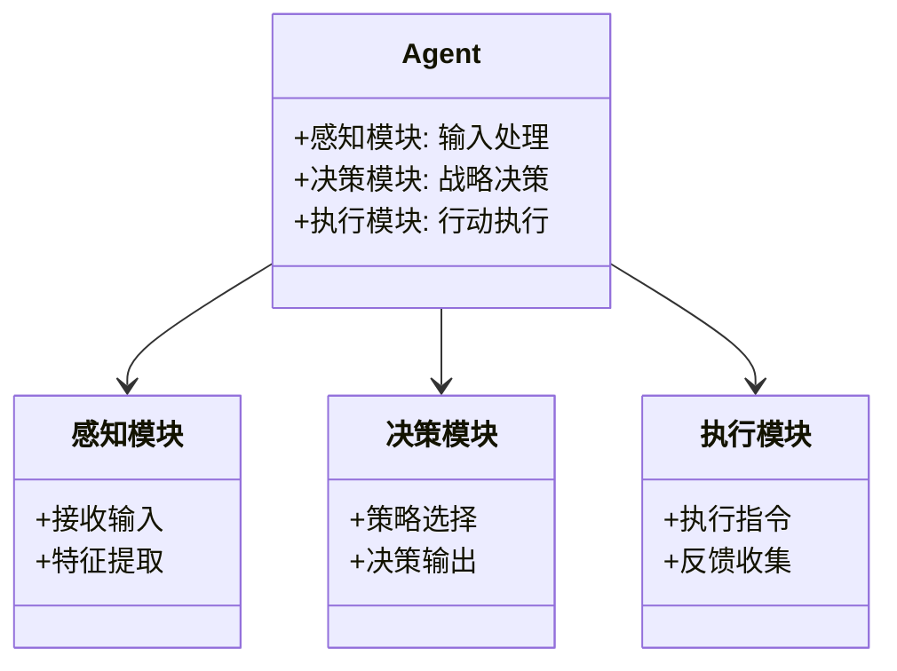
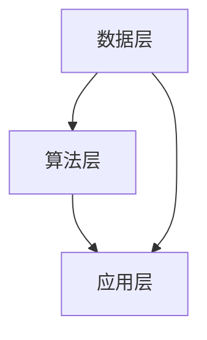

                 


# 迁移学习在AI Agent领域适应中的应用

> 关键词：迁移学习、AI Agent、领域适应、算法原理、系统设计

> 摘要：本文探讨了迁移学习在AI Agent适应中的应用，从核心概念、算法原理到系统设计和项目实战，详细分析了迁移学习如何帮助AI Agent更好地适应新环境和任务。文章结合理论与实践，为AI Agent的开发和应用提供了有价值的指导。

---

## 第一部分：迁移学习在AI Agent领域的背景与核心概念

### 第1章：迁移学习与AI Agent概述

#### 1.1 迁移学习的基本概念

迁移学习是一种机器学习技术，通过利用已学习的知识来辅助新任务的学习。其核心在于将源域的知识迁移到目标域，减少对新任务数据的依赖。与传统机器学习不同，迁移学习强调跨领域的知识转移。

#### 1.2 AI Agent的基本概念

AI Agent（人工智能代理）是一种能够感知环境、执行任务并做出决策的智能体。它广泛应用于自动驾驶、智能助手、游戏AI等领域。AI Agent需要具备适应新环境和任务的能力。

#### 1.3 迁移学习在AI Agent中的重要性

迁移学习在AI Agent中的应用，能够显著提升其适应新任务的能力。通过迁移学习，AI Agent可以在缺乏目标域数据的情况下，快速学习并执行任务，降低训练成本。

---

### 第2章：迁移学习的核心概念与联系

#### 2.1 迁移学习的原理

迁移学习通过特征提取、对齐和模型调整，实现知识的跨领域转移。其核心在于找到源域和目标域之间的共同特征，构建适应目标域的模型。

#### 2.2 核心概念对比分析

- **迁移学习 vs 领域适应**：迁移学习是手段，领域适应是目标。
- **特征提取 vs 模型微调**：特征提取关注低层特征，模型微调关注高层特征。
- **监督学习 vs 迁移学习**：监督学习依赖大量标注数据，迁移学习减少对数据的依赖。

#### 2.3 实体关系图



---

## 第二部分：迁移学习算法原理与数学模型

### 第3章：迁移学习算法原理

#### 3.1 基于特征的迁移学习算法

- **特征提取**：通过降维技术提取特征，如PCA。
- **特征对齐**：通过最大均值差异等方法对齐源域和目标域的特征。
- **实例选择**：选择具有代表性的实例进行迁移。

#### 3.2 基于模型的迁移学习算法

- **参数迁移**：直接迁移模型参数，如深度学习模型的微调。
- **非参数迁移**：不依赖参数，基于核方法进行迁移。
- **深度迁移**：利用深度神经网络提取高层特征。

#### 3.3 基于分布的迁移学习算法

- **分布匹配**：通过对抗训练匹配源域和目标域的分布。
- **最大均值差异**：最小化源域和目标域的特征均值差异。
- **自适应距离度量**：根据目标域数据自适应调整距离度量。

---

### 第4章：迁移学习的数学模型与公式

#### 4.1 基于特征的迁移学习公式

- **最大均值差异**：  
  $$L = \frac{1}{2}(y - y')^2 + \lambda D_{HS}$$  
  其中，$D_{HS}$表示源域和目标域的均值差异。

- **特征对齐公式**：  
  $$D_{HS} = \frac{1}{n}\sum_{i=1}^{n} (f(x_i) - f(x'_i))^2$$

#### 4.2 基于模型的迁移学习公式

- **参数迁移学习**：  
  $$\theta_{target} = \theta_{source} + \lambda (\theta_{target} - \theta_{source})$$  
  其中，$\lambda$是调节参数。

---

## 第三部分：系统分析与架构设计

### 第5章：AI Agent的系统结构

#### 5.1 领域模型设计

通过Mermaid类图展示AI Agent的内部结构，包括感知模块、决策模块和执行模块。



#### 5.2 系统架构设计

通过Mermaid架构图展示AI Agent的整体架构，包括数据层、算法层和应用层。



---

## 第四部分：项目实战

### 第6章：迁移学习项目实战

#### 6.1 环境安装

安装必要的库，如TensorFlow、Keras和Scikit-learn。

```bash
pip install tensorflow scikit-learn
```

#### 6.2 核心代码实现

实现一个简单的迁移学习模型，用于图像分类任务。

```python
import tensorflow as tf
from tensorflow.keras import layers

# 源域和目标域数据加载
source_data = ...  # 源域数据集
target_data = ...  # 目标域数据集

# 特征提取模型
feature_extractor = tf.keras.Sequential([
    layers.Conv2D(32, (3,3), activation='relu'),
    layers.MaxPooling2D((2,2)),
    layers.Flatten(),
    layers.Dense(64, activation='relu')
])

# 迁移学习模型
model = tf.keras.Sequential([
    feature_extractor,
    layers.Dense(10, activation='softmax')
])

# 编译和训练
model.compile(optimizer='adam', loss='sparse_categorical_crossentropy', metrics=['accuracy'])
model.fit(source_data, epochs=10, validation_data=target_data)
```

#### 6.3 案例分析

以图像分类任务为例，展示如何通过迁移学习提升模型在目标域的性能。详细分析模型的训练过程和结果。

---

## 第五部分：总结与展望

### 第7章：总结与未来展望

#### 7.1 总结

迁移学习为AI Agent提供了强大的适应能力，使其能够快速适应新环境和任务，减少对大量目标域数据的依赖。

#### 7.2 未来展望

未来，迁移学习在AI Agent中的应用将更加广泛，特别是在多领域适应和自适应学习方面，具有广阔的发展前景。

---

通过以上结构，本文系统地探讨了迁移学习在AI Agent中的应用，从理论到实践，为读者提供了全面的指导。

