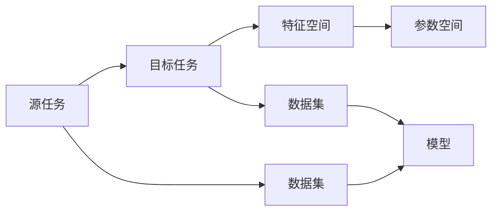
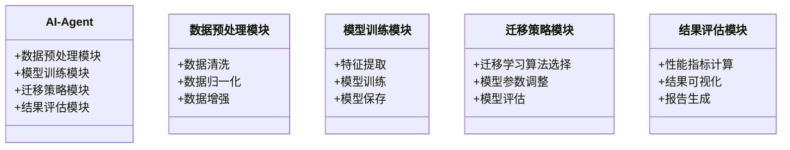
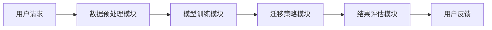

                 


# 迁移学习：快速适应新领域的AI Agent

> 关键词：迁移学习、AI Agent、机器学习、领域适应、数据迁移

> 摘要：迁移学习是一种通过将已学习的知识迁移到新领域或任务的机器学习技术，能够帮助AI Agent快速适应新环境。本文详细分析了迁移学习的核心概念、算法原理、系统架构设计，以及在实际项目中的应用，并提供了丰富的代码示例和系统设计图。

---

# 第一部分: 迁移学习与AI Agent概述

## 第1章: 迁移学习的核心概念与背景

### 1.1 迁移学习的定义与背景

#### 1.1.1 机器学习的基本概念
机器学习是一种通过数据训练模型，使其能够从经验中学习并做出预测的技术。传统的机器学习方法（如支持向量机、随机森林等）需要大量的标注数据，并且假设训练数据和测试数据的分布相同。

#### 1.1.2 迁移学习的提出背景
在实际应用中，许多场景下数据标注成本高昂，且新领域或任务的数据往往有限，导致传统机器学习方法难以有效训练模型。迁移学习正是为了解决这一问题而提出，它允许模型将从源任务或源领域学到的知识迁移到目标任务或目标领域。

#### 1.1.3 AI Agent的定义与特点
AI Agent是一种能够感知环境、执行任务并做出决策的智能体。它需要快速适应新领域，处理多样化的任务，并具备自主学习的能力。迁移学习为AI Agent提供了快速适应新领域的能力。

---

### 1.2 迁移学习的核心问题

#### 1.2.1 数据不足的挑战
在许多实际场景中，目标任务的数据量可能非常有限，甚至为零。迁移学习的目标是通过利用源任务的大量数据来提高目标任务的性能。

#### 1.2.2 领域适应的需求
源任务和目标任务可能属于不同的领域，导致数据分布发生变化。迁移学习需要解决领域适应问题，减少域适应带来的性能下降。

#### 1.2.3 迁移学习的目标与边界
迁移学习的目标是通过共享源任务和目标任务之间的共同特征或参数，提高目标任务的性能。其边界在于，仅在数据分布变化较小的领域内有效，且需要明确的源任务和目标任务定义。

---

### 1.3 迁移学习的分类与应用场景

#### 1.3.1 基于样本的迁移学习
这种方法通过直接迁移样本到目标领域来提高性能。适用于样本之间的特征相似性较高的场景。

#### 1.3.2 基于特征的迁移学习
这种方法通过提取源领域和目标领域的共同特征，构建特征空间，从而实现知识迁移。

#### 1.3.3 基于参数的迁移学习
这种方法通过调整模型参数，使得源任务和目标任务之间的参数尽可能一致。

#### 1.3.4 迁移学习的典型应用场景
- 医疗领域：将医学影像分类模型迁移到新的疾病检测任务。
- 自然语言处理：将文本分类模型迁移到新的语言或领域。
- 图像处理：将图像分类模型迁移到新的物体检测任务。

---

## 第2章: 迁移学习的核心概念与联系

### 2.1 迁移学习的原理与机制

#### 2.1.1 源任务与目标任务的关系
源任务和目标任务可能属于不同的领域，但它们之间可能存在某种关联性。迁移学习通过利用这种关联性来提高目标任务的性能。

#### 2.1.2 特征空间与参数空间的迁移
- **特征空间迁移**：通过构建共同的特征空间，使得源任务和目标任务的特征表示具有可比性。
- **参数空间迁移**：通过调整模型参数，使得源任务和目标任务的模型参数尽可能一致。

#### 2.1.3 迁移学习的数学表达
在数学上，迁移学习可以表示为：
$$ P(y|X) = f(X) $$
其中，$X$ 是输入数据，$y$ 是目标标签，$f$ 是从源任务迁移得到的模型。

---

### 2.2 迁移学习方法的对比分析

#### 2.2.1 样本迁移 vs 特征迁移
| 对比维度 | 样本迁移 | 特征迁移 |
|----------|----------|----------|
| 数据需求 | 需要目标领域数据 | 仅需要源领域数据 |
| 过拟合风险 | 较高 | 较低 |
| 适用场景 | 数据量较小 | 数据量较大 |

#### 2.2.2 参数迁移 vs 模型迁移
| 对比维度 | 参数迁移 | 模型迁移 |
|----------|----------|----------|
| 灵活性 | 较低 | 较高 |
| 计算成本 | 较低 | 较高 |
| 适用场景 | 简单任务 | 复杂任务 |

---

### 2.3 迁移学习的ER实体关系图



---

## 第3章: 基于SVM的迁移学习算法

### 3.1 迁移SVM的基本原理

#### 3.1.1 SVM的基本概念
支持向量机（SVM）是一种监督学习算法，通过构建超平面将数据点分为两类。其核心思想是找到一个最优的超平面，使得数据点与超平面的最小距离最大化。

#### 3.1.2 迁移SVM的改进思路
迁移SVM通过在源任务和目标任务之间共享支持向量，从而实现知识迁移。

#### 3.1.3 迁移SVM的数学模型
迁移SVM的目标函数可以表示为：
$$ \min_{w, b, \xi} \frac{1}{2}||w||^2 + C\sum_{i=1}^n \xi_i $$
$$ \text{subject to } y_i(w \cdot x_i + b) \geq 1 - \xi_i $$
其中，$w$ 是权重向量，$b$ 是偏置项，$\xi_i$ 是松弛变量，$C$ 是惩罚系数。

---

### 3.2 迁移SVM的实现流程

#### 3.2.1 数据预处理
- 数据归一化
- 数据增强

#### 3.2.2 核函数的选择与设计
常用的核函数包括线性核、多项式核、径向基函数（RBF）核等。

#### 3.2.3 参数优化与模型训练
使用交叉验证方法优化SVM的参数（C和gamma）。

---

### 3.3 迁移SVM的代码实现

```python
import numpy as np
from sklearn.svm import SVC

# 示例代码：基于SVM的迁移学习实现
def transfer_svm(X_source, y_source, X_target, y_target):
    # 训练源任务SVM模型
    svm_model = SVC(C=1.0, kernel='rbf', gamma='auto')
    svm_model.fit(X_source, y_source)
    
    # 将目标任务数据转换到源任务的特征空间
    X_target_transformed = svm_model.transform(X_target)
    
    # 在目标任务数据上重新训练SVM模型
    svm_model_target = SVC(C=1.0, kernel='rbf', gamma='auto')
    svm_model_target.fit(X_target_transformed, y_target)
    
    return svm_model_target
```

---

## 第4章: 迁移学习的系统架构设计

### 4.1 系统功能设计

#### 4.1.1 领域模型设计


---

### 4.2 系统架构设计

#### 4.2.1 系统架构图


---

## 第5章: 项目实战

### 5.1 环境安装与配置

#### 5.1.1 安装依赖
```bash
pip install numpy scikit-learn
```

#### 5.1.2 环境配置
```python
import numpy as np
from sklearn.svm import SVC
from sklearn.metrics import accuracy_score
```

---

### 5.2 核心实现代码

#### 5.2.1 数据准备
```python
# 源任务数据
X_source = np.array([[1, 2], [3, 4], [5, 6]])
y_source = np.array([0, 0, 1])

# 目标任务数据
X_target = np.array([[2, 3], [4, 5], [6, 7]])
y_target = np.array([0, 1, 1])
```

#### 5.2.2 模型训练与迁移
```python
# 训练源任务模型
svm_model = SVC(C=1.0, kernel='rbf', gamma='auto')
svm_model.fit(X_source, y_source)

# 将目标任务数据转换到源任务的特征空间
X_target_transformed = svm_model.transform(X_target)

# 在目标任务数据上重新训练SVM模型
svm_model_target = SVC(C=1.0, kernel='rbf', gamma='auto')
svm_model_target.fit(X_target_transformed, y_target)
```

#### 5.2.3 模型评估
```python
# 预测目标任务数据
y_pred = svm_model_target.predict(X_target_transformed)

# 计算准确率
accuracy = accuracy_score(y_target, y_pred)
print(f"Accuracy: {accuracy}")
```

---

## 第6章: 最佳实践与小结

### 6.1 最佳实践

#### 6.1.1 数据质量
确保源任务和目标任务的数据质量，尽量减少噪声。

#### 6.1.2 特征选择
选择与目标任务相关的特征，避免无关特征的干扰。

#### 6.1.3 模型选择
根据任务特点选择合适的迁移学习算法，例如：
- 对于小样本任务，选择基于样本的迁移学习。
- 对于大样本任务，选择基于特征的迁移学习。

---

### 6.2 小结

迁移学习是一种强大的技术，能够帮助AI Agent快速适应新领域。通过本文的分析，我们了解了迁移学习的核心概念、算法原理、系统架构设计，以及在实际项目中的应用。迁移学习的应用场景非常广泛，未来随着技术的发展，迁移学习将在更多领域发挥重要作用。

---

## 第7章: 拓展阅读与注意事项

### 7.1 拓展阅读
- "Transfer Learning for Low-Resource Languages"（低资源语言的迁移学习）
- "Deep Learning for Transfer Learning"（深度学习中的迁移学习）

### 7.2 注意事项
- 迁移学习的有效性依赖于源任务和目标任务之间的相似性。
- 在实际应用中，需要根据具体场景选择合适的迁移学习方法。
- 迁移学习可能会引入偏见，需要注意数据的平衡性。

---

# 结语

通过本文的详细讲解，我们深入探讨了迁移学习的核心概念、算法原理、系统架构设计，以及在实际项目中的应用。迁移学习为AI Agent提供了快速适应新领域的能力，未来随着技术的进步，迁移学习将在更多领域发挥重要作用。

