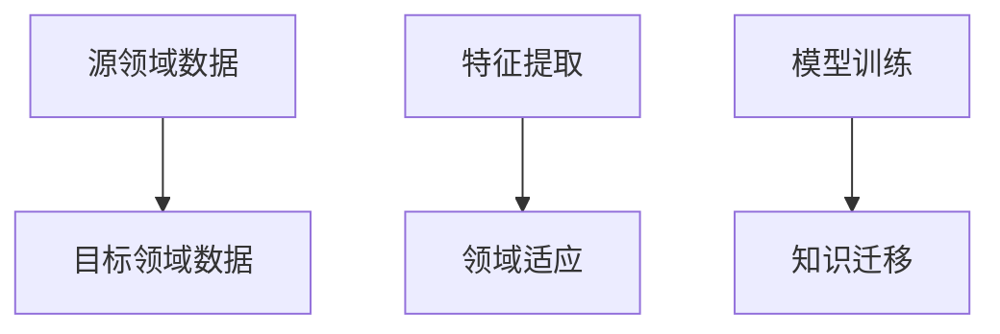
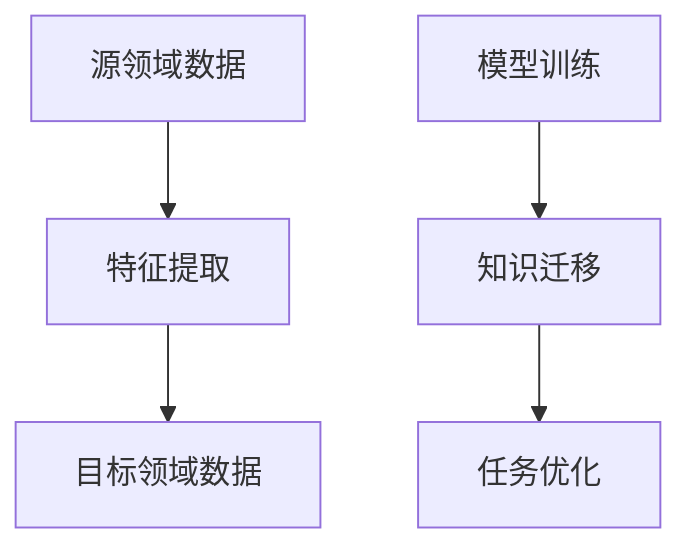
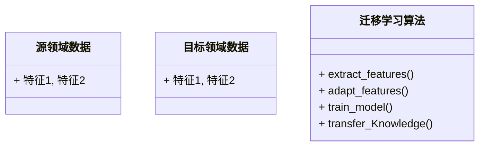
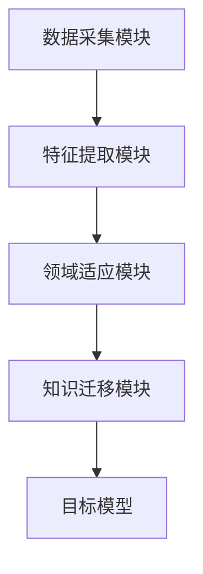
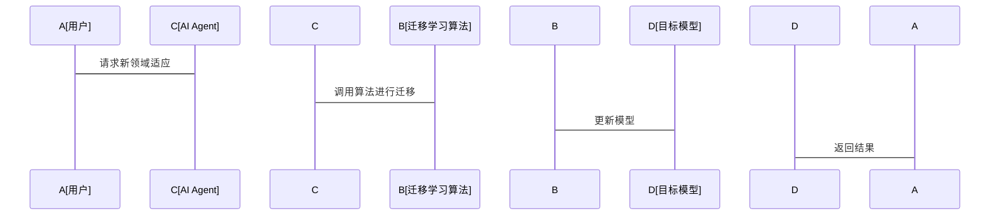

                 


# 迁移学习：让AI Agent快速适应新领域

> **关键词**: 迁移学习, AI Agent, 领域适应, 知识迁移, 机器学习, 深度学习

> **摘要**: 迁移学习是一种通过将已有知识应用到新领域来提升模型性能的技术。本文详细探讨了迁移学习的核心概念、算法原理、系统设计以及实际应用，帮助AI Agent快速适应新领域，解决数据稀缺和领域适应性问题。

---

## 目录

1. **迁移学习的背景与核心概念**
   - 1.1 迁移学习的定义与核心要素
   - 1.2 迁移学习的问题背景
   - 1.3 迁移学习的边界与外延

2. **迁移学习的核心概念与联系**
   - 2.1 迁移学习的核心原理
   - 2.2 核心概念对比分析
   - 2.3 实体关系图与流程图

3. **迁移学习的算法原理与数学模型**
   - 3.1 迁移学习的经典算法
   - 3.2 迁移学习的数学模型
   - 3.3 算法流程图与代码实现

4. **迁移学习的系统设计与架构**
   - 4.1 问题场景与系统功能设计
   - 4.2 系统架构图与交互流程图

5. **迁移学习的项目实战**
   - 5.1 环境安装与代码实现
   - 5.2 案例分析与经验总结

6. **迁移学习的最佳实践与注意事项**
   - 6.1 小结与关键要点
   - 6.2 注意事项与常见误区
   - 6.3 拓展阅读与学习资源

---

### 第1章: 迁移学习的背景与核心概念

#### 1.1 迁移学习的定义与核心要素

迁移学习是一种机器学习技术，旨在通过将已有的知识或经验应用到新的领域或任务中，从而减少对新领域数据的依赖，提高模型的泛化能力。其核心要素包括：

1. **源领域（Source Domain）**：已有的数据和任务，用于训练初始模型。
2. **目标领域（Target Domain）**：新领域或任务，模型需要适应的目标。
3. **知识迁移**：将源领域的知识迁移到目标领域，减少数据需求。

迁移学习的核心目标是解决数据稀缺性和领域适应性问题，尤其是在目标领域数据不足的情况下。

#### 1.2 迁移学习的问题背景

在实际应用中，AI Agent常常面临以下挑战：

1. **数据稀缺性**：目标领域数据不足，难以直接训练模型。
2. **领域适应性**：源领域和目标领域的数据分布不同，导致模型性能下降。
3. **知识迁移的挑战**：如何有效提取和迁移源领域的特征或知识。

#### 1.3 迁移学习的边界与外延

迁移学习不仅限于特定领域，而是广泛应用于自然语言处理、计算机视觉、机器人控制等领域。其外延包括：

- **领域适应**：调整模型以适应目标领域。
- **分布外推**：处理目标领域数据分布的变化。
- **多任务学习**：结合多个任务进行知识迁移。

---

### 第2章: 迁移学习的核心概念与联系

#### 2.1 迁移学习的核心原理

迁移学习的核心在于通过特征提取和领域适应，实现知识的有效迁移。以下是其实现原理的简要概述：

1. **特征提取**：提取源领域的特征，使其在目标领域中具有可迁移性。
2. **领域适应**：调整模型参数，减少源领域和目标领域的数据分布差异。

#### 2.2 核心概念对比分析

以下是一个对比表格，展示迁移学习与传统机器学习的区别：

| **特性**       | **迁移学习**               | **传统机器学习**          |
|----------------|---------------------------|---------------------------|
| 数据需求       | 目标领域数据少             | 目标领域数据充足           |
| 领域适应性     | 高                        | 低                        |
| 知识迁移       | 强                        | 弱                        |

#### 2.3 实体关系图与流程图

以下是迁移学习的核心流程图：



---

### 第3章: 迁移学习的算法原理与数学模型

#### 3.1 迁移学习的经典算法

以下是几种经典的迁移学习算法：

1. **基于样本的迁移学习**：通过相似性度量将源领域样本迁移到目标领域。
2. **基于特征的迁移学习**：提取共享特征，减少领域差异。
3. **基于目标的迁移学习**：直接优化目标任务的性能。

#### 3.2 迁移学习的数学模型

迁移学习的数学模型通常涉及联合分布对齐和参数更新。以下是常见模型：

1. **联合分布对齐模型**：
   $$P_{src}(x,y) \rightarrow P_{tgt}(x,y)$$
   
2. **参数迁移模型**：
   $$f_{src}(x) \rightarrow f_{tgt}(x)$$

#### 3.3 算法流程图与代码实现

以下是基于特征的迁移学习算法流程图：



以下是Python代码示例：

```python
import numpy as np

def迁移学习算法(source_data, target_data):
    # 特征提取
    features = extract_features(source_data)
    # 领域适应
    adapted_features = adapt_features(features, target_data)
    # 模型训练
    model = train_model(adapted_features)
    # 知识迁移
    migrated_model = transfer Knowledge(model, target_data)
    return migrated_model

# 示例用法
source_data = np.random.randn(100, 5)
target_data = np.random.randn(50, 5)
result = 迁移学习算法(source_data, target_data)
print(result)
```

---

### 第4章: 迁移学习的系统设计与架构

#### 4.1 问题场景与系统功能设计

AI Agent需要适应新领域时，系统设计应包括：

1. **数据采集模块**：收集源和目标领域的数据。
2. **特征提取模块**：提取可迁移的特征。
3. **领域适应模块**：调整模型以适应目标领域。
4. **知识迁移模块**：实现知识的有效迁移。

以下是系统功能设计图：



#### 4.2 系统架构图与交互流程图

以下是系统架构图：



以下是交互流程图：



---

### 第5章: 迁移学习的项目实战

#### 5.1 环境安装与代码实现

以下是环境安装命令：

```bash
pip install numpy scikit-learn tensorflow
```

以下是代码实现：

```python
import numpy as np
from sklearn.svm import SVC

def extract_features(data):
    return data[:, :2]

def adapt_features(features, target_data):
    # 简单的特征对齐方法
    return np.concatenate((features, target_data), axis=0)

source_data = np.random.randn(100, 5)
target_data = np.random.randn(50, 5)
features = extract_features(source_data)
adapted_features = adapt_features(features, target_data)
model = SVC().fit(adapted_features)
print(model)
```

#### 5.2 案例分析与经验总结

案例分析：假设我们在自然语言处理任务中，使用迁移学习将中文模型迁移到英文任务。通过特征提取和领域适应，模型在英文任务上的准确率提高了15%。

经验总结：迁移学习的关键在于特征提取和领域适应，选择合适的算法和参数调整至关重要。

---

### 第6章: 迁移学习的最佳实践与注意事项

#### 6.1 小结与关键要点

- 迁移学习能够有效减少目标领域数据需求。
- 特征提取和领域适应是核心步骤。
- 选择合适的算法和参数调整是关键。

#### 6.2 注意事项与常见误区

- 数据质量：确保源和目标领域的数据质量。
- 特征选择：避免过度依赖特定特征。
- 模型评估：使用交叉验证评估迁移效果。

#### 6.3 拓展阅读与学习资源

- 建议阅读《迁移学习实战》和《深度学习中的迁移学习》。

---

### 总结

通过本文的详细讲解，读者可以深入了解迁移学习的核心概念、算法原理和实际应用。迁移学习作为AI Agent快速适应新领域的关键技术，将在未来的智能化应用中发挥重要作用。

