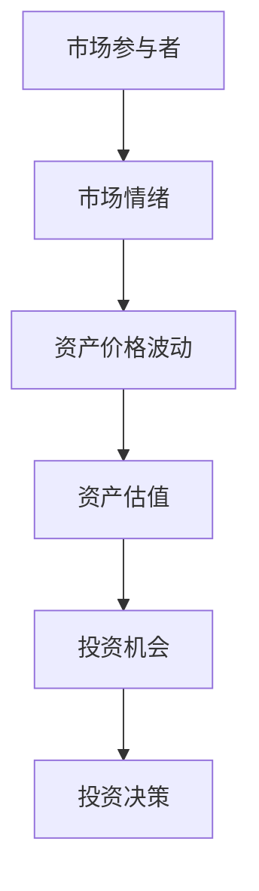
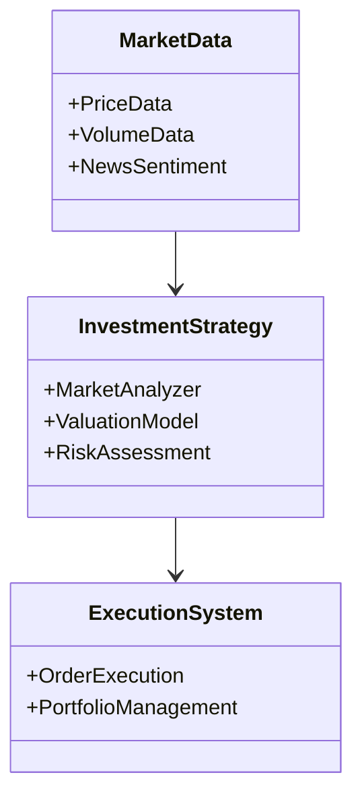

                 


# 迈克尔·伯里的反向投资策略：逆势而为

## 关键词：反向投资，逆向思维，投资策略，迈克尔·伯里，金融分析

## 摘要：  
反向投资是一种在金融市场中逆潮流而动的投资策略，通过分析市场趋势、估值和情绪，寻找被低估的投资机会。本文深入探讨迈克尔·伯里的反向投资策略，结合理论分析和实际案例，揭示其背后的逻辑、算法和系统架构，帮助读者理解如何在市场逆境中发现价值，制定有效的投资策略。

---

# 第一部分: 迈克尔·伯里的反向投资策略背景介绍

## 第1章: 反向投资策略的起源与演变

### 1.1 反向投资的起源

#### 1.1.1 投资学的基本概念  
投资学是研究资金分配、资产定价和风险管理的学科，其核心在于寻找价值被低估的资产。反向投资作为一种独特的策略，强调在市场低谷时买入，在市场高点时卖出。

#### 1.1.2 逆向思维的定义与特征  
逆向思维是指在市场普遍乐观时保持谨慎，在市场悲观时寻找机会。其核心特征包括非共识性、逆周期性和长期性。

#### 1.1.3 迈克尔·伯里投资理念的核心要素  
迈克尔·伯里强调通过基本面分析和市场情绪判断，寻找市场低估的资产。他的策略以逆周期性和长期价值为导向。

### 1.2 反向投资策略的发展历程

#### 1.2.1 早期逆向投资的萌芽  
逆向投资的起源可以追溯到19世纪末，早期投资者通过分析市场波动寻找机会。

#### 1.2.2 迈克尔·伯里对反向投资的贡献  
迈克尔·伯里通过深入研究市场波动和估值，发展出一套系统的反向投资策略。

#### 1.2.3 反向投资在现代金融中的应用  
随着金融市场的复杂化，反向投资策略逐渐被机构投资者和散户采用，成为重要的投资工具。

### 1.3 反向投资的现状与趋势

#### 1.3.1 当前金融市场中的反向投资实践  
反向投资在股票、债券和房地产等领域广泛应用。

#### 1.3.2 反向投资策略的未来发展方向  
结合大数据和人工智能，反向投资策略将更加精准和高效。

#### 1.3.3 技术进步对反向投资的影响  
技术进步使得市场数据的收集和分析更加高效，为反向投资提供了新的工具和方法。

---

## 第2章: 反向投资的核心概念与联系

### 2.1 反向投资的原理与机制

#### 2.1.1 逆向思维的定义与数学模型  
逆向思维通过分析市场趋势和估值，寻找投资机会。数学模型包括均值回归和波动率分析。

#### 2.1.2 反向投资的决策逻辑  
反向投资基于市场情绪和估值，寻找低估资产。其决策逻辑包括市场分析、估值判断和风险评估。

#### 2.1.3 反向投资与传统投资策略的对比分析  
反向投资与传统投资策略在时机选择、风险偏好和资产配置上有显著差异。

### 2.2 反向投资的核心概念属性对比

#### 2.2.1 投资策略的属性特征对比表格  
| 投资策略 | 传统投资 | 反向投资 |
|----------|----------|----------|
| 时间选择 | 高点买入 | 低点买入 |
| 风险偏好 | 高风险厌恶 | 适度风险承受 |
| 资产配置 | 集中配置 | 分散配置 |

#### 2.2.2 反向投资与其他策略的联系  
反向投资与其他策略如价值投资和趋势投资有一定的联系和区别。

### 2.3 反向投资的ER实体关系图



---

# 第二部分: 反向投资策略的算法原理

## 第3章: 反向投资策略的数学模型与公式

### 3.1 反向投资的数学模型

#### 3.1.1 基于均值回归的反向投资模型  
均值回归模型假设资产价格会回归其历史平均值。

#### 3.1.2 基于波动率的反向投资策略  
波动率模型用于判断市场波动对资产价格的影响。

#### 3.1.3 基于市场情绪的反向投资模型  
市场情绪模型分析投资者情绪对资产价格的影响。

### 3.2 反向投资策略的关键公式

#### 3.2.1 均值回归模型  
$$ E(R_i) = R_f + β_i (R_m - R_f) $$

#### 3.2.2 波动率模型  
$$ \sigma = \sqrt{\sum_{i=1}^n (x_i - \mu)^2 / N} $$

---

## 第4章: 反向投资策略的系统架构设计

### 4.1 系统功能设计

#### 4.1.1 领域模型mermaid类图  


### 4.2 系统架构设计mermaid架构图  
```mermaid
container MarketData {
    MarketDataCollector
    DataStorage
}
container InvestmentStrategy {
    MarketAnalyzer
    ValuationModel
}
container ExecutionSystem {
    OrderExecution
    PortfolioManagement
}
MarketData --> InvestmentStrategy
InvestmentStrategy --> ExecutionSystem
```

---

## 第5章: 反向投资策略的项目实战

### 5.1 环境安装

#### 5.1.1 安装Python和相关库  
安装Python和Pandas、NumPy等库。

### 5.2 核心实现源代码

#### 5.2.1 均值回归模型实现  
```python
import pandas as pd
import numpy as np

def mean_reversion_model(data, window=20):
    data['SAR'] = data['Price'].rolling(window).mean()
    data['Signal'] = np.where(data['Price'] < data['SAR'], 'Buy', 'Sell')
    return data
```

### 5.3 案例分析与解读

#### 5.3.1 案例分析  
以某股票为例，分析其价格波动和均值回归信号。

---

## 第6章: 反向投资策略的最佳实践

### 6.1 投资策略建议  
分散投资、长期持有和定期再平衡是反向投资的关键策略。

### 6.2 投资风险管理  
使用止损和止盈机制，控制投资风险。

### 6.3 持续学习与优化  
不断学习市场动态和新技术，优化投资策略。

---

## 第7章: 小结

反向投资策略通过逆向思维，帮助投资者在市场低谷中发现价值，实现长期收益。本文通过理论分析和实际案例，详细阐述了反向投资的策略、算法和系统设计，为投资者提供了实用的指导。

---

## 第8章: 注意事项与拓展阅读

### 8.1 投资者注意事项  
投资者需具备市场分析能力和风险承受能力，避免盲目跟风。

### 8.2 拓展阅读  
推荐阅读迈克尔·伯里的相关著作，深入理解反向投资策略。

---

通过本文的系统分析和实际案例，读者可以全面理解迈克尔·伯里的反向投资策略，掌握其在现代金融中的应用，并在实际投资中灵活运用这些策略。

