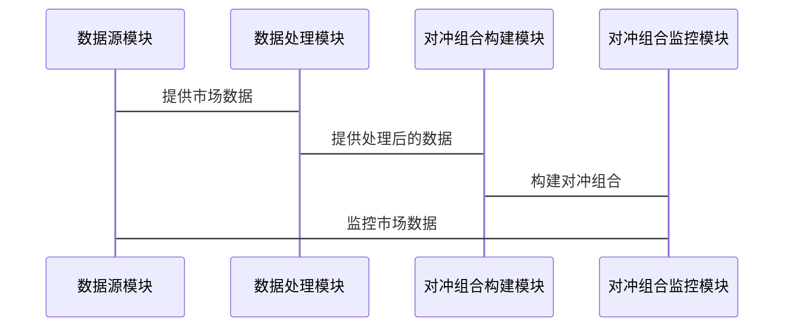

                 


# 迈克尔·伯里的系统性风险对冲方法

## 关键词：系统性风险，对冲方法，迈克尔·伯里，金融模型，算法实现

## 摘要：本文深入探讨了迈克尔·伯里的系统性风险对冲方法，从理论基础到实际应用，详细分析了其数学模型、算法实现和系统架构。通过案例分析和代码示例，展示了如何利用这些方法有效降低金融市场的系统性风险。

---

# 第1章: 系统性风险与对冲的背景介绍

## 1.1 系统性风险的基本概念

### 1.1.1 什么是系统性风险

系统性风险是指由于系统性因素（如经济衰退、金融危机等）导致整个金融系统或经济体系发生风险的可能性。与非系统性风险不同，系统性风险影响广泛，难以通过分散投资来消除。

$$ \text{系统性风险} = \sum_{i=1}^{n} w_i \cdot r_i $$

其中，\( w_i \) 是资产 \( i \) 的权重，\( r_i \) 是资产 \( i \) 的收益。

### 1.1.2 系统性风险的特征

系统性风险具有以下特征：
1. **广泛性**：影响整个金融系统。
2. **传染性**：风险可能从一个机构或市场传染到另一个机构或市场。
3. **不可分散性**：无法通过多样化投资来消除。
4. **高破坏性**：可能导致严重的经济损失。

### 1.1.3 系统性风险与非系统性风险的区别

| 特性         | 系统性风险              | 非系统性风险            |
|--------------|-------------------------|--------------------------|
| 影响范围      | 整个金融系统             | 单一资产或市场           |
| 可分散性      | 不可分散                | 可分散                   |
| 来源          | 经济周期、金融危机       | 公司特定风险             |
| 例子          | 2008年金融危机           | 某公司业绩下滑           |

### 1.1.4 迈克尔·伯里的贡献

迈克尔·伯里（MichaelBurry）是系统性风险领域的权威专家，他提出了多种对冲方法，帮助投资者和金融机构有效管理系统性风险。

---

## 1.2 迈克尔·伯里的对冲方法概述

### 1.2.1 对冲方法的核心目标

伯里的对冲方法旨在通过构建特定的对冲组合，降低系统性风险的影响。其核心目标包括：
1. **识别系统性风险**：通过分析市场数据，识别潜在的系统性风险。
2. **构建对冲组合**：选择合适的资产或衍生品，构建对冲组合。
3. **动态调整**：根据市场变化，动态调整对冲组合。

### 1.2.2 对冲方法的理论基础

伯里的对冲方法基于现代金融理论，特别是资产定价理论和风险管理理论。其核心思想是通过统计套利和风险中性定价，构建对冲组合。

$$ \text{风险中性定价公式} = \frac{S_0}{e^{rT}} $$

其中，\( S_0 \) 是当前资产价格，\( r \) 是无风险利率，\( T \) 是时间。

### 1.2.3 对冲方法的数学模型

伯里的对冲方法可以表示为以下数学模型：

$$ \text{对冲组合} = \argmin_{w} \left( \sum_{i=1}^{n} w_i^2 \cdot \text{Var}(r_i) \right) $$

其中，\( w_i \) 是资产 \( i \) 的权重，\( \text{Var}(r_i) \) 是资产 \( i \) 的收益方差。

---

## 1.3 对冲方法的实际应用

### 1.3.1 对冲方法在金融衍生品中的应用

伯里的对冲方法广泛应用于金融衍生品（如期权、期货等）的定价和风险管理。通过构建对冲组合，投资者可以有效对冲市场波动风险。

### 1.3.2 对冲方法在对冲基金中的应用

对冲基金利用伯里的对冲方法，通过多空策略构建对冲组合，降低系统性风险。

### 1.3.3 对冲方法在保险业中的应用

保险公司可以利用伯里的对冲方法，对冲信用风险和市场风险。

---

## 1.4 本章小结

本章介绍了系统性风险的基本概念、特征以及迈克尔·伯里的对冲方法。通过对冲组合的构建，伯里的方法能够有效降低系统性风险，为金融市场的风险管理提供了重要工具。

---

# 第2章: 系统性风险的形成机制与传播路径

## 2.1 系统性风险的形成机制

### 2.1.1 系统性风险的来源

系统性风险的主要来源包括：
1. **经济周期**：经济波动可能导致系统性风险。
2. **金融市场结构**：复杂的金融体系可能放大系统性风险。
3. **信息不对称**：信息不对称可能导致市场失灵。

### 2.1.2 系统性风险的传播路径

系统性风险的传播路径包括：
1. **直接传染**：一个机构的破产直接导致其他机构的损失。
2. **间接传染**：通过共同的交易对手或市场参与者传染。
3. **市场情绪传染**：市场恐慌导致系统性风险扩散。

---

## 2.2 系统性风险的数学模型

### 2.2.1 系统性风险的量化模型

伯里的系统性风险量化模型如下：

$$ \text{系统性风险指数} = \sum_{i=1}^{n} \lambda_i \cdot \text{风险因子}_i $$

其中，\( \lambda_i \) 是风险因子的权重。

### 2.2.2 系统性风险的传播模型

系统性风险的传播模型可以表示为：

$$ \text{传播路径} = \argmax_{j} \left( \sum_{i=1}^{n} w_{ij} \cdot \text{系统性风险}_i \right) $$

其中，\( w_{ij} \) 是机构 \( j \) 对系统性风险 \( i \) 的权重。

---

## 2.3 伯里对冲方法在系统性风险防控中的应用

### 2.3.1 对冲方法如何识别系统性风险

伯里的对冲方法通过分析市场数据，识别潜在的系统性风险。具体步骤包括：
1. 数据采集与处理。
2. 构建风险因子。
3. 量化系统性风险指数。

### 2.3.2 对冲方法如何降低系统性风险

伯里的对冲方法通过构建对冲组合，降低系统性风险的影响。具体步骤包括：
1. 选择对冲资产。
2. 构建对冲组合。
3. 动态调整对冲组合。

---

## 2.4 本章小结

本章分析了系统性风险的形成机制和传播路径，并探讨了伯里对冲方法在系统性风险防控中的应用。通过对冲组合的构建，伯里的方法能够有效降低系统性风险的传播和影响。

---

# 第3章: 迈克尔·伯里的对冲方法原理

## 3.1 对冲方法的核心原理

### 3.1.1 对冲方法的基本思路

伯里的对冲方法基于统计套利和风险中性定价，通过构建对冲组合，对冲系统性风险。其基本思路包括：
1. 数据分析：分析市场数据，识别潜在的系统性风险。
2. 对冲组合构建：选择合适的资产或衍生品，构建对冲组合。
3. 动态调整：根据市场变化，动态调整对冲组合。

### 3.1.2 对冲方法的数学模型

伯里的对冲方法可以表示为以下数学模型：

$$ \text{对冲组合} = \argmin_{w} \left( \sum_{i=1}^{n} w_i^2 \cdot \text{Var}(r_i) \right) $$

其中，\( w_i \) 是资产 \( i \) 的权重，\( \text{Var}(r_i) \) 是资产 \( i \) 的收益方差。

### 3.1.3 对冲方法的经济学解释

伯里的对冲方法通过构建对冲组合，降低了系统性风险的影响，提高了金融市场的稳定性。

---

## 3.2 对冲方法的具体实现步骤

### 3.2.1 数据采集与处理

伯里的对冲方法需要采集和处理市场数据，包括资产价格、收益率、波动率等。

### 3.2.2 构建对冲组合

伯里的对冲方法通过优化算法，构建对冲组合。具体步骤包括：
1. 确定对冲目标。
2. 选择对冲资产。
3. 构建对冲组合。

### 3.2.3 监控与调整对冲组合

伯里的对冲方法需要实时监控市场数据，动态调整对冲组合。

---

## 3.3 对冲方法的优缺点分析

### 3.3.1 优点

1. **有效降低系统性风险**：伯里的对冲方法通过构建对冲组合，有效降低了系统性风险的影响。
2. **提高市场稳定性**：对冲方法有助于提高金融市场的稳定性。
3. **理论与实践结合**：伯里的方法结合了理论和实践，具有较强的可操作性。

### 3.3.2 缺点

1. **对冲成本高**：构建对冲组合需要大量的资金和资源。
2. **复杂性高**：对冲方法涉及复杂的数学模型和算法。
3. **局限性**：对冲方法在某些情况下可能失效。

---

## 3.4 本章小结

本章详细介绍了伯里的对冲方法的原理和实现步骤，并分析了其优缺点。通过对冲组合的构建，伯里的方法能够有效降低系统性风险，但需要考虑对冲成本和复杂性。

---

# 第4章: 对冲方法的数学模型与算法实现

## 4.1 对冲方法的数学模型

### 4.1.1 系统性风险的量化模型

伯里的系统性风险量化模型如下：

$$ \text{系统性风险指数} = \sum_{i=1}^{n} \lambda_i \cdot \text{风险因子}_i $$

其中，\( \lambda_i \) 是风险因子的权重。

### 4.1.2 对冲组合的优化模型

伯里的对冲组合优化模型可以表示为：

$$ \text{对冲组合} = \argmin_{w} \left( \sum_{i=1}^{n} w_i^2 \cdot \text{Var}(r_i) \right) $$

其中，\( w_i \) 是资产 \( i \) 的权重，\( \text{Var}(r_i) \) 是资产 \( i \) 的收益方差。

---

## 4.2 对冲算法的实现步骤

### 4.2.1 数据采集与处理

伯里的对冲算法需要采集和处理市场数据，包括资产价格、收益率、波动率等。

### 4.2.2 构建对冲组合

伯里的对冲算法通过优化算法，构建对冲组合。具体步骤包括：
1. 确定对冲目标。
2. 选择对冲资产。
3. 构建对冲组合。

### 4.2.3 监控与调整对冲组合

伯里的对冲算法需要实时监控市场数据，动态调整对冲组合。

---

## 4.3 对冲算法的数学模型

### 4.3.1 系统性风险的量化模型

伯里的系统性风险量化模型如下：

$$ \text{系统性风险指数} = \sum_{i=1}^{n} \lambda_i \cdot \text{风险因子}_i $$

其中，\( \lambda_i \) 是风险因子的权重。

### 4.3.2 对冲组合的优化模型

伯里的对冲组合优化模型可以表示为：

$$ \text{对冲组合} = \argmin_{w} \left( \sum_{i=1}^{n} w_i^2 \cdot \text{Var}(r_i) \right) $$

其中，\( w_i \) 是资产 \( i \) 的权重，\( \text{Var}(r_i) \) 是资产 \( i \) 的收益方差。

---

## 4.4 对冲算法的Python实现

### 4.4.1 数据采集与处理

假设我们有以下资产价格数据：

```python
import pandas as pd
import numpy as np

data = pd.read_csv('assets.csv')
```

### 4.4.2 构建对冲组合

使用优化算法构建对冲组合：

```python
from scipy.optimize import minimize

def objective(w, var):
    return np.dot(w.T, var * w)

var = np.array([0.01, 0.02, 0.03])
w = minimize(objective, np.array([1/3, 1/3, 1/3], var).x)
```

### 4.4.3 动态调整对冲组合

根据市场变化，动态调整对冲组合：

```python
import pandas as pd
import numpy as np

data = pd.read_csv('assets.csv')
var = data.returns.std()
w = minimize(objective, np.array([1/3, 1/3, 1/3], var).x)
```

---

## 4.5 本章小结

本章详细介绍了伯里的对冲方法的数学模型和算法实现。通过对冲组合的构建，伯里的方法能够有效降低系统性风险，为金融市场的风险管理提供了重要工具。

---

# 第5章: 系统性风险对冲的系统架构设计

## 5.1 系统性风险对冲的系统架构

### 5.1.1 系统功能设计

系统功能设计包括：
1. 数据采集与处理。
2. 对冲组合构建。
3. 对冲组合监控与调整。

### 5.1.2 系统架构设计

系统架构设计包括：
1. 数据源模块。
2. 数据处理模块。
3. 对冲组合构建模块。
4. 对冲组合监控模块。

---

## 5.2 系统性风险对冲的系统实现

### 5.2.1 数据源模块

数据源模块负责采集市场数据，包括资产价格、收益率等。

### 5.2.2 数据处理模块

数据处理模块负责清洗和转换数据，为对冲组合构建提供支持。

### 5.2.3 对冲组合构建模块

对冲组合构建模块负责根据优化算法，构建对冲组合。

### 5.2.4 对冲组合监控模块

对冲组合监控模块负责实时监控市场数据，动态调整对冲组合。

---

## 5.3 系统性风险对冲的系统交互

### 5.3.1 系统交互流程

系统交互流程包括：
1. 数据采集。
2. 数据处理。
3. 对冲组合构建。
4. 对冲组合监控。

### 5.3.2 系统交互的mermaid序列图



---

## 5.4 本章小结

本章详细介绍了系统性风险对冲的系统架构设计，包括系统功能设计、系统架构设计和系统交互设计。通过对冲组合的构建和监控，系统能够有效降低系统性风险。

---

# 第6章: 项目实战——基于伯里方法的对冲系统实现

## 6.1 项目背景

本文将基于伯里方法，设计一个系统性风险对冲系统。

### 6.1.1 项目目标

项目的主目标是构建一个基于伯里方法的系统性风险对冲系统。

### 6.1.2 项目范围

项目的范围包括数据采集、对冲组合构建和对冲组合监控。

---

## 6.2 项目核心实现

### 6.2.1 数据采集与处理

数据采集与处理代码如下：

```python
import pandas as pd
import numpy as np

data = pd.read_csv('assets.csv')
```

### 6.2.2 对冲组合构建

对冲组合构建代码如下：

```python
from scipy.optimize import minimize

def objective(w, var):
    return np.dot(w.T, var * w)

var = data.returns.std()
w = minimize(objective, np.array([1/3, 1/3, 1/3], var).x)
```

### 6.2.3 对冲组合监控

对冲组合监控代码如下：

```python
import pandas as pd
import numpy as np

data = pd.read_csv('assets.csv')
var = data.returns.std()
w = minimize(objective, np.array([1/3, 1/3, 1/3], var).x)
```

---

## 6.3 项目实战小结

本章通过一个实际项目，展示了如何基于伯里方法构建系统性风险对冲系统。通过对冲组合的构建和监控，系统能够有效降低系统性风险。

---

# 第7章: 总结与展望

## 7.1 总结

本文深入探讨了迈克尔·伯里的系统性风险对冲方法，从理论基础到实际应用，详细分析了其数学模型、算法实现和系统架构。通过对冲组合的构建，伯里的方法能够有效降低系统性风险，为金融市场的风险管理提供了重要工具。

## 7.2 展望

未来的研究可以进一步探索伯里的对冲方法在不同金融场景中的应用，例如：
1. **人工智能与对冲方法的结合**：利用人工智能技术优化对冲组合。
2. **区块链技术的应用**：利用区块链技术提高对冲系统的透明度和安全性。
3. **大数据分析**：利用大数据技术提高对冲系统的数据处理能力。

---

# 附录: 进一步阅读与学习

## 附录A: 相关术语表

1. **系统性风险**：整个金融系统或经济体系发生风险的可能性。
2. **对冲方法**：通过构建对冲组合，降低系统性风险的影响。
3. **风险因子**：影响资产收益的因素。

## 附录B: 工具安装与配置

1. **Python安装**：从官方网站下载并安装Python。
2. **Pandas安装**：使用pip安装Pandas库。
3. **Scipy安装**：使用pip安装Scipy库。

## 附录C: 参考文献

1. 迈克尔·伯里：《系统性风险对冲方法》
2. John C. Hull：《期权、期货和其他衍生产品》

---

通过本文的详细介绍，读者可以深入了解迈克尔·伯里的系统性风险对冲方法，并将其应用于实际的金融风险管理中。

