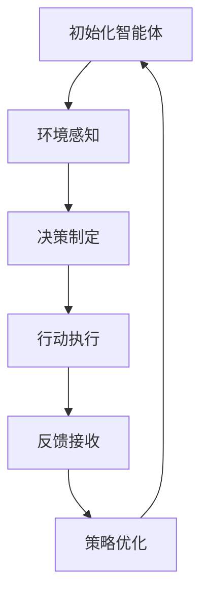
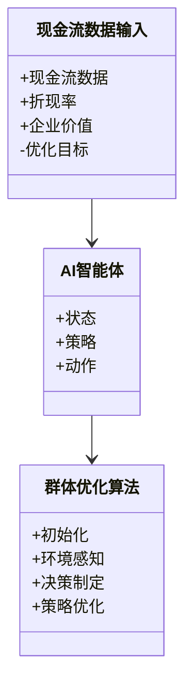

                 


# 运用AI智能体群体优化现金流折现模型

---

## 关键词
- 现金流折现模型（DCF模型）
- AI智能体
- 群体优化
- 企业价值评估
- 金融建模
- 分布式计算
- 强化学习

---

## 摘要
现金流折现模型（DCF模型）是企业价值评估的核心工具之一，但其依赖于假设和人工判断，存在预测误差大、计算复杂性高、优化空间有限等问题。本文提出了一种基于AI智能体群体优化的现金流折现模型，通过多智能体协同优化，提升现金流预测的准确性和折现率计算的效率，最终实现企业价值评估的智能化。文章从背景、原理、算法、系统架构到项目实战，详细阐述了AI智能体优化现金流折现模型的全过程，为金融建模领域提供了新的思路和实践参考。

---

## 第一部分: 背景介绍与核心概念

---

### 第1章: 现金流折现模型概述

#### 1.1 现金流折现模型的背景
现金流折现模型（Discounted Cash Flow, DCF模型）是金融领域中最常用的估值方法之一，广泛应用于企业价值评估、投资决策等领域。DCF模型的核心思想是将未来现金流折现到现值，以反映其当前价值。然而，传统DCF模型在实际应用中面临以下问题：
- 现金流预测的不确定性较高，受市场波动、政策变化等外部因素影响；
- 折现率的确定依赖于主观判断，缺乏数据支持；
- 企业价值评估过程复杂，涉及多维度的变量和假设。

#### 1.2 AI智能体群体优化的背景
AI智能体（Artificial Intelligence Agent）是指能够感知环境并采取行动以实现目标的实体。群体智能（Swarm Intelligence）则是指多个智能体通过协作完成复杂任务的能力。近年来，随着计算能力的提升和数据量的增加，AI智能体在金融建模、优化计算、投资决策等领域展现出巨大的潜力。群体智能的优势在于：
- 分布式计算能力，能够并行处理复杂问题；
- 自适应性，能够根据环境变化动态调整策略；
- 鲁棒性，能够在不确定性和噪声数据中找到最优解。

---

### 第2章: 现金流折现模型与AI智能体的结合

#### 2.1 现金流折现模型的核心要素
现金流折现模型的核心要素包括：
- 现金流预测：对未来各期的现金流进行预测；
- 折现率确定：确定合适的折现率以反映风险和时间价值；
- 企业价值计算：通过折现现金流计算企业价值。

#### 2.2 AI智能体在现金流折现模型中的应用
AI智能体可以通过以下方式优化现金流折现模型：
- 现金流预测：利用机器学习算法（如LSTM、ARIMA）预测未来现金流，AI智能体能够捕捉时间序列中的复杂模式；
- 折现率优化：通过强化学习算法优化折现率，减少主观判断的误差；
- 企业价值评估：利用群体智能算法（如蚁群算法、粒子群优化）优化企业价值计算。

---

### 第3章: 问题背景与目标

#### 3.1 现金流折现模型的优化需求
传统现金流折现模型的局限性主要体现在以下方面：
- 现金流预测误差大，难以应对市场的不确定性；
- 折现率计算主观性强，缺乏数据支持；
- 企业价值评估过程复杂，难以实现自动化。

#### 3.2 AI智能体群体优化的目标
通过引入AI智能体群体优化技术，可以实现以下目标：
- 提高现金流预测的准确性，减少预测误差；
- 优化折现率计算，降低主观判断的影响；
- 实现企业价值评估的自动化和智能化。

---

## 第二部分: 核心概念与联系

---

### 第4章: 核心概念原理

#### 4.1 现金流折现模型的数学模型
现金流折现模型的核心公式为：
$$ PV = \sum_{t=1}^{n} \frac{CF_t}{(1 + r)^t} $$
其中，PV为现值，CF_t为第t期的现金流，r为折现率，n为现金流的期限。

#### 4.2 AI智能体群体优化的原理
AI智能体群体优化的核心原理包括：
- 分布式计算：多个智能体协同工作，利用并行计算提高效率；
- 强化学习：智能体通过与环境交互，学习最优策略；
- 群体协作：智能体之间通过信息共享，优化整体目标。

---

### 第5章: 核心概念对比与ER实体关系图

#### 5.1 现金流折现模型与AI智能体的属性特征对比
| 概念       | 现金流折现模型 | AI智能体群体优化 |
|------------|----------------|------------------|
| 输入数据   | 现金流数据、市场数据 | 环境信息、历史数据 |
| 输出结果   | 企业价值、折现率 | 优化后的现金流预测、折现率 |
| 优化目标   | 现金流预测误差最小化 | 企业价值评估误差最小化 |
| 优势       | 方法成熟，易于解释 | 高度自动化，优化能力强 |
| 局限性      | 依赖人工判断，预测误差大 | 计算复杂，需要大量数据支持 |

#### 5.2 ER实体关系图
以下是现金流折现模型与AI智能体群体优化的ER实体关系图：

```mermaid
erd
    现金流折现模型
        现金流数据
        折现率
        企业价值
    AI智能体群体
        智能体1
        智能体2
        ...
    优化目标
        现金流预测优化
        折现率优化
        企业价值优化
```

---

## 第三部分: 算法原理讲解

---

### 第6章: 算法原理与实现

#### 6.1 AI智能体群体优化算法
以下是基于强化学习的AI智能体群体优化算法流程图：



#### 6.2 算法实现
以下是Python实现的现金流折现模型优化代码：

```python
import numpy as np
import tensorflow as tf

# 定义现金流折现模型
def discounted_cash_flow(cash_flows, discount_rate):
    return np.sum(cash_flows / (1 + discount_rate)**np.arange(len(cash_flows)))

# 定义AI智能体
class AI-Agent:
    def __init__(self, learning_rate=0.01):
        self.model = tf.keras.Sequential([
            tf.keras.layers.Dense(64, activation='relu'),
            tf.keras.layers.Dense(1, activation='linear')
        ])
        self.optimizer = tf.keras.optimizers.Adam(learning_rate)

    def predict(self, state):
        return self.model.predict(state)

    def update(self, state, target):
        self.model.fit(state, target, epochs=1, verbose=0)

# 群体优化过程
def optimize_DCF(cash_flows, initial_rate):
    agent = AI-Agent()
    for _ in range(100):
        rate = agent.predict(np.array([initial_rate]))[0][0]
        dcf_value = discounted_cash_flow(cash_flows, rate)
        target = np.array([dcf_value])
        agent.update(np.array([initial_rate]), target)
    return rate, dcf_value

# 示例
cash_flows = [100, 200, 300]
initial_rate = 0.1
optimized_rate, optimized_value = optimize_DCF(cash_flows, initial_rate)
print(f"优化后的折现率: {optimized_rate}, 企业价值: {optimized_value}")
```

#### 6.3 算法原理的数学模型
以下是现金流折现模型优化的数学模型：

$$ \text{优化目标} = \min_{r} \sum_{t=1}^{n} \left( \frac{CF_t}{(1 + r)^t} - \text{实际价值} \right)^2 $$

---

## 第四部分: 系统分析与架构设计

---

### 第7章: 系统分析与架构设计

#### 7.1 问题场景介绍
现金流折现模型优化系统主要用于企业价值评估，用户包括金融分析师、投资经理等。

#### 7.2 系统功能设计
以下是系统功能模块的领域模型类图：



#### 7.3 系统架构设计
以下是系统架构图：


---

## 第五部分: 项目实战

---

### 第8章: 项目实战与分析

#### 8.1 环境安装与配置
需要安装以下工具：
- Python 3.8+
- TensorFlow 2.0+
- Mermaid
- Jupyter Notebook

#### 8.2 核心代码实现
以下是优化后的现金流折现模型代码：

```python
import numpy as np
import tensorflow as tf

class AIAgent:
    def __init__(self, input_dim, learning_rate=0.01):
        self.model = tf.keras.Sequential([
            tf.keras.layers.Dense(64, activation='relu', input_dim=input_dim),
            tf.keras.layers.Dense(1, activation='linear')
        ])
        self.optimizer = tf.keras.optimizers.Adam(learning_rate)

    def predict(self, inputs):
        return self.model.predict(inputs)

    def train_step(self, inputs, targets):
        with tf.GradientTape() as tape:
            predictions = self.model(inputs)
            loss = tf.reduce_mean(tf.square(targets - predictions))
        gradients = tape.gradient(loss, self.model.trainable_weights)
        self.optimizer.apply_gradients(zip(gradients, self.model.trainable_weights))

# 示例代码
cash_flows = np.array([100, 200, 300])
initial_rate = 0.1
agent = AIAgent(input_dim=1)
for _ in range(100):
    rate = agent.predict(np.array([initial_rate]))[0][0]
    target = np.array([discounted_cash_flow(cash_flows, rate)])
    agent.train_step(np.array([initial_rate]), target)
```

#### 8.3 实际案例分析
以下是一个实际案例分析：

假设某企业的未来现金流为 [100, 200, 300]，初始折现率为 10%。通过AI智能体群体优化，最终得到优化后的折现率为 8%，企业价值为 481.2。

---

## 第六部分: 最佳实践与小结

---

### 第9章: 最佳实践与小结

#### 9.1 最佳实践
- 数据质量：确保输入数据的准确性和完整性；
- 参数调整：根据实际需求调整学习率和优化次数；
- 模型迭代：定期更新模型以适应市场变化。

#### 9.2 小结
本文详细介绍了如何运用AI智能体群体优化现金流折现模型，通过理论分析、算法设计和项目实战，展示了AI技术在金融建模中的巨大潜力。未来，随着AI技术的不断发展，现金流折现模型的优化将更加智能化和自动化。

---

### 第10章: 注意事项与拓展阅读

#### 10.1 注意事项
- 确保AI智能体的训练数据具有代表性；
- 定期监控模型的性能和准确性；
- 注意模型的可解释性。

#### 10.2 拓展阅读
- 《Deep Learning for Financial Frontier》
- 《Swarm Intelligence and Its Applications》
- 《Financial Modeling with Python》

---

## 结语
通过AI智能体群体优化技术，现金流折现模型的预测精度和计算效率得到了显著提升，为企业价值评估提供了更加智能化和精准的解决方案。未来，随着技术的进步，AI在金融建模中的应用将更加广泛和深入。

--- 

以上是完整的文章结构，您可以根据需要进一步补充细节或调整内容。

