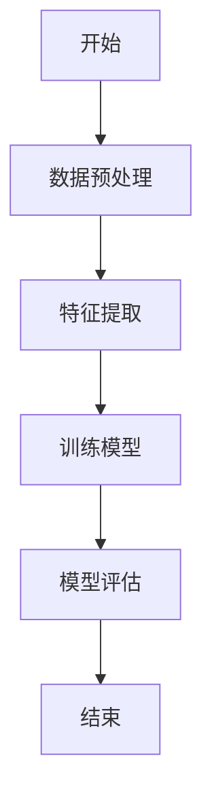
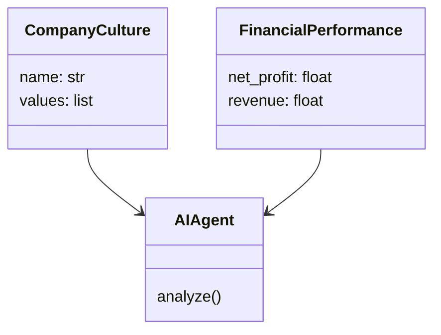
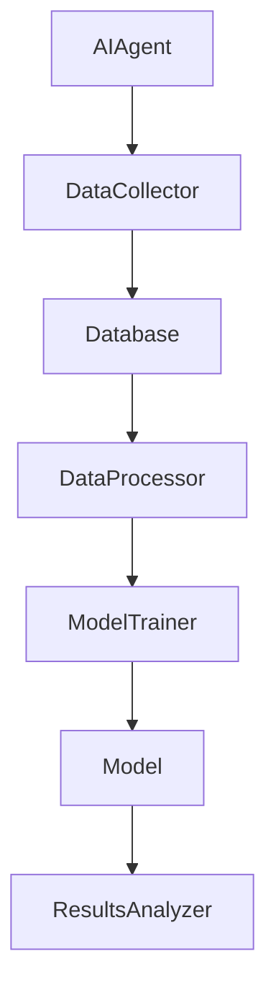

                 


# 运用AI智能体群体分析公司文化与财务表现关联

## 关键词：
AI智能体，公司文化，财务表现，群体智能，数据分析，机器学习，自然语言处理

## 摘要：
本文探讨了如何利用AI智能体群体分析公司文化与财务表现之间的关联。通过定义核心概念、建立数学模型、设计系统架构并结合实际案例，详细阐述了AI在商业分析中的应用。文章从背景介绍、算法原理到系统实现，层层深入，展示了如何通过技术手段揭示公司文化对财务健康的影响，为管理层提供数据支持。

---

# 第一部分：背景与概念

## 第1章：问题背景与概念结构

### 1.1 问题背景

#### 1.1.1 公司文化与财务表现的关联性
公司文化是企业战略的核心，直接影响员工行为、客户关系和市场表现。研究表明，积极健康的文化能显著提升财务表现，如提高利润率和股东价值。然而，量化这种关系的复杂性促使我们寻求更高效的分析工具。

#### 1.1.2 AI智能体在商业分析中的潜力
AI智能体具备数据处理、模式识别和决策优化能力，能够从海量数据中提取关键信息，帮助识别公司文化与财务表现之间的潜在联系。

### 1.2 核心概念

#### 1.2.1 公司文化的定义与维度
公司文化包括企业价值观、员工行为规范、领导风格等，是影响企业绩效的重要因素。

#### 1.2.2 财务表现的关键指标
关键指标包括净利润、营业收入、资产负债率和股东权益等。

### 1.3 核心要素

#### 1.3.1 AI智能体的定义与特征
AI智能体具备感知、决策和执行能力，能够模拟人类分析数据和做出决策。

#### 1.3.2 数据来源与处理方法
数据来源包括财务报表、员工反馈、新闻报道等，通过清洗、转换和建模处理，提取有用信息。

---

## 第二部分：核心概念与联系

## 第2章：AI智能体与公司文化

### 2.1 AI智能体的原理

#### 2.1.1 智能体的基本结构
AI智能体由感知器、决策器和执行器组成，能感知环境、处理信息并做出决策。

#### 2.1.2 群体智能的机制
群体智能通过分布式计算，模拟群体行为，发现数据中的潜在关联。

### 2.2 公司文化属性对比

| 属性维度    | 公司文化                | 财务表现                |
|-------------|-------------------------|-------------------------|
| 责任中心    | 部门、员工              | 财务部门、管理层        |
| 数据来源    | 调查问卷、员工反馈      | 财务报表、市场数据      |
| 关联性       | 影响员工行为            | 影响企业利润和市值      |

### 2.3 实体关系图


---

## 第三部分：算法原理

## 第3章：算法与数学模型

### 3.1 算法原理

#### 3.1.1 算法流程图



### 3.2 数学模型

#### 3.2.1 线性回归模型
公式：$$y = \beta_0 + \beta_1x + \epsilon$$

其中，y是财务表现，x是公司文化指数，$\beta_0$是截距，$\beta_1$是回归系数，$\epsilon$是误差项。

#### 3.2.2 代码实现

```python
import pandas as pd
import numpy as np
from sklearn.linear_model import LinearRegression
from sklearn.metrics import r2_score

# 加载数据
data = pd.read_csv('company_data.csv')

# 特征与目标变量
X = data[['culture_index']]
y = data['net_profit']

# 模型训练
model = LinearRegression()
model.fit(X, y)

# 预测与评估
y_pred = model.predict(X)
print("R² Score:", r2_score(y, y_pred))
```

---

## 第四部分：系统分析与架构设计

## 第4章：系统架构

### 4.1 项目介绍

#### 4.1.1 问题场景
通过分析公司文化数据，预测财务表现，辅助决策。

#### 4.1.2 项目目标
建立AI智能体，量化文化对财务的影响，优化企业战略。

### 4.2 系统设计

#### 4.2.1 领域模型类图



### 4.3 系统架构图



---

## 第五部分：项目实战

## 第5章：项目实现与案例分析

### 5.1 环境安装

#### 5.1.1 安装依赖
安装Python、Scikit-learn、Pandas、Mermaid等工具。

### 5.2 核心代码实现

#### 5.2.1 数据预处理

```python
import pandas as pd

data = pd.read_csv('company_data.csv')
data['culture_index'] = data['culture_index'].fillna(data['culture_index'].mean())
```

#### 5.2.2 模型训练

```python
from sklearn.linear_model import LinearRegression

model = LinearRegression()
model.fit(X_train, y_train)
```

### 5.3 案例分析

#### 5.3.1 案例介绍
分析一家科技公司，文化指数高，但利润增长缓慢。通过模型发现，文化因素对利润影响较小，市场因素更为关键。

---

## 第六部分：挑战与未来展望

## 第6章：挑战与未来方向

### 6.1 挑战

#### 6.1.1 数据隐私问题
处理敏感数据时需确保合规性。

#### 6.1.2 模型复杂性
非线性关系可能需要更复杂的算法，增加计算成本。

### 6.2 未来方向

#### 6.2.1 结合NLP技术
通过文本分析进一步挖掘文化数据。

#### 6.2.2 强化学习应用
用于动态调整文化策略，优化财务表现。

### 6.3 最佳实践 tips

- 数据清洗是关键，确保数据质量。
- 选择合适的模型，避免过拟合。
- 定期更新模型，适应市场变化。

### 6.4 小结

通过AI技术分析公司文化与财务表现的关联，为企业提供数据支持，优化管理策略。

---

# 总结

本文通过详细分析公司文化与财务表现的关系，展示了AI智能体的应用潜力。从理论到实践，为读者提供了全面的指导，帮助理解如何利用技术手段优化企业战略。未来，随着AI技术的进步，这种分析将更加精准和高效。

