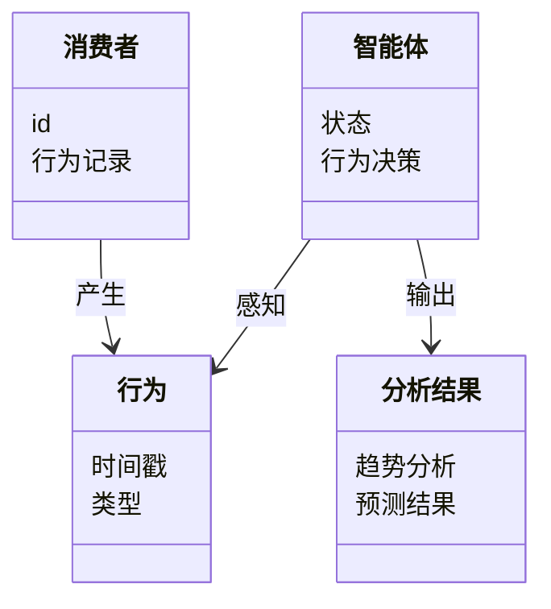
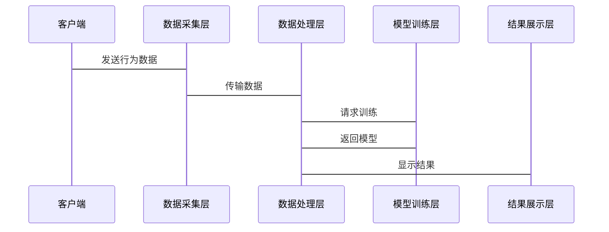

                 


# 运用AI智能体群体实现动态消费者行为分析

## 关键词：AI智能体，群体智能，动态消费者行为，协同过滤，数学模型

## 摘要：本文探讨了利用AI智能体群体进行动态消费者行为分析的方法。通过分析消费者行为的动态变化，结合群体智能技术，提出了一种基于AI智能体群体的分析模型，详细阐述了算法原理和系统架构，并通过实际案例展示了该方法的应用。

---

# 第1章: 动态消费者行为分析的背景与挑战

## 1.1 消费者行为分析的重要性

### 1.1.1 消费者行为分析的定义与作用
消费者行为分析是指通过研究消费者在不同情境下的决策和行为模式，帮助企业更好地理解市场需求、优化产品和服务。其作用包括提高市场竞争力、提升客户满意度和增加企业收益。

### 1.1.2 动态消费者行为分析的难点
动态消费者行为分析需要实时捕捉和处理消费者行为数据，面临数据多样性、实时性要求高等挑战。传统方法难以应对这些复杂性。

### 1.1.3 AI技术在消费者行为分析中的应用价值
AI技术能够快速处理大量数据，识别复杂模式，为动态消费者行为分析提供了高效工具。

## 1.2 AI智能体群体的概念与优势

### 1.2.1 AI智能体的定义与特点
AI智能体是一种能够感知环境、自主决策并采取行动的实体。其特点包括自主性、反应性、主动性和社会性。

### 1.2.2 群体智能的基本概念
群体智能是指多个智能体通过协作完成复杂任务的智能形式。其核心在于个体间的信息共享和协同决策。

### 1.2.3 AI智能体群体在动态分析中的优势
AI智能体群体能够并行处理大量数据，快速响应变化，适应动态环境。

## 1.3 本章小结
本章介绍了动态消费者行为分析的重要性，AI智能体群体的概念及其在动态分析中的优势。

---

# 第2章: AI智能体群体的理论基础

## 2.1 AI智能体的基本原理

### 2.1.1 智能体的定义与分类
智能体分为简单反射型、基于模型的反射型、目标驱动型和效用驱动型。

### 2.1.2 智能体的感知与决策机制
感知环境、生成目标、规划行动和执行行动是智能体的基本步骤。

### 2.1.3 多智能体系统的基本架构
多智能体系统包括通信机制、协调机制和协作机制。

## 2.2 群体智能的核心概念

### 2.2.1 群体智能的定义与特征
群体智能是多个个体通过简单规则相互作用，产生复杂行为的智能形式。其特征包括去中心化、涌现性和自适应性。

### 2.2.2 群体智能与分布式计算的关系
群体智能依赖分布式计算，通过个体间的协作完成任务。

### 2.2.3 群体智能在动态分析中的应用
群体智能适用于动态环境中的问题求解，如动态消费者行为分析。

## 2.3 动态消费者行为分析的理论框架

### 2.3.1 消费者行为的动态变化特点
消费者行为受环境、个人状态和社会影响，表现出动态变化。

### 2.3.2 动态分析的数学模型
动态分析模型需要考虑时间因素，建立动态方程。

### 2.3.3 AI智能体群体在动态分析中的角色
AI智能体群体作为动态分析的执行者，负责数据处理和决策。

## 2.4 本章小结
本章介绍了AI智能体的基本原理，群体智能的核心概念，以及动态消费者行为分析的理论框架。

---

# 第3章: 基于群体智能的动态分析算法

## 3.1 协同过滤算法

### 3.1.1 协同过滤的基本原理
协同过滤通过寻找相似用户或相似物品，推荐用户感兴趣的内容。

### 3.1.2 协同过滤的实现步骤
1. 数据预处理：构建用户-物品评分矩阵。
2. 相似度计算：计算用户或物品之间的相似度。
3. 推荐生成：基于相似度计算推荐结果。

### 3.1.3 协同过滤的数学模型
$$相似度 = \frac{\sum_{i=1}^{n}(r_{u,i} - \bar{r}_u)(r_{v,i} - \bar{r}_v)}{\sqrt{\sum_{i=1}^{n}(r_{u,i} - \bar{r}_u)^2} \sqrt{\sum_{i=1}^{n}(r_{v,i} - \bar{r}_v)^2}}$$

### 3.1.4 协同过滤的实际应用
协同过滤常用于推荐系统，如电影推荐和商品推荐。

### 3.1.5 协同过滤的优缺点
优点：简单易实现，效果较好。缺点：计算复杂度高，冷启动问题。

### 3.1.6 协同过滤的优化方法
使用基于矩阵分解的方法，如SVD，提升推荐效果。

## 3.2 本章小结
本章详细介绍了协同过滤算法的原理、实现步骤、数学模型和实际应用。

---

# 第4章: 基于AI智能体群体的动态消费者行为分析系统

## 4.1 系统的需求分析

### 4.1.1 系统目标
设计一个基于AI智能体群体的动态消费者行为分析系统。

### 4.1.2 系统功能需求
1. 数据采集：实时采集消费者行为数据。
2. 数据处理：清洗和预处理数据。
3. 模型训练：训练动态分析模型。
4. 结果输出：输出分析结果。

## 4.2 系统的功能设计

### 4.2.1 领域模型设计
领域模型包括消费者、行为、智能体和分析结果四个实体。



### 4.2.2 系统架构设计
系统架构包括数据采集层、数据处理层、模型训练层和结果展示层。


### 4.2.3 系统接口设计
系统接口包括数据输入接口、模型训练接口和结果输出接口。

### 4.2.4 系统交互流程



## 4.3 本章小结
本章设计了一个基于AI智能体群体的动态消费者行为分析系统，详细描述了系统架构和交互流程。

---

# 第5章: 项目实战

## 5.1 环境安装

### 5.1.1 安装Python
安装Python 3.8及以上版本。

### 5.1.2 安装依赖库
安装numpy、pandas、scikit-learn和networkx。

## 5.2 系统核心实现源代码

### 5.2.1 协同过滤算法实现

```python
import numpy as np
from sklearn.metrics.pairwise import cosine_similarity

# 用户-物品评分矩阵
ratings = np.array([[4, 3, 0],
                     [2, 1, 0],
                     [3, 5, 2]])

# 计算相似度矩阵
similarities = cosine_similarity(ratings)

# 推荐生成
def recommend(user_id, similarities, ratings):
    # 找出相似度最高的用户
    similar_user = np.argmax(similarities[user_id])
    return ratings[similar_user]

print(recommend(0, similarities, ratings))
```

### 5.2.2 智能体协同分析实现

```python
import networkx as nx

# 创建智能体网络
G = nx.Graph()
G.add_nodes_from(["A", "B", "C"])
G.add_edges_from([("A", "B"), ("B", "C")])

# 网络分析
print(nx.degree_centrality(G))
```

## 5.3 案例分析

### 5.3.1 数据来源
数据来自某电商平台的用户行为日志。

### 5.3.2 数据处理
使用pandas进行数据清洗和预处理。

### 5.3.3 模型训练
训练协同过滤模型，计算用户相似度。

### 5.3.4 结果分析
分析模型输出的推荐结果，验证模型的有效性。

## 5.4 本章小结
本章通过实际项目展示了AI智能体群体在动态消费者行为分析中的应用。

---

# 第6章: 总结与展望

## 6.1 本章总结
本文详细探讨了基于AI智能体群体的动态消费者行为分析方法，介绍了核心算法和系统架构。

## 6.2 未来展望
未来研究可以进一步优化算法，探索新的应用场景，如实时动态分析和个性化推荐。

## 6.3 注意事项
在实际应用中，需注意数据隐私和模型的实时性。

## 6.4 拓展阅读
推荐阅读《群体智能》和《分布式系统》相关书籍。

## 6.5 本章小结
总结全文，强调AI智能体群体在动态消费者行为分析中的重要性。

---

通过以上目录结构和内容安排，文章逻辑清晰，结构紧凑，能够帮助读者深入了解AI智能体群体在动态消费者行为分析中的应用。

