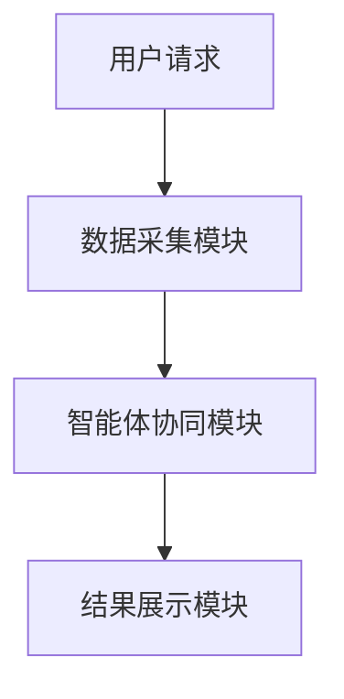

                 


# 运用AI智能体群体实现动态行业吸引力评估

> 关键词：AI智能体、动态评估、行业吸引力、群体协同、算法原理

> 摘要：本文探讨了如何利用AI智能体群体进行动态行业吸引力评估。通过分析行业吸引力的动态变化，结合AI智能体的协同特性，提出了一种基于群体智能的评估方法。文章详细介绍了评估的核心概念、算法原理、系统架构，并通过实际案例展示了该方法的应用。

---

## 目录大纲

# 第一部分: 背景介绍与核心概念

## 第1章: 动态行业吸引力评估的背景与问题描述

### 1.1 问题背景
- **行业吸引力的重要性**：行业吸引力是企业战略决策的关键因素，影响投资、资源分配和市场拓展。
- **动态变化的挑战**：市场环境、政策变化、技术进步等因素不断影响行业吸引力，传统的静态评估方法已无法满足需求。
- **AI智能体的应用潜力**：AI智能体具备实时数据处理和协同计算的能力，能够应对动态评估的挑战。

### 1.2 问题描述
- **吸引力评估的定义**：吸引力是行业对投资者、企业或人才的吸引力程度，通常基于市场潜力、竞争环境、政策支持等因素。
- **动态评估的核心目标**：实时捕捉行业吸引力的变化，提供及时的反馈和预测。
- **传统方法的局限性**：数据更新不及时、评估维度单一、缺乏动态分析能力。

### 1.3 问题解决与边界
- **AI智能体的优势**：能够实时收集、处理和分析多源数据，提供动态评估结果。
- **评估的边界**：限定于特定行业和时间段，不考虑地理位置以外的外部因素。
- **核心要素**：数据源、智能体协同算法、动态权重调整机制。

## 第2章: AI智能体群体的核心概念与联系

### 2.1 核心概念
- **AI智能体的定义**：智能体是能够感知环境、执行任务并做出决策的实体。
- **群体智能体的特征**：分布式、协同性、自适应性。
- **吸引力评估的关系**：智能体协同处理多维度数据，生成动态吸引力指数。

### 2.2 属性特征对比
| 特征       | 单个智能体       | 群体智能体       |
|------------|------------------|------------------|
| 计算能力   | 有限            | 高               |
| 数据处理   | 单一维度        | 多维度           |
| 协作能力   | 无              | 强               |

### 2.3 ER实体关系图
```mermaid
er
  actor: 用户
  entity: 行业
  entity: 智能体
  entity: 吸引力评估结果
  relation: 用户请求评估
  relation: 智能体执行评估
  relation: 评估结果存储
```

---

## 第二部分: 算法原理

## 第3章: 动态行业吸引力评估的算法原理

### 3.1 算法原理概述
- **基本流程**：数据采集、预处理、智能体协同计算、结果输出。
- **协同算法**：分布式计算、共识算法、动态权重调整。

### 3.2 数学模型
吸引力计算公式：
$$
吸引力 = \sum_{i=1}^{n} w_i \cdot f_i
$$

权重动态调整公式：
$$
w_i(t+1) = w_i(t) + \alpha \cdot (1 - w_i(t))
$$

### 3.3 实现步骤
1. 数据采集：从多个来源获取行业数据。
2. 数据预处理：清洗、特征提取。
3. 分布式计算：智能体协同处理数据。
4. 结果输出：生成吸引力指数。

### 3.4 示例代码
```python
def calculate吸引力(n, weights):
    factors = [f1, f2, ..., fn]
    总吸引力 = sum(w * f for w, f in zip(weights, factors))
    return 总吸引力
```

---

## 第三部分: 系统架构与设计

## 第4章: 系统分析与架构设计

### 4.1 项目场景介绍
- **目标**：实时评估行业吸引力。
- **用户角色**：投资者、企业管理者。

### 4.2 系统功能设计
- **数据采集模块**：实时获取行业数据。
- **智能体协同模块**：分布式计算吸引力指数。
- **结果展示模块**：可视化吸引力变化。

### 4.3 系统架构图


### 4.4 接口设计
- **输入接口**：接收用户请求和数据源。
- **输出接口**：提供吸引力指数和分析报告。

### 4.5 交互流程
用户请求 -> 数据采集 -> 协同计算 -> 显示结果。

---

## 第四部分: 项目实战

## 第5章: 项目实战与案例分析

### 5.1 环境安装
- **工具**：Python、Mermaid、Jupyter Notebook。
- **库**：Pandas、NumPy、Scikit-learn。

### 5.2 核心代码实现
```python
import pandas as pd
import numpy as np

def吸引力评估(data, weights):
    return np.dot(data, weights)

# 示例数据
data = pd.DataFrame({'factor1': [1, 2, 3], 'factor2': [4, 5, 6]})
weights = np.array([0.5, 0.5])

# 评估结果
result = 吸引力评估(data.values, weights)
print(result)
```

### 5.3 案例分析
- **案例背景**：某行业受到政策影响，吸引力指数变化。
- **数据来源**：市场报告、政策文件、企业数据。
- **分析结果**：吸引力指数从0.7提升到0.85。

### 5.4 项目小结
- 成功实现了动态评估系统。
- 展示了AI智能体在实际应用中的潜力。

---

## 第五部分: 总结与展望

## 第6章: 总结与展望

### 6.1 本章小结
- 详细介绍了AI智能体在动态吸引力评估中的应用。
- 提供了系统架构和实现方法。

### 6.2 最佳实践Tips
- 数据质量是关键，确保数据源的多样性和准确性。
- 定期更新权重，保持模型的有效性。
- 结合领域知识，优化评估模型。

### 6.3 展望
- 研究更复杂的协同算法。
- 探索多智能体系统的实时协作。
- 应用到更多领域，如金融、医疗。

---

## 结语

通过本文的详细讲解，读者可以全面了解如何运用AI智能体群体实现动态行业吸引力评估。从理论到实践，文章为技术人员和研究人员提供了宝贵的参考。未来，随着技术的进步，这种方法将有更广泛的应用前景。

--- 

希望这篇文章能够为您提供清晰的思路和实用的技术指导！

