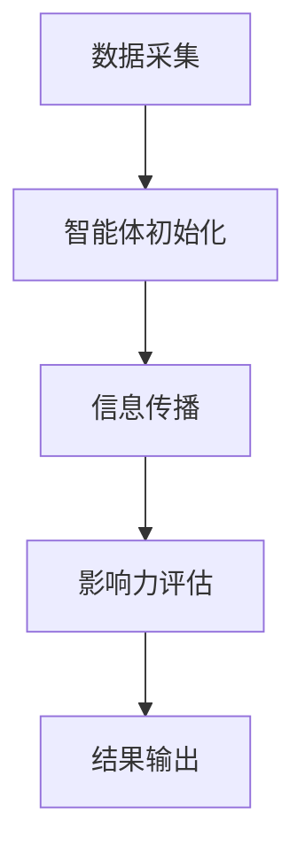

                 


# 运用AI智能体群体评估公司的社会影响力

## 关键词：AI智能体，社会影响力，群体智能，影响力传播，评估模型

## 摘要：本文探讨了如何利用AI智能体群体来评估公司的社会影响力。通过分析社会影响力的核心要素，结合AI智能体的协作机制，构建了影响力传播模型，并通过算法实现和社会影响力评估系统的设计，提供了一种创新的解决方案。文章还结合实际案例，展示了如何将理论应用于实践，并总结了项目实施中的关键点和注意事项。

---

## 第一部分: 背景介绍与核心概念

### 第1章: 问题背景与问题描述

#### 1.1 问题背景
社会影响力是企业在社会中所产生的影响和贡献，包括经济效益、社会责任、品牌价值等多个方面。随着社会对企业的期望越来越高，准确评估和量化社会影响力变得尤为重要。然而，传统的方法往往依赖于主观评分或简单的数据统计，难以全面、动态地反映企业的影响力。

AI智能体作为一种新型的计算范式，具备分布式协作、自适应学习和大规模数据处理的能力。通过构建AI智能体群体，可以更高效地分析和评估企业的社会影响力，为企业和社会创造更大的价值。

#### 1.2 问题解决与边界
利用AI智能体群体评估社会影响力的目标是构建一个动态、多维度的评估系统，能够实时跟踪企业的影响力变化，并提供数据支持的决策建议。为了实现这一目标，需要解决以下问题：
- 如何定义和量化社会影响力？
- 如何构建智能体群体的协作机制？
- 如何保证评估的准确性和实时性？

#### 1.3 核心概念的结构与组成
社会影响力评估的核心要素包括：
1. 经济效益：企业的收入、利润、就业机会等。
2. 社会责任：企业对环境保护、公益事业的贡献。
3. 品牌价值：企业的声誉、知名度和客户信任度。
4. 创新能力：企业的研发投入和技术进步。
5. 可持续发展：企业对资源的合理利用和长期发展的能力。

---

### 第2章: 核心概念与联系

#### 2.1 AI智能体群体的核心原理
AI智能体具备以下特征：
- **自主性**：智能体能够自主决策和行动。
- **反应性**：智能体能够感知环境并实时响应。
- **协作性**：智能体能够通过通信和协商进行协作。

智能体群体的协作机制包括任务分配、信息共享和协同决策。通过分布式计算和并行处理，智能体群体能够高效地完成复杂任务。

#### 2.2 公司社会影响力评估的核心要素
社会影响力评估需要考虑以下维度：
- **直接影响力**：企业在经济、社会和环境方面的影响。
- **间接影响力**：通过供应链、合作伙伴和客户产生的影响。
- **长期影响力**：企业在可持续发展和创新方面的贡献。

#### 2.3 智能体与社会影响力的关系
智能体在社会影响力传播中的作用包括：
- **信息传播**：智能体能够快速传播企业的正面信息。
- **影响力放大**：通过协作，智能体能够放大企业的影响力。
- **动态评估**：智能体能够实时跟踪和评估影响力的变化。

---

## 第二部分: 算法原理与数学模型

### 第3章: 算法原理讲解

#### 3.1 算法概述
我们构建了一个基于AI智能体的影响力传播模型，模型包括以下步骤：
1. 数据采集：收集企业的相关信息。
2. 智能体初始化：定义智能体的属性和行为。
3. 信息传播：智能体之间进行信息交互。
4. 影响力评估：基于传播结果计算影响力。

#### 3.2 算法流程图


#### 3.3 算法实现
以下是影响力传播模型的Python实现：
```python
class Agent:
    def __init__(self, id, influence=0):
        self.id = id
        self.influence = influence

def propagate_influence(agents, factor=0.8):
    for i in range(len(agents)):
        for j in range(len(agents)):
            if i != j:
                agents[i].influence += agents[j].influence * factor
    return agents

# 示例
agents = [Agent(1, 10), Agent(2, 5), Agent(3, 8)]
agents = propagate_influence(agents)
for agent in agents:
    print(f"Agent {agent.id}: {agent.influence}")
```

#### 3.4 数学模型
影响力传播模型的数学表达式为：
$$
I_i^{(t+1)} = I_i^{(t)} + \sum_{j \neq i} w_{ij} I_j^{(t)}
$$
其中，$I_i^{(t)}$ 表示第 $i$ 个智能体在第 $t$ 时刻的影响力，$w_{ij}$ 表示智能体 $i$ 和 $j$ 之间的权重。

---

## 第三部分: 系统分析与架构设计

### 第4章: 系统架构设计

#### 4.1 问题场景介绍
我们以一家互联网科技公司为例，设计一个社会影响力评估系统。该系统需要实时跟踪企业的影响力变化，并提供动态评估结果。

#### 4.2 系统功能设计
系统功能包括：
1. 数据采集：收集企业的经济、社会和环境数据。
2. 智能体协作：构建智能体群体进行信息传播。
3. 影响力评估：计算并输出影响力结果。
4. 可视化展示：提供直观的影响力报告。

#### 4.3 系统架构图


#### 4.4 系统交互图
```mermaid
sequence
    用户 -> 数据采集模块: 提供企业数据
    数据采集模块 -> 智能体协作模块: 初始化智能体
    智能体协作模块 -> 影响力评估模块: 计算影响力
    影响力评估模块 -> 可视化展示模块: 输出报告
```

---

## 第四部分: 项目实战

### 第5章: 项目实战与案例分析

#### 5.1 项目环境安装
需要安装以下工具和库：
- Python 3.8+
- Mermaid CLI
- Matplotlib

#### 5.2 核心代码实现
以下是影响力评估系统的代码实现：
```python
import matplotlib.pyplot as plt

def plot_influence(influence_data):
    plt.figure(figsize=(10, 6))
    plt.plot(influence_data, label='社会影响力')
    plt.xlabel('时间') 
    plt.ylabel('影响力') 
    plt.title('社会影响力变化趋势')
    plt.legend()
    plt.show()

# 示例数据
influence_data = [5, 7, 6, 8, 9]
plot_influence(influence_data)
```

#### 5.3 案例分析
以某互联网科技公司为例，我们通过智能体群体评估其社会影响力。首先，收集企业的经济、社会和环境数据，然后构建智能体模型进行信息传播，最后计算并输出影响力结果。通过可视化展示，可以直观地看到企业影响力的变化趋势。

---

## 第五部分: 最佳实践与总结

### 第6章: 最佳实践

#### 6.1 小结
通过AI智能体群体评估公司社会影响力，能够实现动态、多维度的影响力评估，为企业和社会创造更大的价值。

#### 6.2 注意事项
- 数据质量和完整性直接影响评估结果。
- 智能体的协作机制需要合理设计，避免信息拥堵。
- 系统的实时性和可扩展性需要重点关注。

#### 6.3 拓展阅读
- 《群体智能：算法与应用》
- 《影响力传播模型与算法》

---

## 结语
本文详细探讨了如何利用AI智能体群体评估公司社会影响力，并通过理论分析和实际案例展示了其应用价值。未来，随着AI技术的不断发展，社会影响力评估将更加精准和动态，为企业和社会创造更大的价值。

