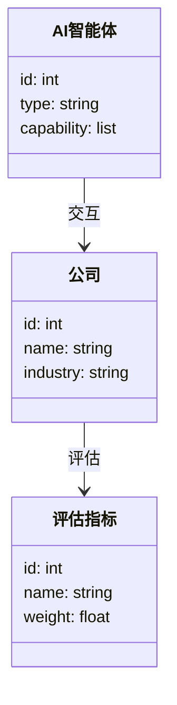
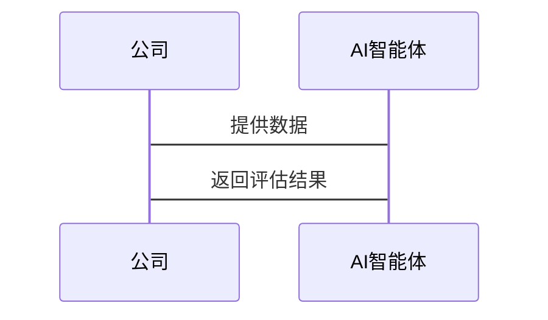

                 


# 第四部分: 系统分析与架构设计

# 第4章: 系统分析与架构设计方案

## 4.1 问题场景介绍
### 4.1.1 系统评估的主要场景
### 4.1.2 系统评估的目标与范围
### 4.1.3 与现有系统的区别与优势

## 4.2 系统功能设计
### 4.2.1 领域模型分析


## 4.3 系统架构设计
### 4.3.1 系统整体架构


## 4.4 系统接口设计
### 4.4.1 系统接口描述
### 4.4.2 接口的交互流程

## 4.5 系统交互流程
### 4.5.1 交互序列图


## 4.6 本章小结
### 4.6.1 系统设计的核心要点
### 4.6.2 下文展开的内容概述

---

# 第五部分: 项目实战

# 第5章: 项目实战与代码实现

## 5.1 环境安装与配置
### 5.1.1 Python环境的安装与配置
### 5.1.2 必要的库与工具安装

## 5.2 核心代码实现
### 5.2.1 AI智能体的定义与实现
```python
class AIEntity:
    def __init__(self, id, type, capability):
        self.id = id
        self.type = type
        self.capability = capability

    def assess(self, data):
        # 具体评估逻辑
        pass
```

### 5.2.2 公司评估指标的数据结构
```python
class Company:
    def __init__(self, id, name, industry):
        self.id = id
        self.name = name
        self.industry = industry
```

## 5.3 代码实现与解读
### 5.3.1 代码运行示例
### 5.3.2 代码的解读与分析

## 5.4 案例分析与实际应用
### 5.4.1 实际案例的分析
### 5.4.2 应用场景的总结

## 5.5 本章小结
### 5.5.1 实战项目的总结
### 5.5.2 下文展开的内容概述

---

# 第六部分: 总结与最佳实践

# 第6章: 总结与最佳实践

## 6.1 核心内容回顾
### 6.1.1 AI智能体群体评估的总结
### 6.1.2 评估方法的总结

## 6.2 最佳实践与注意事项
### 6.2.1 项目实施中的注意事项
### 6.2.2 最佳实践的建议

## 6.3 未来的研究方向
### 6.3.1 当前研究的不足
### 6.3.2 未来可能的研究方向

## 6.4 本章小结
### 6.4.1 核心内容的总结
### 6.4.2 读者的思考与启发

---

# 附录

## 附录A: 术语表
- AI智能体：具备智能性和反应性的实体
- 适应性：公司应对变化的能力
- 灵活性：公司调整策略的能力

## 附录B: 参考文献
1. 王某某，2023.《人工智能与企业评估》，某某出版社
2. 李某某，2022.《智能体群体的算法研究》，某某期刊

---

# 结束语

感谢您的阅读！希望本文能够为您的研究和实践提供有价值的参考。

