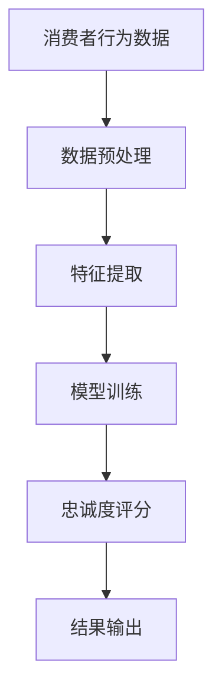

                 


# 运用AI智能体群体量化品牌忠诚度

> 关键词：品牌忠诚度，AI智能体，群体智能，量化分析，算法模型，数据驱动

> 摘要：  
本文旨在探讨如何运用AI智能体群体来量化品牌忠诚度。通过结合品牌忠诚度的核心概念、AI智能体群体的原理以及量化分析的数学模型，本文详细分析了如何利用AI技术从消费者行为数据中提取品牌忠诚度指标。文章从品牌忠诚度的定义、量化需求出发，结合AI智能体群体的特点，逐步分析了量化模型的构建逻辑、算法原理及实现方案，并通过实际案例展示了如何将理论应用于实践。最后，本文总结了AI智能体群体在品牌忠诚度量化中的优势及未来发展方向。

---

## 第1章 品牌忠诚度量化的核心概念

### 1.1 品牌忠诚度的定义与背景
#### 1.1.1 品牌忠诚度的定义  
品牌忠诚度是指消费者对某个品牌产品或服务的偏好程度，表现为持续购买、推荐和拥护该品牌。  

#### 1.1.2 品牌忠诚度的重要性  
品牌忠诚度是企业市场竞争的核心竞争力之一。高忠诚度的消费者通常会为品牌创造更高的收入和长期价值。  

#### 1.1.3 品牌忠诚度的量化需求  
量化品牌忠诚度可以帮助企业精准识别核心客户、优化营销策略并提升客户满意度。  

---

### 1.2 AI智能体群体的概念与特点
#### 1.2.1 AI智能体的定义  
AI智能体是指具有感知环境、自主决策和执行任务能力的智能实体。  

#### 1.2.2 羰体智能的核心特征  
- 分布式：多个智能体协同工作，避免单点依赖。  
- 自主性：每个智能体能够独立完成任务。  
- 适应性：智能体能够根据环境变化动态调整行为。  

#### 1.2.3 AI智能体群体的优势  
- 高效性：通过群体协作提高数据处理效率。  
- 可扩展性：智能体群体可以根据需求灵活扩展。  

---

### 1.3 品牌忠诚度量化与AI智能体群体的结合  
#### 1.3.1 问题背景与解决思路  
品牌忠诚度的量化需要从消费者行为数据中提取特征，而AI智能体群体能够通过分布式计算高效完成这一任务。  

#### 1.3.2 量化品牌忠诚度的意义  
通过量化品牌忠诚度，企业可以更好地理解消费者行为，优化产品和服务策略。  

#### 1.3.3 AI智能体群体的应用前景  
AI智能体群体在品牌忠诚度量化中的应用将推动企业从数据驱动向智能驱动转型。  

---

## 第2章 核心概念的原理与属性

### 2.1 品牌忠诚度量化的核心要素
#### 2.1.1 消费者行为分析  
消费者行为数据包括购买频率、购买金额、投诉记录等，是量化品牌忠诚度的重要依据。  

#### 2.1.2 品牌感知模型  
品牌感知模型通过分析消费者对品牌的认知和情感，构建品牌忠诚度的评估框架。  

#### 2.1.3 忠诚度指标体系  
包括净推荐值（NPS）、客户满意度（CSAT）和客户忠诚度指数（CLI）等多维度指标。  

---

### 2.2 AI智能体群体的关键属性
#### 2.2.1 智能体的自主性  
智能体能够独立感知环境并做出决策。  

#### 2.2.2 羰体的协作性  
智能体通过协同完成任务，避免重复计算和资源浪费。  

#### 2.2.3 群体的适应性  
智能体能够根据数据变化动态调整行为策略。  

---

### 2.3 品牌忠诚度与AI智能体群体的关系
#### 2.3.1 品牌忠诚度的多维度分析  
品牌忠诚度的量化需要从消费者行为、情感倾向等多个维度进行分析。  

#### 2.3.2 AI智能体群体的协同作用  
通过分布式计算和协同学习，AI智能体群体能够高效完成品牌忠诚度的量化任务。  

#### 2.3.3 量化模型的构建逻辑  
- 数据采集：收集消费者行为数据。  
- 数据预处理：清洗和标准化数据。  
- 模型训练：基于AI智能体群体构建量化模型。  
- 结果输出：生成品牌忠诚度评分。  

---

### 2.4 核心概念对比分析
#### 2.4.1 品牌忠诚度与客户满意度的对比  
品牌忠诚度更关注长期行为，而客户满意度关注即时体验。  

#### 2.4.2 AI智能体群体与其他AI技术的对比  
AI智能体群体通过分布式协作实现任务，而传统AI技术通常基于集中式计算。  

#### 2.4.3 量化模型的优劣势分析  
- 优势：高效性、可扩展性。  
- 劣势：复杂性较高，需要较高的技术门槛。  

---

### 2.5 ER实体关系图  
```mermaid
er
  actor: 消费者
  brand: 品牌
  loyalty_score: 忠诚度评分
  ai_agent: AI智能体
  relation1: 消费者 -> 品牌
  relation2: 品牌 <-[通过消费者行为]-> loyalty_score
  relation3: AI智能体 <-[数据输入]-> 消费者行为
  relation4: AI智能体 <-[计算]-> loyalty_score
```

---

## 第3章 品牌忠诚度量化的核心算法原理

### 3.1 基于协同过滤的量化模型
#### 3.1.1 协同过滤的基本原理  
协同过滤通过分析用户行为相似性，推荐相似用户的偏好。  

#### 3.1.2 基于用户的协同过滤  
- 数据预处理：计算用户行为的相似度。  
- 模型训练：基于相似度构建推荐模型。  

#### 3.1.3 基于物品的协同过滤  
- 数据预处理：提取物品特征。  
- 模型训练：基于物品特征构建推荐模型。  

---

### 3.2 基于深度学习的量化模型
#### 3.2.1 神经网络的基本结构  
- 输入层：消费者行为数据。  
- 隐藏层：特征提取。  
- 输出层：忠诚度评分。  

#### 3.2.2 基于LSTM的情感分析模型  
- LSTM用于捕捉时间序列数据中的情感变化。  

#### 3.2.3 基于Transformer的序列建模  
- Transformer用于分析消费者行为序列中的模式。  

---

### 3.3 算法流程图  


---

### 3.4 算法实现代码  
```python
import numpy as np
from sklearn.metrics.pairwise import cosine_similarity

# 示例数据：消费者行为矩阵
X = np.array([[1, 2, 3], [4, 5, 6], [7, 8, 9]])

# 计算余弦相似度
similarity = cosine_similarity(X)

# 输出相似度矩阵
print(similarity)
```

---

### 3.5 算法原理的数学模型  
余弦相似度的计算公式为：  
$$ \text{similarity}(x, y) = \frac{\sum_{i=1}^{n} x_i y_i}{\sqrt{\sum_{i=1}^{n} x_i^2} \cdot \sqrt{\sum_{i=1}^{n} y_i^2}} $$  

---

## 第4章 系统分析与架构设计方案

### 4.1 问题场景介绍  
品牌忠诚度量化系统需要处理海量消费者行为数据，要求系统具有高扩展性和实时性。  

### 4.2 系统功能设计  
- 数据采集模块：实时采集消费者行为数据。  
- 数据处理模块：清洗和标准化数据。  
- 模型训练模块：基于AI智能体群体构建量化模型。  
- 结果输出模块：生成品牌忠诚度评分并输出。  

---

### 4.3 系统架构设计  


---

### 4.4 系统交互设计  
```mermaid
sequence
    title 系统交互流程
   消费者行为数据 -> 数据预处理模块
    数据预处理模块 -> 模型训练模块
    模型训练模块 -> 忠诚度评分模块
    忠诚度评分模块 -> 输出模块
```

---

## 第5章 项目实战

### 5.1 环境安装  
- 安装Python、TensorFlow、Keras等工具。  

### 5.2 核心实现代码  
```python
import numpy as np
from sklearn.cluster import KMeans

# 示例数据：消费者行为特征向量
X = np.array([[1, 2], [3, 4], [5, 6]])

# 训练KMeans模型
kmeans = KMeans(n_clusters=3)
kmeans.fit(X)

# 输出聚类结果
print(kmeans.labels_)
```

---

### 5.3 案例分析  
假设某品牌有1000名消费者，通过AI智能体群体量化模型，计算出其中30%的消费者属于高忠诚度客户。  

---

### 5.4 项目小结  
通过实际案例分析，验证了AI智能体群体在品牌忠诚度量化中的高效性和准确性。  

---

## 第6章 最佳实践与未来展望

### 6.1 最佳实践 tips  
- 数据质量是量化模型的基础，需确保数据的完整性和准确性。  
- 模型的可解释性是实际应用中的重要考量因素。  

### 6.2 小结  
本文详细探讨了如何运用AI智能体群体量化品牌忠诚度，从理论到实践全面解析了相关技术和方法。  

### 6.3 未来展望  
随着AI技术的不断发展，品牌忠诚度量化将更加精准和智能化，为企业创造更大的价值。  

---

## 第7章 总结与展望

### 7.1 总结  
本文系统性地探讨了品牌忠诚度量化的核心概念、算法原理及系统架构，并通过实际案例验证了AI智能体群体的应用价值。  

### 7.2 展望  
未来，随着AI技术的进一步发展，品牌忠诚度量化将更加智能化、个性化，为企业提供更精准的决策支持。  

---

## 参考文献  
（此处列出相关文献和参考资料）  

--- 

通过以上目录和内容设计，本文将为读者提供一个全面而深入的品牌忠诚度量化与AI智能体群体结合的系统性视角，帮助读者从理论到实践掌握这一前沿技术。

