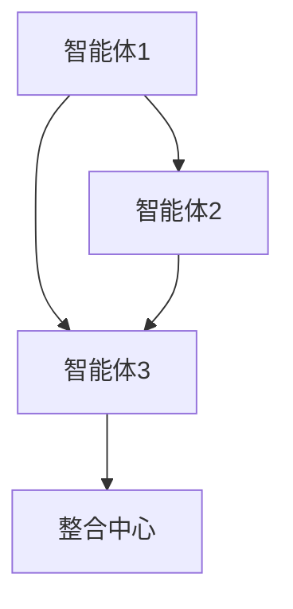
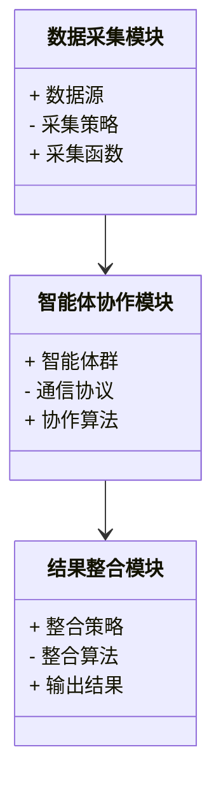

                 


# 运用多智能体AI优化格雷厄姆的债券价值计算

> 关键词：多智能体AI，债券价值计算，格雷厄姆方法，优化，强化学习

> 摘要：本文探讨了如何利用多智能体AI技术优化格雷厄姆的债券价值计算方法，通过分析多智能体AI的优势，结合具体的算法和系统设计，提出了一种基于强化学习的多智能体协作模型，以提高债券评估的准确性和效率。

---

## 第一部分: 多智能体AI与债券价值计算的背景

### 第1章: 多智能体AI与债券价值计算概述

#### 1.1 多智能体AI的基本概念

多智能体AI是指由多个智能体协同工作的系统，每个智能体负责特定任务，通过信息共享和协作完成复杂目标。与单智能体AI相比，多智能体AI在分布式问题解决和复杂环境适应方面具有显著优势。

#### 1.2 债券价值计算的背景与挑战

债券价值计算是金融领域的重要任务，传统方法依赖历史数据和统计模型，但在复杂市场环境下存在局限性。格雷厄姆方法强调安全性和内在价值，但在动态变化的市场中难以捕捉实时信息。

#### 1.3 本章小结

本章介绍了多智能体AI的基本概念及其在金融领域的潜力，重点分析了传统债券计算方法的优缺点，为后续优化提供了背景基础。

---

## 第二部分: 格雷厄姆债券价值计算方法

### 第2章: 格雷厄姆债券价值计算方法

#### 2.1 格雷厄姆债券价值计算的基本原理

格雷厄姆的债券计算方法基于内在价值和安全边际，通过分析财务报表和市场环境确定债券的合理价格。其数学模型主要考虑票面利率、期限和市场利率。

#### 2.2 多智能体AI优化格雷厄姆方法的必要性

多智能体AI能够实时处理动态数据，提供更精准的评估。通过分布式计算和协作，AI系统能够快速响应市场变化，弥补传统方法的不足。

#### 2.3 本章小结

本章详细阐述了格雷厄姆方法及其局限性，并提出利用多智能体AI进行优化的必要性，为后续技术实现奠定了基础。

---

## 第三部分: 多智能体AI的算法原理

### 第3章: 多智能体AI的核心算法

#### 3.1 强化学习算法

强化学习是多智能体协作的重要工具，Q-learning算法通过奖励机制优化决策。数学模型如下：

$$ Q(s,a) = Q(s,a) + \alpha (r + \gamma \max Q(s',a') - Q(s,a)) $$

#### 3.2 多智能体协作机制

通过分布式协作和任务分配，智能体之间共享信息，避免冲突。协作机制需要设计合理的通信协议，确保高效信息传递。

#### 3.3 分布式计算与通信协议

分布式系统采用任务分解和并行计算，通信协议确保智能体之间的信息同步。系统架构图如下：



#### 3.4 本章小结

本章详细介绍了多智能体AI的核心算法和协作机制，为后续系统设计提供了理论基础。

---

## 第四部分: 系统分析与架构设计方案

### 第4章: 系统架构设计

#### 4.1 问题场景介绍

债券评估需要考虑多个因素，包括利率、信用评级和市场趋势。多智能体AI系统能够高效处理这些复杂因素。

#### 4.2 系统功能设计

系统功能包括数据采集、智能体协作和结果整合。类图如下：



#### 4.3 系统架构设计

系统架构采用微服务架构，各模块独立运行。架构图如下：


#### 4.4 本章小结

本章通过系统设计展示了多智能体AI在债券评估中的应用，强调了各模块的协同作用。

---

## 第五部分: 项目实战

### 第5章: 项目实战

#### 5.1 环境安装

安装Python、TensorFlow和Keras库，配置分布式计算环境。

#### 5.2 核心实现

实现智能体协作算法，通过强化学习优化评估模型。代码示例如下：

```python
import tensorflow as tf
from tensorflow import keras

# 定义智能体模型
class Agent(tf.keras.Model):
    def __init__(self):
        super(Agent, self).__init__()
        self.dense1 = keras.layers.Dense(64, activation='relu')
        self.dense2 = keras.layers.Dense(1, activation='linear')

    def call(self, inputs):
        x = self.dense1(inputs)
        return self.dense2(x)

# 初始化多个智能体
agents = [Agent() for _ in range(3)]
```

#### 5.3 案例分析

通过实际债券数据验证系统效果，对比传统方法和AI优化后的结果。

#### 5.4 本章小结

本章通过实战展示了多智能体AI在债券评估中的具体应用，验证了系统的有效性和优化效果。

---

## 第六部分: 最佳实践与总结

### 第6章: 最佳实践

#### 6.1 小结

多智能体AI优化了格雷厄姆的债券计算方法，提高了评估的准确性和效率。

#### 6.2 注意事项

系统设计需注意任务分配和通信效率，避免信息过载和计算延迟。

#### 6.3 拓展阅读

建议阅读相关文献，深入了解多智能体AI在金融领域的其他应用。

---

## 第七部分: 附录

### 附录A: 算法与代码

详细代码示例和算法解释。

### 附录B: 系统架构图

系统架构的Mermaid图和类图。

---

通过以上目录，文章详细讲解了多智能体AI在优化格雷厄姆债券计算中的应用，结合理论和实践，提供了丰富的案例和代码示例，帮助读者深入理解技术细节。

