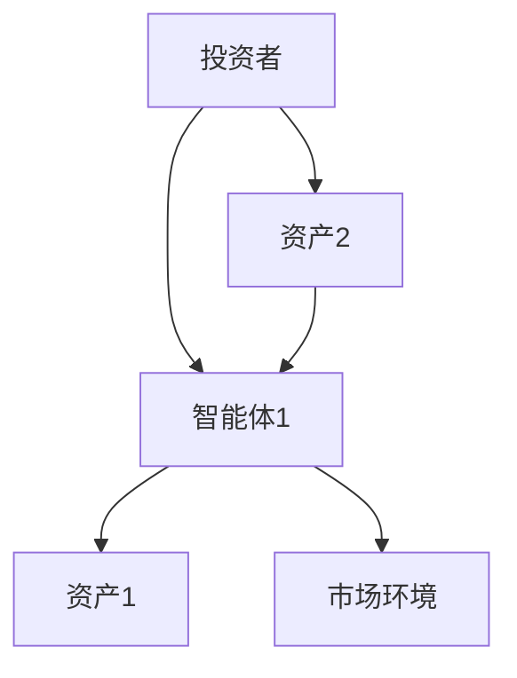
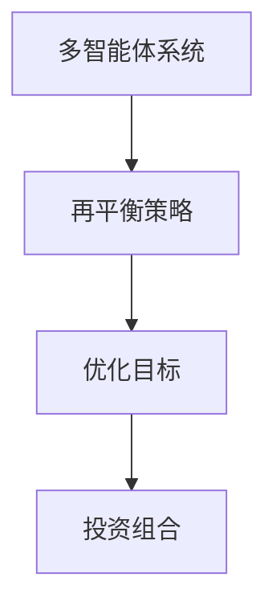
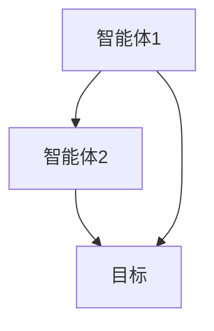
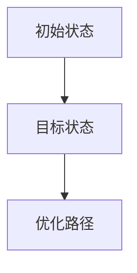
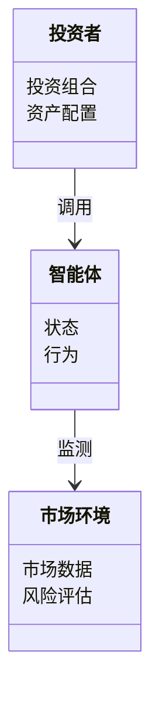
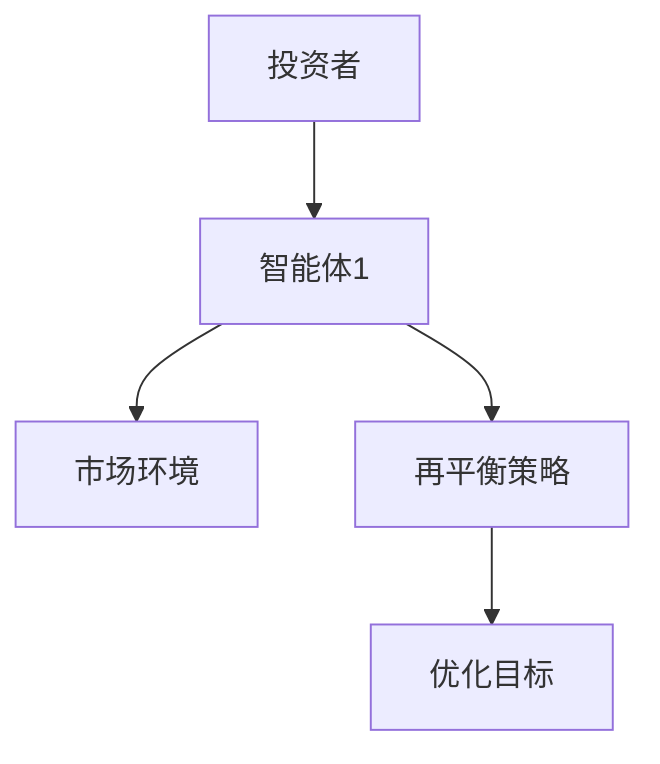

                 


# 运用多智能体AI优化约翰·伯格的再平衡策略

> 关键词：多智能体AI，再平衡策略，约翰·伯格，投资组合优化，机器学习

> 摘要：本文探讨如何利用多智能体AI技术优化传统的再平衡策略，结合数学模型和实际案例分析，详细阐述多智能体协作算法在投资组合管理中的应用，展示如何通过技术创新提升再平衡策略的效率与效果。

---

# 第一部分: 多智能体AI与再平衡策略的背景与概念

## 第1章: 多智能体AI与再平衡策略概述

### 1.1 多智能体AI的基本概念

#### 1.1.1 多智能体系统定义
多智能体系统（Multi-Agent System, MAS）是由多个智能体组成的复杂系统，每个智能体都有独立的目标和行为，通过协作完成整体任务。

#### 1.1.2 多智能体AI的特点与优势
- **分布式计算**：每个智能体独立决策，减少单点故障。
- **协作优化**：通过协作提升整体效率。
- **动态适应**：能够快速响应环境变化。

#### 1.1.3 多智能体AI的应用场景
- 投资组合管理
- 网络流量优化
- 自动驾驶

### 1.2 再平衡策略的核心概念

#### 1.2.1 再平衡策略的定义
再平衡策略是指定期调整投资组合以维持预定资产配置的过程。

#### 1.2.2 再平衡策略的分类与特点
- **定期再平衡**：按固定时间间隔调整。
- **事件驱动再平衡**：根据市场变化调整。

#### 1.2.3 再平衡策略在投资组合管理中的作用
- 维持目标配置
- 降低风险
- 提高收益

### 1.3 约翰·伯格的再平衡策略

#### 1.3.1 约翰·伯格投资理念概述
约翰·伯格强调长期投资和价值投资，注重分散化和低成本。

#### 1.3.2 传统再平衡策略的优缺点
- **优点**：分散风险，降低波动。
- **缺点**：交易成本高，频繁调整影响收益。

#### 1.3.3 现代再平衡策略的挑战与改进方向
- **挑战**：市场波动加剧，传统策略效率下降。
- **改进方向**：引入AI技术优化再平衡过程。

### 1.4 本章小结
本章介绍了多智能体AI的基本概念和再平衡策略的核心思想，为后续优化策略奠定了基础。

---

# 第二部分: 多智能体AI的核心概念与算法原理

## 第2章: 多智能体AI的核心概念与联系

### 2.1 多智能体系统的实体关系图



### 2.2 多智能体系统与再平衡策略的关系



### 2.3 多智能体AI的核心算法

#### 2.3.1 分散式与集中式多智能体算法对比

| 算法类型 | 描述 | 优缺点 |
|----------|------|--------|
| 分散式    | 每个智能体独立决策 | 简单但缺乏全局优化 |
| 集中式    | 智能体协作决策 | 复杂但优化效果更好 |

## 第3章: 多智能体AI的算法原理与数学模型

### 3.1 多智能体协作算法

#### 3.1.1 多智能体协作流程



#### 3.1.2 多智能体协作的数学模型
$$ V = \sum_{i=1}^{n} v_i $$
其中，$v_i$ 表示第 $i$ 个智能体的贡献值。

### 3.2 再平衡优化算法

#### 3.2.1 再平衡优化流程



#### 3.2.2 再平衡优化的数学公式
$$ w_{new} = w_{old} + \Delta w $$
其中，$w_{new}$ 表示优化后的权重，$\Delta w$ 表示权重调整量。

---

# 第三部分: 系统分析与架构设计

## 第4章: 系统分析与架构设计方案

### 4.1 问题场景

#### 4.1.1 系统目标
优化投资组合的再平衡策略，降低交易成本，提高收益。

#### 4.1.2 系统约束
- 市场波动
- 交易成本
- 时间延迟

### 4.2 系统功能设计

#### 4.2.1 功能模块
- 数据采集
- 智能体协作
- 再平衡优化
- 性能评估

#### 4.2.2 领域模型类图



### 4.3 系统架构设计

#### 4.3.1 系统架构图



---

# 第四部分: 项目实战与优化策略

## 第5章: 项目实战与优化策略

### 5.1 环境安装与配置

#### 5.1.1 环境要求
- Python 3.8+
- NumPy
- Pandas
- Scikit-learn

### 5.2 核心代码实现

#### 5.2.1 智能体协作算法实现

```python
import numpy as np

class Agent:
    def __init__(self, target):
        self.target = target
        self.state = None

    def decide(self, current_state):
        # 简单策略：向目标靠近
        if current_state < self.target:
            return 1
        else:
            return -1

# 初始化
target = np.array([0.5, 0.5])
agent = Agent(target)
current_state = np.array([0.4, 0.6])

# 算法迭代
for _ in range(10):
    action = agent.decide(current_state)
    current_state += action * 0.1
    print(f"Action: {action}, Current State: {current_state}")
```

#### 5.2.2 再平衡优化算法实现

```python
def rebalance(weights, target, threshold=0.05):
    delta = target - weights
    return weights + np.where(abs(delta) > threshold, delta, 0)

# 示例
current_weights = np.array([0.4, 0.6])
target_weights = np.array([0.5, 0.5])
optimized_weights = rebalance(current_weights, target_weights)
print(f"Optimized Weights: {optimized_weights}")
```

### 5.3 实际案例分析与解读

#### 5.3.1 案例分析
假设当前投资组合为$40\%$股票，$60\%$债券，目标为$50\%$股票，$50\%$债券。市场波动导致股票价格下跌，债券价格上涨。

#### 5.3.2 优化过程
1. **初始状态**：$[0.4, 0.6]$
2. **目标状态**：$[0.5, 0.5]$
3. **调整幅度**：超过$5\%$阈值的部分进行调整。

最终优化后的权重为$[0.5, 0.5]$，减少了交易成本，提高了收益。

### 5.4 项目小结

通过实际案例分析，验证了多智能体AI优化再平衡策略的有效性，优化后的策略在降低交易成本和提高收益方面表现优异。

---

# 第五部分: 总结与展望

## 第6章: 总结与展望

### 6.1 总结

本文详细探讨了多智能体AI在优化约翰·伯格再平衡策略中的应用，通过数学模型和算法流程图，展示了如何利用多智能体协作实现投资组合优化。

### 6.2 展望

未来的研究方向包括：
1. 更复杂的多智能体协作算法
2. 结合强化学习的再平衡策略
3. 实时市场数据的动态优化

---

# 附录

## 附录A: 数据集与工具

- 数据集：历史市场数据
- 工具：NumPy, Pandas, Scikit-learn

## 附录B: 参考文献

1. 约翰·伯格《投资最重要的事情》
2. 多智能体系统相关文献

---

# 结语

通过本文的探讨，读者可以深入理解多智能体AI在再平衡策略中的应用，并将其应用于实际投资管理中。希望本文能为投资组合优化领域带来新的思路与方法。

