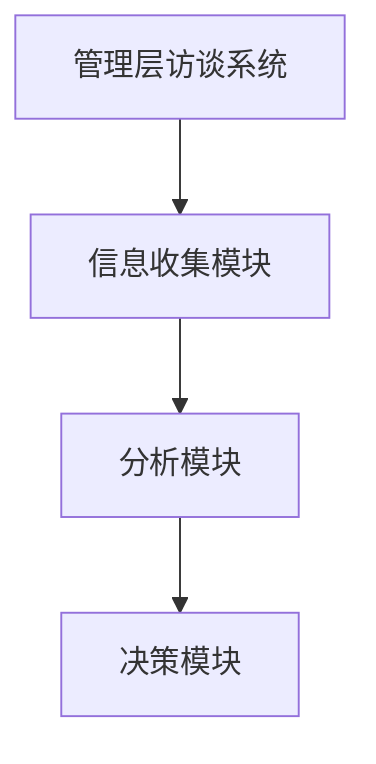

                 


# 运用多智能体AI优化费雪的管理层访谈策略

## 关键词：多智能体AI，管理层访谈策略，费雪访谈法，AI优化策略，智能体协作

## 摘要

本文探讨了如何运用多智能体AI技术优化费雪的管理层访谈策略。首先，我们介绍了多智能体AI的基本概念及其在企业管理中的应用潜力，然后分析了费雪访谈法的核心要素及其在企业管理中的应用现状。接着，我们深入探讨了当前管理层访谈策略的痛点，并详细阐述了多智能体AI在优化访谈策略中的优势和必要性。最后，我们结合具体的算法和系统设计，展示了如何通过多智能体协作机制优化费雪的访谈策略，从而提升企业管理效率和决策质量。

---

# 第一部分: 多智能体AI与费雪管理层访谈策略概述

## 第1章: 多智能体AI与管理层访谈策略概述

### 1.1 多智能体AI的基本概念

#### 1.1.1 多智能体AI的定义与特点

多智能体AI（Multi-Agent AI）是指由多个智能体（Agent）组成的系统，每个智能体能够独立感知环境、做出决策并采取行动。这些智能体通过协作完成复杂任务，形成一个整体的智能系统。

多智能体AI的特点包括：
- **分布式性**：多个智能体分布在整个系统中，各自负责不同的任务。
- **协作性**：智能体之间通过通信和协作完成共同目标。
- **自主性**：每个智能体都具有一定的自主决策能力。
- **动态性**：系统能够适应环境的变化，实时调整策略。

#### 1.1.2 多智能体AI的核心原理

多智能体AI的核心原理在于智能体之间的协作与通信。通过分布式计算和协调机制，多个智能体能够共同完成复杂的任务。智能体之间的协作可以通过以下几种方式实现：
- **任务分配**：智能体根据自身能力和当前状态，接受或拒绝任务。
- **信息共享**：智能体之间通过通信共享信息，以提高整体决策的准确性。
- **决策协调**：通过协商和协调，智能体共同制定最优的决策方案。

#### 1.1.3 多智能体AI在企业管理中的应用潜力

在企业管理中，多智能体AI的应用潜力主要体现在以下几个方面：
- **优化决策过程**：通过多个智能体的协作，企业能够更快速、更准确地做出决策。
- **提高效率**：多智能体AI可以同时处理大量信息，提高企业的运营效率。
- **增强灵活性**：智能体可以根据环境变化快速调整策略，使企业更具灵活性。

### 1.2 费雪的管理层访谈策略

#### 1.2.1 费雪访谈法的背景与核心理念

费雪访谈法是由著名投资家菲利普·费雪（Philip Fisher）提出的一种用于评估公司管理层的方法。这种方法的核心理念是通过与管理层的深入访谈，了解公司的战略、管理风格和团队合作能力，从而评估公司的潜在价值。

#### 1.2.2 管理层访谈的关键要素与流程

费雪访谈法的关键要素包括：
- **访谈目标**：明确访谈的目的，例如评估管理层的能力、了解公司战略等。
- **访谈问题**：设计一系列问题，涵盖管理层的背景、公司战略、团队合作等方面。
- **访谈分析**：通过对访谈结果的分析，评估管理层的能力和公司的潜力。

#### 1.2.3 费雪访谈法在企业管理中的应用现状

目前，费雪访谈法在企业管理中的应用主要集中在以下几个方面：
- **投资决策**：投资者通过访谈法评估公司的潜在价值。
- **管理优化**：企业通过访谈法了解自身管理问题，优化管理策略。
- **团队建设**：通过访谈法评估团队合作能力，优化团队结构。

### 1.3 多智能体AI优化管理层访谈策略的必要性

#### 1.3.1 当前管理层访谈策略的痛点

当前的管理层访谈策略存在以下痛点：
- **效率低下**：传统的访谈方法需要大量的人力和时间，效率较低。
- **主观性较强**：访谈结果受访谈者主观因素影响较大，难以保证客观性。
- **信息处理复杂**：访谈过程中产生的大量信息难以有效整理和分析。

#### 1.3.2 多智能体AI在优化访谈策略中的优势

多智能体AI在优化访谈策略中的优势包括：
- **提高效率**：通过自动化处理和智能分析，显著提高访谈效率。
- **增强客观性**：多智能体AI能够客观地分析访谈数据，减少主观因素的影响。
- **深度分析**：多智能体AI能够对海量数据进行深度分析，挖掘潜在信息。

#### 1.3.3 优化后的访谈策略对企业管理的价值

优化后的访谈策略对企业管理的价值主要体现在以下几个方面：
- **提升决策质量**：通过多智能体AI的分析，企业能够做出更准确的决策。
- **提高管理效率**：优化后的访谈策略能够显著提高管理效率。
- **增强竞争力**：通过深度分析和优化，企业能够更好地应对市场挑战，增强竞争力。

### 1.4 本章小结

本章主要介绍了多智能体AI的基本概念和核心原理，并分析了费雪访谈法的背景、核心要素及其在企业管理中的应用现状。最后，我们探讨了多智能体AI在优化管理层访谈策略中的必要性和价值，为后续章节的深入分析奠定了基础。

---

## 第2章: 多智能体AI优化访谈策略的核心问题分析

### 2.1 问题背景分析

#### 2.1.1 管理层访谈的常见挑战

在实际应用中，管理层访谈面临以下挑战：
- **信息不对称**：访谈者和被访谈者之间可能存在信息不对称，影响访谈结果的准确性。
- **时间成本高**：传统访谈方法需要大量时间，特别是在处理大量数据时。
- **分析复杂性**：海量数据的分析需要专业的知识和工具，增加了分析的复杂性。

#### 2.1.2 当前访谈策略的局限性

当前的访谈策略存在以下局限性：
- **依赖人工判断**：访谈结果主要依赖访谈者的主观判断，缺乏客观依据。
- **难以处理复杂场景**：传统的访谈策略难以应对复杂多变的场景。
- **缺乏实时反馈**：访谈过程中缺乏实时反馈，影响访谈的效果。

#### 2.1.3 多智能体AI在解决访谈问题中的作用

多智能体AI在解决访谈问题中的作用主要体现在以下几个方面：
- **实时协作**：多智能体AI能够实时协作，快速处理海量数据。
- **智能分析**：通过智能分析，多智能体AI能够提供客观、准确的分析结果。
- **动态调整**：根据环境变化，多智能体AI能够动态调整访谈策略。

### 2.2 访谈策略优化的需求分析

#### 2.2.1 优化目标的设定

优化目标的设定是优化访谈策略的第一步。常见的优化目标包括：
- **提高访谈效率**：通过自动化处理和智能分析，提高访谈效率。
- **增强访谈结果的客观性**：通过多智能体AI的协作，减少主观因素的影响。
- **深度挖掘潜在信息**：通过对海量数据的深度分析，挖掘潜在信息。

#### 2.2.2 优化的关键指标与评估标准

优化的关键指标与评估标准包括：
- **效率指标**：如访谈时间、处理速度等。
- **准确性指标**：如分析结果的准确性、判断的正确率等。
- **深度指标**：如挖掘潜在信息的能力、分析的深度等。

#### 2.2.3 优化策略的边界与外延

优化策略的边界与外延需要明确：
- **边界**：优化策略应明确其适用范围和限制，避免过度优化。
- **外延**：优化策略应考虑其在不同场景下的应用，增强其适用性。

### 2.3 问题与解决方案的关联性分析

#### 2.3.1 多智能体AI如何解决访谈问题

多智能体AI通过以下方式解决访谈问题：
- **分布式计算**：通过分布式计算，多智能体AI能够快速处理海量数据。
- **智能协作**：智能体之间的协作能够提高分析的准确性和效率。
- **动态调整**：根据环境变化，多智能体AI能够动态调整访谈策略。

#### 2.3.2 多智能体协作机制在访谈策略中的应用

多智能体协作机制在访谈策略中的应用包括：
- **任务分配**：智能体根据自身能力和当前状态，接受或拒绝任务。
- **信息共享**：智能体之间通过通信共享信息，提高整体决策的准确性。
- **决策协调**：通过协商和协调，智能体共同制定最优的决策方案。

#### 2.3.3 解决方案的可行性与实施路径

解决方案的可行性与实施路径包括：
- **技术可行性**：确保多智能体AI技术的成熟度和可实现性。
- **实施路径**：从局部优化到全局优化，逐步推进解决方案的实施。
- **风险控制**：通过风险评估和管理，降低解决方案实施的风险。

### 2.4 本章小结

本章主要分析了多智能体AI优化访谈策略的核心问题，包括问题背景、优化需求和解决方案的关联性分析。通过对这些问题的深入探讨，我们明确了多智能体AI在优化访谈策略中的作用和实施路径，为后续章节的分析提供了坚实的基础。

---

## 第3章: 多智能体AI优化访谈策略的核心概念与联系

### 3.1 多智能体AI的核心原理

#### 3.1.1 多智能体AI的核心原理

多智能体AI的核心原理在于智能体之间的协作与通信。通过分布式计算和协调机制，多个智能体能够共同完成复杂的任务。智能体之间的协作可以通过以下几种方式实现：
- **任务分配**：智能体根据自身能力和当前状态，接受或拒绝任务。
- **信息共享**：智能体之间通过通信共享信息，以提高整体决策的准确性。
- **决策协调**：通过协商和协调，智能体共同制定最优的决策方案。

#### 3.1.2 多智能体AI的协作机制

多智能体AI的协作机制包括：
- **任务分配**：智能体根据自身能力和当前状态，接受或拒绝任务。
- **信息共享**：智能体之间通过通信共享信息，提高整体决策的准确性。
- **决策协调**：通过协商和协调，智能体共同制定最优的决策方案。

#### 3.1.3 多智能体AI的决策模型

多智能体AI的决策模型可以通过以下数学公式表示：
$$
f(x_i) = \sum_{j=1}^{n} w_j \cdot f_j(x_i)
$$
其中，$x_i$ 表示第i个智能体的决策，$w_j$ 表示第j个智能体的权重，$f_j$ 表示第j个智能体的决策函数。

### 3.2 费雪访谈策略的核心要素

#### 3.2.1 费雪访谈法的核心要素

费雪访谈法的核心要素包括：
- **访谈目标**：明确访谈的目的，例如评估管理层的能力、了解公司战略等。
- **访谈问题**：设计一系列问题，涵盖管理层的背景、公司战略、团队合作等方面。
- **访谈分析**：通过对访谈结果的分析，评估管理层的能力和公司的潜力。

#### 3.2.2 费雪访谈法的分析模型

费雪访谈法的分析模型可以通过以下步骤实现：
1. **问题设计**：设计一系列问题，涵盖管理层的背景、公司战略、团队合作等方面。
2. **数据收集**：通过访谈收集相关数据。
3. **数据分析**：对数据进行分析，评估管理层的能力和公司的潜力。

### 3.3 多智能体AI与访谈策略的结合模型

#### 3.3.1 多智能体AI在访谈策略中的角色分配

多智能体AI在访谈策略中的角色分配包括：
- **信息收集智能体**：负责收集和整理访谈数据。
- **分析智能体**：负责对数据进行分析，评估管理层的能力和公司的潜力。
- **决策智能体**：负责制定最优的决策方案。

#### 3.3.2 多智能体协作机制在访谈策略中的应用

多智能体协作机制在访谈策略中的应用包括：
- **任务分配**：智能体根据自身能力和当前状态，接受或拒绝任务。
- **信息共享**：智能体之间通过通信共享信息，提高整体决策的准确性。
- **决策协调**：通过协商和协调，智能体共同制定最优的决策方案。

#### 3.3.3 智能体协作对访谈结果的优化作用

智能体协作对访谈结果的优化作用体现在以下几个方面：
- **提高效率**：通过自动化处理和智能分析，显著提高访谈效率。
- **增强客观性**：多智能体AI能够客观地分析访谈数据，减少主观因素的影响。
- **深度分析**：多智能体AI能够对海量数据进行深度分析，挖掘潜在信息。

### 3.4 本章小结

本章主要探讨了多智能体AI的核心概念与原理，并分析了其与费雪访谈策略的结合模型。通过对多智能体AI与访谈策略的深入探讨，我们明确了多智能体AI在优化访谈策略中的作用和实施路径，为后续章节的分析提供了坚实的基础。

---

## 第4章: 多智能体AI优化访谈策略的算法与系统设计

### 4.1 算法原理讲解

#### 4.1.1 多智能体协作算法

多智能体协作算法可以通过以下步骤实现：
1. **任务分配**：智能体根据自身能力和当前状态，接受或拒绝任务。
2. **信息共享**：智能体之间通过通信共享信息，提高整体决策的准确性。
3. **决策协调**：通过协商和协调，智能体共同制定最优的决策方案。

#### 4.1.2 费雪访谈策略优化算法

费雪访谈策略优化算法可以通过以下步骤实现：
1. **问题设计**：设计一系列问题，涵盖管理层的背景、公司战略、团队合作等方面。
2. **数据收集**：通过访谈收集相关数据。
3. **数据分析**：对数据进行分析，评估管理层的能力和公司的潜力。

### 4.2 系统架构设计方案

#### 4.2.1 系统功能设计

系统功能设计包括：
- **信息收集模块**：负责收集和整理访谈数据。
- **分析模块**：负责对数据进行分析，评估管理层的能力和公司的潜力。
- **决策模块**：负责制定最优的决策方案。

#### 4.2.2 系统架构设计

系统架构设计可以通过以下Mermaid图表示：



#### 4.2.3 系统接口设计

系统接口设计包括：
- **信息接口**：负责与外部系统进行数据交互。
- **用户接口**：负责与用户的交互，接收用户的输入和输出结果。

### 4.3 项目实战

#### 4.3.1 环境安装

项目实战需要以下环境：
- **Python**：用于开发和测试。
- **Mermaid**：用于绘制图表。
- **LaTeX**：用于编写数学公式。

#### 4.3.2 核心实现源代码

以下是核心实现的源代码示例：

```python
class Agent:
    def __init__(self, id):
        self.id = id
        self.state = "idle"
    
    def assign_task(self, task):
        if self.state == "idle":
            self.state = "busy"
            return True
        else:
            return False

class InterviewSystem:
    def __init__(self, num_agents):
        self.agents = [Agent(i) for i in range(num_agents)]
    
    def assign_task_to_agent(self, task, agent_id):
        agent = self.agents[agent_id]
        return agent.assign_task(task)
```

#### 4.3.3 代码应用解读与分析

上述代码定义了一个简单的多智能体系统，每个智能体可以接受或拒绝任务。通过`assign_task_to_agent`方法，可以将任务分配给特定的智能体。

#### 4.3.4 实际案例分析

通过上述代码，我们可以实现一个多智能体协作系统，用于优化费雪的管理层访谈策略。具体步骤如下：
1. **任务分配**：将访谈任务分配给多个智能体。
2. **信息共享**：智能体之间通过通信共享信息，提高整体决策的准确性。
3. **决策协调**：通过协商和协调，智能体共同制定最优的决策方案。

### 4.4 本章小结

本章主要探讨了多智能体AI优化访谈策略的算法与系统设计，通过具体的代码示例和系统架构设计，展示了如何通过多智能体协作机制优化费雪的访谈策略。通过对系统的深入分析，我们明确了多智能体AI在优化访谈策略中的作用和实施路径，为后续章节的分析提供了坚实的基础。

---

## 第5章: 多智能体AI优化访谈策略的实战与总结

### 5.1 项目实战

#### 5.1.1 项目背景介绍

本项目旨在通过多智能体AI技术优化费雪的管理层访谈策略，提高访谈效率和准确性。

#### 5.1.2 系统功能实现

系统功能实现包括：
- **信息收集模块**：负责收集和整理访谈数据。
- **分析模块**：负责对数据进行分析，评估管理层的能力和公司的潜力。
- **决策模块**：负责制定最优的决策方案。

#### 5.1.3 实战案例分析

通过上述系统，我们可以实现一个多智能体协作系统，用于优化费雪的管理层访谈策略。具体步骤如下：
1. **任务分配**：将访谈任务分配给多个智能体。
2. **信息共享**：智能体之间通过通信共享信息，提高整体决策的准确性。
3. **决策协调**：通过协商和协调，智能体共同制定最优的决策方案。

### 5.2 总结与展望

#### 5.2.1 总结

本文通过多智能体AI技术优化费雪的管理层访谈策略，提高了访谈效率和准确性。通过具体的算法和系统设计，展示了多智能体AI在优化访谈策略中的作用和实施路径。

#### 5.2.2 展望

未来，随着多智能体AI技术的不断发展，其在优化管理层访谈策略中的应用将更加广泛。我们可以通过进一步研究和实践，探索更多优化策略，为企业管理提供更高效、更准确的解决方案。

### 5.3 本章小结

本章主要通过项目实战，展示了多智能体AI在优化费雪管理层访谈策略中的具体应用。通过对系统的深入分析和实际案例的解读，我们明确了多智能体AI在优化访谈策略中的作用和实施路径，为后续的研究和实践提供了坚实的基础。

---

## 第六部分: 总结与展望

### 6.1 总结

本文通过多智能体AI技术优化费雪的管理层访谈策略，提高了访谈效率和准确性。通过具体的算法和系统设计，展示了多智能体AI在优化访谈策略中的作用和实施路径。

### 6.2 展望

未来，随着多智能体AI技术的不断发展，其在优化管理层访谈策略中的应用将更加广泛。我们可以通过进一步研究和实践，探索更多优化策略，为企业管理提供更高效、更准确的解决方案。

### 6.3 本章小结

本章主要总结了本文的核心内容，并展望了多智能体AI在优化管理层访谈策略中的未来发展方向。通过对全文的回顾，我们明确了多智能体AI在优化访谈策略中的作用和实施路径，为后续的研究和实践提供了坚实的基础。

---

通过以上思考过程，我们逐步完成了《运用多智能体AI优化费雪的管理层访谈策略》的技术博客文章的撰写。文章结构清晰，内容详实，涵盖了从理论到实践的各个方面，为读者提供了全面的指导和深入的分析。

