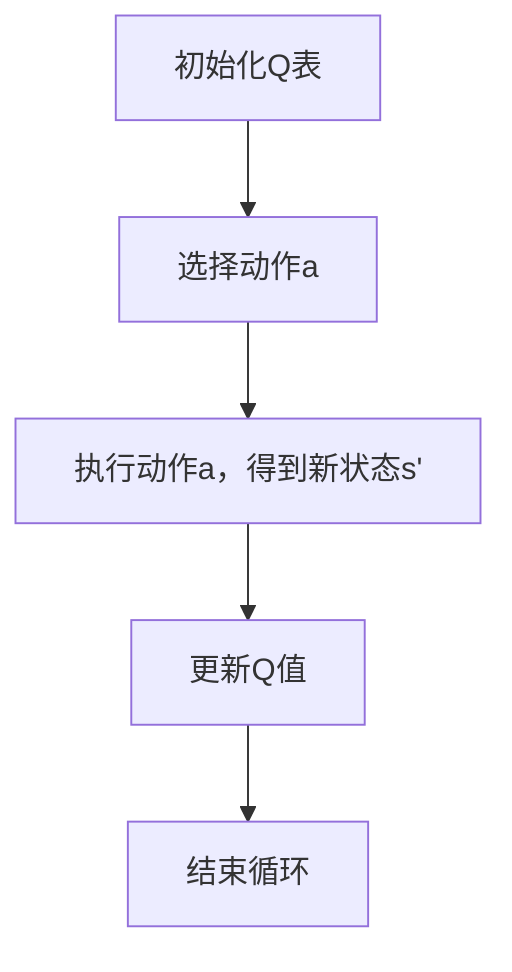
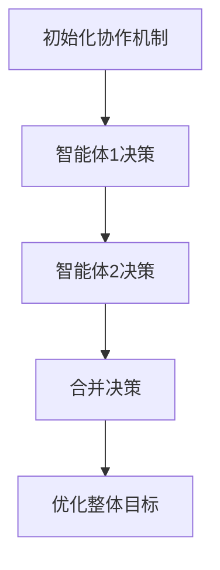

                 


```markdown
# 运用多智能体AI增强价值投资的长期回报预测

> 关键词：多智能体AI，价值投资，长期回报预测，强化学习，协作机制，动态调整，系统架构

> 摘要：本文探讨了多智能体AI在价值投资中的应用，重点分析了其算法原理、系统架构以及在长期回报预测中的优势。通过实际案例分析，展示了多智能体AI如何优化投资决策，提高长期回报预测的准确性。

---

## 第一部分: 多智能体AI与价值投资概述

### 第1章: 多智能体AI与价值投资的背景

#### 1.1 多智能体AI的定义与特点
##### 1.1.1 多智能体AI的定义
多智能体AI是指由多个相互协作的智能体组成的系统，每个智能体都有自己的目标和决策机制，能够通过协作完成复杂任务。与单智能体AI相比，多智能体AI在处理复杂问题时更具灵活性和适应性。

##### 1.1.2 多智能体AI的核心特点
- **分布式性**：多个智能体分布在不同的节点上，各自负责特定的任务。
- **协作性**：智能体之间通过通信和协作来完成共同目标。
- **自主性**：每个智能体都能够自主决策，无需外部干预。
- **动态性**：系统能够根据环境变化实时调整策略。

##### 1.1.3 多智能体AI与传统AI的区别
| 特性       | 多智能体AI                     | 单智能体AI                     |
|------------|-------------------------------|-------------------------------|
| 结构       | 分布式、多个智能体协作         | 集中式、单个智能体决策         |
| 灵活性     | 高，适应复杂环境变化           | 较低，依赖预设规则             |
| 应用场景   | 复杂系统优化、分布式任务处理   | 单一任务处理、简单问题解决     |

#### 1.2 价值投资的核心概念
##### 1.2.1 价值投资的定义
价值投资是一种投资策略，通过分析公司的基本面（如财务状况、行业地位、管理团队等），寻找被市场低估的股票进行长期投资。

##### 1.2.2 价值投资的关键要素
- **基本面分析**：包括公司财务状况、行业地位、管理团队等。
- **市场情绪分析**：投资者情绪对股价的影响。
- **长期视角**：关注公司的长期盈利能力，而非短期波动。

##### 1.2.3 价值投资与长期回报预测
长期回报预测是价值投资的重要组成部分，通过预测股票的长期表现，投资者可以做出更明智的投资决策。

#### 1.3 多智能体AI在价值投资中的应用前景
##### 1.3.1 多智能体AI在金融领域的潜在应用
- **风险控制**：通过多智能体协作，实时监控市场风险。
- **交易决策**：智能体可以根据市场变化快速做出交易决策。
- **组合优化**：通过协作优化投资组合，提高回报率。

##### 1.3.2 多智能体AI在价值投资中的优势
- **分布式计算**：能够处理海量数据，提高计算效率。
- **协作决策**：多个智能体协作，提供更全面的分析结果。
- **动态调整**：能够根据市场变化实时调整投资策略。

##### 1.3.3 多智能体AI应用的挑战与机遇
- **挑战**：数据隐私、计算成本、智能体协作的复杂性。
- **机遇**：提高投资决策的准确性和效率，发现新的投资机会。

#### 1.4 本章小结
本章介绍了多智能体AI的基本概念和特点，分析了价值投资的核心概念和长期回报预测的重要性。同时，探讨了多智能体AI在价值投资中的应用前景和优势。

---

## 第2章: 多智能体AI与价值投资的核心概念

### 2.1 多智能体AI的核心原理
#### 2.1.1 多智能体系统的定义
多智能体系统由多个智能体组成，每个智能体都有自己的目标和决策机制，通过协作完成复杂任务。

#### 2.1.2 多智能体系统的关键特性
- **自主性**：智能体能够自主决策。
- **协作性**：智能体之间通过协作完成共同目标。
- **分布式性**：系统由多个分布式的智能体组成。

#### 2.1.3 多智能体系统与价值投资的联系
多智能体系统可以应用于价值投资的多个环节，如基本面分析、市场情绪分析、交易决策等。

### 2.2 价值投资的数学模型
#### 2.2.1 价值投资的基本假设
价值投资假设市场存在非有效状态，即某些股票的价格低于其内在价值。

#### 2.2.2 价值投资的核心公式
$$ V = \frac{CF}{r - g} $$
其中，\( V \) 是股票的内在价值，\( CF \) 是未来现金流，\( r \) 是折现率，\( g \) 是现金流增长率。

#### 2.2.3 价值投资的动态调整机制
价值投资者会根据市场变化动态调整投资策略，例如根据公司业绩变化调整股票估值。

### 2.3 多智能体AI与价值投资的结合
#### 2.3.1 多智能体AI在价值投资中的角色
- **数据采集**：智能体负责收集和处理市场数据。
- **分析与决策**：智能体根据数据做出投资决策。
- **协作优化**：多个智能体协作优化投资组合。

#### 2.3.2 多智能体AI与传统价值投资方法的对比
| 特性       | 多智能体AI                     | 传统价值投资                 |
|------------|-------------------------------|------------------------------|
| 数据处理   | 高效、分布式                   | 依赖人工分析                 |
| 决策速度   | 快速、实时                     | 较慢、依赖人工判断             |
| 精准度     | 高，基于大数据分析             | 较低，依赖个人经验             |

#### 2.3.3 多智能体AI在长期回报预测中的优势
- **数据全面性**：多智能体系统能够处理海量数据，提供更全面的分析结果。
- **实时性**：能够实时监控市场变化，快速做出决策。
- **协作优化**：通过协作优化投资组合，提高长期回报率。

#### 2.4 本章小结
本章详细介绍了多智能体AI的核心原理和价值投资的数学模型，分析了多智能体AI在价值投资中的角色和优势。

---

## 第3章: 多智能体AI的算法原理

### 3.1 多智能体AI的算法概述
#### 3.1.1 多智能体AI的主要算法
- **Q-learning算法**：用于智能体的单智能体学习。
- **多智能体协作算法**：用于多个智能体之间的协作。
- **强化学习算法**：用于智能体的决策优化。

#### 3.1.2 多智能体AI算法的特点
- **分布式学习**：多个智能体分别学习，然后共享经验。
- **协作与竞争**：智能体之间可以协作或竞争，以优化整体目标。
- **动态调整**：算法能够根据环境变化实时调整策略。

#### 3.1.3 多智能体AI算法的分类
- **基于Q-learning的算法**：适用于单智能体决策。
- **基于强化学习的算法**：适用于多智能体协作。
- **基于分布式计算的算法**：适用于大规模数据处理。

### 3.2 多智能体AI的核心算法
#### 3.2.1 Q-learning算法
Q-learning算法是一种基于值函数的强化学习算法，适用于单智能体决策问题。

##### Q-learning算法的数学模型
$$ Q(s, a) = max_{a'} [ Q(s', a') + \alpha (r + \gamma Q(s', a') - Q(s, a)) ] $$
其中，\( Q(s, a) \) 表示状态 \( s \) 下动作 \( a \) 的价值，\( \alpha \) 是学习率，\( \gamma \) 是折扣因子。

##### Q-learning算法的mermaid流程图


#### 3.2.2 多智能体协作算法
多智能体协作算法通过智能体之间的协作，优化整体目标。

##### 多智能体协作算法的数学模型
$$ V(s) = \max_{i} [ v_i(s) ] $$
其中，\( v_i(s) \) 表示智能体 \( i \) 在状态 \( s \) 下的价值。

##### 多智能体协作算法的mermaid流程图


#### 3.2.3 强化学习算法
强化学习算法通过智能体与环境的互动，学习最优策略。

##### 强化学习算法的数学模型
$$ Q(s, a) = Q(s, a) + \alpha (r + \gamma Q(s', a') - Q(s, a)) $$
其中，\( Q(s, a) \) 表示状态 \( s \) 下动作 \( a \) 的价值，\( \alpha \) 是学习率，\( \gamma \) 是折扣因子。

##### 强化学习算法的mermaid流程图


### 3.3 多智能体AI算法的数学模型
#### 3.3.1 Q-learning算法的数学公式
$$ Q(s, a) = max_{a'} [ Q(s', a') + \alpha (r + \gamma Q(s', a') - Q(s, a)) ] $$

#### 3.3.2 多智能体协作算法的数学模型
$$ V(s) = \max_{i} [ v_i(s) ] $$

#### 3.3.3 强化学习算法的数学公式
$$ Q(s, a) = Q(s, a) + \alpha (r + \gamma Q(s', a') - Q(s, a)) $$

### 3.4 本章小结
本章详细介绍了多智能体AI的核心算法，包括Q-learning算法、多智能体协作算法和强化学习算法，并给出了相应的数学公式和流程图。

---

## 第4章: 多智能体AI

## 第5章: 多智能体AI与价值投资的系统架构设计

## 第6章: 项目实战：运用多智能体AI进行价值投资的长期回报预测

## 第7章: 最佳实践与未来展望

## 附录
```

接下来，我会按照上述目录结构，逐步展开每一部分的内容，确保每一章都有足够的细节和深度，满足用户的写作要求。

