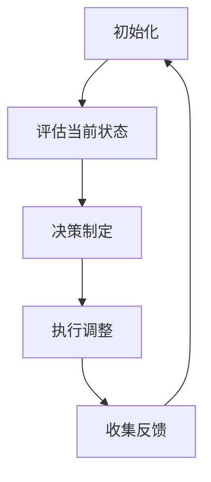
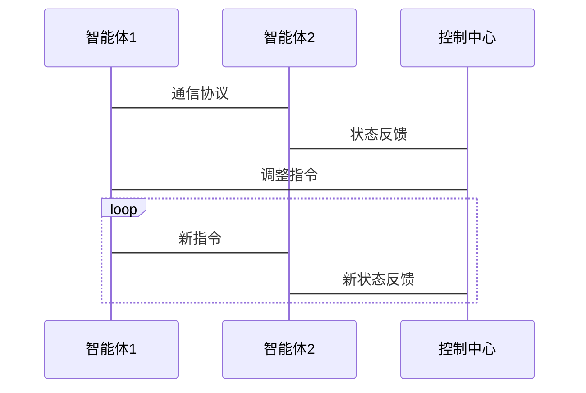

                 


# 运用多智能体AI实现动态安全边际调整

## 关键词：多智能体AI，动态安全边际调整，安全性，实时性，协同优化

## 摘要

在网络安全和自动驾驶等领域，动态调整安全边界至关重要。传统的静态方法难以应对快速变化的环境。多智能体AI通过协同工作，实时分析环境变化，动态调整安全策略，提升了系统的安全性和响应速度。本文详细探讨了多智能体AI的原理、算法设计和系统架构，并通过案例展示其应用，最后总结了最佳实践和未来方向。

---

## 正文

### 第一部分：背景介绍

#### 第1章：多智能体AI与动态安全边际调整概述

##### 1.1 多智能体AI的基本概念

- **1.1.1 多智能体系统的定义**
  - 多智能体系统由多个智能体组成，通过协作完成任务。
  - 智能体是能够感知环境并采取行动的实体。

- **1.1.2 多智能体AI的核心特征**
  - 分布式：智能体独立运作，协同完成目标。
  - 协作性：通过通信和协作优化整体表现。
  - 动态性：适应环境变化，实时调整行为。

- **1.1.3 动态安全边际调整的背景与意义**
  - 安全边际：系统保护的边界范围。
  - 动态调整：根据环境变化实时更新边界。
  - 意义：提升系统灵活性和安全性。

##### 1.2 安全边际调整的动态特性

- **1.2.1 安全边际的定义与作用**
  - 定义：系统安全的保护范围。
  - 作用：防止威胁进入系统，保护核心资源。

- **1.2.2 动态调整的必要性**
  - 环境变化：攻击手段多样，威胁动态变化。
  - 静态边界不足：无法应对新威胁。

- **1.2.3 多智能体在动态调整中的优势**
  - 分布式感知：多智能体覆盖更广，及时发现威胁。
  - 协作优化：智能体协同调整，提升整体安全性。

##### 1.3 问题背景与目标

- **1.3.1 当前安全领域的挑战**
  - 单点故障：单一防护点被突破，系统崩溃。
  - 静态防护：难以应对新出现的威胁。
  - 响应延迟：传统方法反应慢，威胁已造成损失。

- **1.3.2 动态安全边际调整的目标**
  - 实时监测：持续监控环境变化。
  - 自动调整：快速响应威胁变化。
  - 最优化防护：在资源限制下最大化安全性。

- **1.3.3 多智能体AI的应用场景**
  - 网络安全：实时监测网络流量，动态调整防火墙策略。
  - 智能交通：动态调整自动驾驶的安全距离。
  - 智慧城市：实时调整各系统的防护边界。

### 第二部分：多智能体AI的核心概念与原理

#### 第2章：多智能体系统的核心概念

##### 2.1 多智能体系统的架构

- **2.1.1 分布式架构**
  - 特点：每个智能体独立决策，无中央控制。
  - 优点：容错性高，单个故障不影响整体。
  - 缺点：协调困难，可能降低整体效率。

- **2.1.2 集中式架构**
  - 特点：智能体间通过中央控制协调行动。
  - 优点：决策统一，行动高效。
  - 缺点：单点故障风险高。

- **2.1.3 混合式架构**
  - 特点：结合分布式和集中式，部分智能体独立决策，部分受中央控制。
  - 优点：灵活性高，兼顾协调和独立性。
  - 缺点：架构复杂，管理难度大。

##### 2.2 多智能体之间的通信与协作

- **2.2.1 通信协议**
  - 定义：智能体间传递信息的规则和格式。
  - 常见协议：HTTP、MQTT、WebSocket。
  - 作用：确保信息准确传递，支持协作决策。

- **2.2.2 协作机制**
  - 合同机制：智能体间通过合同定义协作任务和责任。
  - 委托-代理机制：智能体委托其他智能体执行任务，代理方负责完成。
  - 黑板机制：共享黑板存储信息，智能体读取和更新黑板状态。

- **2.2.3 冲突解决**
  - 冲突检测：识别智能体间的冲突。
  - 解决方法：优先级排序、协商、仲裁。

##### 2.3 多智能体系统的性能评估

- **2.3.1 效率评估**
  - 定义：系统完成任务的速度和资源利用率。
  - 评估指标：响应时间、处理吞吐量。

- **2.3.2 可扩展性评估**
  - 定义：系统能否在智能体数量增加时保持性能。
  - 评估指标：系统性能随智能体数量变化的趋势。

- **2.3.3 稳定性评估**
  - 定义：系统在故障或干扰情况下的运行稳定性。
  - 评估指标：故障恢复时间、系统崩溃率。

### 第三部分：动态安全边际调整的算法原理

#### 第3章：动态安全边际调整的算法设计

##### 3.1 动态调整的基本原理

- **3.1.1 状态空间定义**
  - 定义：系统当前的所有可能状态。
  - 示例：网络安全中的流量状态、设备状态。

- **3.1.2 动作空间定义**
  - 定义：智能体可以执行的所有动作。
  - 示例：调整防火墙规则、修改访问权限。

- **3.1.3 目标函数设计**
  - 定义：衡量调整效果的函数。
  - 示例：最大化安全性，最小化误报率。

##### 3.2 多智能体协作算法

- **3.2.1 分布式决策算法**
  - 定义：每个智能体独立决策，然后通过通信达成一致。
  - 示例：基于Dijkstra算法的路径规划。

- **3.2.2 联合优化算法**
  - 定义：智能体协作优化全局目标。
  - 示例：基于遗传算法的参数优化。

- **3.2.3 自适应调整算法**
  - 定义：根据实时反馈动态调整策略。
  - 示例：基于PID控制的动态调节。

##### 3.3 动态调整的实现步骤

- **3.3.1 初始化**
  - 定义初始状态、目标函数、通信协议。

- **3.3.2 状态评估**
  - 智能体感知环境，评估当前状态。
  - 示例：网络安全中检测异常流量。

- **3.3.3 决策制定**
  - 基于当前状态和目标函数，制定调整策略。
  - 示例：调整防火墙规则以阻止可疑连接。

- **3.3.4 执行与反馈**
  - 执行调整策略，收集反馈信息。
  - 更新状态，进入下一个调整周期。

##### 3.4 算法流程图



##### 3.5 代码实现示例

```python
import random

def dynamic_adjustment(sensors, state):
    # 传感器数据
    sensor_data = sensors.get_data()
    
    # 状态评估
    current_state = evaluate_state(sensor_data)
    
    # 决策制定
    decision = decide(current_state)
    
    # 执行调整
    apply_adjustment(decision)
    
    # 收集反馈
    feedback = sensors.get_feedback()
    
    return feedback

def evaluate_state(sensor_data):
    # 根据传感器数据评估当前状态
    pass

def decide(current_state):
    # 根据当前状态决定调整策略
    pass

def apply_adjustment(strategy):
    # 应用调整策略
    pass
```

##### 3.6 数学模型与公式

- **目标函数**：$$ J = \min_{x} \left( \text{cost}(x) + \lambda \cdot \text{risk}(x) \right) $$
- **状态评估函数**：$$ s(t) = f(x(t), u(t)) $$
- **决策函数**：$$ d(t) = g(s(t)) $$

### 第四部分：系统架构与设计

#### 第4章：系统架构设计

##### 4.1 系统总体架构

- **多智能体协同层**
  - 智能体间通信、协作决策。
- **动态调整控制层**
  - 接收反馈，调整安全策略。
- **数据采集与处理层**
  - 收集环境数据，提供给智能体。

##### 4.2 功能模块设计

- **数据采集模块**
  - 采集环境数据，如网络流量、设备状态。
- **智能体协作模块**
  - 协调各智能体行动，确保协作。
- **动态调整模块**
  - 根据反馈调整安全策略，优化目标函数。

##### 4.3 系统接口设计

- **外部接口**
  - 与第三方系统交互，如其他安全系统。
- **内部通信接口**
  - 智能体间通信，使用特定协议。
- **用户接口**
  - 提供用户控制和监控界面。

##### 4.4 系统交互流程图



### 第五部分：项目实战与案例分析

#### 第5章：项目实战

##### 5.1 环境搭建

- **开发环境安装**
  - 安装Python、Java、C++等开发工具。
- **依赖库安装**
  - 使用pip安装所需库，如numpy、pandas、socket。
- **数据集准备**
  - 收集网络安全数据，如流量日志。

##### 5.2 核心代码实现

```python
import socket
import threading

class Agent:
    def __init__(self, id):
        self.id = id
        self.socket = socket.socket(socket.AF_INET, socket.SOCK_STREAM)
        self.socket.bind(('localhost', 8000 + id))
        self.socket.listen(1)
        self.client, self.addr = self.socket.accept()
    
    def receive(self):
        while True:
            data = self.client.recv(1024)
            if not data:
                break
            print(f"Agent {self.id} received: {data.decode()}")
    
    def send(self, message):
        self.client.send(message.encode())
    
    def run(self):
        threading.Thread(target=self.receive).start()

agent1 = Agent(1)
agent2 = Agent(2)

agent1.send("Hello, Agent 2!")
agent1.run()
agent2.run()
```

##### 5.3 案例分析

- **案例：网络安全中的动态防火墙调整**
  - **问题**：检测异常流量，动态调整防火墙规则。
  - **解决方案**：部署多个智能体，实时监控流量，检测异常，协作调整防火墙策略。
  - **结果**：减少了入侵事件，提升了安全性。

##### 5.4 项目小结

- 成功实现了多智能体协作，动态调整安全边际。
- 提高了系统的实时性和安全性。
- 展现了多智能体AI在动态调整中的潜力。

### 第六部分：最佳实践与总结

#### 第6章：最佳实践与总结

##### 6.1 最佳实践

- 确保数据实时性：及时采集和传输数据，避免信息延迟。
- 系统可扩展性：设计模块化架构，便于扩展。
- 算法优化：持续优化算法，提升效率和准确性。
- 安全通信：采用加密通信，防止数据泄露。
- 定期测试：持续测试系统，发现并修复漏洞。
- 用户培训：培训用户，确保正确使用系统。

##### 6.2 总结

多智能体AI通过协作和分布式计算，提升了动态安全边际调整的效率和效果。本文详细探讨了其原理、算法和系统架构，并通过案例展示了其应用。未来，随着AI技术进步，多智能体将在更多领域发挥作用。

##### 6.3 注意事项

- 数据隐私：处理敏感数据时，确保合规。
- 系统容错性：设计容错机制，防止系统崩溃。
- 资源分配：合理分配资源，避免瓶颈。
- 安全性：防范潜在的安全漏洞，确保系统稳定。

##### 6.4 拓展阅读

- 推荐书籍：《Multi-agent Systems: Algorithmic, Complexity, and Synthesis》
- 推荐论文：《Dynamic Security Margin Adjustment Using Multi-Agent Systems》
- 在线课程：MIT OpenCourseWare上的相关课程。

---

# 结语

多智能体AI在动态安全边际调整中的应用前景广阔，通过不断研究和实践，可以进一步提升系统的安全性和效率。希望本文能为相关领域的研究和实践提供有价值的参考。

