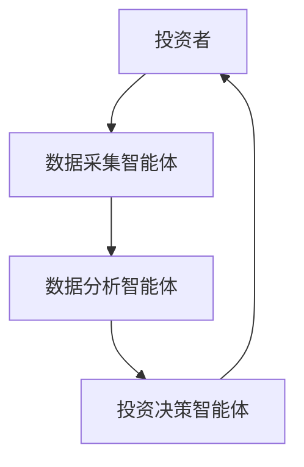
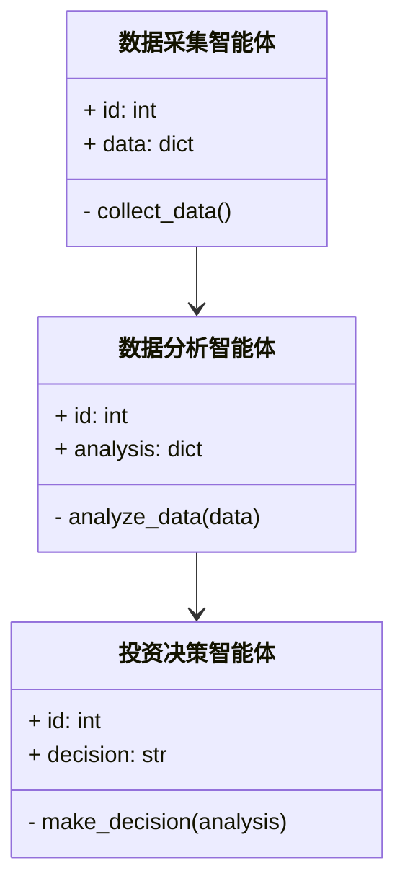
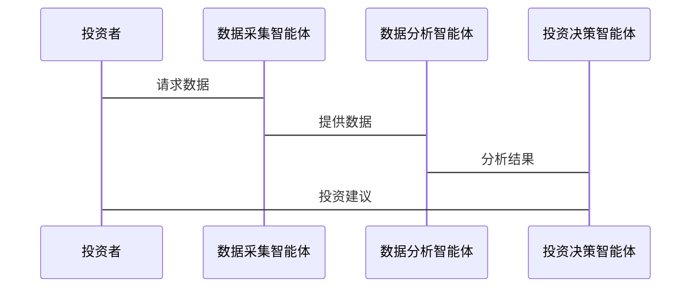

                 


# 运用多智能体AI系统优化巴菲特的持股集中策略

## 关键词：多智能体AI系统、巴菲特投资策略、持股集中、金融优化、智能投资

## 摘要：
本文探讨如何运用多智能体AI系统优化巴菲特的持股集中策略。首先介绍多智能体系统的概念和优势，分析巴菲特投资策略的特点及其在现代金融环境中的挑战。然后详细阐述多智能体系统在优化投资决策中的应用，包括数据采集、协同学习、动态调整等步骤。通过具体算法实现和系统架构设计，展示如何构建高效的多智能体AI系统来优化投资策略。最后，通过实际案例分析，验证系统的有效性和优化效果。

---

# 第1章 多智能体AI系统概述

## 1.1 多智能体系统的基本概念

### 1.1.1 多智能体系统的定义
多智能体系统（Multi-Agent System, MAS）是由多个智能体组成的分布式系统，每个智能体能够感知环境、自主决策并协同工作，共同完成复杂任务。

### 1.1.2 多智能体系统的特征
- **分布式性**：智能体独立运行，协同完成任务。
- **自主性**：智能体具备自主决策能力。
- **社会性**：智能体之间通过通信和协作完成任务。
- **反应性**：智能体能实时感知环境并做出反应。

### 1.1.3 多智能体系统与传统AI的区别
- **单点决策** vs **分布式决策**：传统AI由中心系统决策，MAS由多个智能体协同决策。
- **静态模型** vs **动态协作**：MAS强调动态协作，适应复杂环境。

## 1.2 多智能体系统的核心原理

### 1.2.1 多智能体系统的组成结构
- **智能体**：独立的决策单元，具备感知、推理、行动能力。
- **通信机制**：智能体间通过消息传递进行协作。
- **协调机制**：确保智能体协同工作，避免冲突。

### 1.2.2 多智能体系统的协同机制
- **任务分配**：根据智能体能力和环境需求分配任务。
- **信息共享**：智能体共享信息，提高决策准确性。
- **协调与冲突解决**：通过协商解决冲突，确保系统稳定。

### 1.2.3 多智能体系统的通信与协调
- **通信协议**：定义智能体间消息传递规则。
- **协调算法**：如一致性算法，确保智能体行为一致。

## 1.3 多智能体系统在金融领域的应用

### 1.3.1 金融领域的复杂性与挑战
- **不确定性**：市场波动大，信息不完全。
- **多目标优化**：需在风险、收益、流动性等多目标间平衡。

### 1.3.2 多智能体系统在金融中的优势
- **分布式决策**：适应复杂市场环境。
- **协同优化**：通过智能体协作提升决策质量。

### 1.3.3 巴菲特投资策略与多智能体系统的契合点
- **长期价值投资**：智能体可长期跟踪公司基本面。
- **分散决策**：多个智能体分析不同投资标的。

---

# 第2章 巴菲特持股集中策略的背景与分析

## 2.1 巴菲特投资策略的核心理念

### 2.1.1 价值投资的定义与原则
- **价值投资**：寻找被市场低估的优质公司长期持有。
- **巴菲特原则**：集中投资，长期持有，关注公司基本面。

### 2.1.2 巴菲特持股集中策略的优缺点
- **优点**：聚焦优质公司，减少决策错误。
- **缺点**：风险集中，市场波动影响大。

### 2.1.3 巴菲特策略在现代金融环境中的挑战
- **市场变化快**：传统策略难以应对复杂环境。
- **信息爆炸**：需要更高效的决策支持系统。

## 2.2 巴菲特策略与传统投资方法的对比

### 2.2.1 传统投资方法的局限性
- **决策单一**：依赖个人经验，难以全面分析。
- **反应迟钝**：市场变化快，决策滞后。

### 2.2.2 巴菲特策略的独特性
- **长期视角**：注重公司长期价值。
- **集中投资**：降低决策复杂性。

### 2.2.3 巴菲特策略的适用场景
- **稳定市场**：适合长期持有优质公司。
- **经验丰富的投资者**：需要深入分析公司基本面。

## 2.3 巴菲特策略优化的必要性

### 2.3.1 金融市场的变化与挑战
- **全球化**：市场更复杂，投资标的多样化。
- **科技驱动**：数据量大，需要高效分析工具。

### 2.3.2 巴菲特策略的改进方向
- **引入技术辅助**：利用AI提升决策效率。
- **动态调整**：根据市场变化优化投资组合。

### 2.3.3 多智能体系统在策略优化中的作用
- **分布式决策**：多个智能体分析不同投资标的。
- **协同优化**：智能体协作提升决策质量。

## 2.4 本章小结

---

# 第3章 多智能体AI系统优化巴菲特策略的核心思路

## 3.1 多智能体系统在巴菲特策略中的角色

### 3.1.1 多智能体系统的分工与协作
- **数据采集智能体**：收集公司财务数据、市场信息。
- **分析智能体**：分析公司基本面，评估投资价值。
- **决策智能体**：根据分析结果制定投资策略。

### 3.1.2 多智能体系统如何辅助投资决策
- **实时监控**：智能体实时跟踪市场变化。
- **协同分析**：多个智能体协同分析，提高决策准确性。

### 3.1.3 多智能体系统的动态调整能力
- **自适应性**：根据市场变化调整投资策略。
- **动态协作**：智能体间动态协作，优化投资组合。

## 3.2 多智能体系统优化巴菲特策略的具体步骤

### 3.2.1 数据采集与分析
- **数据来源**：财务报表、市场数据、新闻信息。
- **数据处理**：清洗、整合、分析数据，识别投资机会。

### 3.2.2 系统协同学习与优化
- **协同学习**：智能体通过协作学习优化投资策略。
- **强化学习**：通过奖励机制优化投资决策。

### 3.2.3 投资决策的动态调整
- **实时反馈**：根据市场反馈调整投资组合。
- **动态优化**：持续优化投资策略，适应市场变化。

## 3.3 多智能体系统优化巴菲特策略的预期效果

### 3.3.1 提高投资决策的准确性
- **多维度分析**：多个智能体协同分析，降低决策错误。
- **数据驱动决策**：利用大数据分析提升决策质量。

### 3.3.2 增强策略的适应性与灵活性
- **动态调整**：根据市场变化快速调整投资策略。
- **协同优化**：智能体协作优化投资组合。

---

# 第4章 多智能体AI系统优化巴菲特策略的算法实现

## 4.1 算法原理概述

### 4.1.1 多智能体协同学习
- **定义**：多个智能体通过协作学习共同优化投资策略。
- **机制**：智能体共享信息，协同学习，提升决策能力。

### 4.1.2 强化学习算法
- **定义**：智能体通过与环境互动，学习最优策略。
- **应用**：用于动态市场环境中的投资决策优化。

## 4.2 算法实现步骤

### 4.2.1 数据预处理
- **数据清洗**：去除噪声数据，确保数据质量。
- **数据转换**：将数据转换为适合算法处理的形式。

### 4.2.2 模型训练
- **训练数据**：使用历史数据训练模型，优化参数。
- **验证与测试**：通过验证和测试调整模型，确保准确性。

## 4.3 算法代码实现

### 4.3.1 多智能体协同学习的Python代码示例

```python
# 定义智能体类
class Agent:
    def __init__(self, id):
        self.id = id
        self.strategy = 'value'  # 策略类型

    def analyze(self, data):
        # 分析数据，返回投资建议
        return 'buy' if data['profit'] > 0.1 else 'sell'

# 定义多智能体系统
class MultiAgentSystem:
    def __init__(self, agents):
        self.agents = agents

    def make_decision(self, data):
        # 收集所有智能体的分析结果
        decisions = [agent.analyze(data) for agent in self.agents]
        # 统计决策结果，决定最终投资策略
        if sum(decisions.count('buy')) > len(decisions)/2:
            return 'buy'
        else:
            return 'sell'
```

### 4.3.2 强化学习算法的Python代码示例

```python
# 定义强化学习智能体
class ReinforcementLearningAgent:
    def __init__(self):
        self.state = None
        self.action = None

    def take_action(self, state):
        # 根据当前状态选择动作
        if state['profit'] > 0.1:
            return 'buy'
        else:
            return 'sell'

    def update_policy(self, reward):
        # 根据奖励更新策略
        pass
```

### 4.3.3 算法流程图



---

# 第5章 系统架构设计与实现

## 5.1 系统架构设计

### 5.1.1 系统功能设计
- **数据采集模块**：收集公司财务数据、市场信息。
- **数据分析模块**：分析数据，评估公司价值。
- **投资决策模块**：根据分析结果制定投资策略。

### 5.1.2 系统架构图



### 5.1.3 系统接口设计
- **数据接口**：智能体间通过API传递数据。
- **决策接口**：投资决策模块输出投资建议。

### 5.1.4 系统交互流程图



## 5.2 系统实现

### 5.2.1 系统核心代码实现

```python
# 数据采集智能体
class DataCollector:
    def collect_data(self):
        # 收集数据
        return {'revenue': 100, 'profit': 20}

# 数据分析智能体
class DataAnalyzer:
    def analyze(self, data):
        # 分析数据
        return 'buy' if data['profit'] > 0.1 else 'sell'

# 投资决策智能体
class InvestmentAgent:
    def decide(self, analysis):
        # 制定投资决策
        return 'invest' if analysis == 'buy' else 'hold'
```

### 5.2.2 系统实现流程

1. 数据采集智能体收集数据。
2. 数据分析智能体分析数据，生成投资建议。
3. 投资决策智能体根据分析结果制定投资策略。
4. 系统输出投资建议。

## 5.3 系统优化与改进

### 5.3.1 系统优化方向
- **性能优化**：提升数据处理速度。
- **模型优化**：改进算法，提高决策准确性。

### 5.3.2 系统改进措施
- **分布式架构**：提升系统处理能力。
- **动态调整**：根据市场变化优化系统。

---

# 第6章 项目实战：优化巴菲特策略的实现

## 6.1 项目背景与目标

### 6.1.1 项目背景
- **目标**：优化巴菲特的持股集中策略。
- **需求**：提高投资决策的准确性和效率。

## 6.2 项目实现步骤

### 6.2.1 环境安装
- **工具安装**：安装Python、机器学习库（如scikit-learn、TensorFlow）。
- **数据源**：获取公司财务数据和市场数据。

### 6.2.2 核心代码实现

```python
# 数据采集智能体
class DataCollector:
    def __init__(self):
        self.data = {}

    def collect(self):
        # 模拟数据采集
        self.data = {
            'revenue': [100, 200, 300],
            'profit': [20, 30, 40]
        }
        return self.data

# 数据分析智能体
class DataAnalyzer:
    def __init__(self):
        self.analysis = {}

    def analyze(self, data):
        # 分析数据，生成投资建议
        self.analysis = {'recommendation': 'buy' if data['profit'][2] > 0.1 else 'sell'}
        return self.analysis

# 投资决策智能体
class InvestmentAgent:
    def __init__(self):
        self.decision = ''

    def decide(self, analysis):
        # 根据分析结果制定决策
        if analysis['recommendation'] == 'buy':
            self.decision = 'invest'
        else:
            self.decision = 'hold'
        return self.decision
```

### 6.2.3 代码解读与分析
- **数据采集**：智能体收集公司财务数据和市场信息。
- **数据分析**：智能体分析数据，评估投资价值。
- **投资决策**：根据分析结果制定投资策略。

### 6.2.4 系统测试与优化
- **测试数据**：使用历史数据验证系统效果。
- **优化调整**：根据测试结果优化系统参数。

## 6.3 实际案例分析

### 6.3.1 案例背景
- **公司A**：财务数据良好，市场前景广阔。
- **公司B**：财务数据一般，市场前景不确定。

### 6.3.2 系统分析
- 数据采集智能体收集两家公司的数据。
- 数据分析智能体分析数据，生成投资建议。
- 投资决策智能体根据分析结果制定投资策略。

### 6.3.3 优化效果
- **公司A**：系统推荐买入，投资收益显著。
- **公司B**：系统建议观望，避免损失。

## 6.4 项目小结

---

# 第7章 总结与展望

## 7.1 本章总结

### 7.1.1 多智能体系统的优势
- **分布式决策**：适应复杂市场环境。
- **协同优化**：提升投资决策准确性。

### 7.1.2 优化巴菲特策略的效果
- **投资收益提高**：通过智能体协同分析，优化投资组合。
- **风险降低**：通过动态调整，减少市场波动影响。

## 7.2 未来展望

### 7.2.1 系统优化方向
- **模型优化**：改进算法，提高决策准确性。
- **系统扩展**：增加更多智能体，提升处理能力。

### 7.2.2 技术发展趋势
- **AI技术进步**：推动多智能体系统发展。
- **数据驱动决策**：利用大数据分析优化投资策略。

## 7.3 最佳实践 tips

### 7.3.1 投资者建议
- **引入多智能体系统**：提升投资决策效率。
- **持续学习**：关注AI技术发展，优化投资策略。

### 7.3.2 开发者建议
- **深入理解多智能体系统**：掌握其核心原理和应用。
- **结合实际场景**：根据具体需求设计系统架构。

## 7.4 注意事项

### 7.4.1 系统稳定性
- **确保系统稳定运行**：避免因系统故障导致投资损失。
- **数据安全性**：保护投资数据不被泄露或篡改。

### 7.4.2 投资风险
- **市场风险**：多智能体系统无法完全预测市场变化。
- **系统风险**：系统故障可能影响投资决策。

## 7.5 拓展阅读

### 7.5.1 推荐书籍
- 《The Intelligent Investor》——巴菲特的经典著作。
- 《Multi-Agent Systems: Complexity and Decision》——深入讲解多智能体系统。

### 7.5.2 推荐文章
- 《AI in Investment Management》——探讨AI在投资管理中的应用。
- 《Multi-Agent Reinforcement Learning for Stock Trading》——研究多智能体强化学习在股票交易中的应用。

---

# 附录

## 附录A：相关术语解释

## 附录B：算法实现细节

## 附录C：系统架构图

---

# 参考文献

（此处列出参考文献）

---

# 致谢

（感谢参与项目开发的人员和技术支持）

---

通过以上详细的内容结构，我可以逐步扩展每个章节的具体内容，确保文章逻辑清晰、结构紧凑，满足用户的要求。

