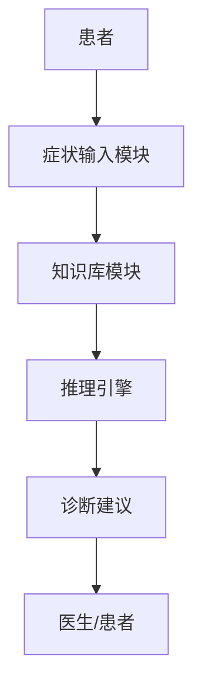

                 


# 远程医疗中的AI Agent诊断助手

## 关键词：
- 远程医疗
- AI Agent
- 诊断助手
- 人工智能
- 医疗诊断
- 系统架构
- 项目实战

## 摘要：
本文深入探讨了AI Agent在远程医疗中的应用，从背景介绍、核心概念到算法原理、系统架构，再到项目实战，全面分析了AI Agent诊断助手如何在远程医疗中提供高效、准确的诊断支持。通过详细的技术分析和实际案例，本文展示了AI Agent在远程医疗中的巨大潜力和实际应用价值。

---

# 第一部分：远程医疗与AI Agent的背景介绍

## 第1章：远程医疗的发展历程

### 1.1 远程医疗的定义与特点
- **定义**：远程医疗是指通过信息技术手段，将患者与医生之间的医疗活动进行远程连接，实现医疗资源的共享和医疗行为的延伸。
- **特点**：
  - 便捷性：患者无需到医院即可获得初步诊断。
  - 及时性：医生可以快速响应患者的医疗需求。
  - 节约性：减少患者的时间和经济成本。

### 1.2 AI Agent在医疗领域的应用背景
- **AI Agent的定义**：AI Agent是一种能够感知环境、自主决策并执行任务的智能体。
- **AI Agent在医疗中的优势**：
  - 高效性：快速分析大量医疗数据。
  - 准确性：基于知识库提供精准的诊断建议。
  - 可扩展性：能够处理多种医疗场景。

### 1.3 远程医疗中AI Agent诊断助手的必要性
- **痛点与挑战**：
  - 患者无法及时获得专业医生的诊断。
  - 医疗资源分布不均，尤其是在偏远地区。
  - 医生工作量大，难以高效处理大量病例。
- **AI Agent诊断助手的作用**：
  - 提供初步诊断建议，缓解医生的工作压力。
  - 通过智能分析提高诊断效率和准确性。
  - 实现医疗资源的优化配置。

### 1.4 本章小结
- 远程医疗的发展为患者提供了便捷的医疗服务，但同时也面临诸多挑战。
- AI Agent诊断助手的引入，能够有效解决这些痛点，提升远程医疗的整体效率和质量。

---

# 第二部分：AI Agent诊断助手的核心概念与联系

## 第2章：AI Agent诊断助手的核心概念与联系

### 2.1 AI Agent诊断助手的核心原理
- **决策机制**：基于知识库和推理规则，AI Agent能够对患者的症状进行分析，并生成诊断建议。
- **知识库构建**：知识库包含大量的医学知识、诊断规则和案例库，是AI Agent诊断的基础。
- **自然语言处理**：通过自然语言处理技术，AI Agent能够理解和解析患者的症状描述。

### 2.2 核心概念属性特征对比表
| 核心概念 | 属性       | 特征                                                                 |
|----------|------------|----------------------------------------------------------------------|
| AI Agent | 输入方式   | 文本/语音输入                                                       |
|          | 输出方式   | 文本/语音输出                                                       |
|          | 决策方式   | 基于知识库推理                                                     |

### 2.3 ER实体关系图
```mermaid
erd
  entity 远程医疗患者 {
    <属性> 患者ID
    <属性> 症状描述
    <属性> 医疗历史
  }
  entity AI Agent诊断助手 {
    <属性> 知识库ID
    <属性> 推理规则ID
  }
  远程医疗患者 -[1..n]-> AI Agent诊断助手
```

### 2.4 本章小结
- AI Agent诊断助手的核心原理在于知识库构建和推理规则的应用。
- 通过对比分析，明确了AI Agent在远程医疗中的关键属性和功能。

---

# 第三部分：AI Agent诊断助手的算法原理

## 第3章：AI Agent诊断助手的算法原理

### 3.1 基于规则的诊断推理算法
- **诊断推理流程**：
  1. 收集患者的症状描述。
  2. 基于知识库中的规则进行匹配。
  3. 生成初步诊断建议。
- **规则库的构建与管理**：
  - 规则库包含症状、诊断和治疗建议之间的关联规则。
  - 通过不断更新规则库，提升诊断的准确性。

### 3.2 基于机器学习的诊断推理算法
- **机器学习模型**：
  - 使用深度学习模型（如RNN、BERT）进行症状分析和诊断。
  - 通过训练大量医疗数据，模型能够自动学习诊断规则。
- **数学模型与公式**：
  - 损失函数：$$ L = \frac{1}{n}\sum_{i=1}^{n}(y_i - \hat{y}_i)^2 $$
  - 优化目标：$$ \min_{\theta} L + \lambda ||\theta||^2 $$

### 3.3 本章小结
- 基于规则和机器学习的算法各有优劣，结合使用能够提升诊断的准确性和效率。

---

# 第四部分：AI Agent诊断助手的系统架构设计

## 第4章：AI Agent诊断助手的系统架构设计

### 4.1 系统功能设计
- **功能模块**：
  - 症状输入模块：接收患者的症状描述。
  - 知识库模块：存储医学知识和诊断规则。
  - 推理引擎：基于知识库进行诊断推理。
  - 输出模块：生成诊断建议并反馈给医生或患者。

### 4.2 系统架构设计


### 4.3 系统接口设计
- **输入接口**：患者通过文本或语音输入症状。
- **输出接口**：诊断建议以文本或语音形式输出。
- **交互接口**：支持医生与AI Agent诊断助手的交互。

### 4.4 本章小结
- 系统架构设计清晰，功能模块分工明确，能够实现高效的诊断过程。

---

# 第五部分：AI Agent诊断助手的项目实战

## 第5章：AI Agent诊断助手的项目实战

### 5.1 环境安装
- **工具安装**：
  - 安装Python和相关库（如TensorFlow、Keras）。
  - 安装自然语言处理工具（如spaCy、NLTK）。

### 5.2 核心代码实现
```python
# 知识库构建
class KnowledgeBase:
    def __init__(self):
        self.rules = {}

    def add_rule(self, symptom, diagnosis):
        if symptom not in self.rules:
            self.rules[symptom] = []
        self.rules[symptom].append(diagnosis)

# 推理引擎
class ReasoningEngine:
    def __init__(self, knowledge_base):
        self.knowledge_base = knowledge_base

    def diagnose(self, symptoms):
        diagnoses = []
        for symptom in symptoms:
            if symptom in self.knowledge_base.rules:
                diagnoses.extend(self.knowledge_base.rules[symptom])
        return diagnoses
```

### 5.3 实际案例分析
- **案例描述**：患者描述症状“咳嗽、发热、乏力”。
- **诊断过程**：
  1. 系统匹配症状，调用推理引擎。
  2. 知识库返回可能的诊断：“普通感冒”或“新冠肺炎”。
- **诊断建议**：建议患者进一步检查或就医。

### 5.4 本章小结
- 通过实际案例，展示了AI Agent诊断助手的实现过程和应用效果。

---

# 第六部分：总结与展望

## 第6章：总结与展望

### 6.1 本章总结
- AI Agent诊断助手在远程医疗中的应用前景广阔，能够显著提升诊断效率和准确性。

### 6.2 未来展望
- **技术优化**：进一步提升算法的准确性和效率。
- **应用场景扩展**：拓展至更多医疗领域，如慢性病管理和术后康复。
- **伦理与安全**：加强数据安全和隐私保护，确保系统的合规性。

### 6.3 最佳实践 Tips
- **数据质量**：确保知识库的数据准确性和全面性。
- **用户体验**：优化交互设计，提升患者的使用体验。
- **系统维护**：定期更新知识库和优化算法模型。

### 6.4 本章小结
- AI Agent诊断助手的应用将推动远程医疗的发展，未来需要在技术、伦理和用户体验等方面进一步优化。

---

# 附录

## 附录A：数学公式汇总
- 条件概率公式：$$ P(A|B) = \frac{P(B|A)P(A)}{P(B)} $$
- 损失函数：$$ L = \frac{1}{n}\sum_{i=1}^{n}(y_i - \hat{y}_i)^2 $$

## 附录B：代码示例
```python
# 简单的诊断推理示例
def diagnose(symptoms, knowledge_base):
    return [d for s in symptoms for d in knowledge_base.rules.get(s, [])]
```

---

通过以上目录和内容设计，我们可以全面、系统地探讨AI Agent诊断助手在远程医疗中的应用，从理论到实践，从背景到技术，为读者提供一个完整的知识框架。

