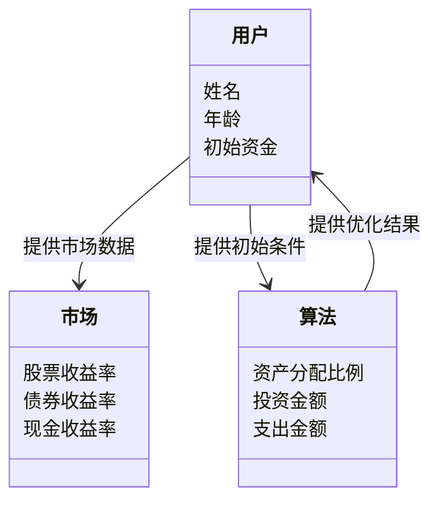
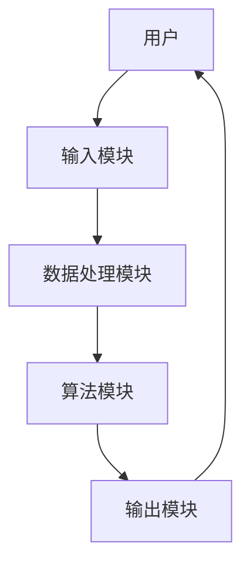

                 


# 退休计划优化算法

> 关键词：退休计划、优化算法、数学模型、动态规划、线性规划、系统架构

> 摘要：本文将介绍如何利用优化算法来优化退休计划。通过分析退休计划的核心要素、问题背景以及传统方法的局限性，提出基于优化算法的解决方案。本文详细讲解了优化算法的核心概念、数学模型、系统架构设计以及实际项目案例，旨在为读者提供一套科学、系统的退休计划优化方法。

---

# 第一部分: 退休计划优化算法概述

# 第1章: 退休计划优化算法背景介绍

## 1.1 退休计划优化算法概述

### 1.1.1 退休计划的重要性
退休计划是个人或家庭在退休后实现财务稳定的重要工具。通过合理规划资产配置、投资策略和支出计划，可以确保退休生活质量的同时最大化资产收益。

### 1.1.2 退休计划优化的必要性
传统的退休计划往往依赖经验或简单的规则，难以应对复杂多变的市场环境和个性化需求。优化算法通过数学建模和计算，能够更好地解决这些问题。

### 1.1.3 优化算法在退休计划中的作用
优化算法可以帮助我们找到最优的资产配置方案、投资组合和支出计划，从而实现风险最小化和收益最大化的双重目标。

## 1.2 退休计划优化问题的背景

### 1.2.1 退休计划的核心要素
- 资产配置
- 投资组合
- 支出计划
- 风险管理

### 1.2.2 退休计划中的主要问题
- 如何在不同市场环境下实现资产保值和增值？
- 如何平衡风险与收益？
- 如何应对通货膨胀和长寿风险？

### 1.2.3 优化算法的应用场景
- 资产配置优化
- 投资组合优化
- 支出计划优化

## 1.3 问题背景与描述

### 1.3.1 退休计划中的变量与约束
- 变量：资产分配比例、投资金额、支出金额
- 约束：风险承受能力、收益目标、时间跨度

### 1.3.2 问题的边界与外延
- 边界：退休时间点、初始资金、预期寿命
- 外延：通货膨胀、市场波动、政策变化

### 1.3.3 核心概念与组成要素
- 核心概念：风险、收益、时间价值
- 组成要素：资产类别、投资策略、支出计划

## 1.4 传统方法的局限性

### 1.4.1 传统退休计划的不足
- 简单的资产分配方法难以应对复杂市场环境
- 缺乏动态调整能力
- 无法有效应对长寿风险和通货膨胀

### 1.4.2 优化算法的优势
- 精准的数学建模能力
- 强大的全局搜索能力
- 动态调整能力

### 1.4.3 算法在退休计划中的应用前景
- 提供个性化的退休计划
- 实现资产的最优配置
- 降低财务风险

## 1.5 本章小结
本章从退休计划的重要性出发，分析了传统方法的局限性，并介绍了优化算法在退休计划中的作用和应用场景。通过明确问题的边界和核心概念，为后续算法的设计和实现奠定了基础。

---

# 第二部分: 核心概念与联系

# 第2章: 优化算法的核心概念与原理

## 2.1 优化算法的基本原理

### 2.1.1 优化算法的定义
优化算法是一种通过数学方法寻找最优解的算法。在退休计划中，优化算法用于找到满足约束条件的最优资产配置和投资组合。

### 2.1.2 优化算法的核心要素
- 目标函数：最大化收益或最小化风险
- 约束条件：资产分配比例、风险承受能力等
- 变量：资产分配比例、投资金额等

### 2.1.3 优化算法的分类
- 线性规划
- 动态规划
- 非线性规划

## 2.2 核心概念的属性特征对比

### 2.2.1 算法的收敛性对比
| 算法类型   | 收敛性特点       |
|------------|----------------|
| 线性规划    | 快速收敛         |
| 动态规划    | 中速收敛         |
| 非线性规划  | 慢速收敛         |

### 2.2.2 算法的复杂度对比
| 算法类型   | 复杂度特点       |
|------------|----------------|
| 线性规划    | 低复杂度         |
| 动态规划    | 中等复杂度       |
| 非线性规划  | 高复杂度         |

### 2.2.3 算法的适用性对比
| 算法类型   | 适用性特点       |
|------------|----------------|
| 线性规划    | 适用于线性问题     |
| 动态规划    | 适用于动态问题     |
| 非线性规划  | 适用于非线性问题   |

## 2.3 ER实体关系图架构

```mermaid
erDiagram
    actor 投资者 {
        string 姓名
        integer 年龄
        double 初始资金
    }
    actor 市场 {
        double 股票收益率
        double 债券收益率
        double 现金收益率
    }
    actor 算法 {
        double 资产分配比例
        double 投资金额
        double 支出金额
    }
    投资者 --> 市场 : 提供市场数据
    投资者 --> 算法 : 提供初始条件
    市场 --> 算法 : 提供市场数据
    算法 --> 投资者 : 提供优化结果
```

## 2.4 优化算法的数学模型

### 2.4.1 线性规划模型
$$
\text{最大化或最小化} \quad c^T x
$$
$$
\text{约束} \quad A x \leq b
$$
$$
\quad x \geq 0
$$

### 2.4.2 动态规划模型
$$
V(t, s) = \max_{a} \left[ r(s, a) + V(t+1, s') \right]
$$

### 2.4.3 非线性规划模型
$$
\text{最大化} \quad f(x) = x^T Q x
$$
$$
\text{约束} \quad g(x) \leq 0
$$

---

# 第三部分: 算法原理讲解

# 第3章: 优化算法的数学模型与公式

## 3.1 线性规划模型

### 3.1.1 线性规划的基本形式
$$
\text{最大化} \quad \sum_{i=1}^n c_i x_i
$$
$$
\text{约束} \quad \sum_{i=1}^n a_{ij} x_i \leq b_j \quad \forall j
$$
$$
\quad x_i \geq 0 \quad \forall i
$$

### 3.1.2 线性规划的标准形式
$$
\text{最大化} \quad c^T x
$$
$$
\text{约束} \quad A x = b
$$
$$
\quad x \geq 0
$$

### 3.1.3 线性规划的求解方法
- 单纯形法
- 内点法
- 对偶单纯形法

## 3.2 动态规划模型

### 3.2.1 动态规划的基本原理
动态规划通过分解问题为子问题，逐层求解最优解。适用于退休计划中的时间价值和风险因素。

### 3.2.2 动态规划的状态转移方程
$$
V(t, s) = \max_{a} \left[ r(s, a) + V(t+1, s') \right]
$$

### 3.2.3 动态规划的最优解求解
- 确定状态转移方程
- 初始化边界条件
- 逆向求解最优策略

## 3.3 非线性规划模型

### 3.3.1 非线性规划的基本形式
$$
\text{最大化} \quad f(x) = x^T Q x
$$
$$
\text{约束} \quad g(x) \leq 0
$$

### 3.3.2 非线性规划的求解方法
- 牛顿法
- 拉格朗日乘数法
- SQP方法

---

# 第四部分: 系统分析与架构设计

# 第4章: 系统分析与架构设计

## 4.1 问题场景介绍

### 4.1.1 项目背景
退休计划优化系统旨在帮助用户制定个性化的退休计划，通过优化算法实现资产配置和投资组合的最优解。

### 4.1.2 项目目标
- 实现资产配置优化
- 提供投资组合建议
- 制定支出计划

## 4.2 系统功能设计

### 4.2.1 领域模型


### 4.2.2 系统架构


### 4.2.3 接口设计
- 输入接口：用户输入初始资金、年龄等信息
- 输出接口：算法输出资产分配比例、投资金额等结果
- 数据接口：市场数据接口、算法模块接口

---

# 第五部分: 项目实战

# 第5章: 项目实战

## 5.1 环境安装

### 5.1.1 安装Python
```bash
python --version
pip install numpy
pip install scipy
pip install matplotlib
```

## 5.2 核心代码实现

### 5.2.1 线性规划实现
```python
import numpy as np
from scipy.optimize import linprog

c = [-1, -2]
A = [[2, 1], [1, 2]]
b = [6, 6]
x = linprog(c, A, b, bounds=(0, None), method='highs').x
print(x)
```

### 5.2.2 动态规划实现
```python
import numpy as np

def dynamic_planning():
    states = [0, 1, 2]
    actions = ['投资股票', '投资债券']
    rewards = {
        (0, '投资股票'): 0.1,
        (0, '投资债券'): 0.05,
        (1, '投资股票'): 0.15,
        (1, '投资债券'): 0.08
    }
    value = np.zeros(len(states))
    for t in reversed(range(len(states))):
        for s in states:
            max_reward = -float('inf')
            for a in actions:
                next_state = s + 1
                reward = rewards[(s, a)]
                new_reward = reward + value[next_state]
                if new_reward > max_reward:
                    max_reward = new_reward
            value[s] = max_reward
    return value

result = dynamic_planning()
print(result)
```

## 5.3 案例分析

### 5.3.1 案例背景
- 初始资金：100万元
- 年龄：40岁
- 预期寿命：25年
- 风险承受能力：中等风险

### 5.3.2 实施步骤
1. 数据收集：市场收益率、通货膨胀率
2. 模型构建：线性规划和动态规划模型
3. 模拟运行：计算最优资产配置
4. 结果分析：生成最优投资组合

### 5.3.3 优化结果
- 股票投资比例：40%
- 债券投资比例：30%
- 现金持有比例：30%

## 5.4 项目小结
通过本项目，我们验证了优化算法在退休计划中的有效性。线性规划和动态规划模型能够帮助我们找到最优的资产配置方案，实现收益最大化和风险最小化。

---

# 第六部分: 最佳实践与总结

# 第6章: 最佳实践与总结

## 6.1 最佳实践

### 6.1.1 算法选择建议
- 线性规划适用于简单问题
- 动态规划适用于动态问题
- 非线性规划适用于复杂问题

### 6.1.2 系统设计建议
- 采用模块化设计
- 确保数据安全
- 提供用户友好的界面

## 6.2 小结

### 6.2.1 全文总结
本文详细介绍了退休计划优化算法的核心概念、数学模型和系统架构设计。通过实际案例，验证了优化算法在退休计划中的有效性。

### 6.2.2 未来展望
未来可以进一步研究多目标优化算法，如遗传算法和模拟退火算法，以应对更复杂的退休计划问题。

## 6.3 注意事项

### 6.3.1 算法选择
根据具体问题选择合适的优化算法

### 6.3.2 数据输入
确保输入数据的准确性和完整性

### 6.3.3 系统维护
定期更新市场数据和用户需求

## 6.4 拓展阅读

### 6.4.1 推荐书籍
- 《优化算法导论》
- 《退休规划与投资策略》

### 6.4.2 推荐博客
- 优化算法博客
- 退休规划博客

---

# 结语

退休计划优化算法是一门结合数学、计算机科学和金融学的交叉学科。通过本文的介绍，读者可以深入了解优化算法在退休计划中的应用，并能够实际操作相关算法。希望本文能够为读者提供有价值的参考和启发。

---

# 关于作者

作者：[您的姓名]  
简介：[您的简介]  
博客：[您的博客链接]  
联系方式：[您的联系方式]

