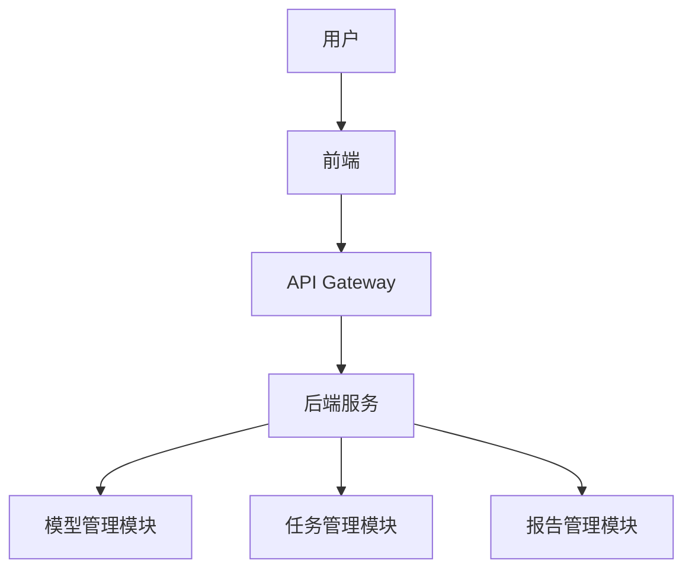

                 


# 选择合适的LLM大模型：对比与评估

> 关键词：大语言模型，LLM对比，模型评估，NLP应用，AI技术，深度学习

> 摘要：在人工智能迅速发展的今天，选择合适的大型语言模型（LLM）对于企业级应用至关重要。本文将从LLM的基本概念出发，详细分析主流模型的特点，对比不同模型的优缺点，探讨模型评估的方法，并提供实际选择策略和最佳实践。通过系统化的对比与评估，帮助读者找到最适合自身需求的LLM模型。

---

## 第1章：大语言模型（LLM）概述

### 1.1 LLM的基本概念

#### 1.1.1 什么是大语言模型
大型语言模型（Large Language Model, LLM）是基于深度学习技术构建的自然语言处理模型，旨在理解和生成人类语言。LLM通过大量真实文本数据的训练，能够执行多种NLP任务，如文本生成、问答系统、机器翻译等。

#### 1.1.2 LLM的核心特点
- **大规模参数**：LLM通常拥有数百万甚至数十亿的参数，使其能够捕捉复杂的语言模式。
- **预训练与微调**：模型通过大量通用数据预训练，再在特定任务上进行微调。
- **上下文理解**：LLM能够理解长上下文，适合复杂对话和多轮交互。

#### 1.1.3 LLM与传统NLP模型的区别
传统NLP模型通常针对特定任务训练，如SVM或CRF，而LLM是通用模型，适用于多种任务。LLM的训练数据量更大，参数更多，计算资源需求也更高。

### 1.2 LLM的发展历程

#### 1.2.1 NLP技术的演进
从规则-based系统到统计模型，再到深度学习驱动的模型，NLP技术经历了多次变革。LLM的出现标志着NLP进入了一个新纪元。

#### 1.2.2 大模型时代的到来
近年来，随着计算能力的提升和数据量的增加，大模型逐渐成为主流。2018年，OpenAI发布的GPT-2是一个重要里程碑。

#### 1.2.3 当前主流LLM模型
目前，主流模型包括GPT系列、BERT系列、PaLM等，每个模型都有其独特的优势和应用场景。

### 1.3 LLM的应用场景

#### 1.3.1 自然语言处理任务
LLM能够处理文本分类、实体识别、信息抽取等多种任务，极大地提升了NLP的效率和准确性。

#### 1.3.2 企业级应用
在客服系统、智能助手、内容生成等领域，LLM展现了巨大的潜力，帮助企业提高效率和用户体验。

#### 1.3.3 LLM的未来趋势
随着技术进步，LLM将更加智能化，应用场景也将更加广泛，如教育、医疗、法律等领域。

---

## 第2章：LLM模型对比与分类

### 2.1 主流LLM模型介绍

#### 2.1.1 GPT系列
GPT模型以生成任务见长，尤其擅长对话生成和内容创作。GPT-3是目前应用最广泛的版本之一。

#### 2.1.2 BERT系列
BERT模型专注于理解任务，如问答系统和文本摘要。其双向编码器结构使其在多个任务上表现出色。

#### 2.1.3 其他主流模型
包括PaLM、Megatron-LM等，各有其独特的架构和应用场景。

### 2.2 模型分类与对比

#### 2.2.1 模型架构对比
比较不同模型的架构特点，如自注意力机制的宽度和深度，以及是否采用层叠结构。

#### 2.2.2 参数规模对比
分析不同模型的参数数量，探讨参数规模与性能之间的关系。

#### 2.2.3 训练数据对比
比较各模型的训练数据来源和规模，了解数据对模型性能的影响。

### 2.3 模型性能评估

#### 2.3.1 评估指标
包括准确率、召回率、F1分数等，帮助全面衡量模型性能。

#### 2.3.2 评估方法
采用客观评测和主观体验相结合的方式，确保评估结果的全面性和准确性。

#### 2.3.3 模型排行榜
介绍主流模型排行榜，如Hugging Face的Model Hub，帮助读者了解当前最佳实践。

---

## 第3章：LLM评估方法与指标

### 3.1 评估指标详解

#### 3.1.1 准确率
准确率是模型输出正确答案的比例，是评估生成任务的重要指标。

#### 3.1.2 召回率
召回率衡量模型找到所有相关答案的能力，适用于问答系统。

#### 3.1.3 F1分数
F1分数是准确率和召回率的调和平均数，平衡了两者的重要性。

### 3.2 评估流程

#### 3.2.1 数据准备
选择合适的测试数据集，确保数据的多样性和代表性。

#### 3.2.2 模型选择
根据任务需求选择合适的模型，并进行必要的参数调优。

#### 3.2.3 评估执行
执行评估任务，记录并分析模型的性能表现。

### 3.3 评估工具与平台

#### 3.3.1 公开评测平台
如Hugging Face的Transformers库，提供多种模型和评测工具。

#### 3.3.2 自定义评估工具
根据具体需求开发定制化的评估工具，提高评估的针对性。

---

## 第4章：LLM选择策略与最佳实践

### 4.1 选择模型的关键因素

#### 4.1.1 任务需求
明确应用场景，选择适合任务的模型架构和参数规模。

#### 4.1.2 数据特性
考虑数据的领域和规模，选择能够最好适应数据的模型。

#### 4.1.3 计算资源
评估本地或云端的计算能力，选择参数规模适中的模型。

### 4.2 模型调优与优化

#### 4.2.1 参数调整
通过超参数调优提升模型性能，如学习率和批量大小。

#### 4.2.2 数据增强
采用数据增强技术，如同义词替换和数据扩展，提高模型的鲁棒性。

#### 4.2.3 模型压缩
通过模型剪枝和知识蒸馏等技术，减少模型体积，降低计算成本。

### 4.3 实际应用中的注意事项

#### 4.3.1 模型的泛化能力
评估模型在不同领域的适应能力，避免过拟合特定任务。

#### 4.3.2 模型的可解释性
确保模型输出可追溯和解释，特别是在需要透明度的领域，如医疗和法律。

#### 4.3.3 模型的实时性
优化模型推理速度，确保其在实时应用中的响应效率。

---

## 第5章：项目实战——构建一个LLM评估系统

### 5.1 项目介绍

#### 5.1.1 项目背景
随着LLM的广泛应用，构建一个自动化评估系统的需求日益迫切。

#### 5.1.2 项目目标
开发一个能够自动化评估多个LLM模型性能的系统，支持多任务和多指标评估。

### 5.2 系统功能设计

#### 5.2.1 功能模块
- 用户管理：权限管理，角色分配。
- 模型管理：上传、存储、配置。
- 任务管理：定义任务类型，分配模型。
- 评估执行：自动执行评估任务，生成报告。
- 报告管理：查看评估结果，生成可视化图表。

#### 5.2.2 功能流程
用户登录系统后，上传模型，配置评估任务，系统自动执行评估并生成报告。

### 5.3 系统架构设计

#### 5.3.1 系统架构图


#### 5.3.2 接口设计
- `/api/login`：用户登录接口。
- `/api/upload-model`：上传模型接口。
- `/api/run-task`：执行评估任务接口。
- `/api/retrieve-report`：获取评估报告接口。

#### 5.3.3 交互流程
用户通过前端提交任务，后端接收请求，调用模型评估模块，返回结果到前端。

### 5.4 代码实现

#### 5.4.1 环境搭建
- 安装Python 3.8及以上版本。
- 安装必要的库：Flask、TensorFlow、Hugging Face Transformers。

#### 5.4.2 核心代码
```python
from flask import Flask
from transformers import GPT2LMHeadModel, GPT2Tokenizer

app = Flask(__name__)

@app.route('/api/run-task', methods=['POST'])
def run_task():
    # 获取请求数据
    data = request.json
    model_name = data['model']
    task = data['task']
    
    # 加载模型
    model = GPT2LMHeadModel.from_pretrained(model_name)
    tokenizer = GPT2Tokenizer.from_pretrained(model_name)
    
    # 执行任务
    if task == 'text-generation':
        prompt = data['prompt']
        inputs = tokenizer.encode(prompt, return_tensors='np')
        outputs = model.generate(inputs, max_length=50)
        response = tokenizer.decode(outputs[0])
        return jsonify({'result': response})
    return jsonify({'error': 'Invalid task'})

if __name__ == '__main__':
    app.run(debug=True)
```

#### 5.4.3 案例分析
以文本生成任务为例，分析模型生成的文本质量，比较不同模型的生成效果。

### 5.5 项目小结

#### 5.5.1 项目总结
通过构建评估系统，能够自动化评估多个LLM模型，提高评估效率和准确性。

#### 5.5.2 经验总结
在实际开发中，需要充分考虑系统的扩展性和可维护性，选择合适的框架和技术栈。

#### 5.5.3 挑战与解决方案
- **挑战**：模型评估的计算资源需求大。
- **解决方案**：采用分布式计算和云资源优化。

---

## 第6章：总结与展望

### 6.1 总结
本文详细介绍了如何选择和评估LLM模型，提供了从理论到实践的全面指导。通过对比分析和实际案例，帮助读者找到最适合的应用方案。

### 6.2 未来展望
随着技术进步，LLM模型将更加智能化和多样化。未来的研究方向包括模型压缩、多模态融合和实时推理优化。

---

通过本文的系统化分析，读者能够全面了解LLM模型的选择与评估方法，为企业级应用提供有力支持。

