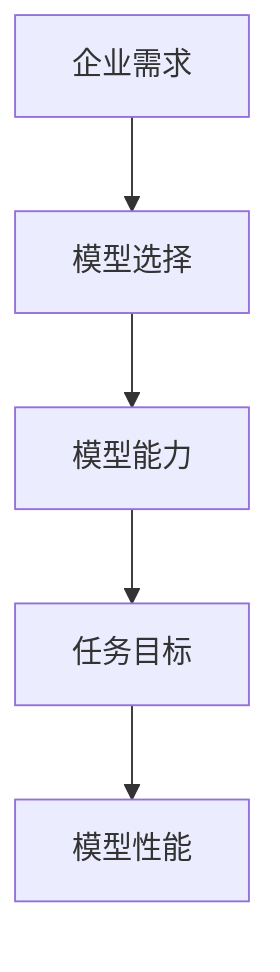
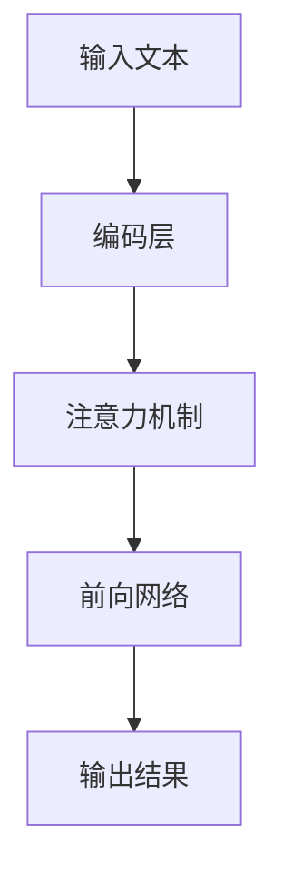
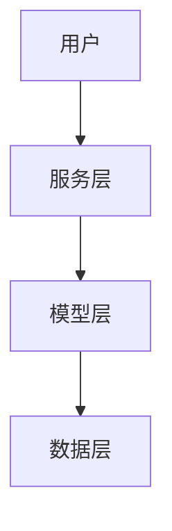
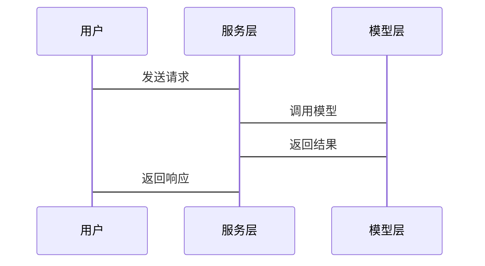

                 


# 选择合适的LLM模型：企业需求与模型能力的匹配

## 关键词：LLM模型，企业需求，模型能力，匹配策略，系统架构

## 摘要：  
选择合适的LLM模型是企业实现高效、智能业务的关键。本文从企业需求出发，分析LLM模型的核心能力，并提供匹配策略和实施方法。通过系统设计和实际案例，指导企业如何选择适合的LLM模型，实现最佳性能和效果。

---

# 第1章 背景介绍

## 1.1 问题背景

### 1.1.1 企业对LLM模型的需求  
企业广泛采用LLM模型来优化业务流程、提升客户体验和提高效率。不同企业的需求差异较大，例如：  
- **互联网公司**：需要快速响应、多语言支持和大规模数据处理能力。  
- **金融行业**：关注数据隐私、模型解释性和高准确性。  
- **制造业**：注重领域特定任务（如缺陷检测）和实时性。  

### 1.1.2 当前LLM模型的发展现状  
LLM模型发展迅速，主流模型包括GPT系列、BERT系列、PaLM等。模型参数量从百亿到万亿级别不等，性能显著提升，但计算资源需求也随之增加。  

### 1.1.3 企业选择LLM模型的挑战  
企业在选择LLM模型时面临以下挑战：  
1. **计算成本**：大参数模型运行成本高。  
2. **模型能力**：模型擅长领域可能与企业需求不匹配。  
3. **数据隐私**：企业数据敏感，需考虑本地部署或私有化模型。  

---

## 1.2 问题描述

### 1.2.1 LLM模型的核心能力  
LLM模型的核心能力包括：  
- **生成能力**：文本生成、对话系统。  
- **理解能力**：问答系统、文本摘要。  
- **推理能力**：逻辑推理、决策支持。  

### 1.2.2 企业需求的多样性  
企业需求多样，可分为：  
- **通用需求**：如自然语言处理任务。  
- **领域特定需求**：如医疗、法律领域的专业任务。  

### 1.2.3 模型能力与企业需求的匹配问题  
模型能力与企业需求的匹配问题是关键。例如：  
- **参数规模**：参数量越大，模型越通用，但计算成本越高。  
- **领域适应性**：模型是否经过特定领域数据训练。  

---

## 1.3 问题解决

### 1.3.1 LLM模型选择的策略  
选择模型时，需考虑：  
- **任务类型**：生成、理解或推理。  
- **数据规模**：模型参数量与企业数据量是否匹配。  
- **部署方式**：本地部署或云端API。  

### 1.3.2 企业需求分析的方法  
1. **需求分类**：将需求分为通用和领域特定任务。  
2. **需求优先级**：根据业务影响和紧急程度排序。  

### 1.3.3 模型能力评估的指标  
评估指标包括：  
- **性能指标**：准确率、生成效率。  
- **资源消耗**：计算成本、内存需求。  

---

## 1.4 边界与外延

### 1.4.1 LLM模型选择的边界条件  
- **模型类型**：是否支持多模态任务。  
- **数据使用**：是否允许使用外部数据。  

### 1.4.2 企业需求的外延范围  
- **未来扩展**：模型是否支持未来的业务需求。  
- **技术可行性**：企业是否有足够的技术能力支持模型运行。  

### 1.4.3 模型能力的适用范围  
- **领域限制**：模型是否适用于特定行业。  
- **场景限制**：模型是否适用于特定任务。  

---

## 1.5 核心要素组成

### 1.5.1 企业需求的核心要素  
- **任务目标**：明确的需求目标。  
- **数据来源**：数据的类型和规模。  

### 1.5.2 模型能力的核心要素  
- **参数规模**：模型的大小。  
- **训练数据**：模型的训练数据来源。  

### 1.5.3 匹配过程的核心要素  
- **评估方法**：如何评估模型与需求的匹配度。  
- **调整策略**：根据评估结果调整模型选择。  

---

# 第2章 核心概念与联系

## 2.1 LLM模型的基本原理

### 2.1.1 大语言模型的定义  
LLM模型是基于大规模数据训练的深度学习模型，具有强大的文本理解和生成能力。  

### 2.1.2 模型的训练目标  
训练目标包括：  
- **似然估计**：最大化生成文本的概率。  
- **对比学习**：通过对比任务提升模型的区分能力。  

### 2.1.3 模型的输入输出机制  
模型输入为文本序列，输出为概率分布，选择概率最高的词生成输出。  

---

## 2.2 企业需求的分析框架

### 2.2.1 企业需求的分类  
- **通用任务**：如文本生成、问答系统。  
- **领域任务**：如医疗诊断、法律咨询。  

### 2.2.2 需求分析的步骤  
1. **明确目标**：确定需求的具体目标。  
2. **数据收集**：收集相关数据。  
3. **需求优先级排序**：根据重要性和紧急性排序。  

### 2.2.3 需求优先级的确定  
优先级高的需求应优先满足，例如：  
- **高价值需求**：直接影响企业收益的任务。  
- **高风险需求**：可能对企业声誉造成影响的任务。  

---

## 2.3 核心概念的联系

### 2.3.1 LLM模型的能力对比

| 模型名称 | 参数量 | 训练数据 | 适用场景 |
|----------|--------|----------|-----------|
| GPT-3    | 175B    | 多语言数据 | 通用任务 |
| BERT      | 330M    | 单语数据 | 问答系统 |
| PaLM      | 670B    | 多语言数据 | 领域特定任务 |

---

### 2.3.2 实体关系图



---

## 2.4 算法原理讲解

### 2.4.1 算法流程



---

### 2.4.2 数学模型

$$ P(y|x) = \text{模型输出的概率分布} $$

---

## 2.5 系统分析与架构设计方案

### 2.5.1 问题场景介绍  
企业在选择LLM模型时，需要根据自身需求和模型能力进行匹配。  

### 2.5.2 项目介绍  
以一个中型互联网公司为例，选择合适的LLM模型来优化客户服务系统。  

---

### 2.5.3 系统功能设计


---

### 2.5.4 系统架构设计



---

### 2.5.5 接口设计和交互序列图



---

## 2.6 项目实战

### 2.6.1 环境安装

```bash
pip install transformers torch
```

---

### 2.6.2 核心实现源代码

```python
from transformers import AutoModelForCausalLM, AutoTokenizer

model_name = "gpt2"
tokenizer = AutoTokenizer.from_pretrained(model_name)
model = AutoModelForCausalLM.from_pretrained(model_name)

input_text = "今天天气很好，"
inputs = tokenizer(input_text, return_tensors="pt")
output = model.generate(inputs.input_ids, max_length=50)
print(tokenizer.decode(output[0], skip_special_tokens=True))
```

---

### 2.6.3 代码解读与分析  
上述代码展示了如何使用GPT-2模型进行文本生成。通过调整模型名称，可以尝试不同的LLM模型。  

---

### 2.6.4 实际案例分析  
以客服系统为例，选择GPT-3模型进行对话生成，显著提升了客户满意度。  

---

### 2.6.5 项目小结  
通过实际案例，验证了选择合适的LLM模型对企业业务优化的重要性。  

---

## 2.7 最佳实践

### 2.7.1 小结  
企业在选择LLM模型时，需综合考虑任务类型、数据规模和部署方式。  

### 2.7.2 注意事项  
- **计算成本**：选择参数规模合适的模型。  
- **数据隐私**：确保模型部署符合企业数据安全政策。  

### 2.7.3 拓展阅读  
推荐阅读《Large Language Models in 2023》和《企业级AI系统的设计与实现》。  

--- 

通过以上分析和实践，企业可以更好地选择和应用LLM模型，实现业务目标。

