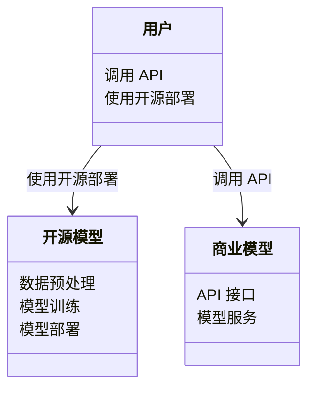
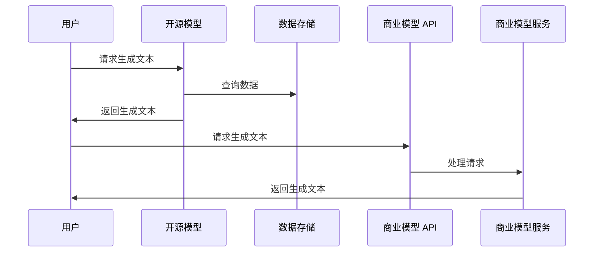

                 


# 选择合适的LLM：开源 vs 商业模型的对比

## 关键词：大语言模型（LLM）、开源模型、商业模型、技术对比、应用选择

## 摘要：  
在人工智能领域，大语言模型（LLM）的应用日益广泛，选择合适的模型对于企业或个人来说至关重要。本文通过对比开源模型和商业模型的特点、技术原理、成本效益、维护难度等多方面，帮助企业技术决策者和开发者更清晰地理解两者的优劣势，从而做出明智的选择。文章还结合实际案例，深入分析了不同场景下的模型适用性，并提出了选择模型的最佳实践和未来发展趋势。

---

## 第一部分：背景介绍

### 第1章：LLM 的发展与现状

#### 1.1 大语言模型（LLM）的定义与核心概念

- **1.1.1 什么是大语言模型？**  
  大语言模型（Large Language Model, LLM）是指基于大量数据训练的深度学习模型，能够理解和生成人类语言。LLM 的核心目标是通过理解和生成文本，实现自然语言处理（NLP）任务，例如文本生成、问答系统、机器翻译等。

- **1.1.2 LLM 的核心特征**  
  - **大规模数据训练**：通常使用数十亿级别的数据进行训练。  
  - **深度神经网络结构**：多层神经网络结构，如 Transformer 架构。  
  - **上下文理解能力**：能够理解文本的上下文关系，生成连贯的回答。  
  - **可扩展性**：支持多种任务和场景的定制化应用。

- **1.1.3 LLM 的应用场景与边界**  
  - **应用场景**：文本生成、问答系统、对话机器人、内容审核、机器翻译等。  
  - **边界**：目前的模型在复杂推理、多语言支持、实时更新等方面仍存在局限性。

#### 1.2 开源与商业模型的背景

- **1.2.1 开源模型的兴起**  
  开源模型的发展得益于开源社区的协作和技术创新。例如，开源模型如 GPT-开源版本、Meta 的 LLaMA 等，为开发者提供了免费使用和改进的可能。

- **1.2.2 商业模型的市场地位**  
  商业模型通常由科技巨头（如 OpenAI、Anthropic）提供，经过大量优化和训练，性能更稳定，但需要付费使用。

- **1.2.3 两种模式的对比与共性**  
  - 开源模型灵活，可以根据需求进行定制化。  
  - 商业模型性能稳定，但灵活性较低。  
  - 两者的目标都是为用户提供高效、可靠的自然语言处理能力。

---

## 第二部分：核心概念与联系

### 第2章：开源与商业模型的核心原理

#### 2.1 开源模型的技术特点

- **2.1.1 开源模型的训练流程**  
  开源模型通常基于开源的训练框架（如 Hugging Face 的 Transformers 库）构建。以下是训练流程的简要步骤：  
  1. 数据预处理：清洗、格式化数据。  
  2. 模型选择：选择开源模型架构（如 GPT、BERT）。  
  3. 训练：使用 GPU 集群进行训练，优化超参数。  
  4. 调优：通过微调（Fine-tuning）提升模型在特定任务上的表现。

- **2.1.2 开源模型的可扩展性**  
  开源模型可以根据需求进行扩展，例如：  
  - 增加模型层数或参数量。  
  - 支持多语言或多任务训练。  

- **2.1.3 开源模型的社区支持**  
  开源模型通常有活跃的社区支持，用户可以提交问题、修复 bug 并贡献代码。

#### 2.2 商业模型的技术特点

- **2.2.1 商业模型的训练流程**  
  商业模型通常由专业团队进行训练，采用更高效的数据清洗、训练策略和优化算法。例如，OpenAI 的 GPT 系列模型采用了大量的高质量数据和先进的训练技术。

- **2.2.2 商业模型的服务模式**  
  商业模型通常以 API 的形式提供服务，用户无需自行训练，直接调用 API 即可使用。例如，OpenAI 提供的 API 服务。

- **2.2.3 商业模型的性能优化**  
  商业模型经过大量优化，性能表现更稳定，但通常不支持用户进行定制化训练。

#### 2.3 对比分析

| **对比维度**       | **开源模型**                         | **商业模型**                         |
|--------------------|--------------------------------------|--------------------------------------|
| **训练数据**       | 数据来源广泛，可能包含公开数据集。  | 数据来源未知，通常经过严格筛选。   |
| **训练成本**       | 训练成本较高，需要自行搭建集群。     | 训练成本由厂商承担，用户仅需支付 API 费用。 |
| **灵活性**          | 高，支持定制化训练和部署。           | 低，通常不支持定制化，仅提供 API 服务。 |
| **维护成本**        | 高，需要自行维护模型和服务器。       | 低，厂商负责模型维护和更新。          |
| **性能稳定性**      | 取决于训练数据质量和优化程度。       | 性能更稳定，经过专业团队优化。       |
| **更新频率**        | 取决于社区贡献，可能较慢。           | 厂商定期更新，更新频率较高。          |

---

## 第三部分：技术原理与实现

### 第3章：LLM 的训练与推理原理

#### 3.1 大语言模型的训练流程

- **数据预处理**  
  数据预处理是训练模型的关键步骤，包括：  
  1. 数据清洗：去除噪声数据（如 HTML 标签、特殊字符）。  
  2. 数据格式化：将数据转换为模型可接受的格式（如 JSON、文本对齐）。  
  3. 数据分割：将数据划分为训练集、验证集和测试集。

- **模型选择**  
  根据任务需求选择合适的模型架构。例如：  
  - 对于生成任务，选择 GPT 系列模型。  
  - 对于理解任务，选择 BERT 系列模型。  

- **训练过程**  
  使用深度学习框架（如 TensorFlow、PyTorch）进行训练，优化目标函数（如交叉熵损失）。

#### 3.2 大语言模型的推理机制

- **解码策略**  
  模型在生成文本时，通常采用贪心解码或采样解码。  
  - **贪心解码**：逐词生成最可能的词，适合确定性任务。  
  - **采样解码**：随机采样生成多个可能的词，适合需要创意的任务。

- **模型调参**  
  根据具体任务调整模型的超参数，例如温度（Temperature）和重复率（Top-p）。  

- **性能评估**  
  使用 BLEU、ROUGE 等指标评估生成文本的质量。

---

## 第四部分：系统分析与架构设计

### 第4章：LLM 选择的系统架构

#### 4.1 问题场景介绍

- **企业级应用的挑战**  
  企业可能需要在内部部署模型，但受限于计算资源和维护能力。

- **选择模型的决策流程**  
  企业需要综合考虑性能、成本、维护难度等因素。

#### 4.2 系统功能设计

- **领域模型设计（Mermaid 类图）**



- **系统架构设计（Mermaid 架构图）**

```mermaid
archiecture
    前端应用 --> API 网关
    API 网关 --> 商业模型服务
    商业模型服务 --> 数据存储
    用户 --> 开源模型部署
    开源模型部署 --> 数据存储
```

- **系统接口设计**  
  - 开源模型：RESTful API 接口。  
  - 商业模型：通过厂商提供的 SDK 或 HTTP 接口。

- **系统交互设计（Mermaid 序列图）**



---

## 第五部分：项目实战与案例分析

### 第5章：开源与商业模型的对比实战

#### 5.1 环境安装与配置

- **开源模型的安装**  
  使用 Hugging Face 的 Transformers 库安装开源模型：  
  ```bash
  pip install transformers
  ```

- **商业模型的使用**  
  使用 OpenAI 的 API：  
  ```bash
  pip install openai
  ```

#### 5.2 核心代码实现

- **开源模型的调用代码**

```python
from transformers import GPT2LMHeadModel, GPT2Tokenizer

# 加载预训练模型
model = GPT2LMHeadModel.from_pretrained('gpt2')
tokenizer = GPT2Tokenizer.from_pretrained('gpt2')

# 生成文本
input_text = "今天天气很好，"
inputs = tokenizer(input_text, return_tensors='np')
outputs = model.generate(
    inputs.input_ids,
    max_length=50,
    do_sample=True,
    temperature=1.0
)

print("生成结果：")
print(tokenizer.decode(outputs[0], skip_special_tokens=True))
```

- **商业模型的调用代码**

```python
import openai

# 初始化 API 客户端
client = openai.Client('your-api-key')

# 生成文本
response = client.chat.completions.create(
    model="gpt-3.5-turbo",
    messages=[{
        "role": "user",
        "content": "今天天气很好，"
    }]
)

print("生成结果：")
print(response.choices[0].message.content)
```

#### 5.3 案例分析

- **实际应用场景对比**  
  - 开源模型适合需要定制化部署的场景，例如内部应用。  
  - 商业模型适合需要快速上线的场景，例如 SaaS 服务。

- **案例总结与经验分享**  
  - 开源模型灵活性高，但需要较高的技术门槛。  
  - 商业模型使用方便，但成本较高。

---

## 第六部分：最佳实践与未来展望

### 第6章：选择合适的 LLM 的最佳实践

#### 6.1 选择模型的关键因素

- **性能需求**  
  - 如果需要高精度生成，选择商业模型。  
  - 如果对生成效果要求不高，可以选择开源模型。  

- **成本预算**  
  - 开源模型适合预算有限的企业。  
  - 商业模型适合预算充足的企业。  

- **维护能力**  
  - 如果有技术团队支持，选择开源模型。  
  - 如果没有技术团队，选择商业模型。

#### 6.2 开源与商业模型的优劣势总结

- **开源模型的优劣势**  
  - 优势：灵活性高、成本低、可定制化。  
  - 劣势：维护成本高、性能不稳定。  

- **商业模型的优劣势**  
  - 优势：性能稳定、使用方便、技术支持。  
  - 劣势：成本高、灵活性低。

### 第7章：未来趋势与挑战

#### 7.1 LLM 技术的未来发展方向

- **模型小型化**  
  开发更小的模型，降低计算成本和部署门槛。  

- **模型专业化**  
  针对特定领域优化模型，例如医疗、法律等。  

- **模型的可解释性**  
  提升模型的可解释性，满足监管要求。

#### 7.2 开源与商业模型的融合趋势

- **开源生态的商业化**  
  开源社区逐渐商业化，提供付费支持和服务。  

- **商业模型的开源化**  
  一些商业模型开始开源，吸引社区参与优化。

---

## 第七部分：小结与注意事项

### 第8章：总结与注意事项

#### 8.1 全文总结

- 开源模型和商业模型各有优劣，选择取决于具体需求、预算和能力。  
- 开源模型适合灵活定制化的需求，商业模型适合快速部署和稳定性能的需求。

#### 8.2 注意事项

- **模型选择中的常见误区**  
  - 过分追求模型的规模，忽视实际需求。  
  - 忽略模型的维护成本。  

- **模型使用中的法律与伦理问题**  
  - 确保数据的合法性和隐私性。  
  - 避免生成有害或不道德的内容。

#### 8.3 拓展阅读

- **推荐书籍与论文**  
  - 《Deep Learning》（Ian Goodfellow）  
  - "Attention Is All You Need"（Vaswani 等人）  

- **相关技术社区与资源**  
  - Hugging Face 社区（https://huggingface.co/）  
  - OpenAI 官方文档（https://platform.openai.com/docs/）  

---

通过本文的分析和对比，读者可以更清晰地理解开源与商业模型的优劣势，并在实际应用中做出合适的选择。无论是技术专家还是企业决策者，都可以从本文中获得 valuable insights。

