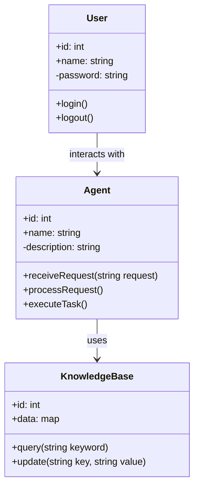
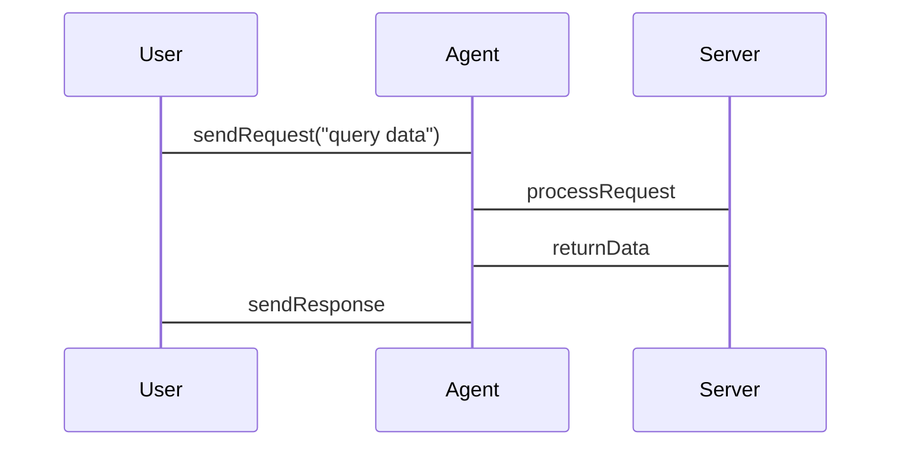

                 


# 选择适合企业的AI Agent平台

> 关键词：AI Agent，企业智能化，技术选型，系统架构，项目实战

> 摘要：随着人工智能技术的快速发展，AI Agent（智能代理）逐渐成为企业智能化转型的重要工具。本文将从AI Agent的基本概念、核心原理、技术选型、系统架构设计、项目实战以及最佳实践等多个方面进行深入分析，帮助企业技术决策者更好地选择和部署适合的AI Agent平台，实现企业智能化目标。

---

# 正文

## 第一部分: AI Agent平台背景与核心概念

### 第1章: AI Agent平台的基本概念

#### 1.1 AI Agent的基本定义

##### 1.1.1 AI Agent的定义与特点

AI Agent（人工智能代理）是指能够感知环境、自主决策并执行任务的智能系统。它能够通过自然语言处理、机器学习等技术，与用户进行交互，并根据需求完成特定任务。AI Agent的核心特点包括：

- **自主性**：能够在没有人工干预的情况下自主运行。
- **反应性**：能够实时感知环境并做出反应。
- **目标导向**：具有明确的目标，能够主动追求目标。
- **可扩展性**：能够根据需求扩展功能和能力。

##### 1.1.2 AI Agent与传统软件的区别

传统软件通常是基于规则的系统，按照预设的逻辑执行任务。而AI Agent则具有以下显著区别：

- **智能性**：AI Agent能够理解上下文并进行推理，而传统软件仅基于规则执行。
- **适应性**：AI Agent能够自适应环境变化，而传统软件需要人工调整。
- **主动性**：AI Agent能够主动发起任务，而传统软件仅响应输入。

##### 1.1.3 企业级AI Agent的应用场景

在企业环境中，AI Agent可以应用于多个场景，例如：

- **客户支持**：通过对话系统为客户提供实时支持。
- **任务自动化**：自动处理重复性任务，提高效率。
- **决策支持**：基于数据分析提供决策建议。
- **智能监控**：实时监控系统状态并自动响应异常。

#### 1.2 企业AI Agent平台的背景与现状

##### 1.2.1 企业智能化转型的需求

随着市场竞争的加剧，企业需要通过智能化手段提升效率、降低成本。AI Agent作为智能化转型的重要工具，为企业提供了新的可能性。

##### 1.2.2 当前AI Agent技术的发展趋势

AI Agent技术正朝着多模态、可解释性、人机协作等方向发展。例如，结合视觉、听觉等多模态输入，提高系统的理解能力；通过可解释性技术增强用户信任。

##### 1.2.3 企业AI Agent平台的市场现状

当前市场上有多种AI Agent平台，例如基于开源框架构建的定制化平台，以及提供SaaS服务的商业化平台。企业可以根据自身需求选择适合的平台。

### 第2章: AI Agent平台的核心概念与联系

#### 2.1 AI Agent的核心原理

##### 2.1.1 AI Agent的基本原理

AI Agent的核心原理包括感知、决策、执行和反馈四个阶段。感知阶段通过传感器或API获取环境信息；决策阶段基于感知信息进行推理和选择；执行阶段通过执行器完成任务；反馈阶段根据结果调整后续行为。

##### 2.1.2 AI Agent的感知与决策机制

感知机制通过多种方式获取信息，例如自然语言处理、计算机视觉等。决策机制基于感知信息和知识库进行推理，选择最优行动方案。

##### 2.1.3 AI Agent的执行与反馈机制

执行机制通过调用外部服务或内部系统完成任务。反馈机制根据执行结果更新知识库或调整策略。

#### 2.2 AI Agent的体系结构

##### 2.2.1 分层架构

分层架构将系统分为感知层、决策层和执行层，每层负责特定功能。这种架构适合复杂任务，但可能增加通信开销。

##### 2.2.2 组件化架构

组件化架构将系统分解为多个功能模块，例如自然语言处理模块、推理模块等。这种架构具有良好的可扩展性和灵活性。

##### 2.2.3 微服务架构

微服务架构将系统功能分解为多个独立的服务，通过API进行通信。这种架构适合分布式部署和扩展。

#### 2.3 AI Agent的工作流程

##### 2.3.1 感知阶段

通过自然语言处理、计算机视觉等技术获取用户需求或环境信息。

##### 2.3.2 决策阶段

基于感知信息和知识库进行推理，生成最优行动方案。

##### 2.3.3 执行阶段

通过调用外部服务或内部系统完成任务。

##### 2.3.4 反馈与优化阶段

根据执行结果更新知识库或调整策略，以提高后续任务的效率。

#### 2.4 AI Agent与传统AI的区别

##### 2.4.1 从任务执行到主动决策

传统AI系统通常是被动执行任务，而AI Agent能够主动发起任务。

##### 2.4.2 从单点智能到分布式协作

传统AI系统通常独立运行，而AI Agent能够与其他系统协作完成复杂任务。

##### 2.4.3 从静态系统到动态自适应

AI Agent能够根据环境变化动态调整策略，而传统AI系统通常需要人工干预。

#### 2.5 AI Agent的核心功能与特性

##### 2.5.1 自然语言处理能力

支持多种语言的自然语言理解与生成，能够与用户进行流畅对话。

##### 2.5.2 多轮对话能力

能够维护上下文，进行多轮对话，提供连续的服务。

##### 2.5.3 任务分解与执行能力

能够将复杂任务分解为多个子任务，并协调资源完成。

##### 2.5.4 知识库与推理能力

基于知识库进行推理，提供准确的信息和建议。

##### 2.5.5 自适应与学习能力

能够根据反馈优化自身行为，适应环境变化。

### 第3章: 企业AI Agent平台的技术选型

#### 3.1 AI Agent平台的技术架构分析

##### 3.1.1 生成式AI模型的选择

生成式AI模型（如GPT）能够生成自然语言文本，适合需要内容生成的任务。

##### 3.1.2 知识库的构建与管理

知识库是AI Agent的核心，需要构建结构化的知识库，并支持高效查询。

##### 3.1.3 混合架构的设计与优化

混合架构结合生成式模型和知识库，能够在需要时生成内容，同时利用知识库提供准确信息。

#### 3.2 AI Agent平台的核心技术对比

##### 3.2.1 生成式模型的选择

选择生成式模型时需要考虑生成的准确性和效率，以及模型的可定制性。

##### 3.2.2 知识库与检索技术

知识库的构建需要考虑数据的结构化和语义化，检索技术需要高效准确。

##### 3.2.3 多模态能力

多模态能力能够提升系统的理解能力，例如结合视觉和听觉信息。

##### 3.2.4 自然语言理解与生成技术

需要选择适合任务的NLP技术，例如分词、实体识别、情感分析等。

#### 3.3 AI Agent平台的性能指标与评估

##### 3.3.1 响应速度与延迟

需要评估系统的响应时间，确保用户体验。

##### 3.3.2 处理能力与吞吐量

评估系统在高并发情况下的处理能力。

##### 3.3.3 精准度与准确率

评估系统在任务执行中的准确性和可靠性。

##### 3.3.4 可扩展性与可维护性

评估系统的架构是否支持扩展和维护。

#### 3.4 AI Agent平台的可定制性与灵活性

##### 3.4.1 系统架构的可扩展性

系统架构是否支持功能的扩展和升级。

##### 3.4.2 功能模块的可定制性

功能模块是否可以根据企业需求进行定制。

##### 3.4.3 接口与API的设计

系统接口是否开放，是否支持与其他系统的集成。

---

## 第二部分: 企业AI Agent平台的技术实现

### 第4章: AI Agent平台的系统架构设计

#### 4.1 系统功能设计

##### 4.1.1 领域模型设计

通过类图展示系统的功能模块和它们之间的关系。



##### 4.1.2 系统架构设计

通过架构图展示系统的整体结构。

```mermaid
client
    .- Server
    |   .- Database
    |   |   .- KnowledgeBase
    |   .- AIModel
    |   .- NLPProcessor
```

##### 4.1.3 系统接口设计

定义系统的API接口，例如：

- `/api/login`：用户登录接口
- `/api/sendRequest`：发送请求接口
- `/api/receiveResponse`：接收响应接口

##### 4.1.4 系统交互设计

通过序列图展示系统的交互流程。



### 第5章: AI Agent平台的项目实战

#### 5.1 环境安装与配置

##### 5.1.1 安装依赖

安装所需的Python库，例如：

```bash
pip install numpy
pip install transformers
pip install requests
```

##### 5.1.2 配置开发环境

配置IDE的环境变量，例如Python路径。

#### 5.2 系统核心实现

##### 5.2.1 自然语言处理模块

实现自然语言理解与生成的功能，例如：

```python
from transformers import pipeline

nlp = pipeline("text-generation", model="gpt2")
response = nlp("Hello, how are you?")
print(response[0]['generated_text'])
```

##### 5.2.2 知识库管理模块

实现知识库的查询与更新功能，例如：

```python
class KnowledgeBase:
    def __init__(self, db_path):
        self.db = sqlite3.connect(db_path)
    
    def query(self, keyword):
        cursor = self.db.cursor()
        cursor.execute("SELECT * FROM data WHERE keyword=?", (keyword,))
        return cursor.fetchall()
    
    def update(self, keyword, value):
        cursor = self.db.cursor()
        cursor.execute("UPDATE data SET value=? WHERE keyword=?", (value, keyword))
        self.db.commit()
```

##### 5.2.3 任务分解与执行模块

实现任务分解与执行的功能，例如：

```python
def decompose_task(task):
    # 分解任务为子任务
    sub_tasks = task.split(" ")
    # 执行子任务
    for task in sub_tasks:
        execute(task)
```

##### 5.2.4 系统集成与测试

集成各模块，进行功能测试和性能测试。

### 第6章: 企业AI Agent平台的最佳实践

#### 6.1 小结与总结

总结企业在选择和部署AI Agent平台时的关键点，例如技术选型、系统架构设计等。

#### 6.2 注意事项与风险提示

提醒企业在实施过程中需要注意的风险，例如数据安全、系统稳定性等。

#### 6.3 未来趋势与拓展阅读

展望AI Agent技术的未来发展趋势，推荐相关的技术书籍和资源。

---

## 结语

选择适合企业的AI Agent平台是一个复杂但重要的任务。通过本文的分析，希望能够为企业技术决策者提供清晰的思路和实用的指导，帮助企业顺利完成智能化转型。

---

**关键词**：AI Agent，企业智能化，技术选型，系统架构，项目实战

**摘要**：本文从AI Agent的基本概念出发，分析了企业选择AI Agent平台的核心问题，探讨了技术选型、系统架构设计和项目实战等关键环节，为企业提供了选择和部署适合的AI Agent平台的指导。

