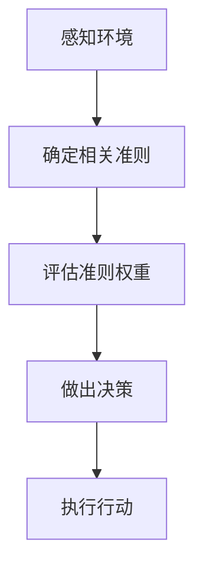
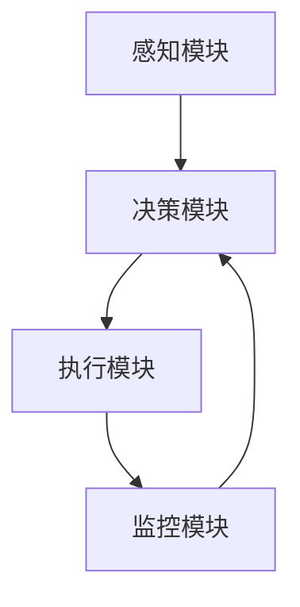
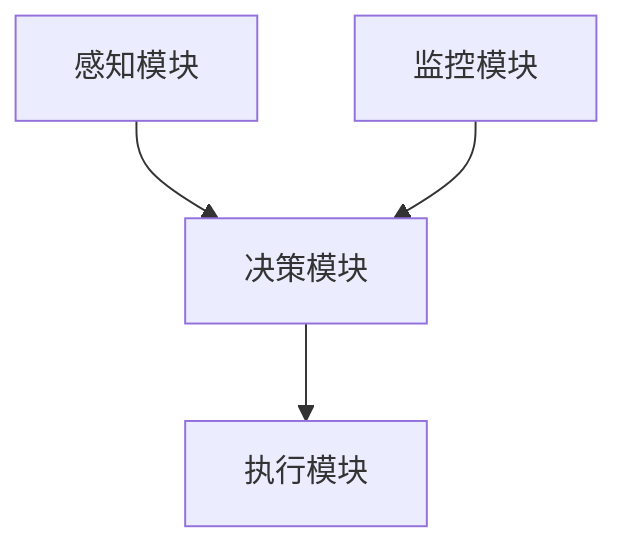
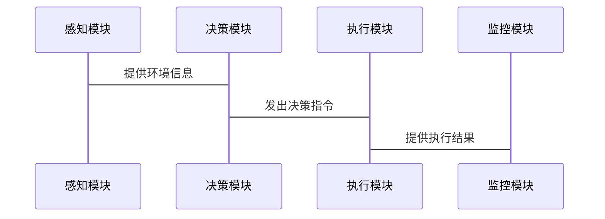

                 


# 道德决策：在AI Agent中实现伦理准则

**关键词**：AI Agent、道德决策、伦理准则、Q-learning、系统架构、项目实战

**摘要**：本文旨在探讨如何在AI Agent中实现伦理准则，从而使其能够进行道德决策。文章从AI Agent的基本概念出发，介绍伦理准则的理论基础，详细讲解基于Q-learning的伦理决策算法，设计系统架构，并通过项目实战展示如何将理论应用于实际。最后，总结全文并展望未来发展方向。

---

# 第一部分: AI Agent与道德决策的背景

## 第1章: AI Agent与道德决策的背景

### 1.1 AI Agent的基本概念

#### 1.1.1 AI Agent的定义
AI Agent（人工智能代理）是指能够感知环境、自主决策并采取行动以实现目标的智能实体。AI Agent可以是软件程序、机器人或其他智能系统。

#### 1.1.2 AI Agent的分类
AI Agent可以根据智能水平分为：
1. **反应式AI Agent**：基于当前感知做出反应，不依赖历史信息。
2. **认知式AI Agent**：具备复杂推理和规划能力，能够处理长期目标。

#### 1.1.3 AI Agent的发展历程
AI Agent的概念起源于20世纪60年代的知识表示与推理研究，随着机器学习和深度学习的发展，AI Agent在近年来取得了显著进步。

---

### 1.2 道德决策的定义与重要性

#### 1.2.1 道德决策的核心概念
道德决策是指在存在伦理冲突的情况下，AI Agent选择最优行动的过程。它涉及对不同利益的权衡。

#### 1.2.2 道德决策在AI Agent中的作用
AI Agent在医疗、自动驾驶等领域需要做出涉及人类生命和利益的决策，因此必须具备道德决策能力。

#### 1.2.3 道德决策的边界与外延
道德决策的边界在于其应用范围和决策权限。外延则包括法律、伦理和社会规范等多个方面。

---

### 1.3 AI Agent与道德决策的关联

#### 1.3.1 AI Agent决策的基本原理
AI Agent通过感知环境、分析可能的行动及其结果，选择最优行动以实现目标。

#### 1.3.2 道德决策对AI Agent的影响
道德决策能力的加入，使得AI Agent能够在复杂场景中做出符合伦理的选择。

#### 1.3.3 道德决策的实现挑战
主要挑战包括伦理准则的建模、多目标优化和动态环境适应等问题。

---

## 1.4 本章小结
本章介绍了AI Agent的基本概念及其与道德决策的关系，强调了道德决策在AI Agent中的重要性。

---

# 第二部分: 伦理准则的理论基础

## 第2章: 伦理准则的核心概念

### 2.1 伦理学的基本原理

#### 2.1.1 伦理学的定义与分类
伦理学是研究道德原则和行为准则的学科，主要分为元伦理学、规范伦理学和应用伦理学。

#### 2.1.2 主要伦理学流派简介
1. **功利主义**：以最大化整体幸福为原则。
2. **义务论**：基于道德义务和责任做出决策。
3. **美德伦理学**：强调个人品德的重要性。

#### 2.1.3 伦理准则的属性特征对比表
| 属性 | 功利主义 | 义务论 | 美德伦理学 |
|------|----------|--------|------------|
| 核心原则 | 最大化幸福 | 遵守义务 | 培养美德 |

---

### 2.2 伦理准则的建模与表达

#### 2.2.1 伦理准则的数学模型
伦理准则可以用一个向量表示，其中每个元素对应一个准则的权重：
$$ w = [w_1, w_2, ..., w_n] $$

#### 2.2.2 伦理准则的ER实体关系图
```mermaid
erDiagram
    A[伦理准则] {
        指导原则
        适用场景
        权重
    }
    B[决策] {
        行动
        结果
        目标
    }
    A --> B
```

#### 2.2.3 伦理准则的Mermaid流程图


---

### 2.3 伦理准则的优先级与权衡

#### 2.3.1 伦理准则的优先级排序
优先级排序可以通过层次分析法（AHP）实现。

#### 2.3.2 不同准则间的冲突与权衡
例如，在自动驾驶中，保护乘客与保护行人之间的权衡。

#### 2.3.3 权衡算法的实现思路
1. 确定冲突准则。
2. 计算各准则的权重。
3. 根据权重进行权衡，选择最优行动。

---

## 2.4 本章小结
本章介绍了伦理准则的理论基础，包括伦理学流派、建模方法和权衡策略。

---

# 第三部分: 道德决策的算法原理

## 第3章: 道德决策算法的核心原理

### 3.1 基于伦理准则的决策模型

#### 3.1.1 决策模型的构建过程
1. 收集环境信息。
2. 分析可能的行动。
3. 评估行动的伦理影响。
4. 选择最优行动。

#### 3.1.2 决策模型的数学表达
$$ f(a) = \sum_{i=1}^{n} w_i \cdot e_i(a) $$
其中，$a$是行动，$w_i$是准则$i$的权重，$e_i(a)$是准则$i$的评估值。

---

### 3.2 基于Q-learning的伦理决策算法

#### 3.2.1 Q-learning算法的基本原理
Q-learning是一种强化学习算法，通过学习状态-动作值函数来优化决策。

#### 3.2.2 伦理准则对Q-learning的扩展
在传统的Q-learning中加入伦理准则的权重：
$$ Q(s,a) = r(s,a) + \gamma \max_{a'} Q(s',a') + \sum_{i=1}^{n} \lambda_i \cdot w_i $$

#### 3.2.3 伦理决策的数学公式
$$ Q(s,a) = r(s,a) + \gamma \max_{a'} Q(s',a') + \sum_{i=1}^{n} \lambda_i \cdot w_i $$

---

### 3.3 基于伦理准则的多目标优化算法

#### 3.3.1 多目标优化的基本原理
多目标优化旨在在多个目标之间找到平衡点。

#### 3.3.2 伦理准则对目标函数的影响
例如，自动驾驶中的目标函数可能包括：
$$ f(a) = \text{安全} + \text{效率} + \text{舒适度} $$

#### 3.3.3 多目标优化的实现流程
1. 确定目标。
2. 建立目标函数。
3. 优化目标函数。

---

## 3.4 本章小结
本章介绍了基于伦理准则的决策模型和Q-learning算法的扩展，以及多目标优化方法。

---

# 第四部分: 道德决策系统的架构设计

## 第4章: 道德决策系统的架构与功能

### 4.1 系统整体架构设计

#### 4.1.1 系统模块划分
1. 感知模块。
2. 决策模块。
3. 执行模块。
4. 监控模块。

#### 4.1.2 系统架构的Mermaid图


---

### 4.2 系统功能设计

#### 4.2.1 问题场景介绍
以自动驾驶为例，AI Agent需要在紧急情况下做出道德决策。

#### 4.2.2 系统功能设计
1. 感知环境。
2. 分析可能的行动。
3. 评估行动的伦理影响。
4. 选择最优行动。
5. 执行行动。

---

### 4.3 系统架构设计

#### 4.3.1 系统架构的Mermaid图


---

### 4.4 系统接口设计

#### 4.4.1 系统接口的定义
1. 感知模块接口。
2. 决策模块接口。
3. 执行模块接口。
4. 监控模块接口。

---

### 4.5 系统交互设计

#### 4.5.1 系统交互的Mermaid序列图


---

## 4.6 本章小结
本章设计了道德决策系统的整体架构，明确了各模块的功能和交互流程。

---

# 第五部分: 项目实战

## 第5章: 项目实战：自动驾驶中的道德决策

### 5.1 环境安装

#### 5.1.1 安装Python
```bash
sudo apt-get install python3 python3-dev
```

#### 5.1.2 安装依赖库
```bash
pip install numpy scikit-learn
```

---

### 5.2 系统核心实现

#### 5.2.1 伦理准则的权重设置
```python
ethics_weights = [0.3, 0.4, 0.3]
```

#### 5.2.2 Q-learning算法实现
```python
def update_q(s, a, r, s_prime):
    global Q
    Q[s][a] = Q[s][a] * gamma + r + lambda * sum(ethics_weights[i] * e_i(a))
```

---

### 5.3 代码应用解读与分析

#### 5.3.1 代码的整体结构
1. 定义状态、动作和奖励函数。
2. 初始化Q表。
3. 进行迭代更新。

#### 5.3.2 代码的实现细节
```python
import numpy as np

gamma = 0.9
lambda = 0.1

Q = np.zeros((num_states, num_actions))
```

---

### 5.4 案例分析

#### 5.4.1 案例场景
自动驾驶遇到紧急情况，需要在保护乘客和保护行人之间做出选择。

#### 5.4.2 案例分析与结果
通过Q-learning算法，系统选择最优行动，实现道德决策。

---

## 5.5 本章小结
本章通过自动驾驶案例，展示了如何将伦理准则应用于实际项目中。

---

# 第六部分: 总结与展望

## 第6章: 总结与展望

### 6.1 全文总结
本文系统地介绍了AI Agent中道德决策的实现方法，包括伦理准则的建模、算法设计和系统架构。

---

### 6.2 未来展望

#### 6.2.1 研究方向
1. 更复杂的多目标优化算法。
2. 动态伦理准则的适应性研究。

#### 6.2.2 应用前景
随着AI技术的发展，道德决策将在更多领域得到应用。

---

## 6.3 最佳实践 tips

1. 在实际应用中，需根据具体场景调整伦理准则的权重。
2. 确保算法的透明性和可解释性。
3. 定期更新和优化伦理准则。

---

## 6.4 小结
本文为AI Agent的道德决策提供了理论和实践指导，未来将在此基础上进一步优化。

---

# 第七部分: 附录

## 7.1 参考文献

1. Russell, S., & Norvig, P. (2010). Artificial Intelligence: A Modern Approach.
2. [插入其他参考文献]

---

## 7.2 相关代码

```python
import numpy as np

gamma = 0.9
lambda = 0.1

Q = np.zeros((num_states, num_actions))

def update_q(s, a, r, s_prime):
    global Q
    Q[s][a] = Q[s][a] * gamma + r + lambda * sum(ethics_weights[i] * e_i(a))
```

---

通过以上结构，您可以逐步填充内容，完成一篇完整的关于AI Agent中道德决策实现的文章。

