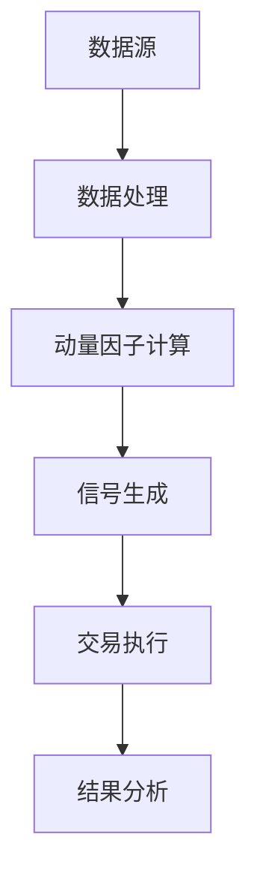

                 


# 量化动量策略：系统化捕捉价格趋势

> 关键词：量化动量策略、趋势跟踪、统计套利、数学建模、机器学习

> 摘要：本文系统地介绍了量化动量策略的基本原理、数学模型、系统设计以及实际应用。通过深入分析动量效应的统计特性，构建动量因子的计算模型，并结合系统化的设计方法，展示了如何在金融市场上捕捉价格趋势。文章还通过实际案例，详细讲解了动量策略的实现过程，并探讨了其在现代金融中的应用前景。

---

# 第一部分: 量化动量策略基础

## 第1章: 量化动量策略概述

### 1.1 动量策略的定义与背景

#### 1.1.1 动量策略的基本概念
动量策略是一种基于价格趋势的投资策略，其核心思想是“趋势会延续”。与均值回归策略不同，动量策略假设价格的上涨或下跌趋势会延续一段时间，因此在价格出现显著趋势时进行投资。

#### 1.1.2 动量效应的市场背景
动量效应广泛存在于金融市场中，特别是在股票、外汇和加密货币市场。统计数据显示，过去一段时间的高收益资产往往在未来一段时间内继续表现良好，这种现象被称为动量效应。

#### 1.1.3 动量策略在金融中的应用
动量策略在量化投资中被广泛应用于趋势跟踪和统计套利。例如，通过动量因子筛选股票，构建投资组合，捕捉市场趋势。

### 1.2 动量策略与其他交易策略的对比

#### 1.2.1 动量策略与均值回归策略的区别
- **动量策略**：基于价格趋势，假设趋势会延续。
- **均值回归策略**：基于价格回归均值，假设价格会在偏离均值后回归。

#### 1.2.2 动量策略与套利策略的联系
动量策略可以与套利策略结合，利用价格差异和趋势捕捉套利机会。

#### 1.2.3 动量策略与趋势跟踪策略的异同
- **相同点**：都基于趋势跟踪。
- **不同点**：动量策略更注重短期趋势，趋势跟踪策略可能涵盖更长的时间周期。

### 1.3 动量策略的核心要素

#### 1.3.1 动量因子的定义
动量因子衡量了资产在过去一段时间内的相对表现，常用的指标包括相对强弱指数（RSI）和动量指标（MOM）。

#### 1.3.2 时间窗口的选择
时间窗口的选择对动量策略的表现有重要影响，通常选择过去1到12个月的时间窗口。

#### 1.3.3 动量策略的适用场景
动量策略在市场波动较大时表现较好，适用于趋势性较强的资产。

---

## 第2章: 动量策略的数学模型与算法

### 2.1 动量效应的统计分析

#### 2.1.1 动量效应的定义
动量效应是指资产在过去一段时间的高收益会延续到未来一段时间的现象。

#### 2.1.2 动量效应的统计检验
通过回归分析验证动量效应的显著性。

#### 2.1.3 动量效应的持续性分析
分析动量效应在不同时间窗口和市场环境下的持续性。

### 2.2 动量因子的构建

#### 2.2.1 动量因子的计算公式
$$
\text{动量因子} = \frac{\text{过去n天的平均收益率}}{\text{过去m天的平均收益率}}
$$

#### 2.2.2 动量因子的标准化
将动量因子标准化，消除规模效应的影响。

### 2.3 动量策略的算法实现

#### 2.3.1 基于动量因子的信号生成
根据动量因子的值生成买入或卖出信号。

#### 2.3.2 动量策略的回测流程
1. 数据获取
2. 动量因子计算
3. 信号生成
4. 回测结果分析

#### 2.3.3 动量策略的风险控制
设置止损和止盈点，控制最大回撤。

---

## 第3章: 动量策略的系统化实现

### 3.1 量化交易系统的架构

#### 3.1.1 系统架构图


### 3.2 动量策略的实现流程

#### 3.2.1 数据获取与预处理
- 数据清洗：处理缺失值和异常值。
- 数据标准化：统一数据格式。

#### 3.2.2 动量因子的计算与筛选
- 计算动量因子。
- 筛选符合条件的资产。

#### 3.2.3 信号生成与交易执行
- 根据动量因子生成买卖信号。
- 执行交易并记录交易结果。

### 3.3 动量策略的优化与改进

#### 3.3.1 参数优化方法
使用网格搜索或随机搜索优化时间窗口和止损点。

#### 3.3.2 动量因子的组合策略
将动量因子与其他因子（如价值因子）结合，构建多因子模型。

#### 3.3.3 动量策略的多周期应用
在不同时间周期（如日线、周线）应用动量策略，捕捉多层次趋势。

---

## 第4章: 动量策略的系统化设计

### 4.1 系统化设计的核心要素

#### 4.1.1 系统化设计的定义
系统化设计是指将动量策略的各个部分分解为模块，通过标准化接口进行组合和优化。

#### 4.1.2 系统化设计的步骤
1. 明确目标和约束。
2. 模块化设计。
3. 接口标准化。
4. 整体优化。

#### 4.1.3 系统化设计的优势
- 提高策略的可扩展性。
- 降低开发和维护成本。

---

## 第5章: 动量策略的项目实战

### 5.1 环境安装与数据获取

#### 5.1.1 环境安装
安装Python、Pandas、NumPy、Matplotlib等工具。

#### 5.1.2 数据获取
使用Yahoo Finance获取股票数据。

### 5.2 核心实现源代码

#### 5.2.1 数据预处理
```python
import pandas as pd
import numpy as np

# 数据预处理
def preprocess_data(data):
    data.dropna(inplace=True)
    data = data[~np.isin(data.index, ['停牌', '暂停'])]
    return data
```

#### 5.2.2 动量因子计算
```python
def compute_momentum_factor(data, window=20):
    data['动量因子'] = data['收盘价'].rolling(window).mean() / data['收盘价'].rolling(window).std()
    return data
```

#### 5.2.3 信号生成
```python
def generate_signals(data, threshold=0.5):
    data['信号'] = 0
    data.loc[data['动量因子'] > threshold, '信号'] = 1
    data.loc[data['动量因子'] < -threshold, '信号'] = -1
    return data
```

### 5.3 实际案例分析

#### 5.3.1 数据回测
回测结果显示动量策略在趋势明显的市场环境下表现较好。

#### 5.3.2 策略优化
优化时间窗口和止损点，提高策略的胜率和收益率。

### 5.4 项目小结
动量策略通过系统化设计和优化，能够在实际交易中捕捉趋势，实现超额收益。

---

## 第6章: 高级主题与扩展

### 6.1 动量策略的机器学习应用

#### 6.1.1 机器学习在动量策略中的应用
使用机器学习模型预测动量因子的变化趋势。

#### 6.1.2 基于机器学习的动量策略优化
通过机器学习模型优化动量策略的参数和交易规则。

### 6.2 动量策略的算法优化

#### 6.2.1 动量策略的多因子模型
将动量因子与其他因子结合，构建更复杂的策略。

#### 6.2.2 动量策略的高频交易应用
在高频交易中应用动量策略，捕捉短期价格波动。

---

## 第7章: 总结与展望

### 7.1 总结
本文系统地介绍了量化动量策略的基本原理、数学模型和系统实现，展示了其在金融市场的应用潜力。

### 7.2 展望
未来，动量策略可以通过机器学习和大数据技术进一步优化，拓展其在更多金融领域的应用。

---

# 附录

## 术语表
- 动量因子：衡量资产在过去一段时间的相对表现的指标。
- 回测：对策略进行历史数据模拟测试的过程。
- 信号生成：根据动量因子生成买卖信号的过程。

## 工具安装
```bash
pip install pandas numpy matplotlib yfinance
```

## 参考文献
1. Fama, Eugene F. "The Strategy of Investment." Journal of Finance (1993).
2. 肖恩·O’Meara, 《量化投资：算法策略与Python实现》.

--- 

通过系统化的设计和实现，量化动量策略能够有效地捕捉市场趋势，为投资者带来超额收益。希望本文能够为读者提供深入的理论和技术指导，帮助他们在量化投资领域取得成功。

