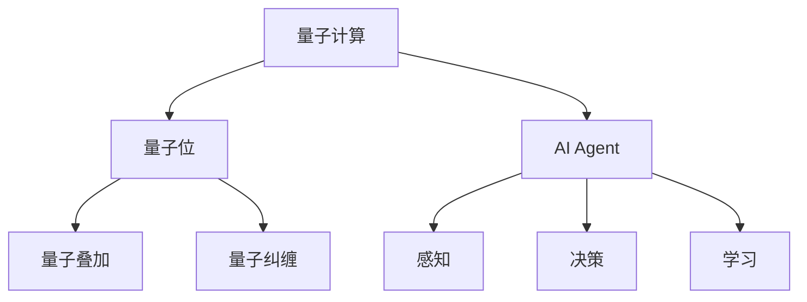
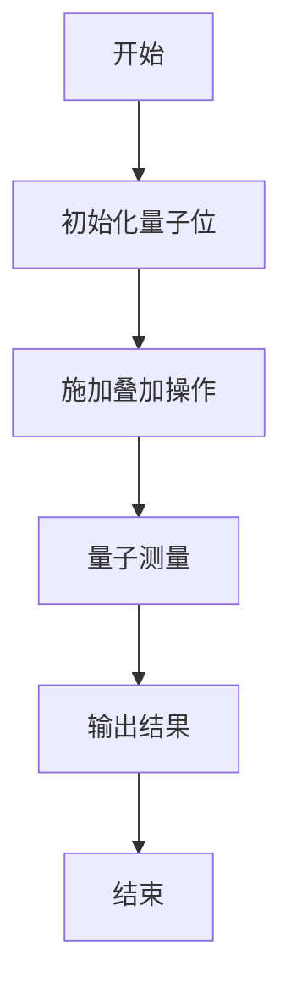
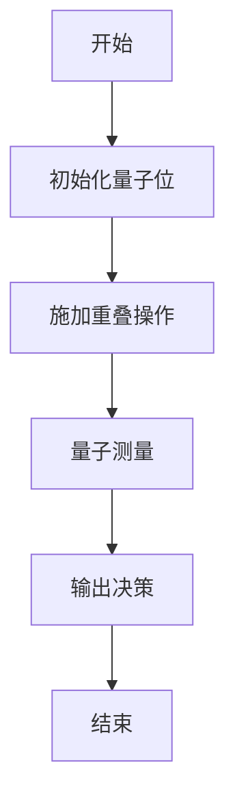
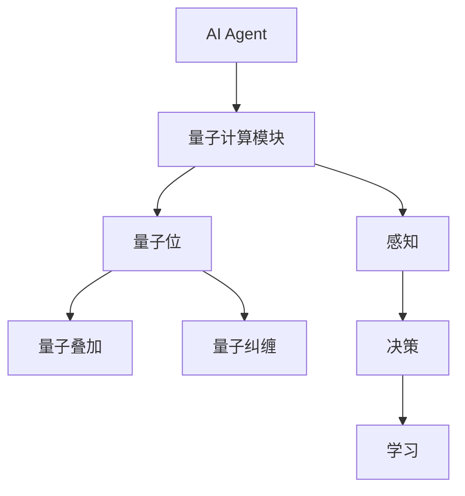
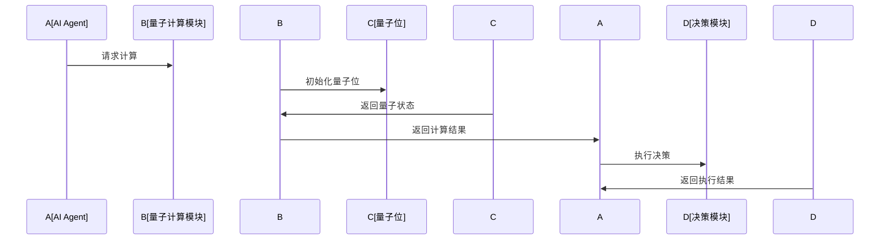

                 


# 量子计算+AI：未来AI Agent的计算范式

## 关键词：量子计算、AI Agent、计算范式、量子叠加、量子纠缠、人机协作、系统架构

## 摘要：  
量子计算与人工智能（AI）的结合正在推动计算范式的深刻变革。本文探讨了量子计算的核心原理、AI Agent的基本机制以及它们的结合如何影响未来AI Agent的计算方式。通过分析量子计算在AI Agent感知、决策和学习中的应用，结合实际案例和系统架构设计，展示了量子计算与AI Agent协同工作的潜力与挑战。文章最后总结了量子计算+AI Agent的未来发展方向。

---

## 第一部分：量子计算与AI Agent的背景与基础

### 1. 背景介绍

#### 1.1 核心概念术语说明
- **量子计算**：基于量子位（qubit）的计算方式，利用量子叠加和量子纠缠的特性进行并行计算。
- **AI Agent**：具备自主决策、学习和交互能力的人工智能实体，能够在复杂环境中执行任务。

#### 1.2 问题背景
AI Agent在处理复杂任务时，如优化问题、大数据分析和实时决策，面临计算效率和资源消耗的瓶颈。传统计算方式难以满足高并发和低延迟的需求。

#### 1.3 问题解决
量子计算的并行性和高效性为AI Agent提供了新的计算范式，能够在复杂环境中快速处理海量数据，提升决策效率。

#### 1.4 边界与外延
量子计算的计算能力依赖于物理实现，当前仍面临技术挑战；AI Agent的应用场景涵盖多个领域，如自动驾驶、金融投资和医疗诊断。

#### 1.5 概念结构与核心要素
- 量子计算：量子位、量子叠加、量子纠缠。
- AI Agent：感知、决策、学习、协作。

---

### 2. 核心概念与联系

#### 2.1 核心概念原理
- 量子叠加：$|\psi\rangle = \alpha|0\rangle + \beta|1\rangle$，$\alpha^2 + \beta^2 = 1$。
- 量子纠缠：两个或多个量子位的关联状态，无法单独描述。

#### 2.2 概念属性对比表

| 概念     | 特性               | 量子计算       | AI Agent       |
|----------|--------------------|----------------|----------------|
| 并行性   | 处理能力           | 高             | 依赖算法效率    |
| 状态数   | 状态数量           | 指数级增长       | 受任务限制       |
| 可扩展性 | 计算能力扩展性       | 高             | 依赖硬件资源     |

#### 2.3 实体关系图



---

## 第二部分：量子计算在AI Agent中的应用

### 3. 算法原理

#### 3.1 量子感知算法

##### 3.1.1 算法描述
量子感知算法利用量子叠加特性，通过量子测量实现对环境的感知。

##### 3.1.2 算法流程图



##### 3.1.3 数学模型
$$
|\psi\rangle = \frac{1}{\sqrt{2}}(|0\rangle + |1\rangle)
$$

#### 3.2 量子决策算法

##### 3.2.1 算法描述
量子决策算法通过量子叠加和量子纠缠实现多选项的并行评估。

##### 3.2.2 算法流程图



##### 3.2.3 数学模型
$$
|\psi\rangle = \frac{1}{\sqrt{3}}(|0\rangle + |1\rangle + |2\rangle)
$$

---

### 4. 系统分析与架构设计

#### 4.1 系统架构图



#### 4.2 接口设计
- 输入接口：感知数据流、决策指令。
- 输出接口：量子计算结果、系统反馈。

#### 4.3 交互序列图



---

## 第三部分：项目实战

### 5. 量子优化问题实现

#### 5.1 环境安装
- 安装Python和Qiskit库：
  ```bash
  pip install qiskit
  ```

#### 5.2 核心代码实现

```python
from qiskit import QuantumCircuit, execute, Aer
from qiskit.circuit import X, CNOT

# 初始化量子电路
qc = QuantumCircuit(2)
qc.h(0)
qc.cnot(0, 1)
qc.measure(0,0)
qc.measure(1,1)

# 执行量子计算
simulator = Aer.get_backend('qasm_simulator')
result = execute(qc, simulator).result()
print(result.get_counts())
```

#### 5.3 案例分析
- 输入：优化问题。
- 输出：量子计算结果。

---

## 第四部分：最佳实践与小结

### 6. 最佳实践

- **技术实现**：量子计算与AI Agent的结合需考虑计算资源和算法实现的难度。
- **风险与挑战**：量子计算的物理实现复杂，AI Agent的学习能力依赖数据质量。

### 6. 小结

量子计算与AI Agent的结合为未来计算范式提供了新思路。通过量子计算的高效性和AI Agent的自主性，能够解决复杂问题，推动技术进步。

---

## 总结

量子计算与AI Agent的结合不仅是技术的进步，更是计算范式的革命。未来，随着量子计算的成熟和AI Agent的智能化，两者将共同构建更高效的计算体系。

