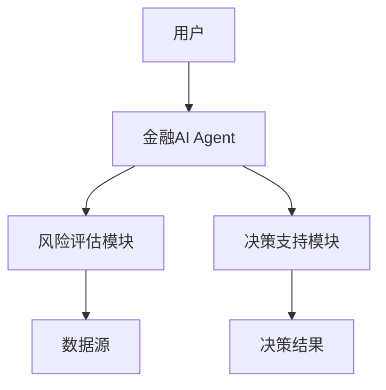
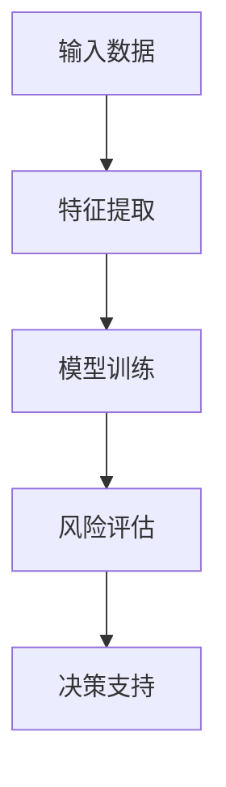
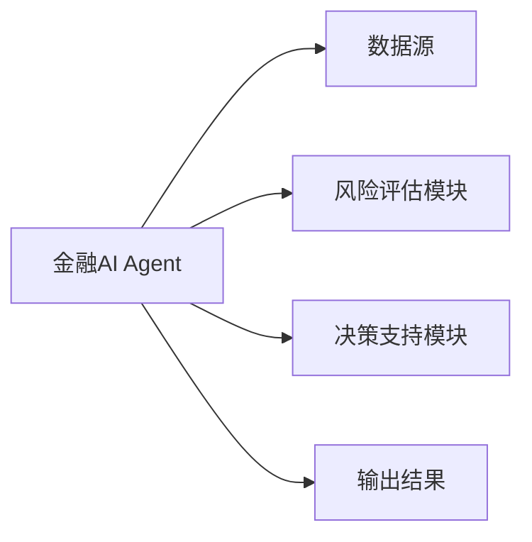
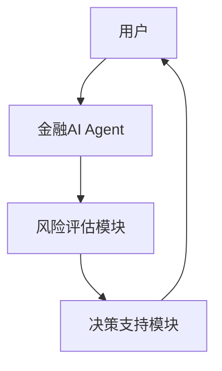

                 


```markdown
# 金融AI Agent：风险评估与决策支持

> 关键词：金融AI Agent, 风险评估, 决策支持, AI算法, 系统架构

> 摘要：本文深入探讨了金融AI Agent在风险评估与决策支持中的应用，从背景、核心概念、算法原理、系统架构到实战案例，全面解析其技术实现与优势。

---

# 第一部分: 金融AI Agent的背景与核心概念

## 第1章: 问题背景与描述

### 1.1 问题背景
#### 1.1.1 传统金融风险评估的局限性
传统金融风险评估主要依赖人工分析和统计模型，存在效率低、覆盖范围有限、实时性差等问题。

#### 1.1.2 AI技术在金融领域的应用潜力
AI技术可以通过大数据分析、机器学习等方法，提高风险评估的准确性和效率。

#### 1.1.3 金融AI Agent的定义与目标
金融AI Agent是一种能够自主感知、分析和决策的智能系统，目标是通过实时数据处理和智能算法，为金融机构提供精准的风险评估和决策支持。

### 1.2 问题描述
#### 1.2.1 金融风险评估的核心挑战
- 数据多样性与复杂性
- 模型的实时更新与优化
- 风险的动态变化

#### 1.2.2 决策支持系统的需求分析
- 实时性
- 准确性
- 可解释性

#### 1.2.3 传统方法与AI方法的对比
| 特征 | 传统方法 | AI方法 |
|------|-----------|--------|
| 数据处理能力 | 有限 | 强大 |
| 决策效率 | 较低 | 高 |
| 模型更新 | 周期性 | 实时 |

### 1.3 问题解决与边界
#### 1.3.1 金融AI Agent的解决方案
通过集成机器学习、自然语言处理和强化学习等技术，实现智能化的风险评估和决策支持。

#### 1.3.2 系统边界与功能范围
- 输入：实时市场数据、用户行为数据
- 输出：风险评估结果、决策建议
- 边界：仅限于金融领域，不涉及其他业务模块

#### 1.3.3 与相关领域的区别与联系
- 区别：专注于金融风险评估
- 联系：与AI技术的其他应用领域共享技术基础

### 1.4 本章小结
本章介绍了金融AI Agent的背景、核心概念和问题解决方法，为后续内容奠定了基础。

---

## 第2章: 核心概念与联系

### 2.1 核心概念原理
#### 2.1.1 AI Agent的基本原理
AI Agent通过感知环境、分析数据、制定策略并执行决策，实现智能化的目标。

#### 2.1.2 金融风险评估的关键要素
- 数据特征：收入、信用评分、交易记录
- 风险类型：信用风险、市场风险、操作风险

#### 2.1.3 决策支持系统的实现机制
- 数据采集
- 模型训练
- 决策输出

### 2.2 核心概念对比表
| 特征 | 传统AI | AI Agent |
|------|--------|----------|
| 自主性 | 低     | 高       |
| 学习能力 | 有限 | 强大     |
| 交互性 | 单向   | 双向     |

### 2.3 实体关系图


### 2.4 本章小结
本章详细解释了金融AI Agent的核心概念和其实现机制，并通过对比和图表明确了其独特性。

---

## 第3章: 算法原理与实现

### 3.1 算法原理
#### 3.1.1 基于强化学习的决策过程
- 状态空间：用户行为、市场数据
- 动作空间：决策建议
- 奖励机制：风险降低带来的收益

#### 3.1.2 风险评估的数学模型
$$\text{风险评分} = \alpha \cdot \text{信用评分} + \beta \cdot \text{交易记录}$$

#### 3.1.3 决策支持的逻辑推理
- 如果风险评分高于阈值，则触发预警
- 否则，提供低风险建议

### 3.2 算法流程图


### 3.3 Python代码实现
```python
# 示例代码：风险评估模型
class RiskAssessment:
    def __init__(self, data):
        self.data = data
    
    def assess_risk(self):
        # 示例评估逻辑
        if self.data['income'] > 50000:
            return 'low'
        else:
            return 'high'
```

### 3.4 本章小结
本章通过强化学习和数学模型，详细讲解了金融AI Agent的算法实现。

---

## 第4章: 系统分析与架构设计

### 4.1 系统分析
#### 4.1.1 问题场景介绍
- 用户请求风险评估
- 系统实时处理并反馈结果

#### 4.1.2 系统功能设计
| 功能模块 | 描述 |
|----------|------|
| 数据采集 | 从数据库获取实时数据 |
| 风险评估 | 计算用户风险评分 |
| 决策支持 | 提供风险缓解建议 |

### 4.2 系统架构设计


### 4.3 接口设计
- 输入接口：API接口接受用户数据
- 输出接口：返回风险评估结果和决策建议

### 4.4 交互流程图


### 4.5 本章小结
本章通过系统分析和架构设计，明确了金融AI Agent的实现方式和交互流程。

---

## 第5章: 项目实战

### 5.1 环境安装
- Python 3.8+
- TensorFlow 2.0+
- scikit-learn 0.24+

### 5.2 核心代码实现
```python
# 示例代码：决策支持模块
class DecisionSupport:
    def __init__(self, risk_score):
        self.risk_score = risk_score
    
    def generate_recommendation(self):
        if self.risk_score > 0.8:
            return "高风险，建议降低杠杆"
        else:
            return "低风险，建议增加投资"
```

### 5.3 案例分析
- 案例背景：某用户申请贷款，系统评估其信用风险
- 数据分析：收入、信用评分、交易记录
- 决策结果：提供贷款建议

### 5.4 项目总结
通过实战案例，验证了金融AI Agent在风险评估和决策支持中的有效性。

### 5.5 本章小结
本章通过实际案例，展示了金融AI Agent的实现过程和应用效果。

---

## 第6章: 最佳实践与小结

### 6.1 小结
- 金融AI Agent的核心优势在于其智能化和实时性
- 通过AI技术实现了更高效的金融风险评估和决策支持

### 6.2 注意事项
- 数据隐私保护
- 模型的可解释性
- 系统的实时性要求

### 6.3 拓展阅读
- 《机器学习实战》
- 《深度学习》
- 《强化学习》

### 6.4 本章小结
本章总结了全文内容，并提出了未来的研究方向和实践建议。

---

# 结语

通过本文的详细阐述，读者可以全面了解金融AI Agent在风险评估与决策支持中的应用，掌握其实现原理和最佳实践方法。希望本文能为金融领域的智能化转型提供有价值的参考。
```

