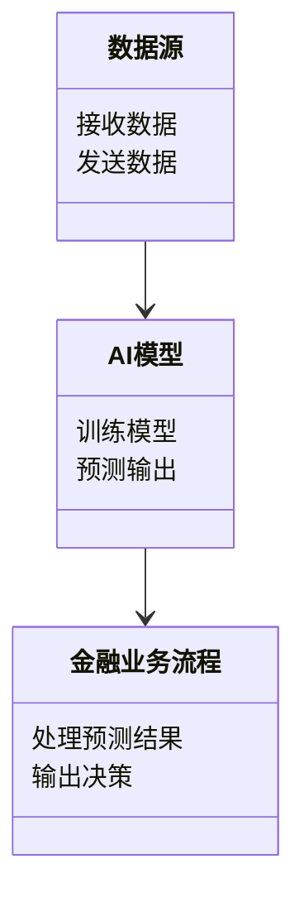
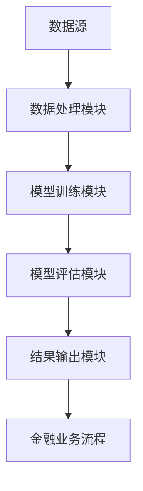
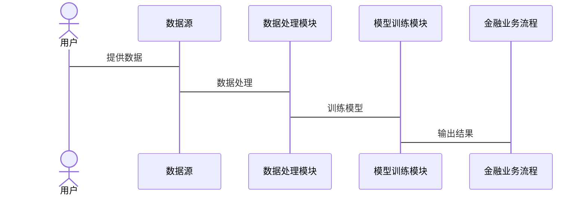
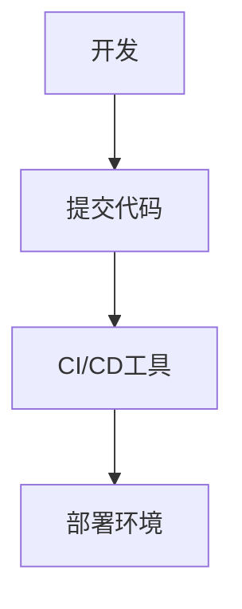

                 


# 《金融AI应用的DevOps流程设计与实施》

---

## 关键词：
金融AI、DevOps、时间序列预测、深度学习、系统架构、风险评估

---

## 摘要：
本文详细探讨了金融AI应用的DevOps流程设计与实施，从背景分析、算法实现到系统架构设计，层层深入。通过结合金融行业的实际需求，分析了AI算法的核心原理及其在金融场景中的应用，并通过Mermaid图和Python代码展示了DevOps工具链在金融AI系统中的具体实现。文章还提出了系统化的解决方案和最佳实践，为金融行业技术人员提供了从理论到实践的完整指导。

---

# 第1章: 金融AI应用与DevOps概述

## 1.1 问题背景与描述
### 1.1.1 传统金融行业的技术挑战
- 数据处理效率低下
- 人工决策的局限性
- 系统集成复杂性

### 1.1.2 AI技术在金融领域的应用需求
- 金融预测
- 风险评估
- 自动化交易

### 1.1.3 DevOps在金融AI中的解决方案
- 提高开发效率
- 实现持续集成
- 优化部署流程

## 1.2 问题解决与边界
### 1.2.1 金融AI应用的核心问题
- 数据实时性
- 模型准确性
- 系统稳定性

### 1.2.2 DevOps在金融AI中的边界与外延
- 边界：AI模型开发与部署
- 外延：数据源、金融业务流程、DevOps工具链

## 1.3 核心概念与联系
### 1.3.1 金融AI应用的实体关系图
```mermaid
er
  actor: 金融机构
  actor: 开发团队
  actor: 数据源
  entity: AI模型
  entity: 数据集
  entity: 金融业务流程
  entity: DevOps工具链
  relationship: 数据源 -> 数据集
  relationship: 数据集 -> AI模型
  relationship: AI模型 -> 金融业务流程
  relationship: 开发团队 -> DevOps工具链
  relationship: 金融机构 -> 金融业务流程
```

---

# 第2章: 金融AI应用的核心算法与数学模型

## 2.1 算法原理
### 2.1.1 金融预测算法概述
- 时间序列预测
- 分类与回归分析

### 2.1.2 基于时间序列的AI模型
- ARIMA模型
- LSTM网络

### 2.1.3 深度学习算法在金融中的应用
- CNN在金融数据中的特征提取
- RNN在时间序列预测中的应用

## 2.2 数学模型与公式
### 2.2.1 时间序列模型
$$ ARIMA模型: ARIMA(p, d, q) $$

### 2.2.2 神经网络模型
$$ LSTM结构: f(x_t, h_{t-1}) = \sigma(W_x x_t + W_h h_{t-1} + b) $$

### 2.2.3 风险评估模型
$$ 风险评分公式: R = \sum_{i=1}^{n} w_i x_i $$

## 2.3 算法实现与案例
### 2.3.1 时间序列预测的Python代码实现
```python
import pandas as pd
from statsmodels.tsa.arima_model import ARIMA
# 数据加载与预处理
data = pd.read_csv('financial_data.csv')
# 模型训练
model = ARIMA(data, order=(5,1,0))
model_fit = model.fit()
# 预测
forecast = model_fit.forecast(steps=10)
```

## 2.4 本章小结
### 2.4.1 算法原理的总结
### 2.4.2 数学模型的实际应用
### 2.4.3 案例分析的意义

---

# 第3章: 金融AI系统的系统分析与架构设计

## 3.1 问题场景介绍
### 3.1.1 金融AI系统的功能需求
- 数据采集
- 模型训练
- 结果输出

### 3.1.2 金融AI系统的性能需求
- 实时性
- 准确性
- 可扩展性

## 3.2 系统功能设计
### 3.2.1 领域模型设计


### 3.2.2 系统架构设计


## 3.3 系统接口设计
### 3.3.1 数据接口
- 数据输入接口
- 数据输出接口

### 3.3.2 模型接口
- 模型训练接口
- 模型预测接口

## 3.4 系统交互设计


---

# 第4章: 金融AI应用的DevOps流程设计

## 4.1 环境安装与配置
### 4.1.1 开发环境
- Python
- 虚拟环境配置
- 依赖管理

### 4.1.2 代码仓库
- Git版本控制
- CI/CD工具集成

## 4.2 系统核心实现
### 4.2.1 DevOps工具链
- Jenkins
- Docker
- Kubernetes

### 4.2.2 持续集成与持续交付


## 4.3 代码实现与解读
### 4.3.1 系统核心功能实现
```python
# 持续集成脚本
from datetime import datetime

def build():
    print(f"构建开始时间: {datetime.now()}")
    # 执行构建命令
    print("构建完成")

def test():
    print(f"测试开始时间: {datetime.now()}")
    # 执行测试命令
    print("测试完成")

def deploy():
    print(f"部署开始时间: {datetime.now()}")
    # 执行部署命令
    print("部署完成")

build()
test()
deploy()
```

## 4.4 项目实战与案例分析
### 4.4.1 案例背景
- 某银行的信用评分系统

### 4.4.2 案例实现
```python
# 案例代码
import pandas as pd
from sklearn.ensemble import RandomForestClassifier

data = pd.read_csv('credit_data.csv')
model = RandomForestClassifier()
model.fit(data.drop('target', axis=1), data['target'])
```

### 4.4.3 案例分析
- 模型准确率
- 系统稳定性
- 成本效益分析

---

# 第5章: 金融AI应用的优化与扩展

## 5.1 系统优化
### 5.1.1 算法优化
- 超参数调优
- 模型融合

### 5.1.2 系统性能优化
- 并行计算
- 异常处理

## 5.2 系统扩展
### 5.2.1 功能扩展
- 多模型部署
- 实时监控

### 5.2.2 技术扩展
- 异构系统集成
- 云计算扩展

---

# 第6章: 金融AI应用的实践总结与展望

## 6.1 最佳实践
### 6.1.1 工具选择
- 开源工具优先
- 工具链集成

### 6.1.2 代码管理
- 版本控制
- 代码审查

## 6.2 项目小结
### 6.2.1 核心成果
- 成功实现了金融AI应用
- 建立了完整的DevOps流程

### 6.2.2 经验总结
- 数据质量的重要性
- 模型解释性的挑战
- 系统稳定性的保障

## 6.3 未来展望
### 6.3.1 技术发展
- 更先进的AI算法
- 更高效的DevOps工具

### 6.3.2 应用领域
- 更多金融场景的AI应用
- 与其他行业的结合

---

## 附录
### 附录A: 金融AI相关术语表
### 附录B: DevOps工具链清单
### 附录C: 代码示例

---

## 参考文献
- [1] 时间序列分析的相关文献
- [2] 深度学习在金融中的应用研究
- [3] DevOps在金融行业中的最佳实践

---

## 作者简介
- 简历
- 著作
- 研究领域

---

## 后记
感谢读者的支持，欢迎提出反馈与建议。

