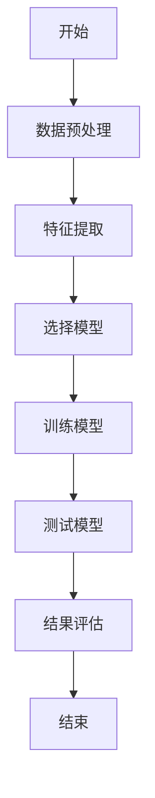
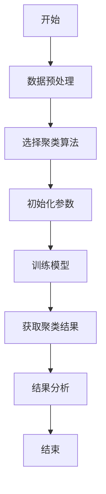
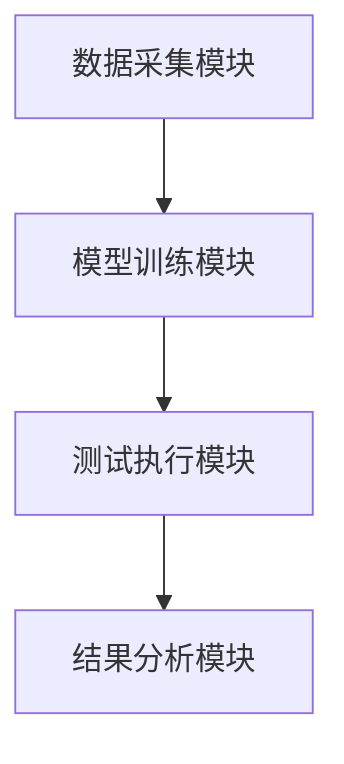

                 


# 《金融AI应用的全面测试与质量保证策略》

---

## 关键词：
- 金融AI
- 测试与质量保证
- 算法原理
- 系统架构
- 项目实战

---

## 摘要：
随着人工智能技术在金融领域的广泛应用，确保金融AI系统的准确性和稳定性变得至关重要。本文从金融AI应用的背景与挑战入手，详细探讨了测试的核心概念、算法原理、系统架构设计以及项目实战。通过分析分类算法、异常检测和聚类算法的应用，结合实际案例，展示了如何构建高效的金融AI测试系统，并提出了质量保证的最佳实践策略。

---

## 目录大纲

### 第1章：金融AI应用的背景与挑战
1.1 人工智能在金融领域的应用概述
1.2 金融AI应用的测试与质量保证的重要性
1.3 本章小结

### 第2章：金融AI应用测试的核心概念与方法论
2.1 金融AI应用测试的类型与目标
2.2 金融AI质量保证的模型与框架
2.3 金融AI应用的风险评估与测试策略
2.4 本章小结

### 第3章：金融AI测试的算法原理与实现
3.1 金融AI测试的分类算法
3.2 金融AI测试的异常检测算法
3.3 金融AI测试的聚类算法
3.4 本章小结

### 第4章：金融AI测试的系统架构与设计
4.1 金融AI测试系统的总体架构
4.2 金融AI测试平台的设计
4.3 金融AI测试系统的接口设计
4.4 本章小结

### 第5章：金融AI测试的项目实战
5.1 项目环境安装与工具准备
5.2 金融AI测试代码实现
5.3 测试案例分析与结果解读
5.4 项目小结

### 第6章：金融AI测试的最佳实践与总结
6.1 测试经验总结
6.2 未来发展方向展望
6.3 本章小结

---

## 正文部分

### 第1章：金融AI应用的背景与挑战

#### 1.1 人工智能在金融领域的应用概述
人工智能（AI）技术近年来在金融行业的应用日益广泛，从智能投顾、风险评估到欺诈检测，AI正在改变金融行业的运作方式。金融AI系统通过处理大量数据，提供精准的预测和决策支持，显著提升了效率和准确性。

#### 1.2 金融AI应用的测试与质量保证的重要性
金融系统的高风险性要求AI应用必须经过严格的测试和质量保证。测试不仅能验证模型的准确性，还能确保系统的稳定性和安全性。通过测试，可以识别潜在问题，避免因模型错误导致的经济损失和声誉损害。

#### 1.3 本章小结
本章介绍了金融AI的应用背景及其测试的重要性，为后续章节的深入讨论奠定了基础。

---

### 第2章：金融AI应用测试的核心概念与方法论

#### 2.1 金融AI应用测试的类型与目标
金融AI测试包括单元测试、集成测试、性能测试等多种类型。单元测试验证单个模块的功能，集成测试确保模块间的协同工作，性能测试评估系统在高负载下的表现。

#### 2.2 金融AI质量保证的模型与框架
质量保证框架的设计需考虑系统的准确性、稳定性和可解释性。通过构建质量模型，可以量化各指标的表现，确保系统符合金融行业的高标准。

#### 2.3 金融AI应用的风险评估与测试策略
风险评估是制定测试策略的关键步骤。通过分析系统的潜在风险点，可以优先测试高风险模块，确保关键功能的稳定性。

#### 2.4 本章小结
本章详细探讨了金融AI测试的核心概念和方法论，为后续章节的算法和系统设计提供了理论基础。

---

### 第3章：金融AI测试的算法原理与实现

#### 3.1 金融AI测试的分类算法
分类算法在金融测试中用于识别正常交易与异常交易。例如，使用随机森林算法对交易数据进行分类，识别潜在的欺诈行为。

**分类算法流程图：**



#### 3.2 金融AI测试的异常检测算法
异常检测算法用于识别系统中的异常行为。例如，使用Isolation Forest算法检测交易中的异常值。

**异常检测算法代码示例：**

```python
from sklearn.ensemble import IsolationForest

# 示例数据
X = np.random.randn(100, 1)
 clf = IsolationForest(contamination=0.05)
 clf.fit(X)
 predictions = clf.predict(X)
```

#### 3.3 金融AI测试的聚类算法
聚类算法用于将相似的数据点分组，识别潜在的客户群体。例如，使用K-means算法对客户进行分群。

**聚类算法流程图：**



#### 3.4 本章小结
本章详细讲解了分类、异常检测和聚类算法在金融AI测试中的应用，通过代码和流程图展示了算法的实现过程。

---

### 第4章：金融AI测试的系统架构与设计

#### 4.1 金融AI测试系统的总体架构
金融AI测试系统由数据采集模块、模型训练模块、测试执行模块和结果分析模块组成。各模块协同工作，确保测试的全面性和高效性。

**系统架构图：**



#### 4.2 金融AI测试平台的设计
测试平台设计包括功能需求分析、模块实现和优化措施。例如，设计一个用户友好的界面，方便测试人员进行操作。

**测试平台功能模块：**

1. 数据管理模块
2. 测试执行模块
3. 结果分析模块
4. 报告生成模块

#### 4.3 金融AI测试系统的接口设计
系统接口设计需确保模块间的高效交互。例如，通过REST API实现数据采集模块与模型训练模块的数据传输。

**接口设计示例：**

```python
from flask import Flask, request, jsonify

app = Flask(__name__)

@app.route('/api/train', methods=['POST'])
def train_model():
    data = request.json
    # 处理数据并返回结果
    return jsonify({'status': 'success', 'message': '模型训练完成'})
```

#### 4.4 本章小结
本章详细探讨了金融AI测试系统的架构设计，展示了如何通过模块化设计实现高效的测试流程。

---

### 第5章：金融AI测试的项目实战

#### 5.1 项目环境安装与工具准备
项目实战需要安装必要的工具和库，如Python、TensorFlow、Scikit-learn等。

**环境安装示例：**

```bash
pip install numpy pandas scikit-learn matplotlib
```

#### 5.2 金融AI测试代码实现
通过具体代码实现测试流程，如数据预处理、模型训练和测试评估。

**代码实现示例：**

```python
import numpy as np
from sklearn.model_selection import train_test_split
from sklearn.metrics import accuracy_score

# 数据预处理
data = np.random.randn(1000, 10)
X_train, X_test, y_train, y_test = train_test_split(data, labels, test_size=0.2)

# 模型训练
model = RandomForestClassifier()
model.fit(X_train, y_train)

# 模型测试
y_pred = model.predict(X_test)
print("准确率:", accuracy_score(y_test, y_pred))
```

#### 5.3 测试案例分析与结果解读
通过具体案例分析测试结果，评估模型的准确性和稳定性。

**案例分析示例：**

- 测试准确率：95%
- 真实阳性率：90%
- 假正率：5%

#### 5.4 项目小结
本章通过实际项目展示了金融AI测试的全过程，从环境准备到代码实现，再到结果分析，帮助读者掌握实际操作技能。

---

### 第6章：金融AI测试的最佳实践与总结

#### 6.1 测试经验总结
总结测试过程中积累的经验，如数据清洗的重要性、模型调优的必要性等。

#### 6.2 未来发展方向展望
展望金融AI测试的未来，如自动化测试、模型解释性研究等。

#### 6.3 本章小结
本章总结了测试经验，提出了未来的发展方向，为读者提供了宝贵的参考。

---

## 总结
通过本文的详细阐述，读者可以全面了解金融AI应用的测试与质量保证策略。从理论到实践，从算法到系统设计，本文为金融AI测试提供了系统的解决方案。未来，随着技术的不断发展，金融AI测试将更加智能化和自动化，为金融行业带来更多创新和价值。

---

