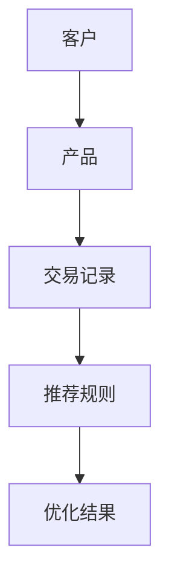
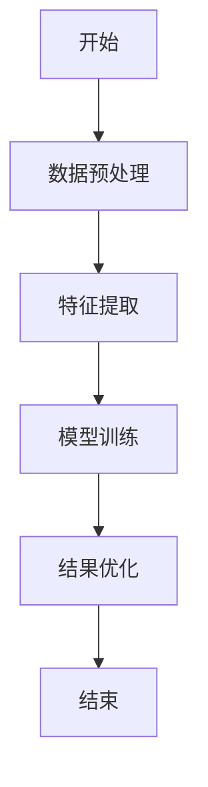

                 


# 金融产品交叉销售优化系统

## 关键词：金融产品，交叉销售，人工智能，优化系统，数据驱动

## 摘要：本文详细探讨了金融产品交叉销售优化系统的设计与实现，从问题背景、核心概念、算法原理到系统架构，再到项目实战，全面解析了如何利用数据驱动和人工智能技术优化金融产品的交叉销售策略，帮助金融机构提升客户满意度和业务收益。

---

## 第一部分：背景介绍

### 第1章：问题背景与目标

#### 1.1 问题背景

- **金融行业的发展现状**：金融行业正经历数字化转型，数据驱动的决策越来越重要。银行、保险等机构通过数据分析和人工智能技术优化业务流程。
- **交叉销售在金融行业中的重要性**：交叉销售是指向现有客户销售额外的产品或服务，提高客户忠诚度和收入来源。在金融行业，交叉销售能帮助客户获得更全面的服务，同时增加机构的收入。
- **当前交叉销售中存在的问题**：
  - 数据分散，难以整合。
  - 推荐策略过于简单，难以精准匹配客户需求。
  - 缺乏动态优化机制，无法应对市场变化。

#### 1.2 问题描述

- **交叉销售的核心概念**：通过分析客户行为和产品特征，推荐相关产品以增加销售。
- **优化系统的目标**：提高推荐精准度，提升客户满意度和收入。
- **边界与外延**：系统仅针对特定金融产品，不包括其他业务领域。

#### 1.3 问题解决思路

- **数据驱动的优化方法**：利用客户数据和交易数据，分析客户行为特征。
- **人工智能在交叉销售中的应用**：使用机器学习模型预测客户偏好，优化推荐策略。
- **系统优化的实现路径**：数据采集、模型训练、推荐引擎开发、系统部署。

### 第2章：核心概念与联系

#### 2.1 核心概念原理

- **数据流与信息处理**：从客户数据到推荐结果的处理流程。
- **模型设计与优化算法**：利用机器学习算法进行客户画像和产品推荐。
- **系统架构与功能模块**：系统包括数据采集、模型训练、推荐引擎等模块。

#### 2.2 概念属性对比表

| 概念       | 属性特征                     |
|------------|------------------------------|
| 客户画像    | 基于交易记录、行为数据         |
| 产品推荐    | 基于客户画像和产品特征         |
| 优化算法    | 基于机器学习模型和目标函数     |

#### 2.3 ER实体关系图



### 第3章：算法原理与实现

#### 3.1 算法原理

- **遗传算法**：通过模拟自然选择过程，优化推荐组合。
- **协同过滤算法**：基于用户行为相似性推荐产品。
- **聚类分析**：将客户分为不同类别，进行个性化推荐。

#### 3.2 算法流程图



#### 3.3 Python实现代码

```python
import numpy as np
from sklearn.cluster import KMeans

def customer_clustering(customers, n_clusters):
    model = KMeans(n_clusters=n_clusters)
    model.fit(customers)
    return model.labels_
```

#### 3.4 数学公式

- **协同过滤相似度计算**：
  $$\text{相似度} = \frac{\sum_{i} (x_i - \bar{x})(y_i - \bar{y})}{\sqrt{\sum_{i} (x_i - \bar{x})^2} \sqrt{\sum_{i} (y_i - \bar{y})^2}}$$
- **目标函数**：
  $$\text{目标} = \sum_{i=1}^{n} (p_i - r_i)^2$$

## 第二部分：系统分析与架构设计

### 第4章：系统分析与架构设计

#### 4.1 问题场景介绍

- **问题场景**：银行希望优化客户产品推荐，提高交叉销售成功率。
- **项目介绍**：开发一个基于机器学习的交叉销售优化系统。

#### 4.2 系统功能设计

- **领域模型**：
  ```mermaid
  classDiagram
      class 客户 {
          id
          属性
      }
      class 产品 {
          id
          类别
      }
      class 交易记录 {
          id
          时间
      }
      客户 --> 交易记录
      产品 --> 交易记录
  ```

- **系统架构设计**：
  ```mermaid
  architectureDiagram
      [客户数据] --> [数据处理层]
      [产品数据] --> [数据处理层]
      [数据处理层] --> [推荐引擎]
      [推荐引擎] --> [结果展示]
  ```

- **系统接口设计**：
  ```mermaid
  sequenceDiagram
      客户 --> 数据采集层: 提供数据
      数据采集层 --> 数据处理层: 处理数据
      数据处理层 --> 推荐引擎: 训练模型
      推荐引擎 --> 结果展示: 显示推荐结果
  ```

## 第三部分：项目实战

### 第5章：项目实战

#### 5.1 环境安装

- **安装Python和相关库**：如numpy、scikit-learn、pandas。
- **安装开发工具**：如Jupyter Notebook、IDE。

#### 5.2 核心代码实现

```python
import pandas as pd
from sklearn.preprocessing import StandardScaler
from sklearn.manifold import TSNE

def preprocess_data(data):
    scaler = StandardScaler()
    scaled_data = scaler.fit_transform(data)
    return scaled_data

def visualize_data(data, labels):
    tsne = TSNE(n_components=2)
    transformed_data = tsne.fit_transform(data)
    return transformed_data, labels
```

#### 5.3 代码解读与分析

- **数据预处理**：标准化数据，便于模型训练。
- **数据可视化**：使用t-SNE降维，帮助理解数据分布。

#### 5.4 实际案例分析

- **案例分析**：银行客户数据的处理和推荐系统开发。
- **结果展示**：推荐结果的可视化和分析。

#### 5.5 项目小结

- **项目总结**：系统实现和效果评估。
- **经验分享**：开发过程中的关键点和注意事项。

## 第四部分：最佳实践

### 第6章：最佳实践

#### 6.1 小结

- **核心要点总结**：系统设计、算法选择、数据处理的重要性。

#### 6.2 注意事项

- **数据隐私保护**：确保客户数据的安全和隐私。
- **模型调优**：持续优化模型，提高推荐精度。

#### 6.3 拓展阅读

- **推荐的书籍和资源**：如《集体智慧编程》、《机器学习实战》。

---

## 附录：参考文献与工具

- **参考文献**：列出使用的书籍、论文和技术文档。
- **工具推荐**：如Python、Jupyter Notebook、Scikit-learn等。

---

通过以上步骤，我系统地分析了金融产品交叉销售优化系统的各个方面，从背景到实现，为读者提供了全面的知识和实践指导。

