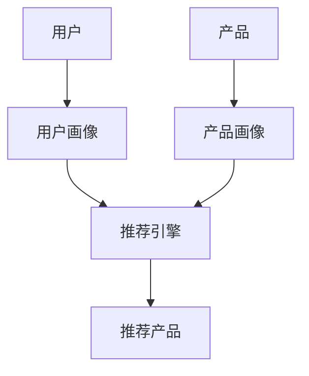
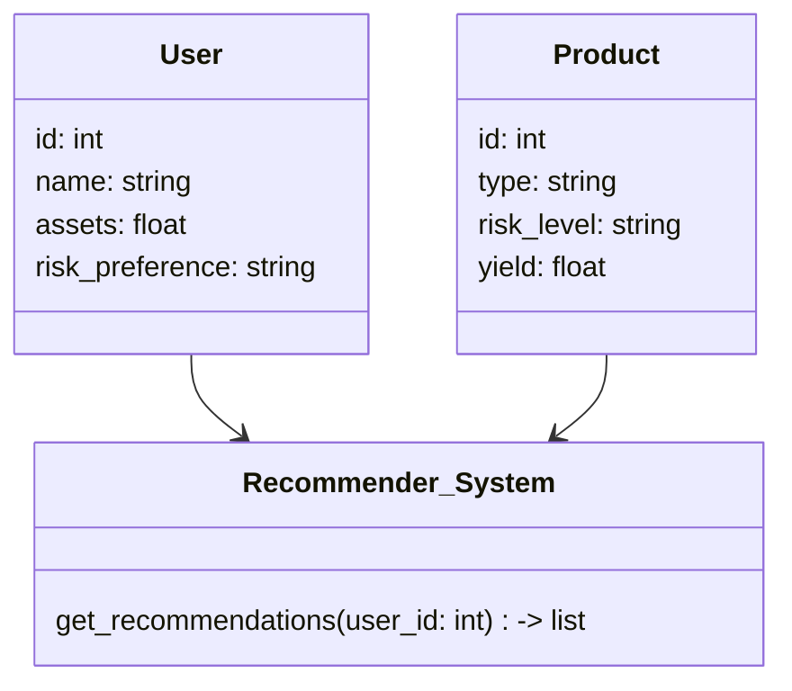
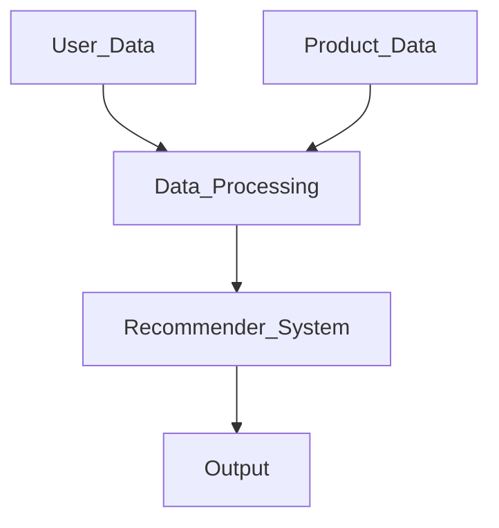
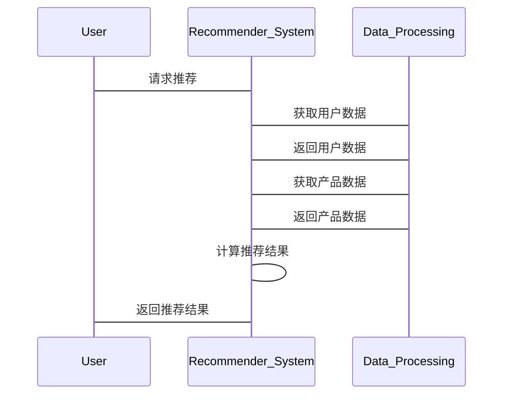

                 


# 金融产品交叉销售推荐引擎

## 关键词
- 金融产品交叉销售
- 推荐引擎
- 协同过滤
- 混合推荐模型
- 个性化推荐
- 系统架构设计

## 摘要
金融产品交叉销售推荐引擎是利用数据分析和机器学习技术，通过协同过滤、基于内容的推荐以及混合推荐模型，实现对客户需求的精准匹配，从而提高销售效率和客户满意度。本文从背景介绍、核心概念、算法原理、系统架构设计到项目实战，详细阐述了推荐引擎在金融领域的应用，旨在为读者提供一个全面的技术指南。

---

## 第1章: 问题背景与目标

### 1.1 问题背景
#### 1.1.1 金融行业交叉销售的现状
在金融行业，交叉销售是一种重要的销售策略，通过向现有客户推荐其他相关产品来提高收入。然而，传统的方法依赖于人工经验，存在效率低、客户体验差的问题。

#### 1.1.2 传统交叉销售的局限性
- 数据分散，难以整合。
- 缺乏个性化推荐，客户体验不佳。
- 需要大量人工干预，效率低下。

#### 1.1.3 数据驱动推荐的重要性
随着大数据技术的发展，通过数据驱动的方式进行推荐，能够提高推荐的精准度和效率，从而优化客户体验。

### 1.2 问题描述
#### 1.2.1 客户需求与产品匹配的挑战
- 不同客户的需求差异大，难以通过统一的策略进行匹配。
- 金融产品的复杂性高，需要综合考虑多个因素。

#### 1.2.2 数据孤岛与信息不对称问题
- 数据分散在不同的系统中，难以整合和分析。
- 信息不对称导致客户无法获得最优的产品推荐。

#### 1.2.3 个性化推荐的必要性
- 通过个性化推荐，能够提高客户的满意度和忠诚度。
- 提高推荐的精准度，降低营销成本。

### 1.3 解决方案与目标
#### 1.3.1 数据驱动的推荐引擎
- 利用大数据和机器学习技术，构建推荐引擎，实现个性化推荐。

#### 1.3.2 核心目标
- 提高推荐的精准度和效率。
- 提高客户的满意度和忠诚度。
- 降低营销成本。

#### 1.3.3 可扩展性与实时性要求
- 系统需要具备可扩展性，能够处理大量的数据和用户请求。
- 推荐结果需要实时生成，以满足客户的实时需求。

### 1.4 边界与外延
#### 1.4.1 系统边界
- 仅关注推荐引擎的核心功能，不涉及前端展示和后端业务逻辑。
- 系统边界包括数据输入、推荐算法和结果输出三个部分。

#### 1.4.2 外延功能
- 用户画像构建。
- 数据清洗与预处理。
- 模型调优与优化。

#### 1.4.3 与其他系统的接口
- 与用户交互系统对接，获取用户行为数据。
- 与产品数据库对接，获取产品特征信息。

### 1.5 概念结构与核心要素
#### 1.5.1 核心概念
- 用户画像：用户的特征信息和行为数据。
- 产品画像：产品的特征信息和属性描述。
- 推荐引擎：基于数据和算法的推荐系统。

#### 1.5.2 概念属性对比
| 概念 | 属性 |
|------|------|
| 用户画像 | 年龄、性别、收入、资产规模 |
| 产品画像 | 产品类型、风险等级、收益率 |

#### 1.5.3 实体关系图


---

## 第2章: 金融产品交叉销售推荐引擎的核心概念

### 2.1 推荐引擎的基本原理
#### 2.1.1 协同过滤
- 基于用户的行为数据，找到相似的用户群体，推荐相似的产品。
- 适用于数据稀疏性问题。

#### 2.1.2 基于内容的推荐
- 基于产品的特征信息，找到与目标产品相似的产品。
- 适用于产品特征丰富的场景。

#### 2.1.3 混合推荐模型
- 结合协同过滤和基于内容的推荐方法，利用两者的优势，提高推荐的准确性和多样性。

### 2.2 推荐算法的分类与对比
#### 2.2.1 基于用户的协同过滤
- 计算用户之间的相似度，推荐相似用户喜欢的产品。

#### 2.2.2 基于物品的协同过滤
- 计算产品之间的相似度，推荐与目标产品相似的产品。

#### 2.2.3 基于内容的推荐方法
- 利用产品特征信息，进行相似度计算。

#### 2.2.4 混合推荐模型的优缺点
- 优点：结合多种推荐方法，提高推荐的准确性和多样性。
- 缺点：计算复杂度高，需要更多的计算资源。

### 2.3 推荐系统的评价指标
#### 2.3.1 准确率与召回率
- 准确率：推荐的正确产品比例。
- 召回率：推荐的正确产品数量比例。

#### 2.3.2 F1分数
$$ F1 = \frac{2 \cdot \text{准确率} \cdot \text{召回率}}{\text{准确率} + \text{召回率}} $$

#### 2.3.3 混淆矩阵
| 预测结果 | 实际结果 |
|----------|----------|
| 预测正确 | TP |
| 预测错误 | FP |
| 预测正确 | TN |
| 预测错误 | FN |

### 2.4 金融领域的特殊性
#### 2.4.1 金融产品的复杂性
- 产品类型多样，风险等级不同，收益率差异大。

#### 2.4.2 风险控制的重要性
- 需要根据客户的风险承受能力进行推荐。

#### 2.4.3 用户行为的特殊性
- 用户的资产规模、投资目标不同，推荐策略需要差异化。

---

## 第3章: 推荐算法的数学模型与实现

### 3.1 协同过滤算法
#### 3.1.1 余弦相似度公式
$$ \text{相似度} = \frac{\sum_{i=1}^{n} (u_i - \bar{u})(v_i - \bar{v})}{\sqrt{\sum_{i=1}^{n} (u_i - \bar{u})^2} \cdot \sqrt{\sum_{i=1}^{n} (v_i - \bar{v})^2}} $$

#### 3.1.2 基于矩阵分解的推荐
$$ P \times Q = R $$

### 3.2 基于内容的推荐算法
#### 3.2.1 TF-IDF特征提取
- 使用TF-IDF方法提取产品特征向量。

#### 3.2.2 余弦相似度计算
$$ \text{相似度} = \frac{\sum_{i=1}^{n} w_i \cdot w_j}{\sqrt{\sum_{i=1}^{n} w_i^2} \cdot \sqrt{\sum_{j=1}^{n} w_j^2}} $$

### 3.3 混合推荐模型
#### 3.3.1 深度学习在推荐系统中的应用
- 使用深度学习模型（如神经网络）进行推荐。

#### 3.3.2 混合推荐模型的实现
- 结合协同过滤和基于内容的推荐结果，进行加权融合。

---

## 第4章: 系统分析与架构设计

### 4.1 问题场景介绍
- 系统需要处理大量的用户行为数据和产品特征数据。
- 系统需要实时生成推荐结果，满足客户的实时需求。

### 4.2 系统功能设计
#### 4.2.1 用户画像构建
- 收集用户的资产规模、投资目标、风险偏好等信息。

#### 4.2.2 产品画像构建
- 收集产品的类型、风险等级、收益率等信息。

#### 4.2.3 推荐引擎模块
- 实现协同过滤、基于内容的推荐和混合推荐模型。

### 4.3 系统架构设计
#### 4.3.1 领域模型类图


#### 4.3.2 系统架构图


### 4.4 接口设计
- 用户数据接口：RESTful API。
- 产品数据接口：RESTful API。
- 推荐结果接口：RESTful API。

### 4.5 交互流程图


---

## 第5章: 项目实战

### 5.1 环境安装
- 安装Python和相关库（如pandas、numpy、scikit-learn）。

### 5.2 核心代码实现
#### 5.2.1 数据清洗与预处理
```python
import pandas as pd

# 读取数据
data = pd.read_csv('user_product.csv')

# 数据清洗
data.dropna(inplace=True)
data = pd.get_dummies(data)
```

#### 5.2.2 协同过滤实现
```python
from sklearn.metrics.pairwise import cosine_similarity

# 计算相似度
similarity_matrix = cosine_similarity(data)
```

#### 5.2.3 混合推荐模型
```python
import numpy as np

def hybrid_recommendation(user_id, similarity_matrix, product_features):
    user_preferences = data[user_id]
    product_similarities = similarity_matrix[user_id]
    # 加权融合
    weights = np.exp(-product_similarities)
    weighted_sum = np.dot(weights, product_features)
    return weighted_sum.argsort()[-5:]
```

### 5.3 实际案例分析
- 使用真实数据进行分析，验证推荐模型的效果。

### 5.4 项目小结
- 通过项目实战，验证了推荐引擎的有效性和可行性。

---

## 第6章: 最佳实践与总结

### 6.1 性能优化
- 使用分布式计算框架（如Spark）进行数据处理。
- 优化推荐算法的计算效率。

### 6.2 模型调优
- 调整推荐算法的参数，提高推荐的准确率和召回率。

### 6.3 用户隐私保护
- 严格遵守数据隐私保护法规，确保用户数据的安全。

### 6.4 扩展阅读
- 《推荐系统导论》
- 《机器学习实战》

---

## 结语
金融产品交叉销售推荐引擎通过数据驱动的方式，能够提高推荐的精准度和效率，为金融机构带来了显著的业务价值。随着技术的不断发展，推荐引擎的应用前景将更加广阔。

