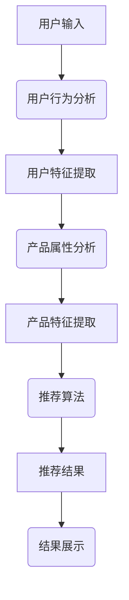
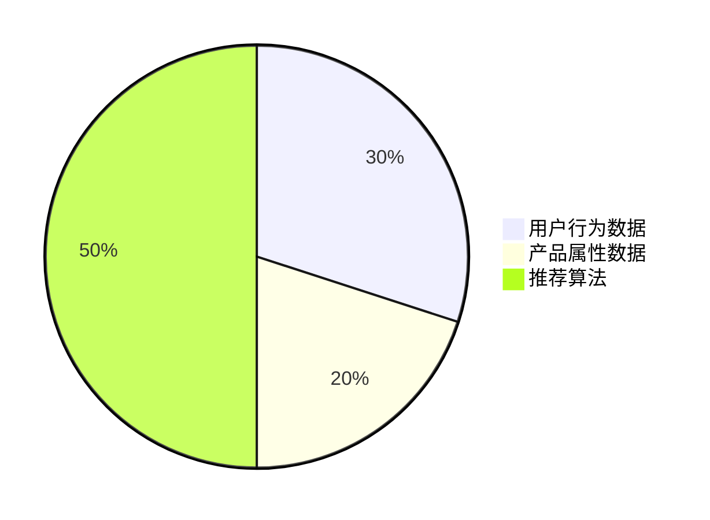

                 


# 《金融产品交叉销售推荐引擎优化》

---

## 关键词：
- 金融产品
- 交叉销售
- 推荐引擎
- 优化
- 机器学习
- 数据分析

---

## 摘要：
本文深入探讨了金融产品交叉销售推荐引擎的优化方法，结合金融领域的特点，分析了推荐系统的分类、算法原理、系统架构及优化策略。通过实际案例分析，展示了如何利用协同过滤、混合推荐模型等技术，提升推荐系统的准确性和实时性。文章内容涵盖背景介绍、核心概念、算法实现、系统设计、项目实战及优化技巧，为金融机构优化推荐引擎提供了理论和实践指导。

---

## 目录

### 第一部分: 金融产品交叉销售推荐引擎概述
- **第1章: 交叉销售推荐引擎的背景与意义**
  - 1.1 交叉销售的基本概念
  - 1.2 金融产品推荐的重要性
  - 1.3 推荐引擎优化的必要性

### 第二部分: 推荐引擎的核心算法与数学模型
- **第2章: 协同过滤算法原理**
  - 2.1 协同过滤的基本原理
  - 2.2 协同过滤的数学模型
  - 2.3 协同过滤的优化方法

- **第3章: 混合推荐模型的构建**
  - 3.1 混合推荐模型的核心概念
  - 3.2 混合推荐模型的实现方法
  - 3.3 混合推荐模型的优缺点

### 第三部分: 系统分析与架构设计
- **第4章: 系统功能设计**
  - 4.1 系统功能模块划分
  - 4.2 系统功能流程图
  - 4.3 系统功能实现细节

- **第5章: 系统架构设计**
  - 5.1 系统架构概述
  - 5.2 系统架构设计图
  - 5.3 系统架构实现细节

### 第四部分: 项目实战
- **第6章: 环境安装与配置**
  - 6.1 开发环境要求
  - 6.2 开发工具安装
  - 6.3 数据库配置

- **第7章: 核心代码实现**
  - 7.1 数据预处理代码
  - 7.2 推荐算法实现
  - 7.3 系统接口开发

### 第五部分: 优化技巧与最佳实践
- **第8章: 优化策略**
  - 8.1 数据预处理优化
  - 8.2 模型调优方法
  - 8.3 性能监控与优化

- **第9章: 最佳实践与注意事项**
  - 9.1 开发中的常见问题
  - 9.2 解决方案与技巧
  - 9.3 未来发展趋势

---

## 正文内容

### 第一部分: 金融产品交叉销售推荐引擎概述

#### 第1章: 交叉销售推荐引擎的背景与意义

##### 1.1 交叉销售的基本概念
交叉销售是一种销售策略，旨在通过推荐相关产品或服务，增加客户购买的产品数量或价值。在金融领域，交叉销售可以帮助客户发现适合他们的金融产品，同时增加金融机构的收入来源。

##### 1.2 金融产品推荐的重要性
金融产品的多样性和复杂性使得客户难以选择最适合自己的产品。通过推荐引擎，金融机构可以基于客户的偏好和市场动态，提供个性化的推荐，提升客户满意度和忠诚度。

##### 1.3 推荐引擎优化的必要性
现有的推荐引擎可能存在推荐准确率低、实时性差等问题。优化推荐引擎可以提高推荐的精准度，降低计算成本，从而提升用户体验和业务效果。

---

### 第二部分: 推荐引擎的核心算法与数学模型

#### 第2章: 协同过滤算法原理

##### 2.1 协同过滤的基本原理
协同过滤是一种基于用户行为相似性的推荐方法。基于用户的协同过滤通过寻找与当前用户行为相似的用户，推荐他们喜欢的产品；基于物品的协同过滤通过分析产品之间的相似性，推荐相关产品。

##### 2.2 协同过滤的数学模型
协同过滤的核心是计算用户或物品之间的相似度。常用的相似度计算公式如下：
$$ \text{相似度} = \frac{\sum_{i=1}^{n} (r_{ui} - \bar{r}_u)(r_{vi} - \bar{r}_v)}{\sqrt{\sum_{i=1}^{n} (r_{ui} - \bar{r}_u)^2} \cdot \sqrt{\sum_{i=1}^{n} (r_{vi} - \bar{r}_v)^2}} $$
其中，$\bar{r}_u$和$\bar{r}_v$分别是用户u和v的平均评分。

##### 2.3 协同过滤的优化方法
为了提高协同过滤的效率，可以采用矩阵分解方法，如奇异值分解（SVD）。矩阵分解可以将用户-物品评分矩阵分解为两个低维矩阵，从而减少计算复杂度。

---

#### 第3章: 混合推荐模型的构建

##### 3.1 混合推荐模型的核心概念
混合推荐模型结合了协同过滤和基于内容的推荐方法。通过将两种方法的结果进行加权融合，可以提高推荐的准确性和多样性。

##### 3.2 混合推荐模型的实现方法
混合推荐模型的实现可以分为以下几个步骤：
1. **数据预处理**：对用户行为数据和产品属性数据进行清洗和归一化处理。
2. **协同过滤推荐**：基于用户行为数据，计算用户之间的相似度，生成推荐列表。
3. **基于内容的推荐**：基于产品属性数据，计算产品之间的相似度，生成推荐列表。
4. **模型融合**：将协同过滤和基于内容的推荐结果进行加权融合，生成最终推荐列表。

##### 3.3 混合推荐模型的优缺点
混合推荐模型的优点在于能够结合多种推荐方法的优点，提高推荐的准确性和多样性。缺点在于实现复杂，需要处理多数据源和模型融合的问题。

---

### 第三部分: 系统分析与架构设计

#### 第4章: 系统功能设计

##### 4.1 系统功能模块划分
推荐引擎系统主要包括以下几个功能模块：
- **用户行为分析模块**：分析用户的点击、购买等行为，提取用户特征。
- **产品属性分析模块**：分析金融产品的属性，提取产品特征。
- **推荐算法模块**：实现协同过滤、基于内容的推荐和混合推荐算法。
- **推荐结果展示模块**：将推荐结果展示给用户。

##### 4.2 系统功能流程图


##### 4.3 系统功能实现细节
推荐算法模块是系统的核心，需要实现协同过滤、基于内容的推荐和混合推荐算法。以下是协同过滤算法的实现步骤：
1. **数据预处理**：对用户行为数据进行清洗和归一化处理。
2. **相似度计算**：计算用户或物品之间的相似度。
3. **推荐生成**：基于相似度计算，生成推荐列表。

---

#### 第5章: 系统架构设计

##### 5.1 系统架构概述
推荐引擎系统的架构主要包括以下几个部分：
- **数据层**：存储用户行为数据和产品属性数据。
- **计算层**：实现协同过滤、基于内容的推荐和混合推荐算法。
- **展示层**：将推荐结果展示给用户。

##### 5.2 系统架构设计图


##### 5.3 系统架构实现细节
数据层使用关系型数据库存储用户行为数据和产品属性数据。计算层使用分布式计算框架，如Spark，提高计算效率。展示层使用前端框架，如React，实现推荐结果的动态展示。

---

### 第四部分: 项目实战

#### 第6章: 环境安装与配置

##### 6.1 开发环境要求
推荐引擎开发需要以下环境：
- 操作系统：Linux/Windows/MacOS
- 编程语言：Python 3.6+
- 数据库：MySQL/PostgreSQL
- 开发工具：PyCharm/VS Code

##### 6.2 开发工具安装
安装Python和必要的库：
```bash
pip install numpy pandas scikit-learn
```

##### 6.3 数据库配置
配置数据库连接：
```python
import mysql.connector

cnx = mysql.connector.connect(
    host='localhost',
    user='root',
    password='password',
    database='financial_products'
)
```

---

#### 第7章: 核心代码实现

##### 7.1 数据预处理代码
```python
import pandas as pd
from sklearn.preprocessing import StandardScaler

# 加载数据
data = pd.read_csv('user_behavior.csv')

# 数据清洗
data.dropna(inplace=True)

# 数据归一化
scaler = StandardScaler()
data_scaled = scaler.fit_transform(data)
```

##### 7.2 推荐算法实现
协同过滤算法实现：
```python
from sklearn.metrics.pairwise import cosine_similarity

# 计算相似度矩阵
similarity_matrix = cosine_similarity(data_scaled)

# 生成推荐列表
def get_recommendations(user_id, similarity_matrix, top_n=5):
    user_index = user_id
    similar_users = [i for i in range(len(similarity_matrix[user_index]))]
    similar_users.sort(key=lambda x: similarity_matrix[user_index][x], reverse=True)
    recommendations = similar_users[:top_n]
    return recommendations
```

##### 7.3 系统接口开发
定义REST接口：
```python
from flask import Flask, jsonify

app = Flask(__name__)

@app.route('/recommend', methods=['POST'])
def recommend():
    data = request.json
    user_id = data['user_id']
    top_n = data['top_n']
    recommendations = get_recommendations(user_id, similarity_matrix, top_n)
    return jsonify({'recommendations': recommendations})
```

---

### 第五部分: 优化技巧与最佳实践

#### 第8章: 优化策略

##### 8.1 数据预处理优化
- 数据清洗：删除无效数据，减少计算量。
- 数据归一化：提高模型的收敛速度。

##### 8.2 模型调优方法
- 参数调优：通过网格搜索找到最优参数。
- 模型融合：结合多种推荐方法，提高推荐的准确率。

##### 8.3 性能监控与优化
- 使用监控工具，实时监控系统的性能。
- 优化算法复杂度，减少计算时间。

#### 第9章: 最佳实践与注意事项

##### 9.1 开发中的常见问题
- 数据稀疏性：数据量不足时，推荐准确率低。
- 计算复杂度：大规模数据时，计算时间长。

##### 9.2 解决方案与技巧
- 使用矩阵分解方法，降低计算复杂度。
- 采用分布式计算框架，提高计算效率。

##### 9.3 未来发展趋势
- 结合深度学习，提高推荐的准确性和多样性。
- 利用实时数据流，实现动态推荐。

---

### 第六部分: 案例分析与总结

#### 第10章: 案例分析
通过一个实际案例，展示优化后的推荐引擎在金融产品交叉销售中的应用效果。案例包括数据预处理、算法实现、系统设计和优化策略等步骤。

#### 第11章: 总结
总结全文内容，强调优化推荐引擎的重要性，并展望未来的发展趋势。

---

通过以上内容，读者可以全面了解金融产品交叉销售推荐引擎的优化方法，掌握推荐系统的实现技术和优化策略，为实际应用提供理论和实践指导。

