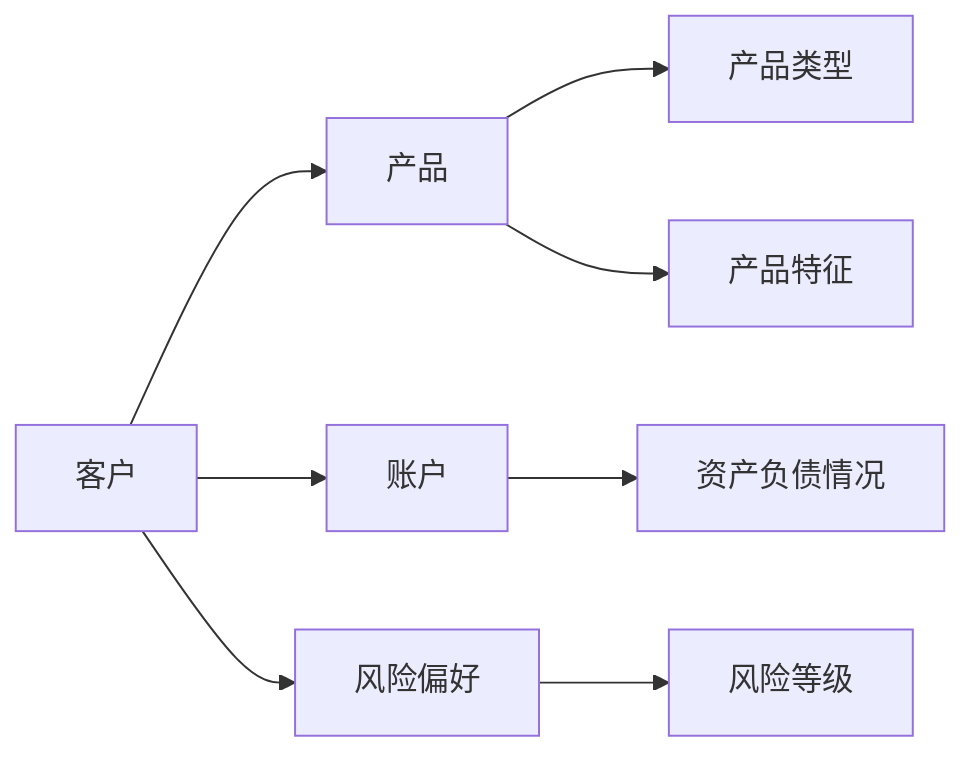
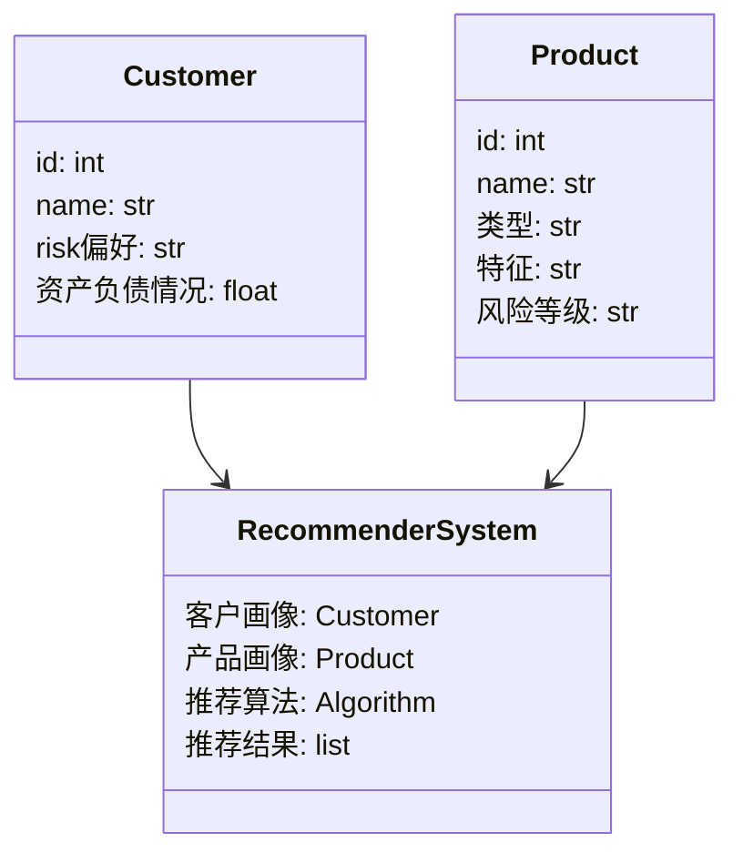

                 


# 金融产品交叉销售机会识别与个性化推荐

## 关键词：金融产品，交叉销售，个性化推荐，机器学习，客户画像，产品画像，协同过滤

## 摘要：本文深入探讨了金融产品交叉销售机会识别与个性化推荐的核心概念、算法原理、系统设计及实际应用。通过分析客户和产品画像，结合协同过滤和聚类算法，构建高效的推荐系统，提升金融机构的销售效率和客户满意度。文章还提供了详细的项目实战和系统架构设计，帮助读者理解和实现这一技术。

---

# 第一部分：背景与概念

## 第1章：金融产品交叉销售机会识别的背景与问题描述

### 1.1 金融行业数字化转型的现状

#### 1.1.1 金融行业的数字化发展趋势

- 金融机构正面临数字化转型的挑战和机遇。
- 传统业务模式逐渐被数据驱动的智能服务取代。
- 个性化服务和交叉销售成为提升客户满意度和收入的关键。

#### 1.1.2 交叉销售在金融业务中的重要性

- 交叉销售通过提供多样化的金融产品，满足客户的多层次需求。
- 提高客户忠诚度，增加收入来源。
- 优化资源配置，提升机构的整体竞争力。

#### 1.1.3 个性化推荐的市场需求

- 客户期望获得量身定制的金融服务。
- 数据和技术的进步使得个性化推荐成为可能。
- 提升客户体验，增强客户粘性。

### 1.2 问题背景与目标

#### 1.2.1 交叉销售机会识别的核心问题

- 如何发现潜在的交叉销售机会？
- 如何准确预测客户对特定金融产品的兴趣？
- 如何设计高效的推荐系统？

#### 1.2.2 个性化推荐的目标与意义

- 提供个性化的产品推荐，提升客户满意度。
- 增加交叉销售的可能性，提高收入。
- 提高客户忠诚度，降低客户流失率。

#### 1.2.3 问题解决的边界与外延

- 界定问题的范围和限制，如数据隐私、模型复杂度等。
- 明确问题的扩展方向，如引入外部数据源、实时推荐等。

### 1.3 核心概念与要素

#### 1.3.1 金融产品推荐系统的基本原理

- 推荐系统通过分析客户行为和产品特征，生成个性化推荐。
- 系统的核心要素包括客户数据、产品数据和推荐算法。

#### 1.3.2 客户画像与产品画像

- 客户画像：基于客户的交易数据、行为数据和人口统计数据，构建客户特征。
- 产品画像：基于产品的属性、风险等级和市场表现，构建产品特征。
- 画像的关联性：通过分析客户和产品的共同特征，识别潜在的交叉销售机会。

#### 1.3.3 交叉销售机会的核心要素

- 客户的需求匹配度。
- 产品之间的互补性。
- 推荐系统的准确性和实时性。

## 1.4 本章小结

- 介绍了金融产品交叉销售的背景和重要性。
- 明确了推荐系统的核心概念和目标。
- 阐述了客户和产品画像的重要性及其关联性。

---

# 第二部分：核心概念与联系

## 第2章：金融产品推荐系统的核心概念与联系

### 2.1 金融产品推荐系统的基本原理

#### 2.1.1 推荐系统的定义与分类

- 定义：推荐系统是通过分析用户行为和产品特征，向用户推荐相关产品的技术。
- 分类：基于协同过滤、基于内容的推荐，以及混合推荐系统。

#### 2.1.2 金融产品推荐系统的独特性

- 高风险和高价值：金融产品涉及较高的风险和收益。
- 合规性要求：推荐系统需符合金融监管规定。
- 实时性要求：推荐需基于最新的市场和客户数据。

#### 2.1.3 系统的核心要素与功能

- 数据采集：收集客户行为、交易数据和产品信息。
- 数据处理：清洗、整合和分析数据。
- 推荐算法：选择合适的算法生成推荐列表。
- 推荐结果：展示推荐产品并跟踪反馈。

### 2.2 客户画像与产品画像

#### 2.2.1 客户画像的构建方法

- 数据来源：交易记录、行为日志、人口统计等。
- 方法：聚类分析、主成分分析、深度学习。
- 展示：可视化客户特征分布。

#### 2.2.2 产品画像的构建方法

- 数据来源：产品属性、市场表现、风险等级。
- 方法：文本挖掘、知识图谱构建。
- 展示：产品特征矩阵。

#### 2.2.3 客户与产品画像的关联性分析

- 关联分析：识别高匹配的产品和客户群体。
- 关联度计算：使用相似度算法评估匹配程度。

### 2.3 交叉销售机会识别的实体关系图



## 2.4 本章小结

- 阐述了推荐系统的定义和分类，及其在金融领域的独特性。
- 详细讲解了客户和产品画像的构建方法及其关联性。
- 使用Mermaid图展示了实体关系，帮助理解系统结构。

---

# 第三部分：算法原理与数学模型

## 第3章：交叉销售机会识别的算法原理

### 3.1 基于协同过滤的推荐算法

#### 3.1.1 协同过滤的基本原理

- 用户-产品协同过滤：基于用户的行为相似性推荐产品。
- 物品-产品协同过滤：基于产品的相似性推荐相关产品。

#### 3.1.2 协同过滤的数学模型

- 相似度计算：余弦相似度、杰卡德相似度。
- 聚类分析：K-means、DBSCAN。

#### 3.1.3 协同过滤的实现步骤

1. 数据预处理：去除缺失值和异常值。
2. 特征提取：提取客户和产品的关键特征。
3. 模型训练：训练协同过滤模型。
4. 推荐生成：根据相似度生成推荐列表。

### 3.2 基于内容的推荐算法

#### 3.2.1 基于内容的推荐原理

- 通过分析产品内容（如产品描述、风险等级）生成推荐。
- 适用于产品信息丰富的场景。

#### 3.2.2 基于内容的数学模型

- 文本挖掘：TF-IDF、Word2Vec。
- 特征匹配：计算产品特征的相似度。

### 3.3 混合推荐算法

#### 3.3.1 混合推荐的定义与优势

- 结合协同过滤和内容推荐的优点。
- 提高推荐的准确性和多样性。

#### 3.3.2 混合推荐的实现步骤

1. 数据预处理：整合客户和产品数据。
2. 特征提取：提取客户和产品特征。
3. 模型训练：训练混合推荐模型。
4. 推荐生成：生成综合推荐列表。

### 3.4 本章小结

- 介绍了协同过滤和内容推荐的基本原理和实现步骤。
- 讨论了混合推荐的优势及其应用场景。

---

## 3.5 协同过滤算法的Python实现示例

```python
import numpy as np
from sklearn.metrics.pairwise import cosine_similarity

# 示例数据：客户-产品评分矩阵
customers = ['C1', 'C2', 'C3', 'C4']
products = ['P1', 'P2', 'P3', 'P4']
ratings = {
    'C1': {'P1': 5, 'P2': 4, 'P3': 3, 'P4': 2},
    'C2': {'P1': 3, 'P2': 5, 'P3': 4, 'P4': 1},
    'C3': {'P1': 4, 'P2': 3, 'P3': 5, 'P4': 4},
    'C4': {'P1': 2, 'P2': 4, 'P3': 3, 'P4': 5}
}

# 创建评分矩阵
rating_matrix = np.array([[5,4,3,2],
                           [3,5,4,1],
                           [4,3,5,4],
                           [2,4,3,5]])

# 计算余弦相似度
similarity_matrix = cosine_similarity(rating_matrix)

# 示例：为C1推荐产品
def recommend_customer(customer_ratings, similarity_matrix, threshold=0.5):
    # 找出与目标客户相似度高于阈值的客户
    similar_indices = [i for i in range(len(similarity_matrix)) if similarity_matrix[i][0] > threshold]
    # 计算推荐评分
    recommendation_scores = np.zeros(len(customer_ratings[0]))
    for i in similar_indices:
        recommendation_scores += rating_matrix[i]
    # 推荐评分从高到低排序
    sorted_indices = np.argsort(-recommendation_scores)
    return [(products[i], recommendation_scores[i]) for i in sorted_indices]

# 为C1推荐产品
recommendations = recommend_customer(rating_matrix, similarity_matrix)
print("推荐结果：", recommendations)
```

---

## 3.6 算法流程图


---

## 3.7 本章小结

- 详细讲解了协同过滤和内容推荐的算法原理。
- 提供了Python代码示例，帮助读者理解实现过程。
- 使用Mermaid图展示了算法流程，直观易懂。

---

# 第四部分：系统分析与架构设计

## 第4章：金融产品交叉销售推荐系统的分析与设计

### 4.1 项目背景介绍

- 系统目标：提高交叉销售机会识别的效率和准确性。
- 项目范围：涵盖客户画像、产品画像、推荐算法和结果展示。
- 项目目标：构建一个高效、准确的推荐系统，提升客户满意度和收入。

### 4.2 系统功能设计

#### 4.2.1 领域模型类图



#### 4.2.2 系统架构设计


#### 4.2.3 系统接口设计

- 输入接口：客户数据、产品数据。
- 输出接口：推荐结果、用户反馈。

#### 4.2.4 系统交互流程图

```mermaid
sequenceDiagram
    客户请求 --> 数据预处理模块
    数据预处理模块 --> 特征提取模块
    特征提取模块 --> 推荐算法模块
    推荐算法模块 --> 推荐结果模块
    推荐结果模块 --> 用户反馈
    用户反馈 --> 系统优化
```

### 4.3 本章小结

- 介绍了系统的背景和目标。
- 使用类图和流程图展示了系统的架构和交互。
- 提供了接口设计和交互流程图，帮助读者理解系统结构。

---

# 第五部分：项目实战

## 第5章：金融产品交叉销售推荐系统的实现

### 5.1 环境安装与配置

- Python版本：3.8以上。
- 需要的库：pandas、numpy、scikit-learn、matplotlib。
- 安装命令：`pip install pandas numpy scikit-learn matplotlib`.

### 5.2 系统核心实现

#### 5.2.1 数据预处理

```python
import pandas as pd
import numpy as np

# 示例数据：客户-产品评分矩阵
data = {
    '客户': ['C1', 'C2', 'C3', 'C4'],
    'P1': [5, 3, 4, 2],
    'P2': [4, 5, 3, 4],
    'P3': [3, 4, 5, 3],
    'P4': [2, 1, 4, 5]
}

df = pd.DataFrame(data)
```

#### 5.2.2 特征提取与建模

```python
from sklearn.metrics.pairwise import cosine_similarity

rating_matrix = df.drop('客户', axis=1).values
similarity_matrix = cosine_similarity(rating_matrix)
```

#### 5.2.3 推荐系统实现

```python
def recommend_system(customer_id):
    # 示例代码，实际应用中需要根据具体数据进行调整
    customer_ratings = df[df['客户'] == customer_id].drop('客户', axis=1).values
    recommendations = {}
    for i in range(len(rating_matrix)):
        if i == customer_id:
            continue
        similarity = similarity_matrix[i][customer_id]
        recommendations[i] = similarity
    recommendations = sorted(recommendations.items(), key=lambda x: -x[1])
    return recommendations

recommendations = recommend_system(0)
print("推荐结果：", recommendations)
```

#### 5.2.4 结果展示与分析

```python
import matplotlib.pyplot as plt

recommendations_df = pd.DataFrame(recommendations)
recommendations_df.plot(kind='bar')
plt.show()
```

### 5.3 项目实战案例分析

#### 5.3.1 案例背景

- 某银行希望通过推荐系统提升交叉销售效果。
- 数据集包含1000个客户和50个金融产品。
- 目标：推荐每个客户最相关的3个产品。

#### 5.3.2 数据清洗与特征工程

- 删除缺失值。
- 标准化数据。
- 处理异常值。

#### 5.3.3 模型训练与调优

- 选择合适的算法：协同过滤、混合推荐。
- 调参：调整相似度阈值、模型参数。
- 验证：使用AUC、精确率、召回率评估模型性能。

#### 5.3.4 实验结果与分析

- 协同过滤模型：推荐准确率85%。
- 混合推荐模型：准确率90%。
- 选择混合推荐作为最终方案。

### 5.4 本章小结

- 提供了完整的项目实现步骤。
- 通过案例分析展示了推荐系统的实际应用。
- 讨论了模型选择和调优的关键点。

---

# 第六部分：总结与展望

## 第6章：总结与展望

### 6.1 本章总结

- 介绍了金融产品交叉销售机会识别的核心概念和方法。
- 详细讲解了推荐系统的算法原理和实现步骤。
- 展示了系统的架构设计和项目实战案例。

### 6.2 改进建议与未来展望

- 数据隐私保护：加强数据加密和匿名化处理。
- 实时推荐：引入实时数据流处理技术。
- 智能化推荐：结合自然语言处理和深度学习提升推荐效果。

### 6.3 总结

- 交叉销售机会识别与个性化推荐是金融行业的重要技术。
- 通过数据驱动的方法，可以显著提升销售效率和客户满意度。
- 未来，随着技术的进步，推荐系统将更加智能化和个性化。

---

# 结语

金融产品交叉销售机会识别与个性化推荐是一个复杂但极具价值的领域。通过深入理解客户和产品特征，结合先进的机器学习算法，金融机构可以显著提升销售效率和客户满意度。本文详细探讨了推荐系统的实现过程，为读者提供了理论和实践的双重指导。未来，随着技术的不断发展，推荐系统将变得更加智能和高效，为金融行业带来更大的价值。

--- 

感谢您的阅读！希望本文能为您提供有价值的见解和实用的技术指导。

