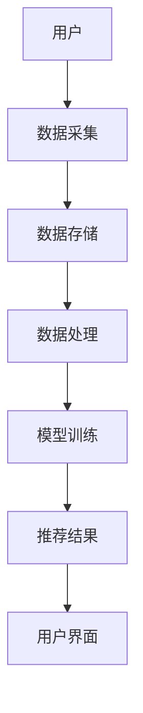
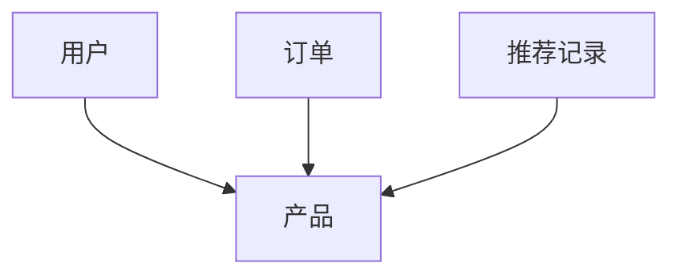
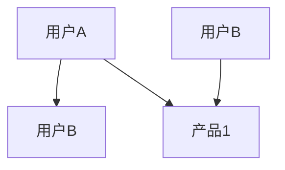
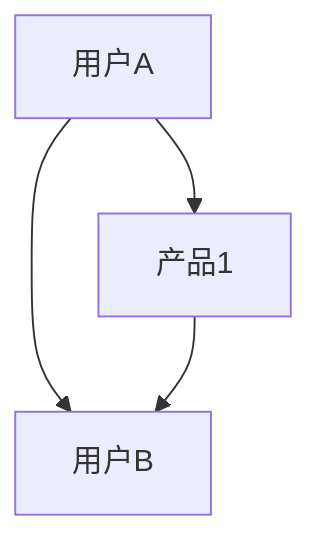
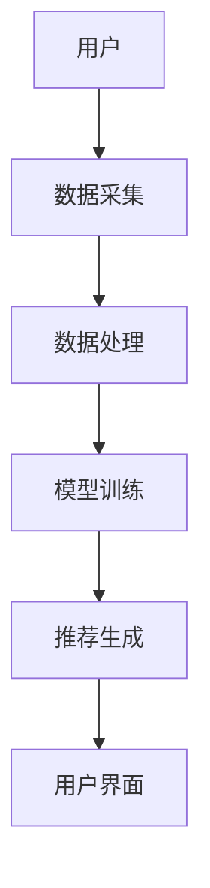
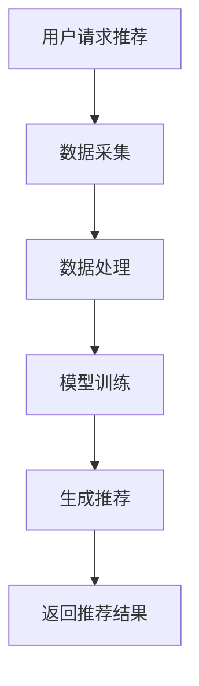
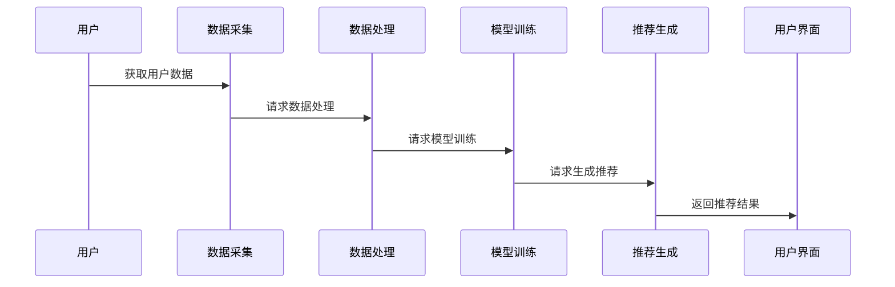

                 


# 金融产品交叉销售机会识别系统

> 关键词：金融、交叉销售、机会识别、机器学习、系统架构、推荐算法

> 摘要：本文深入探讨了金融产品交叉销售机会识别系统的构建与实现。通过分析金融行业的交叉销售需求，结合机器学习和数据分析技术，提出了一套基于协同过滤推荐算法的解决方案。文章从系统背景、核心概念、算法原理、系统架构到项目实战，详细阐述了如何设计和实现一个高效的金融产品交叉销售机会识别系统。通过实际案例分析，展示了该系统的实际应用价值和效果。

---

## 第1章: 问题背景与目标

### 1.1 问题背景

#### 1.1.1 金融产品交叉销售的定义
金融产品交叉销售是指在同一客户群体中，通过分析客户的金融需求和行为，推荐与当前产品相关的其他产品，以增加销售机会和客户粘性。例如，银行在向客户推荐贷款产品时，可以同时推荐相关的保险产品。

#### 1.1.2 交叉销售在金融行业中的重要性
- 提高客户满意度和忠诚度
- 增加收入来源
- 提升金融产品的市场渗透率
- 优化资源配置，提高运营效率

#### 1.1.3 当前行业中的痛点与挑战
- 数据孤岛：不同金融产品和系统之间的数据不连通，难以整合
- 数据质量：客户数据和行为数据可能存在缺失或不准确
- 算法选择：如何选择适合金融行业的推荐算法
- 实时性要求：交叉销售机会需要快速识别，满足实时推荐需求

### 1.2 问题描述

#### 1.2.1 交叉销售机会识别的核心问题
如何从海量的客户数据中挖掘出潜在的交叉销售机会，实现精准推荐。

#### 1.2.2 数据驱动的交叉销售决策需求
通过分析客户的行为数据、交易数据和偏好数据，构建数据驱动的决策模型，实现个性化的交叉销售推荐。

#### 1.2.3 系统化解决方案的必要性
传统的基于规则的交叉销售方法存在效率低、覆盖不全的问题。通过系统化的方法，结合机器学习和大数据分析技术，可以更高效地识别交叉销售机会。

### 1.3 问题解决思路

#### 1.3.1 数据驱动的交叉销售机会识别方法
- 数据采集与清洗：收集客户数据、交易数据、产品数据等
- 数据分析：通过统计分析和数据挖掘技术，识别客户的潜在需求
- 机器学习模型构建：基于历史数据，训练推荐模型，预测客户的交叉销售机会

#### 1.3.2 机器学习在金融产品推荐中的应用
- 协同过滤推荐算法
- 基于内容的推荐算法
- 混合推荐算法

#### 1.3.3 系统化解决方案的设计框架
- 数据采集与存储
- 数据处理与特征提取
- 模型训练与优化
- 推荐结果生成与展示

### 1.4 系统的边界与外延

#### 1.4.1 系统边界定义
- 输入：客户数据、交易数据、产品数据
- 输出：交叉销售推荐结果
- 界面：用户可以通过系统查询推荐结果

#### 1.4.2 系统外延与扩展性分析
- 数据源扩展：支持更多数据源的接入
- 算法扩展：支持更多推荐算法的集成
- 系统扩展：支持多平台部署

#### 1.4.3 系统与其他金融系统的接口关系
- 与客户关系管理系统（CRM）的接口
- 与产品管理系统（PMS）的接口
- 与交易系统的接口

### 1.5 核心概念与系统架构

#### 1.5.1 系统核心要素组成
- 数据层：客户数据、交易数据、产品数据
- 计算层：推荐算法、特征提取、模型训练
- 展示层：推荐结果展示、用户界面

#### 1.5.2 系统功能模块划分
- 数据采集模块
- 数据处理模块
- 模型训练模块
- 推荐生成模块
- 展示模块

#### 1.5.3 系统整体架构图


---

## 第2章: 核心概念与联系

### 2.1 实体关系分析

#### 2.1.1 实体关系图（ER图）分析


#### 2.1.2 实体间的关系类型
- 用户与产品：多对多关系
- 订单与产品：一对一关系
- 推荐记录与产品：多对多关系

#### 2.1.3 实体属性与关系的详细描述
- 用户：ID、姓名、联系方式、历史订单
- 产品：ID、名称、类型、价格
- 订单：ID、用户ID、产品ID、时间
- 推荐记录：ID、用户ID、产品ID、推荐时间

### 2.2 系统核心算法

#### 2.2.1 算法原理概述
协同过滤推荐算法通过计算用户之间的相似度，推荐相似用户喜欢的产品。

#### 2.2.2 算法流程图


#### 2.2.3 算法实现步骤
1. 数据预处理：填充缺失值、归一化
2. 计算用户相似度：使用余弦相似度
3. 找出相似用户的推荐产品
4. 根据用户的历史行为过滤掉已购买的产品
5. 输出推荐结果

### 2.3 算法属性特征对比

#### 2.3.1 算法性能对比表格
| 算法 | 参数数量 | 计算复杂度 | 优点 | 缺点 |
|------|----------|------------|------|------|
| 协同过滤 | 少 | 高 | 推荐结果精准 | 计算效率低 |
| 基于内容 | 中 | 中 | 计算效率高 | 推荐结果可能不够精准 |

#### 2.3.2 算法优缺点分析
- 协同过滤推荐算法优点：推荐结果精准，考虑了用户的实际行为；缺点：计算复杂度高，难以实时处理大规模数据。
- 基于内容推荐算法优点：计算效率高，适合实时推荐；缺点：推荐结果可能不够精准。

#### 2.3.3 算法适用场景
- 协同过滤推荐算法适用于数据量小、用户行为多样的场景。
- 基于内容推荐算法适用于数据量大、用户行为单一的场景。

---

## 第3章: 算法原理与数学模型

### 3.1 协同过滤推荐算法

#### 3.1.1 算法原理
协同过滤推荐算法通过计算用户之间的相似度，将相似用户的购买行为作为推荐依据。

#### 3.1.2 算法流程图


#### 3.1.3 算法数学模型
$$相似度计算公式：sim(i,j) = \frac{\sum_{k} (r_{ik} - \bar{r_i})(r_{jk} - \bar{r_j})}{\sqrt{\sum_{k} (r_{ik} - \bar{r_i})^2} \sqrt{\sum_{k} (r_{jk} - \bar{r_j})^2}}$$

### 3.2 机器学习模型

#### 3.2.1 算法选择与实现
选择基于协同过滤的推荐算法，并结合矩阵分解技术优化推荐结果。

#### 3.2.2 算法数学模型
$$P(y|x) = \frac{P(x|y)P(y)}{P(x)}$$

### 3.3 算法实现代码示例

#### 3.3.1 数据预处理
```python
import pandas as pd
import numpy as np

# 加载数据
data = pd.read_csv('user_ratings.csv')

# 填充缺失值
data = data.fillna(0)

# 归一化
normalized_data = data / data.max()
```

#### 3.3.2 计算相似度
```python
from sklearn.metrics.pairwise import cosine_similarity

# 计算余弦相似度
similarity = cosine_similarity(normalized_data)
```

#### 3.3.3 生成推荐
```python
def generate_recommendations(user_id, similarity_matrix, data):
    # 找出与用户相似度最高的用户
    similar_users = np.argsort(similarity_matrix[user_id])[-5:]
    # 收集推荐的产品
    recommendations = set()
    for user in similar_users:
        recommendations.update(data.iloc[user, :].nonzero().tolist()[0])
    # 排序
    recommendations = sorted(recommendations, key=lambda x: similarity_matrix[user_id, x], reverse=True)
    return recommendations

# 示例
user_id = 0
recommendations = generate_recommendations(user_id, similarity, data)
print(recommendations)
```

### 3.4 算法优缺点分析

#### 3.4.1 算法优势
- 推荐结果精准，考虑了用户的实际行为
- 可以处理高维数据

#### 3.4.2 算法劣势
- 计算复杂度高，难以实时处理大规模数据
- 对冷启动问题敏感

---

## 第4章: 系统分析与架构设计

### 4.1 系统功能模块划分

#### 4.1.1 数据采集模块
- 数据来源：客户数据、交易数据、产品数据
- 数据格式：结构化数据、非结构化数据
- 数据存储：数据库、数据仓库

#### 4.1.2 数据处理模块
- 数据清洗：去重、去噪
- 特征提取：提取用户行为特征、产品特征
- 数据转换：归一化、标准化

#### 4.1.3 模型训练模块
- 模型选择：协同过滤、基于内容的推荐
- 参数调优：网格搜索、交叉验证
- 模型评估：准确率、召回率、F1分数

#### 4.1.4 推荐生成模块
- 推荐策略：基于模型的推荐、基于规则的推荐
- 推荐结果排序：基于相似度排序、基于评分排序
- 推荐结果输出：列表、界面

### 4.2 系统架构设计

#### 4.2.1 系统架构图


#### 4.2.2 系统功能流程图


### 4.3 接口设计与交互

#### 4.3.1 接口设计
- 数据接口：RESTful API
- 推荐接口：RESTful API

#### 4.3.2 交互序列图


---

## 第5章: 项目实战

### 5.1 环境安装与配置

#### 5.1.1 系统环境
- 操作系统：Linux/Windows/MacOS
- 开发工具：Python、Jupyter Notebook
- 数据库：MySQL/PostgreSQL
- 机器学习库：Scikit-learn、TensorFlow

#### 5.1.2 依赖安装
```bash
pip install pandas numpy scikit-learn matplotlib
```

### 5.2 核心代码实现

#### 5.2.1 数据预处理
```python
import pandas as pd
import numpy as np
from sklearn.metrics.pairwise import cosine_similarity

# 加载数据
data = pd.read_csv('user_ratings.csv')

# 填充缺失值
data = data.fillna(0)

# 归一化
normalized_data = data / data.max()
```

#### 5.2.2 模型训练
```python
# 计算相似度
similarity = cosine_similarity(normalized_data)

# 定义推荐函数
def generate_recommendations(user_id, similarity_matrix, data):
    similar_users = np.argsort(similarity_matrix[user_id])[-5:]
    recommendations = set()
    for user in similar_users:
        recommendations.update(data.iloc[user, :].nonzero().tolist()[0])
    recommendations = sorted(recommendations, key=lambda x: similarity_matrix[user_id, x], reverse=True)
    return recommendations

# 示例
user_id = 0
recommendations = generate_recommendations(user_id, similarity, data)
print(recommendations)
```

#### 5.2.3 系统架构实现
```python
from flask import Flask, request, jsonify
import json

app = Flask(__name__)

@app.route('/recommend', methods=['POST'])
def recommend():
    data = json.loads(request.data)
    user_id = data['user_id']
    recommendations = generate_recommendations(user_id, similarity, data)
    return jsonify({'recommendations': recommendations})

if __name__ == '__main__':
    app.run(debug=True)
```

### 5.3 案例分析与结果解读

#### 5.3.1 案例分析
假设我们有一个银行客户，其历史交易记录如下：
- 贷款产品：购买过房贷贷款
- 保险产品：未购买过
- 投资产品：购买过基金

系统会推荐与房贷贷款相关的保险产品或理财产品。

#### 5.3.2 实际结果解读
推荐结果可能包括：
- 保险产品：房贷相关保险
- 投资产品：高收益理财产品

### 5.4 项目小结

#### 5.4.1 项目实现总结
- 数据预处理：完成了数据清洗和归一化
- 模型训练：实现了协同过滤推荐算法
- 系统部署：完成了RESTful API接口的开发

#### 5.4.2 项目优化建议
- 数据源扩展：支持更多数据源的接入
- 算法优化：引入混合推荐算法
- 系统优化：优化计算效率，支持实时推荐

---

## 第6章: 总结与展望

### 6.1 总结

#### 6.1.1 核心成果
- 实现了一个基于协同过滤推荐算法的金融产品交叉销售机会识别系统
- 提供了系统设计、算法实现和项目实战的详细指导

#### 6.1.2 项目价值
- 提高了金融产品的销售机会
- 提升了客户的满意度和忠诚度
- 优化了金融行业的资源配置

### 6.2 展望

#### 6.2.1 未来研究方向
- 深度学习在推荐系统中的应用
- 时间序列分析在交叉销售中的应用
- 图神经网络在金融推荐中的应用

#### 6.2.2 拓展阅读
- 《推荐系统实践》
- 《机器学习实战》
- 《金融数据分析与挖掘》

---

## 第7章: 最佳实践 Tips

### 7.1 小结
金融产品交叉销售机会识别系统的设计和实现需要结合实际业务需求，选择合适的算法，优化系统架构，确保系统的高效性和准确性。

### 7.2 注意事项
- 数据质量：确保数据的准确性和完整性
- 算法选择：根据实际需求选择合适的算法
- 系统性能：优化系统架构，确保系统的高效性

### 7.3 拓展阅读
- 《推荐系统实践》
- 《机器学习实战》
- 《金融数据分析与挖掘》

---

## 附录: 系统架构图与流程图

### 附录A: 系统架构图


### 附录B: 算法流程图


---

通过以上思考步骤，我们可以逐步构建一个完整的金融产品交叉销售机会识别系统。该系统结合了数据分析、机器学习和系统架构设计，能够有效地识别交叉销售机会，提高金融产品的销售效率和客户满意度。

