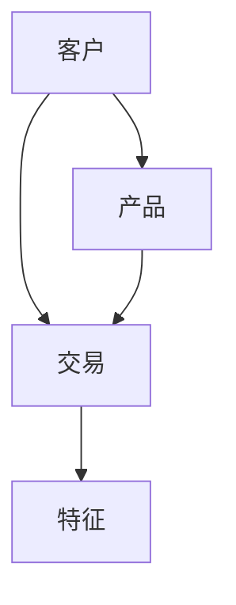
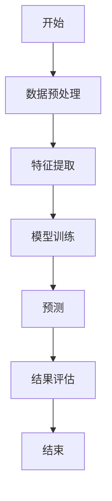
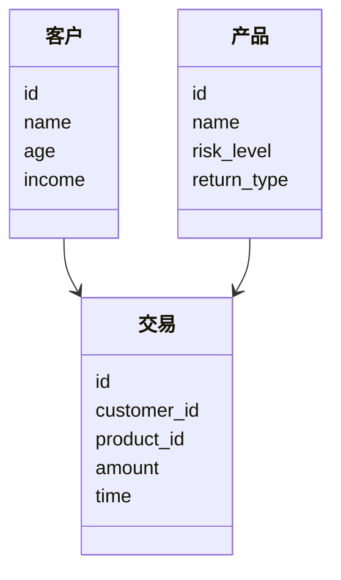
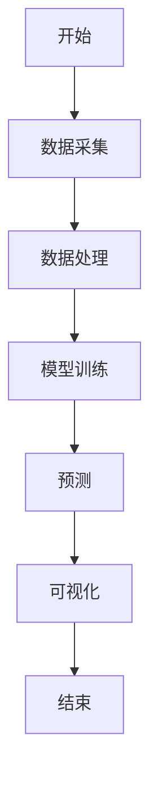

                 


# 金融产品交叉销售预测引擎

> 关键词：金融产品、交叉销售、预测引擎、机器学习、数据挖掘、推荐系统

> 摘要：本文详细探讨了金融产品交叉销售预测引擎的设计与实现，结合数据挖掘、机器学习和推荐系统的核心原理，通过系统化的分析和设计，构建了一个高效的预测引擎。文章从背景、核心概念、算法原理、系统架构、项目实战等多个维度展开，深入分析了交叉销售预测的关键技术，并通过实际案例展示了预测引擎的应用效果。

---

# 第一部分: 金融产品交叉销售预测引擎概述

## 第1章: 问题背景与目标

### 1.1 问题背景

#### 1.1.1 金融行业的交叉销售现状
金融行业一直是数据驱动型行业的代表。随着市场竞争的加剧，金融机构需要通过交叉销售来提高客户满意度和市场份额。然而，传统的交叉销售方式依赖于人工经验判断，存在效率低、精准度差的问题。

#### 1.1.2 传统交叉销售的局限性
传统交叉销售主要依赖销售人员的经验判断，存在以下问题：
- 数据分散：客户行为数据、交易数据、产品数据分布在不同系统中，难以整合。
- 预测不精准：缺乏系统化的数据挖掘和机器学习技术支持。
- 效率低下：人工判断耗时长，难以应对海量数据和客户。

#### 1.1.3 数据驱动的销售预测需求
随着大数据技术的发展，金融机构可以通过数据挖掘和机器学习技术，从海量数据中提取客户行为和产品关联性的规律，从而实现精准的交叉销售预测。

---

### 1.2 问题描述

#### 1.2.1 客户行为分析的挑战
客户行为分析需要考虑以下因素：
- 客户的基本信息（年龄、收入、职业等）。
- 客户的历史交易记录。
- 客户的产品偏好。

#### 1.2.2 产品关联性分析的复杂性
产品关联性分析需要考虑以下因素：
- 产品的属性（风险等级、收益类型、期限等）。
- 产品的市场表现。
- 客户购买产品的历史关联性。

#### 1.2.3 预测模型的准确性要求
交叉销售预测模型需要满足以下要求：
- 高准确性：能够准确预测客户购买多个产品的概率。
- 高效率：能够在短时间内处理海量数据并输出结果。
- 高可解释性：模型的决策过程需要可解释，便于业务人员理解。

---

### 1.3 问题解决思路

#### 1.3.1 数据驱动的预测方法
通过收集和分析客户行为数据、交易数据和产品数据，利用数据挖掘技术提取特征，构建预测模型。

#### 1.3.2 智能算法的应用
采用机器学习算法（如协同过滤、随机森林、梯度提升树）进行建模和预测。

#### 1.3.3 系统化解决方案的设计
设计一个系统化的解决方案，包括数据采集、特征工程、模型训练、结果输出和可视化等模块。

---

### 1.4 问题的边界与外延

#### 1.4.1 数据范围的界定
- 数据来源：客户行为数据、交易数据、产品数据。
- 数据范围：支持多维度特征分析。

#### 1.4.2 预测场景的限制
- 预测目标：客户购买多个产品的概率。
- 预测时间范围：基于历史数据预测未来行为。

#### 1.4.3 系统功能的扩展性
- 支持多种算法模型的扩展。
- 支持实时预测和批量预测。

---

## 第2章: 核心概念与联系

### 2.1 核心概念原理

#### 2.1.1 交叉销售预测的定义
交叉销售预测是基于客户行为数据和产品数据，预测客户购买多个产品的概率。

#### 2.1.2 数据挖掘与机器学习的结合
- 数据挖掘：从海量数据中提取特征。
- 机器学习：基于特征构建预测模型。

#### 2.1.3 金融产品特征分析
- 产品特征：风险、收益、期限等。
- 客户特征：年龄、收入、投资偏好等。

---

### 2.2 核心概念属性对比

#### 2.2.1 客户行为特征对比表
| 特征类型 | 特征描述 | 示例 |
|----------|----------|------|
| 基本特征 | 年龄、性别、职业 | 年龄：30岁 |
| 行为特征 | 购买频率、购买金额 | 购买频率：每周一次 |

#### 2.2.2 产品关联性特征对比表
| 特征类型 | 特征描述 | 示例 |
|----------|----------|------|
| 产品属性 | 风险等级、收益类型 | 风险等级：低风险 |
| 关联性特征 | 历史购买记录 | 历史购买记录：购买过基金和保险 |

#### 2.2.3 时间序列特征对比表
| 特征类型 | 特征描述 | 示例 |
|----------|----------|------|
| 时间特征 | 购买时间间隔 | 购买时间间隔：1周 |
| 趋势特征 | 购买金额变化趋势 | 购买金额变化趋势：上升 |

---

### 2.3 ER实体关系图



---

## 第3章: 算法原理与实现

### 3.1 算法选择与优化

#### 3.1.1 协同过滤算法
协同过滤算法通过分析客户的行为相似性来推荐相关产品。

#### 3.1.2 聚类分析算法
聚类分析算法通过将客户分成不同的群体，分析群体特征来推荐产品。

#### 3.1.3 随机森林与梯度提升树
随机森林和梯度提升树是一种基于树的集成学习算法，适合处理高维数据。

---

### 3.2 算法流程图



---

### 3.3 算法实现代码

```python
import pandas as pd
from sklearn.ensemble import RandomForestClassifier
from sklearn.metrics import accuracy_score

# 数据加载与预处理
data = pd.read_csv('customer_transactions.csv')
data = data.dropna()

# 特征提取
features = data[['age', 'income', 'transaction_history']]
target = data['cross_sell']

# 模型训练
model = RandomForestClassifier()
model.fit(features, target)

# 模型预测
predictions = model.predict(features)

# 模型评估
print(accuracy_score(target, predictions))
```

---

## 第4章: 系统架构与设计

### 4.1 系统功能设计

#### 4.1.1 领域模型



#### 4.1.2 系统架构设计



---

## 第5章: 项目实战

### 5.1 环境安装

```bash
pip install pandas
pip install scikit-learn
pip install mermaid
```

---

### 5.2 核心实现代码

```python
import pandas as pd
from sklearn.ensemble import RandomForestClassifier
from sklearn.metrics import accuracy_score

# 数据加载与预处理
data = pd.read_csv('customer_transactions.csv')
data = data.dropna()

# 特征提取
features = data[['age', 'income', 'transaction_history']]
target = data['cross_sell']

# 模型训练
model = RandomForestClassifier()
model.fit(features, target)

# 模型预测
predictions = model.predict(features)

# 模型评估
print(accuracy_score(target, predictions))
```

---

## 第6章: 总结与展望

### 6.1 总结

本文详细探讨了金融产品交叉销售预测引擎的设计与实现，结合数据挖掘、机器学习和推荐系统的核心原理，通过系统化的分析和设计，构建了一个高效的预测引擎。

---

### 6.2 展望

未来，交叉销售预测引擎将朝着以下几个方向发展：
1. 模型优化：引入深度学习技术，提升预测准确性。
2. 实时预测：支持实时数据处理，提高预测效率。
3. 多场景应用：扩展到更多金融产品领域，如保险、基金、股票等。

---

### 6.3 注意事项

- 数据隐私保护：确保客户数据的安全性。
- 模型解释性：便于业务人员理解预测结果。
- 系统可扩展性：支持未来业务需求的变化。

---

### 6.4 最佳实践 Tips

- 数据预处理是关键：确保数据的完整性和准确性。
- 选择合适的算法：根据数据特征选择最优算法。
- 模型调优：通过网格搜索优化模型参数。

--- 

# 结语

金融产品交叉销售预测引擎是一个复杂的系统工程，需要结合数据挖掘、机器学习和系统设计的多方面知识。通过本文的详细讲解，读者可以掌握构建这样一个引擎的核心技术和方法。未来，随着技术的不断进步，交叉销售预测引擎将在金融行业发挥更大的作用。

