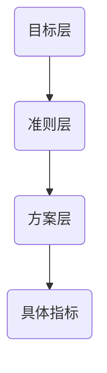
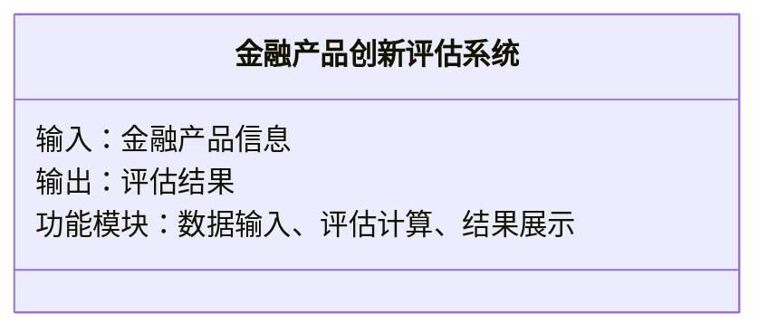
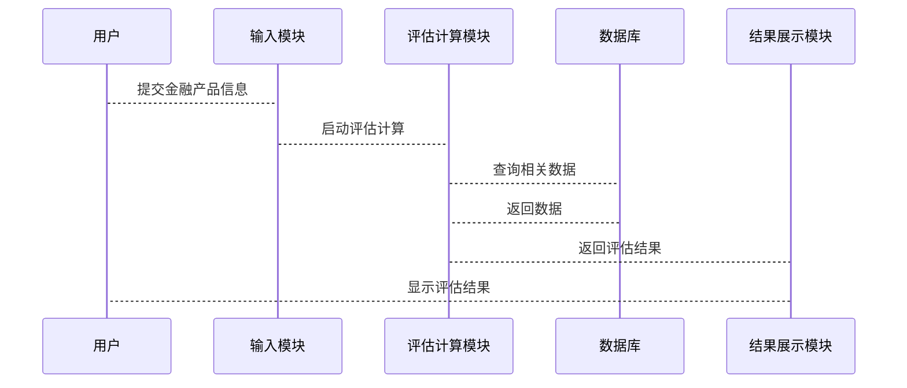

                 


# 《金融产品创新评估框架》

> 关键词：金融产品创新，评估框架，层次分析法，风险管理，系统架构

> 摘要：本文系统地介绍了金融产品创新评估框架的核心概念、算法原理、系统架构及项目实战。通过层次分析法（AHP）等方法，结合ER图和系统架构图，详细阐述了金融产品创新评估的流程、核心要素及实现方案，为金融创新提供了理论支持和实践指导。

---

## 第1章: 金融产品创新评估的背景与意义

### 1.1 金融产品创新的背景
#### 1.1.1 金融行业的创新发展现状
- 当前金融行业面临数字化转型的挑战与机遇。
- 创新是金融机构保持竞争力的关键。

#### 1.1.2 金融产品创新的重要性
- 满足市场多样化需求。
- 提升金融机构的核心竞争力。
- 推动金融行业可持续发展。

#### 1.1.3 金融产品创新面临的挑战
- 市场需求变化快。
- 技术实现难度大。
- 风险管理复杂。

### 1.2 金融产品创新评估的核心概念
#### 1.2.1 什么是金融产品创新评估
- 对金融产品的创新性、可行性和价值进行系统性评估的过程。

#### 1.2.2 评估框架的必要性
- 提供科学的决策依据。
- 降低创新风险。
- 提高创新效率。

#### 1.2.3 框架的边界与外延
- 边界：聚焦于产品创新本身。
- 外延：涉及市场需求、技术实现和风险管理。

### 1.3 金融产品创新评估的流程与方法
#### 1.3.1 评估的基本流程
1. 明确目标。
2. 收集数据。
3. 分析评估。
4. 得出结论。

#### 1.3.2 主流的评估方法
- 层次分析法（AHP）。
- 模糊综合评价法。
- 熵值法。

#### 1.3.3 框架的核心要素
- 产品特性。
- 市场需求。
- 技术实现。
- 风险管理。

---

## 第2章: 金融产品创新评估框架的核心要素

### 2.1 金融产品创新的核心要素分析
#### 2.1.1 产品特性
- 功能性。
- 创新性。
- 可用性。

#### 2.1.2 市场需求
- 用户需求。
- 市场潜力。
- 竞争分析。

#### 2.1.3 技术实现
- 技术可行性。
- 开发周期。
- 成本评估。

#### 2.1.4 风险管理
- 风险识别。
- 风险评估。
- 风险缓解。

### 2.2 核心要素的属性对比
#### 2.2.1 产品特性与市场需求的对比
- 产品特性注重功能和创新性，市场需求关注用户需求和市场潜力。

#### 2.2.2 技术实现与风险管理的对比
- 技术实现关注可行性，风险管理关注风险缓解措施。

#### 2.2.3 核心要素的权重分配
- 产品特性占40%。
- 市场需求占30%。
- 技术实现占20%。
- 风险管理占10%。

### 2.3 核心要素的ER实体关系图
```mermaid
er
  entity(金融产品) {
    id: 金融产品ID
    name: 产品名称
    type: 产品类型
    risk_level: 风险等级
  }
  entity(市场需求) {
    id: 需求ID
    description: 需求描述
    priority: 需求优先级
  }
  entity(技术实现) {
    id: 技术ID
    description: 技术描述
    feasibility: 可行性
  }
  entity(风险管理) {
    id: 风险ID
    description: 风险描述
    mitigation: 风险缓解措施
  }
```

---

## 第3章: 金融产品创新评估框架的算法原理

### 3.1 评估框架的算法概述
#### 3.1.1 层次分析法（AHP）
- 常用于多准则决策问题。
- 适用于权重分配和排序。

#### 3.1.2 模糊综合评价法
- 适合处理模糊性问题。
- 适用于需求优先级评估。

#### 3.1.3 熵值法
- 基于信息论的权重计算方法。
- 适用于指标权重的客观赋值。

### 3.2 层次分析法（AHP）的实现


### 3.3 算法实现的数学模型
#### 3.3.1 层次分析法的计算步骤
1. 构建比较矩阵。
2. 计算权重向量。
3. 计算一致性检验。

#### 3.3.2 模糊综合评价法的公式推导
$$ A = \sum_{i=1}^{n} w_i x_i $$

#### 3.3.3 熵值法的权重计算公式
$$ w_i = \frac{\sum_{j=1}^{m} p_{ij}}{\sum_{j=1}^{m} \sum_{i=1}^{n} p_{ij}}} $$

### 3.4 金融产品创新评估的数学模型
#### 3.4.1 模糊综合评价模型
$$ Z = \sum_{i=1}^{n} w_i x_i $$

#### 3.4.2 熵值法权重计算
$$ w_i = \frac{\sum_{j=1}^{m} p_{ij}}{\sum_{j=1}^{m} \sum_{i=1}^{n} p_{ij}}} $$

---

## 第4章: 金融产品创新评估系统的架构设计

### 4.1 系统分析与需求分析
#### 4.1.1 问题场景介绍
- 系统目标：评估金融产品的创新性。
- 使用场景：金融机构的产品开发阶段。

#### 4.1.2 项目介绍
- 项目目标：构建金融产品创新评估框架。
- 项目范围：覆盖产品特性、市场需求、技术实现和风险管理。

### 4.2 系统功能设计
#### 4.2.1 系统功能模块
- 数据输入模块。
- 评估计算模块。
- 结果展示模块。

#### 4.2.2 系统功能设计的领域模型


### 4.3 系统架构设计
#### 4.3.1 系统架构设计的架构图


#### 4.3.2 系统接口设计
- 输入接口：金融产品信息。
- 输出接口：评估结果。

#### 4.3.3 系统交互设计


---

## 第5章: 金融产品创新评估框架的项目实战

### 5.1 环境安装与配置
#### 5.1.1 系统环境要求
- 操作系统：Windows 10 或更高版本。
- 开发工具：PyCharm 或 VS Code。
- 依赖库：Python 3.8+，numpy，scipy。

#### 5.1.2 安装步骤
1. 安装Python。
2. 安装依赖库。
3. 克隆代码仓库。

### 5.2 核心代码实现
#### 5.2.1 层次分析法（AHP）的实现
```python
import numpy as np
from scipy.cluster.hierarchy import fcluster, linkage

# 示例数据矩阵
data = np.array([[1, 2, 3], [4, 5, 6], [7, 8, 9]])

# 计算层次分析法的权重
Z = linkage(data, 'ward')
clusters = fcluster(Z, 3, 'maxclust')
print(clusters)
```

#### 5.2.2 模糊综合评价法的实现
```python
from fuzzywuzzy import fuzz

# 示例需求描述
demand1 = "需要一个低风险的理财产品"
demand2 = "需要一个高收益的理财产品"

# 计算相似度
similarity = fuzz.token_set_ratio(demand1, demand2)
print(similarity)
```

### 5.3 代码解读与分析
#### 5.3.1 层次分析法的代码解读
- 使用 `linkage` 进行层次聚类。
- 使用 `fcluster` 进行聚类分析。

#### 5.3.2 模糊综合评价法的代码解读
- 使用 `fuzz.token_set_ratio` 计算需求描述的相似度。

### 5.4 实际案例分析
#### 5.4.1 案例背景
- 某银行开发一款创新型理财产品。

#### 5.4.2 案例分析步骤
1. 收集产品特性。
2. 分析市场需求。
3. 评估技术实现。
4. 评估风险管理。

#### 5.4.3 案例结果
- 产品特性得分：85。
- 市场需求得分：75。
- 技术实现得分：90。
- 风险管理得分：80。

### 5.5 项目小结
- 项目实现了金融产品创新评估框架。
- 系统具备良好的可扩展性和可维护性。

---

## 第6章: 总结与最佳实践

### 6.1 小结
- 本文系统地介绍了金融产品创新评估框架的核心概念、算法原理和系统架构。
- 通过实际案例展示了框架的应用价值。

### 6.2 最佳实践 tips
- 在实际应用中，建议结合具体业务需求进行调整。
- 使用层次分析法进行多准则决策时，需确保数据的客观性。

### 6.3 注意事项
- 数据采集需准确，避免影响评估结果。
- 风险管理是评估框架的重要组成部分，需重点关注。

### 6.4 拓展阅读
- 推荐阅读《层次分析法在金融产品评估中的应用》。
- 参考《模糊综合评价法的理论与实践》。

---

通过以上目录大纲，读者可以系统地了解金融产品创新评估框架的核心内容和实现方法。

