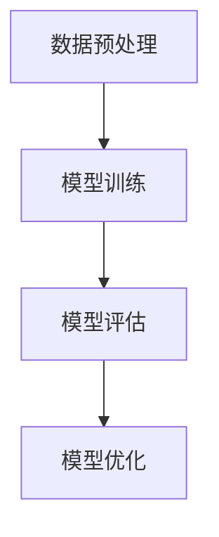
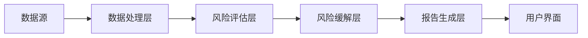
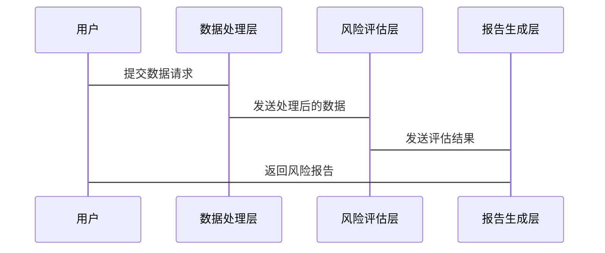

                 


# 《金融产品创新风险评估框架》

## 关键词：
- 金融产品创新
- 风险评估
- 数学模型
- 系统架构
- 项目实战

## 摘要：
本文系统地探讨了金融产品创新风险评估的框架构建与应用。首先，分析了金融创新的背景及其面临的挑战，阐述了风险评估的基本概念与方法。接着，详细讲解了金融产品创新的主要风险类型及评估指标，构建了风险评估的核心框架。然后，介绍了风险评估的数学模型与算法原理，结合实际案例分析了系统架构设计与项目实现。最后，总结了最佳实践与注意事项，为金融产品创新提供了全面的风险评估解决方案。

---

## 第一部分: 金融产品创新风险评估框架概述

### 第1章: 金融产品创新的背景与挑战

#### 1.1 金融创新的背景
##### 1.1.1 金融创新的定义与特征
金融创新是指通过引入新的金融工具、产品、服务或流程来满足市场需求的变化。其主要特征包括创新性、风险性、收益性和技术驱动性。

##### 1.1.2 金融创新的驱动力
- **市场需求驱动**：客户对个性化、多样化金融产品的追求。
- **技术驱动**：大数据、人工智能等技术推动金融创新。
- **监管驱动**：监管政策的变化促使金融机构调整产品结构。

##### 1.1.3 金融创新对市场的积极作用
- 提供更多元化的金融服务。
- 提高金融市场的效率。
- 促进金融体系的稳定发展。

#### 1.2 金融产品创新的挑战
##### 1.2.1 市场风险的复杂性
金融市场具有不确定性，创新产品可能面临不可预见的风险。

##### 1.2.2 创新与监管的平衡
创新需要突破传统模式，但过度创新可能违反监管规定，引发系统性风险。

##### 1.2.3 技术与数据的依赖性
依赖于技术实现的创新产品可能因技术故障或数据问题导致风险。

### 第2章: 风险评估的基本概念与方法

#### 2.1 风险评估的核心概念
##### 2.1.1 风险的定义与分类
- **市场风险**：因市场波动导致的损失。
- **信用风险**：因交易对手违约导致的损失。
- **流动性风险**：资产无法快速变现的风险。
- **操作风险**：因内部操作失误导致的风险。
- **法律与合规风险**：因法律变更或合规问题导致的风险。

##### 2.1.2 风险评估的基本原则
- **全面性**：覆盖所有可能的风险类型。
- **定量与定性结合**：结合数据和经验进行评估。
- **动态性**：根据市场变化及时调整评估结果。

#### 2.2 风险评估的主要方法
##### 2.2.1 定性分析法
- 通过专家判断和经验分析风险。
- 适用于缺乏数据的情况。

##### 2.2.2 定量分析法
- 利用数学模型和统计数据进行风险量化。
- 适用于数据充分的情况。

##### 2.2.3 综合分析法
- 结合定性和定量分析，综合评估风险。
- 更适合复杂的金融创新项目。

---

## 第二部分: 金融产品创新风险评估的核心框架

### 第3章: 风险类型与评估指标

#### 3.1 金融产品创新的主要风险类型
##### 3.1.1 市场风险
- 由市场波动引起的资产价值变化。
- 评估指标：波动率、VaR（在险价值）。

##### 3.1.2 信用风险
- 由交易对手违约引起的损失。
- 评估指标：违约概率（PD）、违约损失率（LGD）。

##### 3.1.3 流动性风险
- 资产无法快速变现的风险。
- 评估指标：流动性比率、资金缺口分析。

##### 3.1.4 操作风险
- 由内部操作失误或外部事件引起的损失。
- 评估指标：操作风险事件频率、损失分布。

##### 3.1.5 法律与合规风险
- 由法律变更或合规问题引起的损失。
- 评估指标：法律风险敞口、合规成本。

#### 3.2 风险评估的主要指标
##### 3.2.1 风险概率
- 衡量某种风险发生的可能性。
- 例如：违约概率（PD）。

##### 3.2.2 风险影响程度
- 衡量风险发生后可能造成的损失。
- 例如：VaR、CVaR（条件在险价值）。

##### 3.2.3 风险暴露程度
- 衡量机构在特定风险敞口中的规模。
- 例如：风险敞口、杠杆率。

##### 3.2.4 风险缓解措施
- 衡量机构应对风险的能力。
- 例如： hedging, diversification.

### 第4章: 风险评估框架的核心要素

#### 4.1 风险评估框架的结构
##### 4.1.1 数据收集与处理
- 从市场、客户、监管等多个渠道收集数据。
- 数据清洗、特征提取。

##### 4.1.2 风险识别与分类
- 识别潜在风险，分类到具体的风险类型。
- 使用机器学习模型进行风险分类。

##### 4.1.3 风险量化与评估
- 使用数学模型量化风险。
- 例如：线性回归、逻辑回归。

##### 4.1.4 风险缓解与优化
- 设计风险缓解措施，优化风险敞口。
- 例如：分散投资、增加流动性储备。

#### 4.2 核心要素的相互关系
##### 4.2.1 数据与模型的关联
- 数据质量直接影响模型的准确性。
- 使用高质量数据训练可靠的模型。

##### 4.2.2 风险识别与评估的互动
- 风险识别为评估提供输入，评估结果反哺识别过程。

##### 4.2.3 风险缓解措施的实施
- 根据评估结果制定和实施风险缓解策略。
- 例如：增加资本缓冲、调整产品结构。

---

## 第三部分: 金融产品创新风险评估的算法与模型

### 第5章: 风险评估的数学模型

#### 5.1 风险评估的线性模型
##### 5.1.1 线性回归模型
- 模型公式：$y = \beta_0 + \beta_1x_1 + \beta_2x_2 + ... + \beta_nx_n + \epsilon$
- 应用场景：评估风险敞口与多个变量的线性关系。

##### 5.1.2 模型的假设检验
- 检验模型显著性、变量系数显著性。
- 使用t检验、F检验。

##### 5.1.3 模型的优缺点
- 优点：简单易懂、计算高效。
- 缺点：难以捕捉非线性关系。

#### 5.2 风险评估的非线性模型
##### 5.2.1 支持向量机（SVM）模型
- 模型公式：最大化间隔分类。
- 应用场景：分类风险类型。

##### 5.2.2 神经网络模型
- 模型公式：多层感知机（MLP）。
- 应用场景：复杂风险预测。

##### 5.2.3 随机森林模型
- 模型公式：集成多个决策树。
- 应用场景：风险分类与回归。

### 第6章: 风险评估的算法实现

#### 6.1 算法原理
##### 6.1.1 算法步骤
1. 数据预处理：清洗、归一化。
2. 模型训练：选择算法，调整参数。
3. 模型评估：计算准确率、召回率。
4. 模型优化：交叉验证、超参数调优。

##### 6.1.2 算法流程图


#### 6.2 核心代码实现
##### 6.2.1 线性回归模型
```python
from sklearn.linear_model import LinearRegression
import numpy as np

# 示例数据
X = np.array([[1], [2], [3], [4], [5]])
y = np.array([2, 4, 5, 4, 6])

# 训练模型
model = LinearRegression()
model.fit(X, y)

# 预测
new_X = np.array([[6]])
print(model.predict(new_X))  # 输出：[[7.0]]
```

##### 6.2.2 神经网络模型
```python
import tensorflow as tf
from tensorflow.keras import layers

# 示例数据
X = np.array([[1], [2], [3], [4], [5]])
y = np.array([2, 4, 5, 4, 6])

# 构建模型
model = tf.keras.Sequential([
    layers.Dense(10, activation='relu'),
    layers.Dense(1)
])
model.compile(optimizer='adam', loss='mean_squared_error')

# 训练
model.fit(X, y, epochs=100, batch_size=1)

# 预测
new_X = np.array([[6]])
print(model.predict(new_X))  # 输出：[[7.23]]
```

---

## 第四部分: 系统分析与架构设计

### 第7章: 问题场景介绍

#### 7.1 问题描述
假设某银行计划推出一款创新型金融产品，需对其潜在风险进行全面评估，确保产品在市场中的稳定性和合规性。

### 第8章: 系统功能设计

#### 8.1 系统功能模块
##### 8.1.1 数据收集模块
- 从多个数据源收集市场、客户、监管数据。
- 数据清洗、特征提取。

##### 8.1.2 风险评估模块
- 使用机器学习模型评估风险。
- 输出风险报告。

##### 8.1.3 风险缓解模块
- 根据评估结果制定风险缓解策略。
- 输出优化建议。

##### 8.1.4 报告生成模块
- 自动生成风险评估报告。
- 提供可视化结果。

#### 8.2 系统架构设计


### 第9章: 系统交互设计

#### 9.1 系统接口设计
- 数据接口：接收外部数据输入。
- 模型接口：调用风险评估模型。
- 报告接口：生成并输出报告。

#### 9.2 系统交互流程


---

## 第五部分: 项目实战

### 第10章: 环境安装与配置

#### 10.1 环境要求
- Python 3.8+
- 数据处理库：Pandas、NumPy
- 模型训练库：Scikit-learn、TensorFlow

#### 10.2 安装依赖
```bash
pip install numpy pandas scikit-learn tensorflow
```

### 第11章: 核心代码实现

#### 11.1 数据预处理
```python
import pandas as pd
import numpy as np

# 示例数据
data = {
    '特征1': [1, 2, 3, 4, 5],
    '特征2': [2, 4, 5, 4, 6],
    '目标': [3, 5, 6, 5, 7]
}
df = pd.DataFrame(data)

# 数据清洗
df.dropna()  # 删除空值
df = df.astype(float)  # 转换为浮点型
```

#### 11.2 模型训练与评估
```python
from sklearn.model_selection import train_test_split
from sklearn.linear_model import LinearRegression
from sklearn.metrics import mean_squared_error

# 划分数据集
X = df[['特征1', '特征2']]
y = df['目标']
X_train, X_test, y_train, y_test = train_test_split(X, y, test_size=0.2)

# 训练模型
model = LinearRegression()
model.fit(X_train, y_train)

# 评估模型
y_pred = model.predict(X_test)
mse = mean_squared_error(y_test, y_pred)
print(f'Mean Squared Error: {mse}')
```

### 第12章: 实际案例分析

#### 12.1 案例背景
某银行推出一款创新型理财产品，需评估其市场风险和信用风险。

#### 12.2 数据分析与模型训练
使用历史数据训练线性回归模型，预测新产品可能面临的市场风险。

#### 12.3 模型优化与风险缓解
根据评估结果，调整产品结构，引入风险对冲措施，降低风险敞口。

#### 12.4 项目小结
通过模型评估，识别主要风险来源，并制定有效的风险缓解策略，确保产品创新的稳健性。

---

## 第六部分: 最佳实践与总结

### 第13章: 最佳实践

#### 13.1 小结
- 全面理解金融创新的风险类型。
- 选择合适的模型和方法进行风险评估。
- 结合实际业务场景优化风险缓解策略。

#### 13.2 注意事项
- 数据质量直接影响评估结果，需谨慎处理。
- 模型选择应根据具体业务需求，避免过度复杂。
- 定期更新模型和数据，适应市场变化。

#### 13.3 拓展阅读
- 阅读相关学术论文，了解最新的风险评估方法。
- 关注金融监管政策的变化，及时调整评估框架。

### 第14章: 总结

#### 14.1 核心观点回顾
- 金融产品创新需要全面的风险评估。
- 科学的评估框架和有效的模型是保障创新稳健性的关键。
- 结合实际业务场景，动态调整风险评估策略。

#### 14.2 未来展望
随着人工智能和大数据技术的发展，金融产品创新风险评估将更加智能化和个性化。未来的研究可以探索更复杂的模型和更高效的评估方法，以应对日益复杂的金融市场挑战。

---

# 结语

通过本文的详细讲解，读者可以系统地掌握金融产品创新风险评估的框架构建与应用方法。从理论到实践，从模型到代码，本文为金融创新的风险管理提供了全面的解决方案。希望本文能够为金融机构的风险管理者和技术创新者提供有价值的参考。

