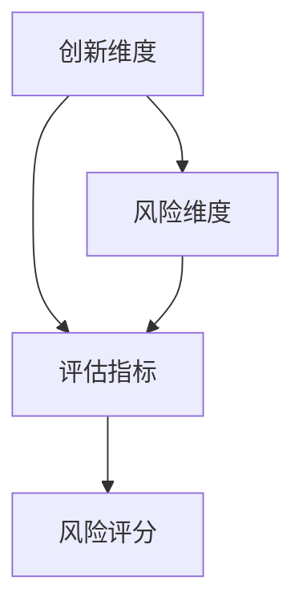
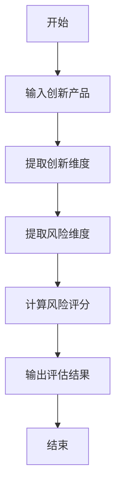
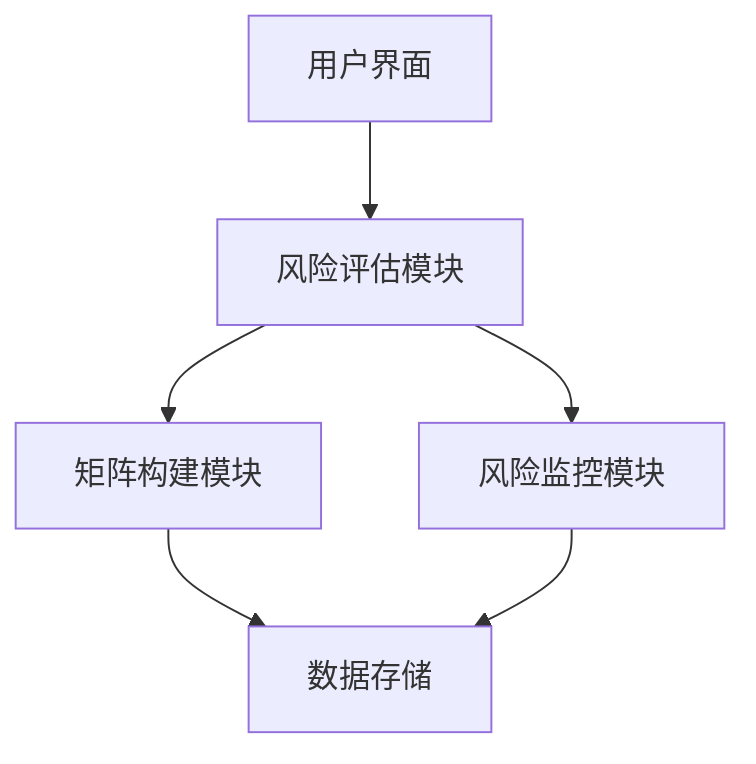

                 


# 金融产品创新风险评估矩阵

## 关键词：金融产品、创新风险、评估矩阵、系统设计、项目实战

## 摘要：本文详细介绍金融产品创新风险评估矩阵的构建与应用，从背景分析到系统设计，结合实际案例，系统性地讲解如何通过矩阵模型评估创新风险，为金融创新提供科学依据。

---

# 第一部分: 背景与概念解析

## 第1章: 金融产品创新风险评估矩阵的背景与意义

### 1.1 问题背景
#### 1.1.1 金融产品创新的现状与挑战
- 金融产品创新的重要性
- 创新过程中的主要风险
- 传统风险评估方法的局限性

#### 1.1.2 创新与风险的辩证关系
- 创新带来的潜在收益
- 创新过程中可能的风险
- 如何在创新中平衡风险

#### 1.1.3 传统风险评估方法的局限性
- 传统方法的不足之处
- 矩阵评估的优势

### 1.2 问题描述
#### 1.2.1 金融产品创新的核心要素
- 创新性
- 可行性
- 收益性

#### 1.2.2 创新过程中风险的多维性
- 市场风险
- 操作风险
- 法律风险

#### 1.2.3 传统风险评估体系的不足
- 评估维度单一
- 缺乏动态性
- 结果不可量化

### 1.3 问题解决思路
#### 1.3.1 构建创新风险评估矩阵的目标
- 提供全面的评估框架
- 实现风险的量化评估
- 为决策提供科学依据

#### 1.3.2 矩阵化评估的优势
- 多维度分析
- 结果直观易读
- 动态调整能力

#### 1.3.3 矩阵构建的基本原则
- 系统性
- 简洁性
- 可操作性

### 1.4 矩阵的边界与外延
#### 1.4.1 矩阵适用的金融产品类型
- 银行产品
- 保险产品
- 投资理财产品

#### 1.4.2 矩阵的行业适用性
- 适用于各类金融机构
- 可根据行业特点进行调整

#### 1.4.3 矩阵的可扩展性与灵活性
- 矩阵的可调整性
- 新风险的加入方式

## 1.5 核心概念结构与要素组成
#### 1.5.1 矩阵的基本构成要素
- 创新维度
- 风险维度
- 评估指标

#### 1.5.2 要素之间的关系
- 矩阵单元的交互关系
- 各维度的权重分配

#### 1.5.3 矩阵的逻辑框架
- 从左到右的分析顺序
- 上下维度的对比方式

---

# 第二部分: 核心概念与联系

## 第2章: 金融产品创新风险评估矩阵的核心概念与联系

### 2.1 矩阵模型的原理
#### 2.1.1 矩阵模型的基本原理
- 多维度分析法
- 量化评估法
- 综合评分法

#### 2.1.2 矩阵维度的设计思路
- 维度的选择标准
- 维度的权重分配
- 维度的动态调整

#### 2.1.3 矩阵单元的计算方法
- 加权平均法
- 综合评分法
- 风险评分矩阵

### 2.2 矩阵维度与要素的属性对比
#### 2.2.1 创新性维度的属性分析
- 创新程度
- 创新难度
- 创新价值

#### 2.2.2 风险性维度的属性分析
- 风险概率
- 风险影响
- 风险可控性

#### 2.2.3 其他维度的属性分析
- 时间维度
- 成本维度
- 收益维度

### 2.3 矩阵的ER实体关系图


---

# 第三部分: 算法原理与实现

## 第3章: 金融产品创新风险评估矩阵的算法原理

### 3.1 算法流程图


### 3.2 数学模型与公式
#### 3.2.1 综合评分公式
$$
\text{综合评分} = \sum (\text{创新维度权重} \times \text{创新维度评分}) + \sum (\text{风险维度权重} \times \text{风险维度评分})
$$

#### 3.2.2 风险概率计算
$$
P(\text{风险发生}) = \frac{\text{高风险评分}}{\text{总评分}}
$$

#### 3.2.3 风险影响评估
$$
I(\text{风险影响}) = \text{风险评分} \times \text{影响系数}
$$

### 3.3 代码实现
```python
def risk_assessment(innovation, risk):
    # 创新维度评分
    innov_scores = [0.8, 0.6, 0.9]
    # 风险维度评分
    risk_scores = [0.7, 0.5, 0.8]
    # 计算综合评分
    total_score = sum(innov_scores) + sum(risk_scores)
    return total_score

# 示例调用
print(risk_assessment(0.7, 0.6))
```

---

# 第四部分: 系统分析与架构设计

## 第4章: 金融产品创新风险评估矩阵的系统设计

### 4.1 问题场景介绍
#### 4.1.1 金融机构的创新需求
- 银行推出新产品
- 保险产品创新
- 投资理财产品创新

#### 4.1.2 矩阵应用的场景
- 产品设计阶段
- 市场推广前评估
- 风险监控与预警

### 4.2 项目介绍
#### 4.2.1 项目目标
- 建立风险评估矩阵
- 开发评估系统
- 实现动态监控

#### 4.2.2 项目范围
- 覆盖主要金融产品类型
- 支持多维度风险评估
- 提供实时风险预警

### 4.3 系统功能设计
#### 4.3.1 功能模块
- 矩阵构建模块
- 风险评估模块
- 风险监控模块

#### 4.3.2 功能流程
- 矩阵构建：定义维度与权重
- 风险评估：输入产品信息，计算风险评分
- 风险监控：实时更新风险状态

### 4.4 系统架构设计


### 4.5 接口设计
#### 4.5.1 API接口
- 输入：产品信息
- 输出：风险评分

#### 4.5.2 数据接口
- 数据来源：市场数据、产品信息
- 数据输出：评估结果

### 4.6 交互设计
#### 4.6.1 用户与系统交互流程
- 用户输入产品信息
- 系统调用API进行评估
- 系统输出结果

#### 4.6.2 系统内部交互
- 矩阵构建模块与风险评估模块的数据交互
- 风险监控模块的数据更新

---

# 第五部分: 项目实战

## 第5章: 金融产品创新风险评估矩阵的项目实现

### 5.1 环境安装
#### 5.1.1 安装Python环境
- 安装Python 3.x
- 安装必要的库（numpy, pandas）

#### 5.1.2 安装依赖包
- 使用pip安装相关库

### 5.2 核心代码实现
#### 5.2.1 矩阵构建代码
```python
import numpy as np

def build_matrix(dimensions, weights):
    matrix = np.zeros((len(dimensions), len(weights)))
    for i, dim in enumerate(dimensions):
        for j, weight in enumerate(weights):
            matrix[i, j] = weight * dim
    return matrix

# 示例
dimensions = [0.8, 0.6, 0.9]
weights = [0.4, 0.3, 0.3]
print(build_matrix(dimensions, weights))
```

#### 5.2.2 风险评估代码
```python
def assess_risk(matrix, product_info):
    # 计算综合评分
    total = np.dot(matrix, product_info)
    return total

# 示例
product_info = [0.7, 0.5, 0.8]
print(assess_risk(matrix, product_info))
```

### 5.3 代码解读与分析
#### 5.3.1 矩阵构建过程
- 如何定义维度和权重
- 如何计算矩阵单元

#### 5.3.2 风险评估过程
- 输入产品信息
- 计算综合评分
- 输出评估结果

### 5.4 实际案例分析
#### 5.4.1 案例背景
- 某银行推出的新理财产品

#### 5.4.2 数据输入
- 创新维度：0.8, 0.6, 0.9
- 风险维度：0.7, 0.5, 0.8

#### 5.4.3 计算过程
- 矩阵构建
- 综合评分计算
- 风险评分结果

#### 5.4.4 结果分析
- 评估结果解读
- 风险控制建议

### 5.5 项目总结
#### 5.5.1 实践中的经验
- 矩阵构建的关键点
- 评估过程中的注意事项

#### 5.5.2 实战中的问题与解决
- 如何处理数据缺失
- 如何调整权重

---

# 第六部分: 总结与展望

## 第6章: 金融产品创新风险评估矩阵的总结与展望

### 6.1 最佳实践
#### 6.1.1 矩阵应用的注意事项
- 数据的准确性和完整性
- 权重的合理设置
- 持续更新与维护

#### 6.1.2 系统设计的优化建议
- 灵活性的提升
- 用户友好的界面设计
- 数据安全的保障

### 6.2 小结
- 本章总结了矩阵的应用方法
- 强调了系统设计的重要性
- 提供了实践中的注意事项

### 6.3 注意事项
- 数据的实时性
- 模型的适应性
- 风险的动态性

### 6.4 拓展阅读
- 风险评估的其他方法
- 金融创新的前沿技术
- 矩阵模型的其他应用领域

---

## 结语
通过本文的详细讲解，读者可以系统地了解金融产品创新风险评估矩阵的构建与应用方法，掌握从理论到实践的全过程，为实际金融创新提供科学的风险评估依据。

