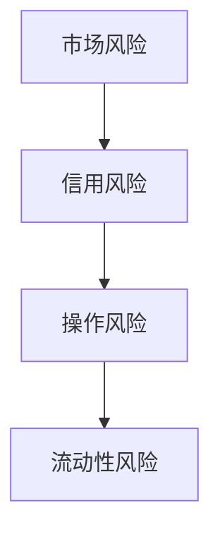
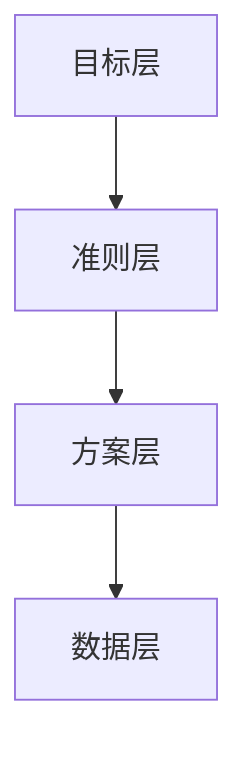
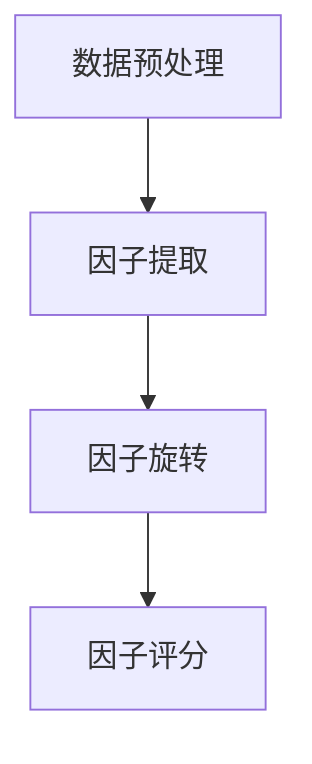
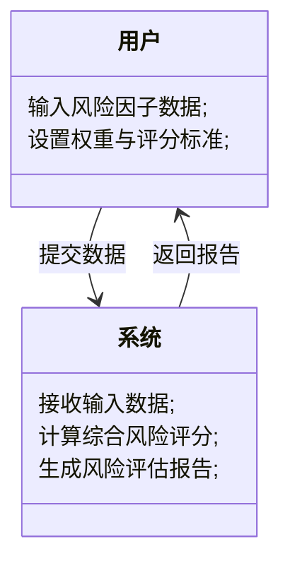
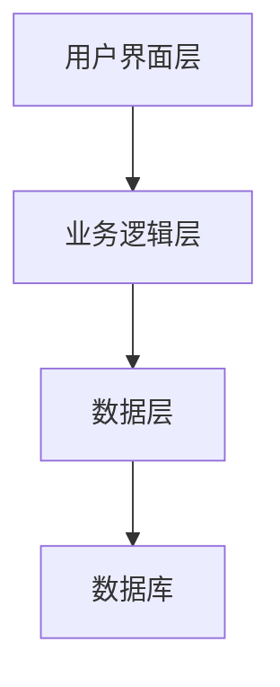

                 


# 《金融产品创新风险评估矩阵与决策支持》

## 关键词：金融产品、风险评估、创新、矩阵、决策支持

## 摘要：  
本文深入探讨了金融产品创新中的风险评估问题，提出了一种基于矩阵的创新风险评估模型，并结合实际案例分析，详细阐述了该模型的构建方法、算法实现及应用场景。通过层次分析法（AHP）和因子分析法，本文为金融产品创新提供了科学的决策支持工具，帮助金融机构在创新过程中有效识别和管理风险。

---

# 第一部分: 金融产品创新风险评估背景与概述

## 第1章: 金融产品创新与风险评估概述

### 1.1 金融产品创新的背景与意义  
金融创新是推动金融行业发展的重要驱动力。随着全球经济的快速发展和金融市场的复杂化，金融机构不断推出新的金融产品以满足多样化的市场需求。然而，创新的同时也伴随着较高的风险，包括市场风险、信用风险、流动性风险等。因此，如何在创新过程中有效评估和管理风险，成为金融机构面临的重大挑战。

### 1.2 风险评估的基本概念与方法  
风险评估是通过对潜在风险的识别、量化和分析，帮助决策者制定有效的风险管理策略。传统的风险评估方法主要包括定性分析和定量分析两类，但这些方法往往难以应对金融产品创新中的复杂性和不确定性。

### 1.3 金融产品创新风险的特征与挑战  
金融产品创新的风险具有以下特征：  
1. **复杂性**：创新产品往往涉及多个风险因子，且这些因子之间可能存在复杂的相互作用。  
2. **不确定性**：创新产品的市场表现往往难以预测，尤其是在缺乏历史数据的情况下。  
3. **动态性**：金融市场环境的变化会导致创新产品风险的动态调整。  

### 1.4 本章小结  
本章从金融创新的背景、风险评估的基本概念以及创新风险的特征三个方面，阐述了金融产品创新风险评估的重要性及其面临的挑战。

---

# 第二部分: 金融产品创新风险评估矩阵的核心概念与模型

## 第2章: 金融产品创新风险评估矩阵的构建基础

### 2.1 风险评估矩阵的定义与构成要素  
风险评估矩阵是一种基于矩阵模型的工具，用于量化和评估金融产品创新中的各种风险。其核心要素包括：  
1. **风险因子**：影响金融产品创新的关键因素，如市场需求、技术实现难度、政策合规性等。  
2. **权重与评分标准**：根据各风险因子的重要性和影响程度，赋予相应的权重和评分标准。  
3. **矩阵模型**：通过矩阵运算，量化各风险因子的综合影响，形成最终的风险评估结果。  

### 2.2 风险因子的分类与属性对比  
风险因子的分类和属性对比是构建风险评估矩阵的重要基础。以下是常见的风险因子分类及其属性对比：

#### 表2-1：风险因子分类与属性对比

| 风险因子 | 市场风险 | 信用风险 | 流动性风险 | 操作风险 |
|----------|----------|----------|------------|----------|
| 属性     | 市场波动、政策变化 | 债务人违约概率 | 资金流动性需求 | 内部流程缺陷 |
| 影响     | 投资者损失 | 机构信用损失 | 资金周转压力 | 内部操作失误 |

#### 图2-1：风险因子关系图  


### 2.3 矩阵模型的数学表达与公式  
风险评估矩阵的数学模型如下：  
$$ R = \sum_{i=1}^{n} w_i \cdot f_i $$  
其中：  
- $R$ 表示综合风险评分；  
- $w_i$ 表示第 $i$ 个风险因子的权重；  
- $f_i$ 表示第 $i$ 个风险因子的评分。  

---

# 第三部分: 金融产品创新风险评估矩阵的算法与实现

## 第3章: 风险评估矩阵的算法原理与流程

### 3.1 层次分析法（AHP）在矩阵中的应用  
层次分析法（AHP）是一种常用的决策分析方法，适用于多因子风险评估。其基本步骤如下：

#### 图3-1：层次分析法流程图  


#### 算法步骤  
1. **构建层次结构**：将风险因子分为目标层、准则层和方案层。  
2. **构造判断矩阵**：根据专家评分，构造各层次之间的比较矩阵。  
3. **计算权重**：通过特征值法或几何平均法计算各因子的权重。  
4. **计算综合评分**：根据权重和评分计算综合风险评分。  

### 3.2 因子分析法在矩阵中的应用  
因子分析法通过提取公因子，降低数据维度，适用于高维风险因子的分析。

#### 图3-2：因子分析流程图  


#### 算法步骤  
1. **数据预处理**：对风险因子数据进行标准化处理。  
2. **因子提取**：通过主成分分析（PCA）提取公因子。  
3. **因子旋转**：对提取的因子进行旋转，提高解释性。  
4. **计算因子评分**：根据因子载荷矩阵计算各方案的因子评分。  

---

## 第4章: 数学模型与公式详细推导

### 4.1 综合风险评分公式  
综合风险评分公式如下：  
$$ R = \sum_{i=1}^{n} w_i \cdot f_i $$  
其中，$w_i$ 是第 $i$ 个因子的权重，$f_i$ 是第 $i$ 个因子的评分。  

### 4.2 权重计算公式  
层次分析法中，权重计算公式为：  
$$ w_i = \frac{a_i}{\sum_{j=1}^{m} a_j} $$  
其中，$a_i$ 是第 $i$ 个因子的特征值，$m$ 是因子总数。  

### 4.3 示例计算  
假设某金融产品的风险因子包括市场风险、信用风险和操作风险，权重分别为 $0.4$、$0.3$ 和 $0.3$，评分分别为 $0.8$、$0.6$ 和 $0.5$。则综合风险评分为：  
$$ R = 0.4 \cdot 0.8 + 0.3 \cdot 0.6 + 0.3 \cdot 0.5 = 0.32 + 0.18 + 0.15 = 0.65 $$  

---

## 第5章: 系统分析与架构设计方案

### 5.1 问题场景介绍  
金融机构需要对新推出的金融产品进行风险评估，确保其符合监管要求并具备市场竞争力。

### 5.2 系统功能设计  
系统功能包括：  
1. **风险因子录入**：支持用户输入风险因子数据。  
2. **权重与评分设置**：允许用户自定义或预设权重和评分标准。  
3. **风险评估计算**：根据输入数据，计算综合风险评分并生成报告。  

#### 图5-1：系统功能设计类图  


### 5.3 系统架构设计  
系统架构采用分层设计，包括数据层、业务逻辑层和用户界面层。

#### 图5-2：系统架构设计  


---

## 第6章: 项目实战与案例分析

### 6.1 环境安装与配置  
需要安装 Python、NumPy、Pandas 和 Matplotlib 等依赖库。

### 6.2 核心代码实现  
以下是基于层次分析法的风险评估矩阵实现代码：

#### 代码6-1：Python实现  
```python
import numpy as np

# 示例数据：风险因子评分矩阵
factors = np.array([[0.8, 0.6, 0.5]])

# 权重向量
weights = np.array([0.4, 0.3, 0.3])

# 计算综合风险评分
R = np.sum(factors * weights, axis=1)
print("综合风险评分：", R[0])
```

### 6.3 案例分析  
以某创新型金融产品为例，假设其风险因子评分和权重如下：  
- 市场风险评分：0.8，权重：0.4  
- 信用风险评分：0.6，权重：0.3  
- 操作风险评分：0.5，权重：0.3  

根据上述代码计算，综合风险评分为：  
$$ R = 0.4 \cdot 0.8 + 0.3 \cdot 0.6 + 0.3 \cdot 0.5 = 0.65 $$  

---

## 第7章: 最佳实践与总结

### 7.1 小结  
本文提出了一种基于矩阵的金融产品创新风险评估模型，通过层次分析法和因子分析法，为金融机构提供了科学的决策支持工具。

### 7.2 注意事项  
1. **数据质量**：确保输入数据的准确性和完整性。  
2. **模型适用性**：根据实际情况调整模型参数和因子选择。  
3. **定期更新**：随着市场环境的变化，及时更新模型和风险评估结果。  

### 7.3 拓展阅读  
1. 《金融风险管理》  
2. 《层次分析法的应用与实践》  
3. 《金融产品创新与监管》  

---

以上是《金融产品创新风险评估矩阵与决策支持》的完整目录大纲和文章内容，按照逻辑逐步展开，详细阐述了模型构建、算法实现和实际应用，为金融产品创新提供了科学的决策支持工具。

