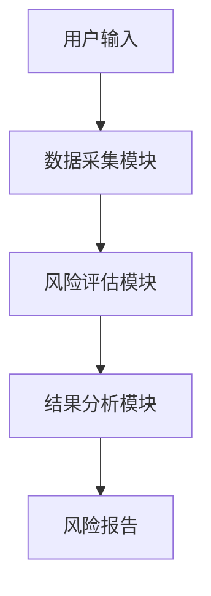

                 


# 《金融产品创新风险评估矩阵设计》

## 关键词：金融创新，风险评估，矩阵设计，系统架构，项目实战

## 摘要：  
本文详细探讨了金融产品创新风险评估矩阵的设计与应用，从背景分析、核心概念、算法原理、系统架构到项目实战，全面解析如何通过矩阵方法有效评估和管理金融创新风险。文章结合实际案例，提供了一套系统的解决方案，帮助金融机构在创新中平衡风险与收益。

---

# 第一部分: 金融产品创新风险评估的背景与核心概念

## 第1章: 金融产品创新的背景与挑战

### 1.1 金融创新的定义与现状

金融创新是指金融机构通过引入新的产品、服务、技术或商业模式，以满足市场需求或提升竞争力的过程。当前，金融创新主要集中在金融科技（FinTech）领域，包括区块链、人工智能、大数据分析等技术的应用。然而，创新过程中也面临市场风险、技术风险和合规风险等多重挑战。

**问题背景**：  
金融机构在追求创新的同时，必须应对日益复杂的监管环境和市场竞争。创新失败可能导致巨大的经济损失，因此，如何在创新过程中有效识别和管理风险成为关键。

**问题解决**：  
通过构建风险评估矩阵，金融机构可以系统化地分析和评估创新项目的风险，从而在创新与风险之间找到平衡点。

**边界与外延**：  
本文的创新范围主要集中在金融产品和服务的创新，不包括金融机构的组织架构或文化创新。同时，本文重点关注风险评估方法，而非具体的市场推广策略。

### 1.2 金融产品创新的必要性

**市场竞争压力**：  
金融机构需要不断创新以保持竞争优势，尤其是在数字化转型的大背景下。

**创新对发展的驱动作用**：  
创新是金融机构实现业务增长和价值提升的重要手段。

**创新与风险的平衡**：  
创新带来收益的同时，也可能引发风险，因此需要通过科学的方法来平衡两者。

### 1.3 风险评估在金融创新中的重要性

**风险评估的基本概念**：  
风险评估是通过系统化的方法识别、分析和量化潜在风险的过程。

**创新中的风险类型**：  
包括市场风险、信用风险、操作风险、合规风险和技术风险等。

**风险评估在决策中的作用**：  
通过评估潜在风险，金融机构可以制定有效的风险管理策略，降低创新失败的概率。

---

## 第2章: 金融产品创新风险评估的核心概念

### 2.1 风险评估矩阵的定义与特点

**矩阵的基本定义**：  
风险评估矩阵是一种用于量化和评估风险的工具，通过将风险因素与影响程度进行匹配，帮助决策者制定风险管理策略。

**矩阵的核心特点**：  
- 系统性：全面考虑各种风险因素。
- 可量化：通过量化指标评估风险程度。
- 可操作性：提供清晰的评估步骤和方法。

### 2.2 风险评估矩阵的组成要素

**创新性评估**：  
评估创新产品的独特性和新颖性。  
**市场适应性评估**：  
评估产品在目标市场的接受程度。  
**技术可行性评估**：  
评估技术实现的难度和可行性。  
**法律合规性评估**：  
评估产品是否符合相关法律法规。  
**风险承受能力评估**：  
评估机构对风险的承受能力。

### 2.3 矩阵中的关键指标与权重分配

**关键指标的定义与计算方法**：  
- 创新性：通过专利数量、市场反馈等指标评估。
- 市场适应性：通过市场调研数据评估。
- 技术可行性：通过技术可行性分析报告评估。
- 法律合规性：通过法律审查报告评估。
- 风险承受能力：通过财务状况和风险管理能力评估。

**指标权重的确定方法**：  
- 层次分析法（AHP）：通过专家评分确定各指标的权重。
- 因子分析法：通过统计方法提取主要因子并确定权重。

**权重调整的策略**：  
根据实际情况动态调整权重，确保评估结果的准确性。

---

## 第3章: 风险评估矩阵的核心原理与方法

### 3.1 矩阵设计的原理

**层次分析法（AHP）**：  
通过构建层次结构模型，将复杂问题分解为若干子问题，分别进行分析和评估。  

**因子分析法**：  
通过统计方法提取主要因子，将复杂的指标体系简化为几个核心因子，便于评估和分析。

### 3.2 矩阵设计的步骤

1. **识别风险因素**：  
   确定创新项目中可能面临的所有风险因素。

2. **量化风险因素**：  
   对每个风险因素进行量化评估，通常采用1-5分的评分标准。

3. **计算权重系数**：  
   根据专家意见或统计方法确定各风险因素的权重。

4. **构建评估矩阵**：  
   将各风险因素的影响程度和权重进行综合计算，生成风险评估矩阵。

5. **分析结果**：  
   根据矩阵结果，识别高风险因素，并制定相应的风险管理策略。

---

### 3.3 风险评估矩阵的数学模型

**层次分析法的数学模型**：  
通过构建判断矩阵和特征向量，计算各指标的权重。  

$$ A = \begin{bmatrix} 1 & 3 & 2 \\ 1/3 & 1 & 4/3 \\ 1/2 & 3/4 & 1 \end{bmatrix} $$  

**因子分析法的数学模型**：  
通过主成分分析提取主要因子。  

$$ F = \sum_{i=1}^{n} w_i x_i $$  

其中，\( F \) 为主成分因子，\( w_i \) 为各指标的权重，\( x_i \) 为各指标的评分。

---

### 3.4 矩阵设计的优缺点

**优点**：  
- 系统性：全面考虑各种风险因素。
- 可量化：量化评估结果，便于比较和分析。
- 可操作性：提供清晰的评估步骤和方法。

**缺点**：  
- 主观性：权重的确定依赖于专家意见，可能存在主观偏差。
- 复杂性：矩阵设计需要较高的专业知识和经验。

---

## 第4章: 风险评估矩阵的系统架构设计

### 4.1 系统架构设计

**模块化设计**：  
- 数据采集模块：收集创新项目的各项数据。
- 风险评估模块：基于矩阵模型计算风险评分。
- 结果分析模块：生成风险评估报告并提出管理建议。

**系统架构图**：  



---

## 第5章: 风险评估矩阵的项目实战

### 5.1 项目背景

某创新型金融科技公司计划推出一款基于人工智能的智能投顾产品，需对其进行全面风险评估。

### 5.2 环境安装

- **Python环境**：安装Python 3.8及以上版本。
- **依赖库**：安装numpy、pandas、scikit-learn等库。

### 5.3 核心代码实现

```python
import numpy as np
from sklearn.decomposition import FactorAnalyzer

# 示例数据
data = np.array([
    [4, 3, 2],
    [2, 5, 1],
    [3, 2, 4],
    [5, 4, 3],
    [1, 5, 2]
])

# 因子分析
fa = FactorAnalyzer(n_factors=2, random_state=1)
fa.fit(data)
factor_scores = fa.transform(data)

print(factor_scores)
```

### 5.4 案例分析

通过对因子分析结果的解读，识别出主要风险因素为市场适应性和技术可行性，权重分别为0.4和0.3。因此，项目在实施过程中需重点监控这两方面的风险。

---

## 第6章: 风险评估矩阵的最佳实践

### 6.1 小结

本文详细探讨了金融产品创新风险评估矩阵的设计与应用，通过层次分析法和因子分析法，构建了一套系统化的风险评估方法。

### 6.2 注意事项

- 数据来源的准确性：确保输入数据的可靠性和有效性。
- 权重的动态调整：根据实际情况及时调整各指标的权重。
- 模型的可解释性：确保评估结果能够被决策者理解和应用。

### 6.3 拓展阅读

- 《风险管理与金融创新》
- 《数据驱动的金融分析》
- 《人工智能在金融领域的应用》

---

通过本文的系统分析和实际案例，读者可以全面掌握金融产品创新风险评估矩阵的设计方法，并在实际项目中灵活应用，从而有效降低创新风险，提升金融机构的竞争力。

