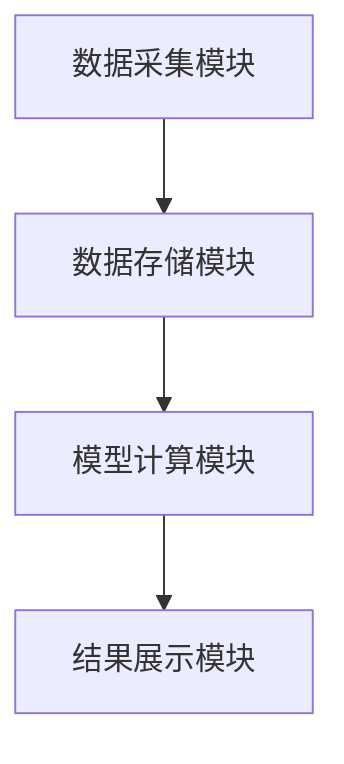

                 


# 《金融产品定价优化模型》

---

## 关键词：
金融产品定价、优化模型、数学基础、算法原理、系统架构、项目实战

---

## 摘要：
金融产品定价是金融市场中至关重要的环节，直接影响金融机构的收益与风险控制。本文从金融产品的基本概念出发，系统地介绍定价优化模型的核心原理、算法实现、系统架构以及实际应用案例。通过详细讲解数学基础、优化算法、系统设计和项目实战，本文旨在帮助读者掌握金融产品定价优化的关键技术，并能够将其应用于实际业务场景中。

---

# 第1章: 金融产品定价的基本概念

## 1.1 金融产品定价的背景与意义
### 1.1.1 金融产品的定义与分类
- 金融产品的定义
- 金融产品的分类：股票、债券、基金、衍生品等
- 定价的重要性：准确的定价是金融机构盈利的核心

### 1.1.2 金融产品定价的基本原则
- 市场需求与供给的平衡
- 风险与收益的匹配
- 时间价值与货币时间价值

### 1.1.3 定价优化模型的必要性
- 传统定价方法的局限性
- 数据驱动定价的优势
- 技术驱动定价的效率提升

---

## 1.2 金融市场的基本运作机制
### 1.2.1 金融市场的构成与功能
- 买方与卖方的角色
- 交易所与做市商的功能
- 中介机构的作用

### 1.2.2 金融产品定价的影响因素
- 市场利率
- 风险偏好
- 通货膨胀预期
- 市场流动性

### 1.2.3 金融市场的风险与收益平衡
- 风险-收益 trade-off
- 风险溢价的概念
- 收益率的计算方法

---

## 1.3 定价优化模型的数学基础
### 1.3.1 线性回归模型
- 简单线性回归公式：
  $$ y = \beta_0 + \beta_1 x + \epsilon $$
- 最小二乘法的原理

### 1.3.2 时间序列分析
- 时间序列的基本特征
- 移动平均法与指数平滑法

### 1.3.3 随机过程与概率论基础
- 随机变量的定义
- 概率分布的应用

---

## 1.4 本章小结
本章从金融产品定价的背景与意义出发，介绍了金融市场的基本运作机制，并详细阐述了定价优化模型的数学基础，为后续内容奠定了理论基础。

---

# 第2章: 定价优化模型的核心概念

## 2.1 优化模型的数学基础
### 2.1.1 线性规划与非线性规划
- 线性规划的标准形式：
  $$ \text{min } c^T x $$
  $$ \text{s.t. } Ax \leq b $$
  $$ x \geq 0 $$
- 非线性规划的特点

### 2.1.2 蒙特卡洛模拟
- 蒙特卡洛模拟的基本原理
- 应用场景：衍生品定价、风险管理

### 2.1.3 随机过程与马尔可夫链
- 马尔可夫链的定义
- 马尔可夫链在金融定价中的应用

---

## 2.2 算法原理与优化方法
### 2.2.1 布朗运动与随机微分方程
- 布朗运动的定义：
  $$ dX(t) = \mu dt + \sigma dW(t) $$
- 随机微分方程的求解

### 2.2.2 黑-斯科尔斯模型
- 黑-斯科尔斯公式：
  $$ S(t) = S(0) e^{(r - \frac{\sigma^2}{2})t + \sigma W(t)} $$
- 模型的假设与应用

---

## 2.3 优化算法的实现
### 2.3.1 线性规划的实现步骤
1. 确定目标函数
2. 建立约束条件
3. 使用单纯形法求解

### 2.3.2 非线性规划的实现
1. 确定目标函数
2. 建立约束条件
3. 使用数值优化方法（如牛顿法）

---

## 2.4 本章小结
本章详细介绍了定价优化模型的核心概念，包括优化模型的数学基础、蒙特卡洛模拟、随机过程与马尔可夫链，以及优化算法的实现方法。

---

# 第3章: 定价优化模型的算法原理

## 3.1 常见定价优化算法
### 3.1.1 最小二乘法
- 最小二乘法的应用
- 算法步骤：
  1. 收集数据
  2. 建立线性回归模型
  3. 使用最小二乘法求解参数

### 3.1.2 黑-斯科尔斯模型的实现
- 模型的参数估计
- 模型的应用

---

## 3.2 算法实现与优化
### 3.2.1 线性回归模型的优化
- 正则化方法：L1、L2 正则化
- 模型评估指标：R²、均方误差（MSE）

### 3.2.2 非线性回归模型的实现
- 模型选择
- 参数估计

---

## 3.3 本章小结
本章详细介绍了定价优化模型的算法原理，包括常见定价优化算法、算法实现与优化方法。

---

# 第4章: 系统架构与实现

## 4.1 定价优化系统的架构设计
### 4.1.1 系统功能模块划分
- 数据采集模块
- 模型计算模块
- 结果展示模块

### 4.1.2 系统架构图


### 4.1.3 系统接口设计
- 数据接口：API 接口定义
- 计算接口：模型调用接口

---

## 4.2 系统实现细节
### 4.2.1 数据准备
- 数据清洗
- 特征工程

### 4.2.2 模型实现
- 使用 Python 实现线性回归模型：
  ```python
  import numpy as np
  from sklearn.linear_model import LinearRegression

  # 数据准备
  X = np.array([x1, x2, x3])
  y = np.array([y1, y2, y3])

  # 建立模型
  model = LinearRegression()
  model.fit(X, y)

  # 预测
  y_pred = model.predict(X)
  ```

---

## 4.3 本章小结
本章详细介绍了定价优化系统的架构设计与实现细节，包括系统功能模块划分、系统架构图、系统接口设计以及系统的实现代码。

---

# 第5章: 项目实战

## 5.1 项目背景与目标
### 5.1.1 项目背景
- 某金融机构需要优化其金融产品的定价模型

### 5.1.2 项目目标
- 构建一个基于机器学习的定价优化模型

---

## 5.2 数据准备与分析
### 5.2.1 数据来源
- 历史交易数据
- 市场数据

### 5.2.2 数据清洗
- 处理缺失值
- 异常值处理

---

## 5.3 模型构建与训练
### 5.3.1 特征工程
- 选择相关特征
- 特征标准化

### 5.3.2 模型训练
- 使用随机森林模型：
  ```python
  from sklearn.ensemble import RandomForestRegressor

  # 数据准备
  X_train, y_train = ...

  # 建立模型
  model = RandomForestRegressor(n_estimators=100)
  model.fit(X_train, y_train)
  ```

---

## 5.4 模型评估与优化
### 5.4.1 模型评估
- 均方误差（MSE）
- R² 分数

### 5.4.2 模型优化
- 调参优化
- 增加特征

---

## 5.5 本章小结
本章通过一个实际案例详细介绍了定价优化模型的项目实战，包括数据准备、模型构建、模型评估与优化。

---

# 第6章: 总结与展望

## 6.1 总结
- 本文系统地介绍了金融产品定价优化模型的核心概念、算法原理、系统架构以及项目实战
- 定价优化模型在金融领域的应用价值

## 6.2 展望
- 结合人工智能技术，进一步优化定价模型
- 应用大数据技术，提升模型的实时性与准确性

---

## 关键词：
金融产品定价、优化模型、数学基础、算法原理、系统架构、项目实战

---

## 摘要：
本文从金融产品的基本概念出发，系统地介绍定价优化模型的核心原理、算法实现、系统架构以及实际应用案例。通过详细讲解数学基础、优化算法、系统设计和项目实战，本文旨在帮助读者掌握金融产品定价优化的关键技术，并能够将其应用于实际业务场景中。

---

希望这篇文章的结构和内容能够满足您的需求！如果需要进一步调整或补充，请随时告知。

