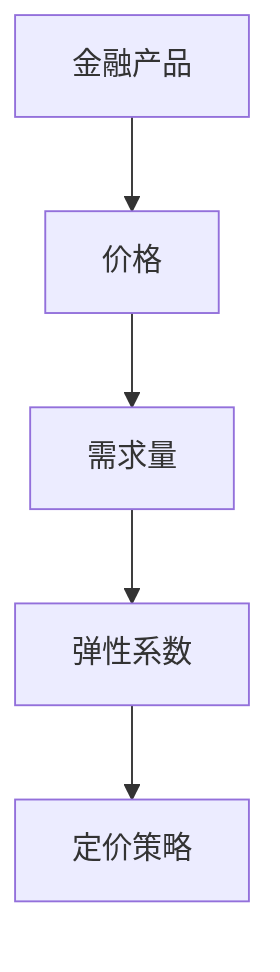
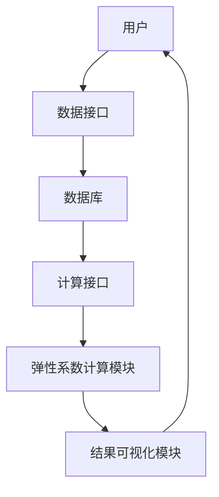

                 


# 金融产品定价弹性分析工具

## 关键词：金融产品定价、弹性分析、定价工具、金融模型、算法设计

## 摘要：本文详细探讨了金融产品定价弹性分析工具的设计与实现，从理论基础到算法实现，再到系统架构，全面解析了弹性分析在金融定价中的重要性与应用。通过实际案例分析，展示了如何利用弹性分析工具优化金融产品的定价策略。

---

# 第一部分: 金融产品定价弹性分析工具的背景与基础

# 第1章: 金融产品定价弹性分析概述

## 1.1 金融产品定价的基本概念

### 1.1.1 金融产品的定义与分类

金融产品是金融机构提供给客户的各类金融服务或金融工具，主要包括以下几类：

1. **债务工具**：如债券、贷款等，代表债权人与债务人之间的债权债务关系。
2. **股权工具**：如股票，代表对公司的所有权。
3. **衍生工具**：如期货、期权等，其价值依赖于其他基础资产的价格。
4. **基金产品**：如共同基金、ETF等，通过汇集资金进行投资组合管理。

### 1.1.2 金融产品定价的基本原理

金融产品定价的核心是确定其市场价值，通常基于以下因素：

- **市场供需关系**：供需关系直接影响价格。
- **风险水平**：风险越高，定价越高。
- **期限结构**：金融产品的期限也会影响其定价。
- **市场利率**：利率波动对定价有直接影响。

### 1.1.3 弹性分析在金融定价中的作用

弹性分析是一种量化变量间关系的工具，常用于衡量价格变化对需求量的影响。在金融产品定价中，弹性分析可以帮助机构：

- 优化定价策略。
- 预测价格波动对市场需求的影响。
- 制定风险管理措施。

## 1.2 弹性分析的基本概念

### 1.2.1 弹性分析的定义

弹性分析是一种衡量变量之间关系的统计方法，通常定义为变量变化的百分比与引起该变化的另一变量变化的百分比的比率。在金融领域，弹性分析常用于衡量价格变化对需求量的影响。

### 1.2.2 弹性分析的分类与特点

弹性分析主要分为以下几种类型：

1. **价格弹性**：价格变化对需求量的影响。
2. **收入弹性**：价格变化对总收入的影响。
3. **交叉弹性**：一种商品价格变化对另一种商品需求量的影响。

### 1.2.3 弹性分析在金融产品定价中的应用

弹性分析在金融定价中的应用主要体现在以下几个方面：

- **风险定价**：通过分析风险因素的弹性，确定风险对价格的影响。
- **市场定位**：通过分析不同客户群体的价格弹性，制定差异化定价策略。
- **产品组合优化**：通过分析不同产品之间的交叉弹性，优化产品组合。

## 1.3 金融产品定价弹性分析工具的发展现状

### 1.3.1 弹性分析工具的演变历程

弹性分析工具的发展经历了以下几个阶段：

1. **手工计算阶段**：早期的弹性分析主要依赖手工计算，效率低下。
2. **计算机辅助阶段**：随着计算机技术的发展，弹性分析开始借助软件工具进行。
3. **智能化阶段**：近年来，随着人工智能和大数据技术的发展，弹性分析工具逐渐智能化。

### 1.3.2 当前市场上的弹性分析工具特点

当前市场上的弹性分析工具具有以下特点：

- **自动化**：能够快速处理大量数据，自动生成分析结果。
- **智能化**：结合机器学习算法，能够预测价格变化对市场需求的影响。
- **可视化**：提供直观的图表展示，便于用户理解和分析。

### 1.3.3 弹性分析工具的发展趋势

未来，弹性分析工具的发展趋势主要体现在以下几个方面：

- **数据驱动**：更加依赖大数据分析，提高分析精度。
- **实时分析**：能够实时监控市场变化，及时调整定价策略。
- **多维度分析**：能够同时考虑多种因素的相互作用，提供更全面的分析结果。

## 1.4 本章小结

本章主要介绍了金融产品定价弹性分析工具的背景与基础，包括金融产品定价的基本概念、弹性分析的基本概念以及弹性分析工具的发展现状。通过本章的学习，读者可以了解弹性分析在金融定价中的重要性，以及弹性分析工具的基本特点和发展趋势。

---

# 第二部分: 金融产品定价弹性分析的核心概念与联系

# 第2章: 弹性分析的核心原理

## 2.1 弹性分析的数学模型

### 2.1.1 弹性系数的定义公式

弹性系数（Elasticity Coefficient）定义为：

$$ E = \frac{\% \Delta Q}{\% \Delta P} $$

其中，$\% \Delta Q$ 表示需求量变化的百分比，$\% \Delta P$ 表示价格变化的百分比。

例如，如果价格增加10%，需求量减少20%，则弹性系数为：

$$ E = \frac{-20\%}{10\%} = -2 $$

### 2.1.2 弹性分析的数学推导

弹性分析的基本假设是价格变化与需求量变化之间存在线性关系。因此，可以通过回归分析来计算弹性系数。

假设需求函数为：

$$ Q = aP + b $$

其中，$Q$ 是需求量，$P$ 是价格，$a$ 和 $b$ 是常数。

对上式进行微分，得到：

$$ dQ = a \cdot dP $$

因此，弹性系数可以表示为：

$$ E = \frac{dQ/dP \cdot P}{Q} = a \cdot \frac{P}{Q} $$

### 2.1.3 弹性系数的经济意义

弹性系数的经济意义主要体现在以下几个方面：

- **弹性系数大于1**：需求量对价格变化非常敏感，称为富有弹性。
- **弹性系数等于1**：需求量对价格变化敏感程度适中，称为单位弹性。
- **弹性系数小于1**：需求量对价格变化不敏感，称为缺乏弹性。

## 2.2 弹性分析的实体关系图

以下是弹性分析的实体关系图：



从上图可以看出，价格变化会影响需求量，需求量变化通过弹性系数影响定价策略。

## 2.3 弹性分析的核心要素对比

以下是弹性分析的核心要素对比表：

| 对比维度 | 价格弹性 | 数量弹性 | 时间弹性 |
|----------|----------|----------|----------|
| 定义     | 价格变化对需求量的影响 | 数量变化对价格的影响 | 时间维度上的弹性 |
| 应用场景 | 短期定价策略 | 长期需求预测 | 市场波动分析 |

## 2.4 本章小结

本章主要介绍了弹性分析的核心原理，包括弹性系数的定义公式、数学推导以及弹性系数的经济意义。通过实体关系图和对比表，帮助读者更好地理解弹性分析的核心概念及其在金融产品定价中的应用。

---

# 第三部分: 金融产品定价弹性分析工具的算法实现

# 第3章: 弹性分析算法的实现

## 3.1 弹性分析算法的数学模型

### 3.1.1 弹性系数计算公式

弹性系数的计算公式为：

$$ E = \frac{\% \Delta Q}{\% \Delta P} $$

其中，$\% \Delta Q = \frac{Q_2 - Q_1}{Q_1} \times 100\%$，$\% \Delta P = \frac{P_2 - P_1}{P_1} \times 100\%$。

### 3.1.2 弹性分析的线性回归模型

假设需求函数为：

$$ Q = aP + b $$

通过最小二乘法拟合回归模型，可以得到系数 $a$ 和 $b$。

## 3.2 弹性分析算法的实现步骤

### 3.2.1 数据收集

收集金融产品的价格和需求量数据，确保数据的完整性和准确性。

### 3.2.2 数据预处理

对数据进行清洗和标准化处理，确保数据适合模型训练。

### 3.2.3 模型训练

使用回归算法训练模型，得到价格弹性系数。

### 3.2.4 模型验证

通过交叉验证等方法，验证模型的准确性和稳定性。

### 3.2.5 模型应用

将模型应用于实际定价策略中，实时监控价格变化对需求量的影响。

## 3.3 弹性分析算法的Python实现

以下是弹性分析算法的Python代码示例：

```python
import numpy as np

def calculate_elasticity(price1, price2, quantity1, quantity2):
    delta_price = price2 - price1
    percent_delta_price = (delta_price / price1) * 100 if price1 != 0 else 0
    delta_quantity = quantity2 - quantity1
    percent_delta_quantity = (delta_quantity / quantity1) * 100 if quantity1 != 0 else 0
    elasticity = percent_delta_quantity / percent_delta_price
    return elasticity

# 示例数据
price1 = 100
price2 = 110
quantity1 = 1000
quantity2 = 950

# 计算弹性系数
elasticity = calculate_elasticity(price1, price2, quantity1, quantity2)
print("弹性系数为:", elasticity)
```

### 3.3.1 代码解释

上述代码定义了一个计算弹性系数的函数 `calculate_elasticity`，并使用示例数据计算了弹性系数。函数的输入是两个价格和对应的两个需求量，输出是弹性系数。

## 3.4 本章小结

本章主要介绍了弹性分析算法的实现，包括数学模型和Python代码实现。通过示例数据，读者可以理解如何利用弹性分析算法计算弹性系数，并将其应用于实际定价策略中。

---

# 第四部分: 金融产品定价弹性分析工具的系统架构与项目实战

# 第4章: 弹性分析工具的系统架构设计

## 4.1 项目介绍

本项目旨在开发一个金融产品定价弹性分析工具，帮助金融机构优化定价策略。系统主要功能包括数据采集、弹性系数计算、结果可视化等。

## 4.2 系统功能设计

### 4.2.1 数据采集模块

- 通过API接口获取金融产品的价格和需求量数据。
- 支持多种数据源的接入。

### 4.2.2 弹性系数计算模块

- 使用回归算法计算弹性系数。
- 提供多种弹性分析方法。

### 4.2.3 结果可视化模块

- 生成弹性系数的可视化图表。
- 提供交互式界面，方便用户分析和调整定价策略。

## 4.3 系统架构设计

以下是系统的架构图：


## 4.4 系统接口设计

### 4.4.1 数据接口

- 数据接口通过RESTful API实现，支持GET和POST请求。
- 数据接口地址为：`http://localhost:8000/api/data`

### 4.4.2 计算接口

- 计算接口用于调用弹性系数计算模块。
- 数据接口地址为：`http://localhost:8000/api/elasticiy`

## 4.5 系统交互流程

以下是系统交互流程图：



## 4.6 本章小结

本章主要介绍了弹性分析工具的系统架构设计，包括功能模块设计、系统架构图以及系统接口设计。通过本章的学习，读者可以了解如何将弹性分析算法应用于实际系统中，并通过系统交互流程图理解系统的工作流程。

---

# 第五部分: 金融产品定价弹性分析工具的最佳实践与小结

# 第5章: 最佳实践与小结

## 5.1 最佳实践

### 5.1.1 数据质量

- 确保数据的准确性和完整性。
- 处理缺失值和异常值。

### 5.1.2 模型选择

- 根据具体需求选择合适的回归算法。
- 定期更新模型，适应市场变化。

### 5.1.3 可视化

- 提供直观的图表展示，帮助用户理解分析结果。
- 支持交互式分析，提高用户体验。

## 5.2 小结

通过本篇文章的学习，读者可以全面了解金融产品定价弹性分析工具的设计与实现。从理论基础到算法实现，再到系统架构，文章详细介绍了弹性分析在金融定价中的重要性与应用。通过实际案例分析，展示了如何利用弹性分析工具优化金融产品的定价策略。

## 5.3 注意事项

- 弹性分析结果仅供参考，实际定价策略需要结合市场实际情况进行调整。
- 数据质量和模型选择对分析结果有重要影响，需要谨慎处理。
- 系统设计需要充分考虑用户体验，确保系统的易用性和稳定性。

## 5.4 拓展阅读

- 《金融时间序列分析》：深入理解金融市场的波动性和预测方法。
- 《机器学习在金融中的应用》：探索机器学习算法在金融定价中的应用。

---

通过以上内容，我们可以看到，金融产品定价弹性分析工具的设计与实现是一个复杂而重要的过程。从理论到实践，需要结合数学模型、算法实现和系统架构等多个方面。希望本文能够为读者提供有价值的参考，帮助他们在实际工作中更好地应用弹性分析工具优化金融产品的定价策略。

