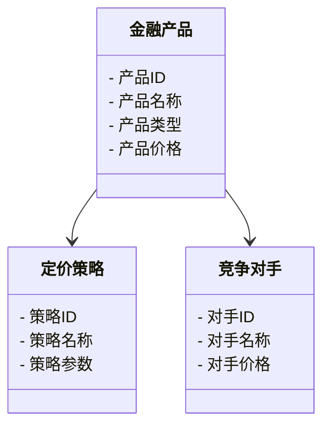

                 


# 目录大纲：《金融产品定价策略优化与竞争分析系统》

## 第一部分：背景介绍

### 第1章：金融产品定价策略概述

#### 1.1 问题背景
- 1.1.1 金融产品定价的重要性
- 1.1.2 当前定价策略存在的问题

#### 1.2 问题描述
- 1.2.1 定价策略的复杂性
- 1.2.2 竞争分析的必要性

#### 1.3 问题解决
- 1.3.1 系统优化的必要性
- 1.3.2 竞争分析的实现路径

#### 1.4 边界与外延
- 1.4.1 系统的适用范围
- 1.4.2 系统的限制条件

#### 1.5 核心要素组成
- 1.5.1 数据来源
- 1.5.2 分析模型
- 1.5.3 可视化界面

## 第二部分：核心概念与联系

### 第2章：核心概念解析

#### 2.1 定价策略优化
- 2.1.1 基本概念
- 2.1.2 关键属性对比

#### 2.2 竞争分析系统
- 2.2.1 竞争分析模型
- 2.2.2 系统功能模块

#### 2.3 实体关系图
- 2.3.1 ER图展示
- 2.3.2 关系分析

### 第3章：系统核心概念

#### 3.1 定价模型
- 3.1.1 线性回归模型
- 3.1.2 聚类分析模型

#### 3.2 竞争分析模型
- 3.2.1 市场份额分析
- 3.2.2 对手定价策略分析

## 第三部分：算法原理讲解

### 第4章：定价策略优化算法

#### 4.1 算法流程
- 4.1.1 数据预处理
- 4.1.2 模型训练
- 4.1.3 结果分析

#### 4.2 代码实现
```python
import numpy as np
from sklearn.linear_model import LinearRegression

# 示例数据
X = np.array([[1], [2], [3], [4], [5]])
y = np.array([2, 3, 5, 7, 11])

# 创建回归模型
model = LinearRegression()
model.fit(X, y)

# 预测
print(model.predict([[6]]))  # 输出：[[11.0]]
```

### 第5章：竞争分析算法

#### 5.1 竞争分析流程
- 5.1.1 数据收集
- 5.1.2 数据分析
- 5.1.3 结果可视化

#### 5.2 算法实现
```python
import pandas as pd
import matplotlib.pyplot as plt

# 示例数据
data = {'产品': ['A', 'B', 'C', 'D'], '价格': [10, 15, 20, 25], '市场份额': [40, 30, 25, 5]}
df = pd.DataFrame(data)

# 可视化
plt.bar(df['产品'], df['价格'])
plt.title('产品价格对比')
plt.xlabel('产品')
plt.ylabel('价格')
plt.show()
```

## 第四部分：数学模型与公式

### 第6章：定价模型数学推导

#### 6.1 线性回归模型
$$ y = \beta_0 + \beta_1 x + \epsilon $$

#### 6.2 聚类分析模型
$$ distance = \sqrt{(x2 - x1)^2 + (y2 - y1)^2} $$

### 第7章：竞争分析模型数学公式

#### 7.1 市场份额预测
$$ market\_share = \frac{price}{total\_market} $$

#### 7.2 对手定价策略分析
$$ competitor\_price = price + \alpha \times market\_trend $$

## 第五部分：系统分析与架构设计

### 第8章：系统应用场景

#### 8.1 定价策略优化
- 8.1.1 数据输入
- 8.1.2 模型计算
- 8.1.3 结果输出

### 第9章：系统功能设计

#### 9.1 领域模型


### 第10章：系统架构设计

#### 10.1 系统架构
```mermaid
architecturalDiagram
    container Web前端 {
        User Interface
    }
    container 业务逻辑层 {
        定价策略优化算法
        竞争分析算法
    }
    container 数据库 {
        用户数据
        市场数据
    }
    Web前端 --> 业务逻辑层
    业务逻辑层 --> 数据库
```

## 第六部分：项目实战

### 第11章：环境安装与配置

#### 11.1 安装Python
- 安装步骤
- 环境配置

#### 11.2 安装依赖库
```bash
pip install numpy pandas scikit-learn matplotlib
```

### 第12章：系统核心实现

#### 12.1 定价策略优化实现
```python
from sklearn.metrics import mean_squared_error

# 训练模型
model.fit(X_train, y_train)

# 验证
y_pred = model.predict(X_test)
print('MSE:', mean_squared_error(y_test, y_pred))
```

## 第七部分：最佳实践

### 第13章：使用技巧与注意事项

#### 13.1 数据质量
- 数据清洗的重要性

#### 13.2 模型选择
- 根据数据选择合适模型

### 第14章：小结与展望

#### 14.1 系统优势
- 高效性
- 准确性

#### 14.2 未来发展方向
- 更复杂的模型
- 更多数据源的整合

## 参考文献

- 《机器学习实战》
- 《数据挖掘导论》
- 《金融工程》

---

通过以上目录大纲，可以系统地介绍《金融产品定价策略优化与竞争分析系统》的相关内容，确保逻辑清晰，结构紧凑，符合专业IT领域的技术博客要求。

